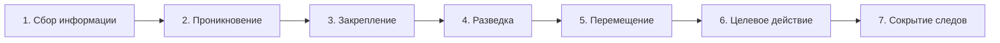

# Жизненный цикл атаки

  ОБЯЗАТЕЛЬНО
  ДЛЯ НОВИЧКОВ

Разработчику
Инженеру

---

## Жизненный цикл атаки

OWASP, MITRE ATT&CK и [тестирование на проникновение](/encyclopedia/8-infra-security/8-07-informatsionnaya-bezopasnost/1131) описывают угрозы с разных сторон. Эта статья даёт **единую простую модель** — как типичная атака проходит от разведки до цели. Её удобно держать в голове при проектировании, ревью и расследовании инцидентов.

На практике большинство взломов **не гениальны**, а **методичны**: атакующий повторяет отработанные шаги; защитник выигрывает, когда знает эту последовательность и закрывает слабые места на каждом этапе.

  
С чего начать чтение раздела

  

  После [триады CIA и OWASP](/encyclopedia/8-infra-security/8-07-informatsionnaya-bezopasnost/1) эта статья связывает теорию с реальным поведением атакующего. Дальше — [методы защиты](/encyclopedia/8-infra-security/8-07-informatsionnaya-bezopasnost/111) и [безопасность приложений](/encyclopedia/8-infra-security/8-07-informatsionnaya-bezopasnost/113).
  

---

### Асимметрия атакующего и защитника

Злоумышленник ищет **одну** брешь. Специалист по ИБ в идеале должен закрыть **все** — патчи, конфигурации, обучение пользователей, мониторинг. На практике работает **эшелонированная оборона**: несколько независимых слоёв, чтобы одна ошибка не приводила к полной компрометации.

Частая метафора: взлом — как удар кувалдой, а защита — как гараж, который строят неделями, а снести можно за часы. Вывод для инженера: ценнее **построить устойчивую систему**, чем демонстрировать новый способ её сломать.

---

## Семь этапов методологии взлома

Не каждая атака проходит все шаги. Вредоносное ПО может автоматизировать часть цепочки. Но **первичное проникновение** обязательно — без него дальнейшие действия невозможны.

| № | Этап | Суть | Часто автоматизирует malware |
|---|------|------|------------------------------|
| 1 | **Сбор информации** | OSINT, IP, домены, сотрудники, ПО на периметре | частично |
| 2 | **Проникновение** | первый доступ к системе или учётке | иногда полностью |
| 3 | **Закрепление доступа** | бэкдор, новая учётка, сохранённые хэши | да |
| 4 | **Разведка системы** | файлы, память, сеть, общие ресурсы | да |
| 5 | **Перемещение** | lateral / vertical movement по сети | да |
| 6 | **Целевое действие** | кража, шифрование, саботаж, шпионаж | по сценарию |
| 7 | **Сокрытие следов** | очистка логов, маскировка под админа | реже в наши дни |

**Сбор информации** делят на два слоя:

- **Поиск следов (footprinting)** — публичные данные о компании, людях, новости (M&A часто ослабляют ИБ), партнёры.
- **Цифровые отпечатки (fingerprinting)** — версии ОС, веб-сервера, СУБД; инструменты вроде Nmap, Nikto. Подробнее о легальной разведке — в [Легальный сбор информации](/encyclopedia/8-infra-security/8-07-informatsionnaya-bezopasnost/122).

Слабые цели на периметре — **сайты сотрудников, партнёров, старые сервисы**, а не только главный портал.

**Перемещение** бывает **горизонтальным** (между равноправными хостами) и **вертикальным** (повышение привилегий). Типичный сценарий в AD-домене: локальный админ → общий пароль на многих ПК → чтение учёток на сервере аутентификации. У опытного пентестера захват домена часто укладывается в **пару часов** после первого входа.

**Сокрытие следов** сегодня реже: логов много, а действия идут от имени легитимного пользователя с теми же инструментами, что у администратора. Отсюда вывод — без [мониторинга и корреляции](/encyclopedia/8-infra-security/8-07-informatsionnaya-bezopasnost/114) атака остаётся незамеченной **месяцами** (данные Verizon DBIR).

---

## Тринадцать векторов первичного доступа

На этапе **проникновения** атакующий выбирает один или несколько путей. Ниже — сводная таблица типовых векторов с отсылками к материалам раздела.

| Вектор | Суть | Типичная защита |
|--------|------|-----------------|
| **0-day** | уязвимость без патча | сегментация, WAF, EDR, быстрый процесс патчей после раскрытия |
| **Непропатченное ПО** | ~тысячи CVE в год; массовые взломы — старые дыры | автопатчи, инвентарь активов, SLA; см. [Патчи и управление уязвимостями](/encyclopedia/8-infra-security/8-07-informatsionnaya-bezopasnost/132) |
| **Malware** | доставка эксплойта в масштабе | EDR, сегментация, обучение; см. [Вирусы и вредоносные программы](/encyclopedia/8-infra-security/8-07-informatsionnaya-bezopasnost/119) |
| **Социальная инженерия** | фишинг, вложения, vishing | MFA, фильтры почты, учения; см. [Социальная инженерия](/encyclopedia/8-infra-security/8-07-informatsionnaya-bezopasnost/1291) |
| **Пароли и учётки** | брутфорс, утечки, **Pass-the-Hash** | MFA, уникальные пароли, защита LSASS; см. [Авторизация и аутентификация](/encyclopedia/8-infra-security/8-07-informatsionnaya-bezopasnost/116) |
| **MITM** | перехват сессии, подмена Wi‑Fi | TLS, HSTS, [Риски открытых Wi-Fi сетей](/encyclopedia/2-system-network/2-08-osnovy-informatsionnoy-bezopasnosti/113) |
| **Утечка данных** | случайная публикация или целенаправленная кража | DLP, классификация данных, минимизация хранения |
| **Ошибки конфигурации** | открытые каталоги, `debug=true`, лишние порты | baseline, IaC, [Управление конфигурациями и окружениями](/encyclopedia/8-infra-security/8-07-informatsionnaya-bezopasnost/1153) |
| **DoS / DDoS** | перегрузка сервиса | CDN, rate limit, [DDoS и отказ в обслуживании](/encyclopedia/2-system-network/2-08-osnovy-informatsionnoy-bezopasnosti/117) |
| **Цепочка поставок** | партнёр, подрядчик, инсайдер | оценка третьих сторон, least privilege, мониторинг инсайдеров |
| **Ошибки пользователя** | неверный адрес, пропущенный патч | процессы, автоматизация, не только «awareness» |
| **Физический доступ** | кража ноутбука, cold boot | шифрование диска, блокировка экрана, FDE |
| **Эскалация привилегий** | второй заход уже изнутри системы | hardening ОС, [Обеспечение безопасности](/encyclopedia/8-infra-security/8-07-informatsionnaya-bezopasnost/2) |

  
Любимая цель пентестеров

  

  На практике часто взламывают **сами средства защиты** — непропатченный NGFW, устаревший сканер, консоль SIEM с дефолтным паролем. При инвентаризации активов учитывайте и «security tools».
  

**Weaponization** — отдельный момент: как только известен новый эксплойт, авторы malware встраивают его в автоматизированные кампании. Риск для массового пользователя часто выше, чем от редкого 0-day в руках APT.

---

## Связь с MITRE ATT&CK

[MITRE ATT&CK](https://attack.mitre.org/) детализирует тактики и техники; семь этапов выше — **учебный каркас**. Грубое соответствие:

| Этап | Тактики ATT&CK (примеры) |
|---------------|--------------------------|
| Сбор информации | Reconnaissance, Resource Development |
| Проникновение | Initial Access |
| Закрепление | Persistence, Credential Access |
| Разведка | Discovery |
| Перемещение | Lateral Movement, Privilege Escalation |
| Целевое действие | Collection, Exfiltration, Impact |
| Сокрытие | Defense Evasion |

В [Обеспечении безопасности](/encyclopedia/8-infra-security/8-07-informatsionnaya-bezopasnost/2) ATT&CK уже используется для hunting и разбора логов. Здесь модель нужна, чтобы **до** погружения в сотни техник понять порядок действий противника.

---

## Чек-лист защитника по этапам

| Этап атаки | Вопрос команде | Минимальные меры |
|------------|----------------|------------------|
| 1. Разведка | Что видно снаружи без авторизации? | убрать лишнее из DNS/WHOIS, rate limit на сканирование, [Легальный сбор информации](/encyclopedia/8-infra-security/8-07-informatsionnaya-bezopasnost/122) |
| 2. Проникновение | Что сломается первым при фишинге или CVE? | патчи, MFA, WAF, hardening |
| 3. Закрепление | Есть ли аномальные учётки и автозапуск? | EDR, мониторинг создания пользователей |
| 4. Разведка | Видны ли сканирования изнутри? | сегментация, [honeypot](/encyclopedia/8-infra-security/8-07-informatsionnaya-bezopasnost/130) |
| 5. Перемещение | Один пароль local admin на сотне ПК? | LAPS, уникальные creds, Zero Trust — [Zero Trust и облачная безопасность](/encyclopedia/8-infra-security/8-07-informatsionnaya-bezopasnost/121) |
| 6. Действие | Кто может массово читать/шифровать данные? | backup offline, least privilege, алерты на exfil |
| 7. Следы | Через сколько обнаружим компрометацию? | централизованные логи, SIEM, [Контроль и отслеживание](/encyclopedia/8-infra-security/8-07-informatsionnaya-bezopasnost/114) |

---

### Malware как автоматизация цепочки

Вредоносная программа может выполнить несколько этапов подряд без участия человека. SQL Slammer (376 байт) показал, что **маленький эксплойт + автоматическое распространение** бьёт по миллионам хостов за минуты. Современные группы сочетают **фишинг + loader + ручные действия оператора** (как Emotet → Ryuk).

Для разработчика это значит: закрытие одной RCE в API может остановить всю цепочку на этапе 2 — см. [инъекции](/encyclopedia/8-infra-security/8-07-informatsionnaya-bezopasnost/123) и [OWASP](/encyclopedia/8-infra-security/8-07-informatsionnaya-bezopasnost/1).

---

### Пентест и реальность

Законный пентест проверяет ту же методологию. Клиент может «радоваться», что его не взломали — но если через месяц его скомпрометируют реальные атакующие, качество теста под вопросом. Слабые места **есть**; задача — найти их раньше злоумышленника. Подробнее о процессе — [Анализ и тестирование безопасности](/encyclopedia/8-infra-security/8-07-informatsionnaya-bezopasnost/1131) и [Bug Bounty](/encyclopedia/8-infra-security/8-09-belyy-haking-i-bug-bounty/intro).

---

## Источники и смежные материалы

- [Verizon DBIR](https://www.verizon.com/business/resources/reports/dbir/) — время обнаружения инцидентов.
- [MITRE ATT&CK](https://attack.mitre.org/) — тактики и техники.
- [Легальный сбор информации](/encyclopedia/8-infra-security/8-07-informatsionnaya-bezopasnost/122) — граница OSINT и атаки.
- [Вирусы и вредоносные программы](/encyclopedia/8-infra-security/8-07-informatsionnaya-bezopasnost/119) — доставка и weaponization.
