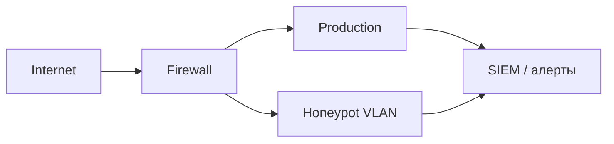

# Honeypots и приманки

  ОБЯЗАТЕЛЬНО
  ДЛЯ НОВИЧКОВ

Инженеру
Разработчику

---

## Honeypots и приманки

**Honeypot (медовый горшок)** — намеренно уязвимая или поддельная система, которую **не используют** легитимные пользователи и сервисы. Любое обращение к ней с высокой вероятностью означает разведку или компрометацию.

Идея описана Лэнсом Спицнером и сообществом [Honeynet Project](https://www.honeynet.org/). Honeypots часто используют как **детектор lateral movement** после первого взлома — когда firewall и SIEM тонут в шуме.

  
Связь с lifecycle

  

  На этапе **перемещения** по сети атакующие сканируют хосты. Касание honeypot — сигнал "периметр уже пробит". См. [Жизненный цикл атаки](/encyclopedia/8-infra-security/8-07-informatsionnaya-bezopasnost/129).
  

---

### Уровни взаимодействия

| Уровень | Поведение | Плюсы | Минусы |
|---------|-----------|-------|--------|
| **Низкий** | открытый порт, fake banner, без полноценного входа | дёшево, мало обслуживания | мало данных о намерениях |
| **Средний** | login, простой FTP/HTTP, статичный контент | баланс сигнала и трудозатрат | нужна изоляция |
| **Высокий** | полноценная копия prod, обновляемый контент | атакующий не отличит от боя | дорого, риск pivot если ошиблись |

Часто достаточно **низкого или среднего** уровня для **раннего предупреждения**. Полная копия production оправдана для исследования APT, а не для каждой компании.

---

### Зачем ставить honeypot

- **Раннее обнаружение** — malware или человек "коснулся" decoy раньше, чем добрался до CRM.
- **Низкий шум** — на honeypot нет легитимного трафика; алерт "любое подключение" проще, чем разбор миллионов drop-событий firewall.
- **Понимание намерений** — какие порты, эксплойты, учётки пробуют (в lab-среде).
- **Ловушка для lateral movement** — фальшивые "SQL", "файловый", "AD" серверы внутри VLAN.

Известный кейс: honeypot выявил **инсайдера**, который через несанкционированную Wi‑Fi-связку соединил изолированные сегменты и выкачивал данные — поведение, которое долго маскировалось под "слабого пользователя".

---

### Где размещать

- **DMZ** — сканирование из интернета.
- **Внутренняя сеть** — после компрометации рабочей станции (самый ценный сигнал).
- **Рядом с критичными активами** — но **не** на том же хосте и не с production-учётками.

Honeypot **изолирован** от реальных данных — отдельный VLAN, firewall "только исходящие логи на SIEM", без маршрутов в prod.

---

### Архитектура

Легитимные агенты (patch management, AV) нужно **занести в allowlist**, иначе ложные срабатывания. Настройка фильтра "шума" обычно занимает от нескольких часов до пары дней.

---

### Инструменты и проекты

| Ресурс | Назначение |
|--------|------------|
| [Honeynet Project](https://www.honeynet.org/) | исследования, papers Know Your Enemy |
| Honeyd | эмуляция множества OS/сервисов (legacy, но учебно) |
| [Modern honeypot platforms](https://github.com/paralax/awesome-honeypots) | списки open source решений (Cowrie SSH, Dionaea, T-Pot и др.) |
| KFSensor, commercial | Windows-friendly sensor |

Выбор зависит от ОС, нужного уровня interaction и интеграции с SIEM ([Контроль и отслеживание](/encyclopedia/8-infra-security/8-07-informatsionnaya-bezopasnost/114)).

---

### Ограничения и риски

- **Не замена** патчей, MFA и сегментации — только **детективный** слой.
- **Ошибочная изоляция** — если honeypot смотрит в prod, он становится трамплином.
- **Опытные APT** иногда **избегают** очевидных decoy, но массовые атаки и типичный ransomware всё равно "щупают" сеть.
- **Юридические аспекты** — перехват атакующего без договорённостей с провайдером и counsel; в enterprise — согласовать с legal/compliance.

---

### Honeypot vs canary token

| | Honeypot | Canary / honeytoken |
|---|----------|---------------------|
| Объект | целый сервис или VM | файл, учётка, DNS-имя, cookie |
| Сигнал | connect, login, scan | open file, use creds |
| Сложность | выше | ниже (можно положить `passwords.xlsx` с мониторингом) |

Оба относятся к **deception**. Canary быстрее внедрить в существующий AD или файловый сервер.

---

## Чек-лист внедрения

- [ ] Honeypot в отдельном VLAN без доступа к production data.
- [ ] Любое inbound-соединение к decoy → алерт с высоким приоритетом.
- [ ] Allowlist для легитимных сканеров и patch-систем.
- [ ] Регулярный review: honeypot не превратился в забытый prod-like сервер с реальными секретами.
- [ ] Playbook — при срабатывании — изоляция источника, сбор артеfacts, [IRP](/encyclopedia/8-infra-security/8-07-informatsionnaya-bezopasnost/1).

---

## Источники

- Lance Spitzner, *Honeypots: Tracking Hackers*.
- [Мониторинг и SIEM](/encyclopedia/8-infra-security/8-07-informatsionnaya-bezopasnost/114).
