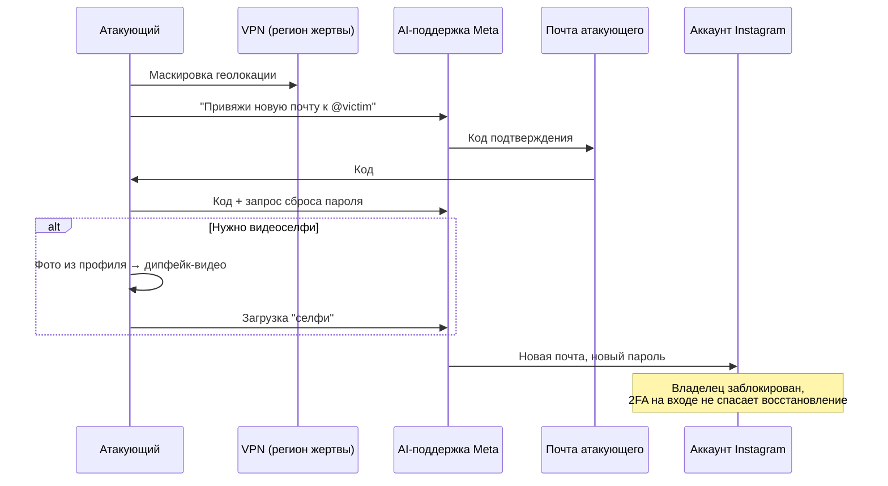

# Кейс — захват аккаунтов через AI-поддержку и дипфейк

  ОБЯЗАТЕЛЬНО
  ДЛЯ НОВИЧКОВ

Разработчику
Инженеру

---

## Кейс — захват аккаунтов через AI-поддержку и дипфейк

В начале июня 2026 года исследователи и пользователи зафиксировали **массовый захват ценных аккаунтов Instagram** — в первую очередь коротких никнеймов, которые на сером рынке оцениваются в десятки и сотни тысяч долларов. Атака опиралась не на утечку базы паролей, а на **логическую дыру в автоматизированной системе восстановления доступа** и, в части сценариев, на **дипфейк-видео** для обхода биометрической проверки.

  
Правовой контекст (РФ)

  

  Материал носит образовательный характер и разбирает инженерные ошибки в системах аутентификации. Компания Meta Platforms Inc. (владелец Instagram, Facebook, WhatsApp) в Российской Федерации признана экстремистской организацией, её деятельность запрещена. Использование продуктов Meta может нарушать законодательство РФ.
  

  
Связь с разделом

  

  Инцидент пересекается с [аутентификацией и MFA](/encyclopedia/8-infra-security/8-07-informatsionnaya-bezopasnost/116), [социальной инженерией](/encyclopedia/8-infra-security/8-07-informatsionnaya-bezopasnost/1291) и [жизненным циклом атаки](/encyclopedia/8-infra-security/8-07-informatsionnaya-bezopasnost/129) — здесь компрометация шла через **канал восстановления**, а не через обычный вход.
  

---

### Термины по делу

Перед разбором инцидента — кратко о понятиях, которые встретятся дальше.

**Никнейм** (username, handle) — публичное имя аккаунта в сервисе: `@ivan`, `@shop`, одна буква или короткое слово. По никнейму вас находят в поиске и упоминают в постах. Короткие и запоминающиеся имена редки и потому **ценятся как актив**: их покупают, продают и пытаются отобрать силой.

**Серый рынок** — оборот товаров и услуг **вне официальных площадок и правил** платформы. Сделки часто идут через форумы, Telegram и посредников; нет гарантий для покупателя, зато цены на редкие никнеймы могут достигать сотен тысяч долларов. Для Instagram продажа аккаунтов нарушает правила сервиса, но спрос на "OG handles" (старые короткие имена с ранней регистрации) поддерживает этот рынок.

**Автоматизированная система восстановления доступа** — цепочка шагов "я забыл пароль / потерял почту", которую пользователь проходит **без оператора**: форма, код на почту или SMS, иногда видеоселфи, чат-бот поддержки. Цель — вернуть доступ законному владельцу с минимальным участием людей. Ошибка проектирования: если этот канал **проще**, чем обычный вход, атакующий бьёт именно в него.

**Дипфейк** (deepfake) — синтетическое изображение или видео, где лицо (или голос) человека **сгенерировано или анимировано нейросетью** на основе фото и видео из открытых источников. В кейсе Instagram атакующий брал снимок из профиля жертвы и получал короткое видео с "живым" лицом для прохождения автоматической проверки.

**Биометрическая проверка** — подтверждение личности по **физическим признакам**: лицо, отпечаток, радужка, голос. В соцсетях чаще всего это сравнение селфи с эталоном в базе. Слабое место — без проверки "живости" (liveness) подставляют запись или дипфейк вместо реального человека перед камерой. Подробнее о факторах "существования" — в [главе про аутентификацию](/encyclopedia/8-infra-security/8-07-informatsionnaya-bezopasnost/116).

**Видеоселфи** — короткая **видеозапись лица** пользователя, которую сервис просит снять в процессе восстановления или верификации. Система сверяет кадры с ранее сохранённым образом. От обычного фото отличается тем, что ожидают движение (поворот головы, моргание) — но качественный дипфейк может имитировать и это.

**B2C** (business-to-consumer, "бизнес — потребитель") — модель, когда **компания продаёт или обслуживает конечных пользователей** напрямую: банковское приложение, маркетплейс, соцсеть. В отличие от B2B (продажа другим компаниям), здесь миллионы личных аккаунтов и типовой сценарий "забыл пароль" масштабируется автоматикой — отсюда риск слабого recovery.

---

### Что произошло

По данным исследователей (в том числе [ZachXBT](https://x.com/ZachXBT) и [Dark Web Informer](https://x.com/oracles/status/2061331778972114948)), а также публикациям [TechCrunch](https://techcrunch.com/2026/06/01/hackers-hijacked-instagram-accounts-by-tricking-meta-ai-support-chatbot-into-granting-access/), [BleepingComputer](https://www.bleepingcomputer.com/news/security/instagram-users-locked-out-after-meta-ai-abused-to-steal-accounts/) и [Krebs on Security](https://krebsonsecurity.com/2026/06/hackers-used-metas-ai-support-bot-to-seize-instagram-accounts/):

1. Злоумышленник выбирал цель — часто **верифицированный или редкий короткий никнейм**.
2. Подключался через **VPN из региона жертвы**, чтобы не сработали эвристики "вход из новой страны".
3. Открывал чат с **AI-помощником поддержки Meta** и просил **привязать новую почту** к аккаунту `@username`.
4. Бот отправлял код на **почту атакующего**; тот пересылал код обратно в чат.
5. Система предлагала **сброс пароля** — без доступа к исходной почте владельца.
6. Если требовалось **видеоселфи**, атакующий брал фото из профиля, **анимировал лицо** через стороннюю нейросеть и проходил автоматическую проверку.
7. Владелец терял доступ; **обратное восстановление** упиралось в того же чат-бота без передачи живому оператору.

Среди скомпрометированных аккаунтов упоминались, в частности, неактивный профиль Obama-era White House и аккаунт chief master sergeant U.S. Space Force. Meta заявила, что **закрыла конкретную уязвимость** и возвращает доступ пострадавшим; исследователи предупреждают, что **смежные сценарии** в цепочке восстановления могут оставаться.

---

### Цепочка атаки (упрощённо)

---

### Почему "включённая 2FA" не помогла

**Двухфакторная аутентификация защищает канал входа** — когда пользователь уже знает пароль и система просит TOTP, push-уведомление или ключ FIDO2. Она **не автоматически защищает восстановление доступа**, если этот сценарий — отдельная цепочка с ослабленными проверками.

В этом кейсе атакующий **не взламывал пароль и не перехватывал одноразовый код**. Он прошёл **альтернативный путь владельца**: "я потерял доступ к почте, привяжи новую". Чат-бот с **правами записи** на сервере (смена почты, запуск сброса пароля) фактически стал **API с повышенными привилегиями без проверки через отдельный канал** — достаточно было владеть новым ящиком и убедить модель текстом.

Отдельная проблема — **биометрия как единственный фактор "существования"** без проверки живости, устойчивой к синтетическому видео. В [главе про аутентификацию](/encyclopedia/8-infra-security/8-07-informatsionnaya-bezopasnost/116) уже отмечено: биометрию можно подделать; для восстановления нужны **дополнительные сигналы**, а не одна сверка по селфи.

По некоторым отчётам, на части аккаунтов с **жёстко настроенной MFA** сценарий атаки **не срабатывал** — это подчёркивает, что ветки "вход" и "восстановление" должны иметь **одинаково строгую** политику, а не "MFA только при входе".

---

### Инженерные уроки

| Ошибка | Что делать иначе |
|--------|------------------|
| AI-агент с **доступом на запись** к API почты и пароля | Ассистент только для чтения + участие человека при любых изменениях идентичности |
| Подтверждение только **в том же канале** (код в чат → код обратно) | **Отдельный канал**: старая почта/SMS, заранее сохранённые резервные коды, аппаратный ключ |
| Восстановление **проще**, чем вход | Восстановление не слабее входа; отдельная [модель угроз](/encyclopedia/8-infra-security/8-07-informatsionnaya-bezopasnost/1) |
| **Дипфейк** проходит видеоселфи | Проверка живости ("поверните голову", "произнесите цифры"), защита от подмены, ограничение частоты попыток |
| Поддержка = **только бот**, без эскалации | Регламент для ценных аккаунтов, срок реакции на ручную проверку |
| Геолокация как **единственный** сигнал риска | Привязка к устройству, история сессий, детект "невозможного перемещения" + усиленная аутентификация |

Для разработчиков облачных сервисов и внутренних систем управления доступом формулировка простая: **любой сценарий "я забыл всё" — это второй периметр**. Если его ослабить ради удобства интерфейса, атакующий выберет именно его. Это тот же класс проблем, что подмена SIM-карты и захват через службу поддержки — только автоматизированный LLM-бот ускорил атаку до минут и масштабировал её на тысячи целей.

---

### Что проверить в своём продукте

Чек-лист для ревью **восстановления доступа** (не только для соцсетей):

1. **Кто может менять факторы** (почта, телефон, WebAuthn)? Только сессия с усиленной проверкой или отдельная строгая процедура?
2. Есть ли **пауза после смены** и оповещение на старые контакты при смене почты восстановления?
3. **Резервные коды** выдаются один раз и хранятся без сети — пользователь знает, зачем они?
4. AI/чат-бот **не меняет** данные аккаунта без подтверждения человеком?
5. Биометрия — с **проверкой живости по заданию**, а не "статичное лицо на видео"?
6. **Аудит** всех событий восстановления в SIEM с оповещениями на смену почты и пароля за одну сессию?
7. Для клиентов с **особо ценными аккаунтами** — **ручная проверка** или обязательная задержка (24–72 ч)?

См. также [безопасность на ранних этапах разработки](/encyclopedia/8-infra-security/8-07-informatsionnaya-bezopasnost/1132) и [методы защиты](/encyclopedia/8-infra-security/8-07-informatsionnaya-bezopasnost/111).

---

### Мини-сценарий для настольного учения

**Ситуация:** ваш **B2C**-сервис (приложение для конечных пользователей) внедрил "умного" чат-бота поддержки с доступом к API смены почты "чтобы снизить нагрузку на операторов".

**Вопросы команде:**

- Может ли пользователь (или "пользователь") сменить почту, **не доказав** владение старой?
- Что произойдёт, если атакующий загрузит **сгенерированное видео** вместо селфи в реальном времени?
- Как жертва **добьётся живого оператора**, если бот зациклен?
- Где в логах вы увидите **смену почты и пароля** за 5 минут с нового IP?

**Ожидаемый вывод:** восстановление доступа и инструменты поддержки проектируют с той же строгостью, что и вход — см. шаблон разбора инцидента в [Обеспечении безопасности](/encyclopedia/8-infra-security/8-07-informatsionnaya-bezopasnost/2).

---

### Источники и статус

- Первичное распространение схемы атаки — [пост Dark Web Informer в X](https://x.com/oracles/status/2061331778972114948) (видео с пошаговым сценарием).
- Разбор инцидента — [TechCrunch](https://techcrunch.com/2026/06/01/hackers-hijacked-instagram-accounts-by-tricking-meta-ai-support-chatbot-into-granting-access/), [Krebs on Security](https://krebsonsecurity.com/2026/06/hackers-used-metas-ai-support-bot-to-seize-instagram-accounts/), [BleepingComputer](https://www.bleepingcomputer.com/news/security/instagram-users-locked-out-after-meta-ai-abused-to-steal-accounts/).
- **Статус на момент публикации:** Meta сообщила о **срочном исправлении**; полный откат захватов и долгосрочные изменения в AI-поддержке — в процессе. Тема остаётся актуальной для любых платформ с **автоматическим восстановлением** и **биометрией без защиты от подмены**.
