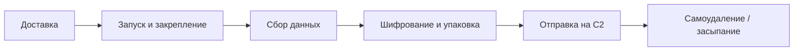

# Стилеры (info-stealer)

  ОБЯЗАТЕЛЬНО
  ДЛЯ НОВИЧКОВ

Разработчику
Инженеру

---

## Стилеры (info-stealer)

**Стилер** (от англ. *stealer*, *info-stealer*) — тип вредоносного ПО, цель которого — **тихо собрать и выгрузить конфиденциальные данные** с устройства жертвы. В отличие от ransomware стилер не шифрует диск и не требует выкупа: он работает в фоне, крадёт ценное и уходит.

Типичная добыча: пароли и cookie браузеров, данные банковских карт, сессии мессенджеров, файлы криптокошельков, токены VPN и облачных сервисов. Украденные учётные записи продают на теневых площадках, используют для обналичивания, доступа к корпоративным системам или шантажа.

  
Смежные темы

  

  Классификация malware, руткиты и RAT — в [Вирусы и вредоносные программы](/encyclopedia/8-infra-security/8-07-informatsionnaya-bezopasnost/119). Доставка через фишинг и социнженерию — в [Социальной инженерии](/encyclopedia/8-infra-security/8-07-informatsionnaya-bezopasnost/1291). EDR и антивирусы — в [статье про антивирусы](/encyclopedia/8-infra-security/8-07-informatsionnaya-bezopasnost/120).
  

---

### Краткая история

Первые стилеры появились в **середине 2000-х**, когда киберпреступники сместили фокус с "сломать ради славы" на **монетизацию личных данных**.

Одним из ранних и влиятельных образцов стал **Zeus** (2007) — троян, крадущий банковские учётные данные через перехват веб-форм и кейлоггинг. Zeus задал шаблон для целого поколения malware: модульная архитектура, C2-сервер, продажа билдов на подпольных форумах.

Сегодня стилеры — **один из самых массовых классов угроз**. Злоумышленнику не нужно писать код с нуля: достаточно **арендовать** готовый стилер (модель MaaS — *Malware-as-a-Service*) и запустить кампанию через фишинг или поддельный софт.

---

## Почему стилеры опасны

| Фактор | Что это значит на практике |
|--------|---------------------------|
| **Низкий порог входа** | Готовые панели и подписка на RedLine/Vidar — атака доступна без глубоких навыков |
| **Тихая работа** | Жертва может не заметить заражение неделями |
| **Обход защиты** | Пакеры, анти-VM, анти-сandbox, самоудаление после выгрузки данных |
| **Каскадный ущерб** | Украденная cookie сессии обходит MFA; корпоративный VPN-логин открывает сеть |
| **Масштаб** | Один билд — тысячи жертв; логи продают пакетами |

Стилер часто **не единственная угроза**: после кражи cookie злоумышленник может загрузить ransomware, банковский троян или RAT. В [жизненном цикле атаки](/encyclopedia/8-infra-security/8-07-informatsionnaya-bezopasnost/129) стилер типично работает на этапах **execution** и **collection**.

---

## Что крадут стилеры

- **Логины и пароли** — почта, соцсети, VPN, корпоративные порталы (из хранилищ браузера и менеджеров паролей).
- **Cookie и сессии** — обход пароля и иногда 2FA при живой сессии.
- **Данные банковских карт** — автозаполнение форм, скриншоты, перехват из браузера.
- **Криптокошельки** — файлы `wallet.dat`, seed-фразы, расширения MetaMask, Exodus, Electrum и аналоги.
- **Данные браузера** — история, закладки, автозаполненные формы, расширения.
- **Файлы и переписка** — документы с рабочего стола, конфиги FTP/SSH, токены Telegram/Discord.
- **Персональные данные** — телефоны, адреса из сохранённых профилей.

Украденные логи часто **агрегируют в "стиллог"** (stealer log) — архив с паролями, cookie, IP, ОС и списком установленного ПО. Такие пакеты покупают для дальнейших атак.

---

## Как распространяются

Стилеры попадают на устройство теми же каналами, что и прочий malware, но с упором на **доверие пользователя** и **жадность к "бесплатному" софту**.

| Вектор | Как выглядит для жертвы |
|--------|-------------------------|
| **Фишинг (email, мессенджеры)** | Письмо "о выигрыше", вложение `.exe` / `.scr` / архив с паролем |
| **Поддельный софт** | "Кряк" игры, мод, майнер, "ускоритель ПК", фальшивый кодек |
| **Форумы и торренты** | Ссылка на "проверенный" билд в комментарии под видео или в треде |
| **Видеохостинги** | Вредоносная ссылка в описании или комментарии к популярному ролику |
| **Соцсети** | Клон аккаунта админа группы, розыгрыш с вложением |
| **Вредоносная реклама (malvertising)** | Баннер на легитимном сайте ведёт на drive-by download |
| **Заражённые сайты** | Эксплойт-кит или принудительная загрузка при посещении страницы |
| **Эксплойты уязвимостей** | Непропатченное ПО, RCE в публичном сервисе — реже для массовых кампаний |
| **Съёмные носители** | Заражённые USB/SD (сегодня реже, но в изолированных средах встречается) |

  
Типичная ловушка

  

  На игровых и крипто-форумах распространяют стилеры под видом <strong>модов, читов, "оптимизаторов" или кошельков с бонусом</strong>. Пользователь сам запускает файл — антивирус видит "доверенное" действие пользователя, а не эксплойт с сайта.
  

---

## Как работает стилер

После запуска вредонос выполняет цепочку скрытых шагов. Пользователь обычно не видит окон и уведомлений.

1. **Попадание на устройство** — жертва открывает вложение, устанавливает "полезную" программу или срабатывает эксплойт.
2. **Закрепление** — автозагрузка через реестр, планировщик задач, службу; иногда — только в памяти (fileless).
3. **Сбор** — сканирование путей браузеров (`%LOCALAPPDATA%`, профили Chromium/Firefox), поиск файлов кошельков, скриншот экрана, список процессов и установленного ПО.
4. **Подготовка к выгрузке** — сжатие и шифрование лога (чтобы не перехватили по пути).
5. **Exfiltration** — HTTP(S), Telegram-бот, FTP или панель MaaS; иногда — несколько каналов.
6. **Сокрытие** — удаление себя с диска, анти-анализ, ожидание следующего запуска по расписанию.

На этапе сбора стилеры целенаправленно обходят **песочницы антивирусов**: проверяют VM, задерживают старт, маскируются под легитимный процесс.

---

## Популярные семейства

| Семейство | Фокус | Особенности |
|-----------|-------|-------------|
| **RedLine** | Браузеры, криптокошельки, cookie | Один из самых массовых; панель MaaS, низкая цена подписки |
| **Vidar** | Браузеры, карты, кошельки | Часто маскируется под обновление или "установщик" |
| **Raccoon** | Браузеры, почта, мессенджеры | Пик активности 2021–2022, malvertising-кампании |
| **MetaStealer** | Развитие линейки RedLine | Распространение через спам-рассылки |
| **Lumma / Rhadamanthys / Stealc** | Актуальные конкуренты RedLine | Та же модель: панель, подписка, обновления обхода AV |

Исторически значимы также **Zeus**, **Pony (Fareit)**, **AZORult** — их техники (перехват форм, модульный сбор) до сих пор повторяют в новых билдах.

---

## Статистика и тренды

По данным **"Лаборатории Касперского"**, в 2023 году:

- от стилеров пострадало **около 10 млн** устройств по миру;
- рост числа заражений относительно 2022 года — **порядка 35 %**;
- среди атакованных стилерами систем **55 %** были заражены семейством **RedLine**.

Тренд сохраняется: стилеры вытесняют "классические" вирусы в массовом сегменте, потому что **быстрее окупаются** — лог с корпоративным VPN или криптокошельком стоит дороже, чем показ рекламы в adware.

---

## Защита

### Для пользователя и сотрудника

- **Не запускать** вложения и установщики из непроверенных писем, чатов и "бесплатных" сайтов; не кликать по ссылкам из спама и подозрительной рекламы ([Kaspersky](https://www.kaspersky.ru/resource-center/threats/malware-protection)).
- **Скачивать ПО** только с официальных сайтов и магазинов (Google Play, App Store, сайт вендора); торренты и "кряки" — частый вектор. Перед установкой — проверить разработчика и отзывы (только позитив без негатива — тревожный знак).
- **Обновлять ОС и приложения** — хакеры эксплуатируют известные уязвимости в браузере и ОС для доставки троянов ([Kaspersky — трояны](https://www.kaspersky.ru/resource-center/preemptive-safety/avoiding-a-trojan-virus)).
- **Менеджер паролей + уникальные пароли** — украденный один логин не открывает всё сразу.
- **Аппаратный ключ (FIDO2)** там, где поддерживается — cookie не заменяет физический фактор.
- **Проверять активные сессии** в почте, соцсетях, Discord — и отзывать незнакомые.
- **Не подключать чужие USB** — носитель может быть заражён.
- **При подозрении на стилер** — сменить пароли с чистого устройства, отозвать сессии; проверить процессы по [чек-листу маскировки](/encyclopedia/8-infra-security/8-07-informatsionnaya-bezopasnost/135).

### Для команды ИБ и инфраструктуры

- **EDR / антивирус** с поведенческим анализом и централизованными логами — см. [Антивирусы](/encyclopedia/8-infra-security/8-07-informatsionnaya-bezopasnost/120).
- **Фильтрация почты и веб** — блокировка исполняемых вложений, категоризация URL.
- **Обучение и фишинг-симуляции** — [Социальная инженерия](/encyclopedia/8-infra-security/8-07-informatsionnaya-bezopasnost/1291).
- **Сегментация и least privilege** — украденный VPN-пользователь не должен видеть всю сеть.
- **Мониторинг утечек** — поиск корпоративных учёток в стиллогах (OSINT, сервисы мониторинга dark web).
- **Реагирование** — при подозрении на стилер: изоляция хоста, смена паролей **с чистого устройства**, отзыв сессий и токенов, разбор в [контуре forensics](/encyclopedia/8-infra-security/8-07-informatsionnaya-bezopasnost/2).

---

## Чек-лист

**Пользователь**

- [ ] Не устанавливаю "моды", "кряки" и "ускорители" с форумов и Telegram-каналов.
- [ ] Вложения из неожиданных писем не открываю; макросы в документах — только если ждал файл.
- [ ] Пароли не повторяю между сайтами; для важных сервисов — 2FA или FIDO2.
- [ ] Периодически проверяю активные сеансы в почте и мессенджерах.

**Команда ИБ**

- [ ] EDR на всех рабочих станциях; алерты на массовый доступ к профилям браузеров.
- [ ] Политика: установка ПО только из доверенных источников.
- [ ] Ежегодное обучение; симуляция фишинга.
- [ ] План реагирования на компрометацию учётных данных (отзыв сессий, ротация секретов).

---

## Источники и смежные материалы

**В энциклопедии**

- [Вирусы и вредоносные программы](/encyclopedia/8-infra-security/8-07-informatsionnaya-bezopasnost/119) — классификация malware, RAT, руткиты.
- [Как выявлять замаскированные вирусы?](/encyclopedia/8-infra-security/8-07-informatsionnaya-bezopasnost/135) — поддельные системные процессы и случайные имена в диспетчере задач.
- [Социальная инженерия](/encyclopedia/8-infra-security/8-07-informatsionnaya-bezopasnost/1291) — фишинг как главный канал доставки.
- [Жизненный цикл атаки](/encyclopedia/8-infra-security/8-07-informatsionnaya-bezopasnost/129) — где стилер вписывается в цепочку.
- [Антивирусы и EDR](/encyclopedia/8-infra-security/8-07-informatsionnaya-bezopasnost/120) — детектирование и реагирование на конечных точках.
- [Мониторинг и SIEM](/encyclopedia/8-infra-security/8-07-informatsionnaya-bezopasnost/114) — корреляция событий после утечки учёток.

**Внешние материалы**

- [Microsoft Security — что такое вредоносные программы](https://www.microsoft.com/ru-ru/security/business/security-101/what-is-malware)
- [Kaspersky — защита от вредоносного ПО](https://www.kaspersky.ru/resource-center/threats/malware-protection)
