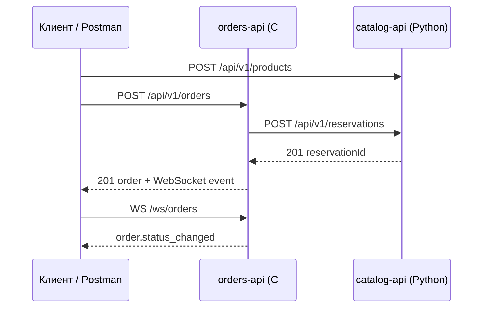

# Практикум — сценарий и архитектура OrderDesk

<div class="article-tags">
  <span class="tag tag-required">ОБЯЗАТЕЛЬНО</span>
  <span class="tag tag-beginner">ДЛЯ НОВИЧКОВ</span>
</div>

<span class="complexity-badge">Разработчику</span>
<span class="complexity-badge">Архитектору</span>

> **Практикум, шаг 1 из 8.** Перед кодом фиксируем **зачем** нужны два сервиса и **как** они общаются. Теория — [REST](/encyclopedia/8-infra-security/8-05-mikroservisy-i-integratsiya/1151), [проектирование API](/encyclopedia/8-infra-security/8-05-mikroservisy-i-integratsiya/122), [реактивные транспорты](/encyclopedia/8-infra-security/8-05-mikroservisy-i-integratsiya/116).

---

## Бизнес-задача

**OrderDesk** — учебный мини-склад интернет-магазина:

1. Менеджер заводит **товары** и остатки (каталог).
2. Оператор оформляет **заказ** на несколько позиций.
3. При создании заказа система **резервирует** остаток в каталоге.
4. Клиенты (веб, Postman) получают **живые уведомления** о смене статуса заказа.

Один монолит на двух языках здесь не нужен: в реальных системах каталог и заказы часто развиваются разными командами и релизными циклами. Практикум показывает **интеграцию через контракт**, а не через общую базу.

---

## Два сервиса

| Сервис | Язык | Ответственность |
|--------|------|-----------------|
| **catalog-api** | Python (FastAPI) | CRUD товаров, остаток, резервирование и отмена резерва |
| **orders-api** | C# (ASP.NET Core) | CRUD заказов, оркестрация резерва в каталоге, WebSocket для подписчиков |

**Правило границ:** только `catalog-api` меняет поле `stockAvailable`. `orders-api` хранит заказы и статусы (`draft` → `reserved` → `confirmed` / `failed`), но остатки запрашивает по HTTP.

---

## Диаграмма взаимодействия



---

## Почему REST между сервисами, WebSocket к клиенту

- **REST** между `orders-api` и `catalog-api` — запрос-ответ, понятные коды ошибок, кэширование `GET`, идемпотентный `DELETE` резерва. Подходит для **синхронной оркестрации** «создать заказ → зарезервировать».
- **WebSocket** от `orders-api` к клиенту — **push** без опроса: статус заказа меняется редко, но UI должен узнать сразу. Подробнее о выборе транспорта — в [116](/encyclopedia/8-infra-security/8-05-mikroservisy-i-integratsiya/116).

В базовой версии практикума **WebSocket** поднимается на `orders-api`; каталог остаётся внутренним доменным сервисом по REST. При расширении можно добавить SSE или webhook из каталога в заказы (шаг 7).

---

## Нефункциональные требования

| Требование | Решение в практикуме |
|------------|----------------------|
| Версионирование API | Префикс `/api/v1` |
| Безопасность | JWT для клиентов, заголовок `X-Api-Key` между сервисами |
| Масштабирование | Stateless HTTP; сессии WebSocket привязаны к экземпляру (sticky sessions или Redis backplane — в проде) |
| Наблюдаемость | `X-Request-Id` сквозь оба сервиса, структурированные логи |
| Отказоустойчивость | Таймаут HttpClient, повтор только для идемпотентных операций |

---

## Структура репозитория

Создайте папку `OrderDesk` рядом с учебными проектами:

```
OrderDesk/
├── catalog-api/          # Python
│   ├── app/
│   │   ├── main.py
│   │   ├── models.py
│   │   ├── schemas.py    # DTO (Pydantic)
│   │   └── db.py
│   └── requirements.txt
└── orders-api/           # C#
    ├── Program.cs
    ├── Models/
    ├── Dtos/
    └── appsettings.json
```

Код появится в шагах [4](./4.md) и [5](./5.md). Следующий шаг — **контракт API** без привязки к языку: [Проектирование контракта](./2.md).

---

## Роли и доверие

```text
                    ┌─────────────────┐
  Публичный JWT     │   orders-api    │     X-Api-Key (сервисный)
  Postman / SPA ───►│  заказы, WS     │──────────────────────────► catalog-api
                    └─────────────────┘
                           │
                     SQLite orders
```

| Зона | Кто вызывает | Аутентификация |
|------|--------------|----------------|
| Каталог, CRUD товаров | Менеджер, Postman | JWT (опционально в учебной версии) или внутренняя сеть |
| Резервы | Только orders-api | `X-Api-Key` |
| Заказы, WebSocket | Оператор, UI | JWT Bearer / `access_token` в query для WS |

Сверьте потоки в [интерактивной песочнице](/encyclopedia/8-infra-security/8-08-praktikum-rest-i-websocket/intro) — кнопки «Сквозной сценарий» и «Catalog down» показывают те же коды, что ожидаются в Postman.

---

## Типовые сбои и ответ системы

| Ситуация | Симптом для клиента | Где чинить |
|----------|---------------------|------------|
| Каталог недоступен | `502 Bad Gateway` на `POST /orders` | Таймаут HttpClient, health-check catalog |
| Двойной клик «Оформить» | Два заказа или один (с `Idempotency-Key`) | [шаг 6](./6.md) |
| Резерв есть, оплата отменена | Остаток «завис» | `POST …/cancel` + `DELETE` резерва в каталоге |
| WebSocket оборвался | UI отстаёт от REST | Reconnect + `GET /orders/{id}` для синхронизации ([шаг 7](./7.md)) |

---

## Критерии готовности шага 1

- [ ] Нарисована диаграмма из трёх участников (клиент, orders, catalog).
- [ ] Понятно, какое поле (`stockAvailable`) владеет только каталогом.
- [ ] Выбраны порты `8100` / `5200` и префикс `/api/v1`.
