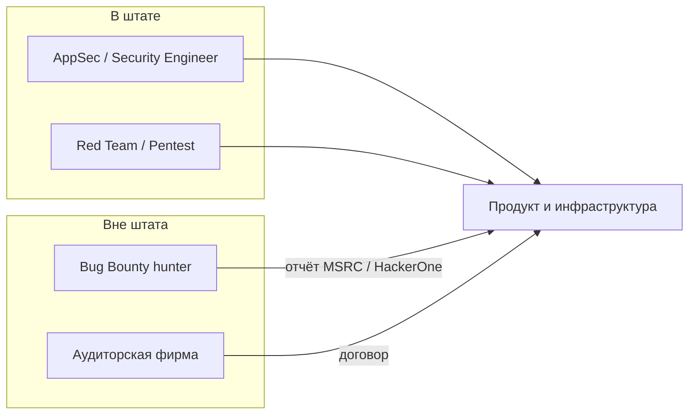

# Белое хакерство — основы

  ОБЯЗАТЕЛЬНО
  ДЛЯ НОВИЧКОВ

Разработчику
Тестировщику
Инженеру

> **Раздел 8.09, шаг 1 из 6.** Дальше — [как оформляют находки](./2.md) и [программы Bug Bounty](./3.md).

---

## Что такое белое хакерство

**Белый хакер** (white hat, этичный хакер) — специалист, который применяет те же приёмы, что и злоумышленник (разведка, эксплуатация слабых мест, обход контролей), но **с разрешения** владельца системы и с целью **усилить защиту**, а не причинить ущерб. В русскоязычном сленге говорят о «белой шляпе»; противоположность — «чёрная шляпа» ([чёрный хакер](https://ru.wikipedia.org/wiki/%D0%A7%D1%91%D1%80%D0%BD%D0%B0%D1%8F_%D1%88%D0%BB%D1%8F%D0%BF%D0%B0)).

Ключевое отличие от «взлома ради интереса» — **правовой и договорной контекст**:

| Элемент | Белое хакерство | Несанкционированный доступ |
|---------|-----------------|---------------------------|
| Согласие | Письменный договор, правила Bug Bounty, scope программы | Нет |
| Цель | Закрыть уязвимость, улучшить продукт | Кража, шантаж, саботаж |
| Действия после находки | Отчёт вендору, срок на патч | Продажа доступа, публикация эксплойта |
| Ответственность | Прозрачные правила, иногда вознаграждение | Уголовная и гражданская |

  
Без разрешения — не «белое»

  

  В России неправомерный доступ к компьютерной информации подпадает под [ст. 272 УК РФ](https://www.consultant.ru/document/cons_doc_LAW_10699/c87a336408011de5d6f360a9bf71e30d4f22d/) независимо от мотива («я же хотел помочь»). Исключение — когда закон или **явное согласие** владельца это разрешают: договор на пентест, публичная программа Bug Bounty с перечислением разрешённых действий.
  

Исторически идея «этичного взлома» укрепилась вместе с ростом интернета: военные и корпоративные заказчики заказывали проверки Multics и UNIX; позже появились инструменты вроде SATAN для **автоматизированного** анализа сетей. Сегодня отрасль опирается на стандарты координированного раскрытия ([ISO/IEC 29147](https://www.iso.org/standard/72311.html), [ISO/IEC 30111](https://www.iso.org/standard/53208.html)) и открытые каталоги вроде [CVE](https://www.cve.org/).

### Хронология

| Период | Веха |
|--------|------|
| 1960–70-е | Аудиты Multics, военные Red Team |
| 1995 | SATAN — массовая сетевая проверка |
| 1999 | RFC 2828, формализация терминов ИБ |
| 2000-е | PCI DSS, обязательные пентесты у процессингов |
| 2010-е | HackerOne, публичные Bug Bounty у Facebook, Google |
| 2020-е | Bounty для облака, CI/CD, AI-пайплайнов; регуляторика ПДн |

---

## CVE, CWE и язык общения с вендором

Когда уязвимость подтверждена, вендор часто получает **CVE** (Common Vulnerabilities and Exposures) — публичный идентификатор вроде `CVE-2026-33825`. Исследователю полезно сразу думать категориями **CWE** (Common Weakness Enumeration) — *класс* ошибки, а не только конкретный баг в одном URL.

| Идентификатор | Что описывает | Пример |
|---------------|---------------|--------|
| **CVE** | Конкретная уязвимость в продукте/версии | CVE в модуле ядра Windows |
| **CWE** | Тип слабости в дизайне или коде | CWE-79 (XSS), CWE-287 (Improper Authentication) |
| **CAPEC** | Паттерн атаки | Цепочка фишинг → кража сессии |

В отчёте достаточно написать: «Broken Access Control (OWASP A01:2021), близко к CWE-639 (Authorization Bypass Through User-Controlled Key)». Это ускоряет triage: аналитик сразу видит **куда** смотреть в коде.

---

## Три «шляпы» и серые зоны

Метафора «шляп» описывает **намерение и правовой статус**, а не уровень навыка.

| Шляпа | Роль | Типичные действия |
|-------|------|-------------------|
| **Белая** | Защитник, исследователь, пентестер в штате или на контракте | Отчёт вендору, патч, аудит по договору |
| **Серая** | Спорная легальность или двойственная мотивация | Взлом DRM «для архива», публикация 0-day без согласия «ради давления» |
| **Чёрная** | Преступная деятельность | Ransomware, кража карт, продажа доступа |

  
Этика vs «хакерские правила»

  

  Ранняя «хакерская этика» Леви и современная практика расходятся: <strong>лучший взлом — этичный и законный</strong>. Навык без морального компаса вредит и исследователю, и отрасли. Практическое правило: не причинять вред ради денег или славы; scope и согласие владельца — обязательны.
  

**Серые** сценарии часто обсуждают в СМИ: взломщики игровых копий, «активисты», публикующие уязвимости без координации. Для инженера практичное правило одно: **если scope и safe harbor не описаны письменно — риск на исследователе**.

### Хакер и кракер в русской традиции

В англоязычной среде *hacker* часто означает «глубоко разбирающегося в системе». В русском «хакер» в СМИ почти всегда ассоциируется с преступником; для **легальной** роли используют «специалист по тестированию на проникновение», «исследователь безопасности», «аналитик ИБ». В международных отчётах и на HackerOne профиль всё равно может называться *security researcher*.

---

## Белый хакер, пентестер, AppSec-инженер

Эти роли пересекаются, но **занятость и рамка** разные.

### Пентестер (penetration tester)

- Работает по **заказу** (внутренний Red Team или внешняя фирма).
- Имеет **Statement of Work**: цели, сроки, запрещённые техники (например, без социальной инженерии на сотрудников).
- Сдаёт **отчёт** с рисками, скриншотами, рекомендациями; часто проводит **ретест** после исправлений.
- Режимы: black box (без знаний), gray box (учётка пользователя), white box (код и архитектура).

Подробнее о методах — в [тестировании ИБ](/encyclopedia/7-project/7-05-testirovanie/123).

### Специалист по безопасности приложений (AppSec)

- В **штате** продукта: secure SDLC, ревью кода, SAST/DAST в CI, обучение разработчиков.
- Может **не** «взламывать» продакшен ежедневно, но проектирует контроли и реагирует на инциденты.

### Независимый исследователь Bug Bounty

- Ищет уязвимости **вне штатного графика**, в рамках [публичных программ](./3.md).
- Оплата **за результат** (valid report), без фиксированного оклада.
- Сам ведёт налоги, выбирает проекты, конкурирует с другими исследователями.

### Red Team, Blue Team, Purple Team

| Команда | Задача | Связь с «белой шляпой» |
|---------|--------|-------------------------|
| **Red** | Атакует по сценарию | Пентест, adversary simulation |
| **Blue** | Защищает, детектит, расследует | SOC, SIEM, IR |
| **Purple** | Совместные учения Red + Blue | Закрытие разрыва между атакой и мониторингом |

Bug Bounty **дополняет**, а не заменяет Red Team: внешние исследователи видят продукт свежим взглядом и не связаны внутренней «короной» (предположение «у нас так не принято»).

### Другие роли рядом

- **CSIRT / CERT** — координация инцидентов и приём внешних отчётов (иногда единая точка `security@company.com`).
- **GRC** — соответствие стандартам (ISO 27001, PCI), не эксплуатация.
- **Threat Intelligence** — сбор индикаторов компрометации, не PoC в веб-форме.

---

## Закон и этика в России и мире

В РФ белое хакерство **не выделено** отдельной статьёй закона: действует общий режим защиты информации. Обсуждаются законопроекты о **регулировании исследовательской деятельности** (лицензии, реестры), но на практике компании опираются на **договоры** и **правила программ**.

### Статьи УК РФ, которые должен знать исследователь

| Статья | Суть | Связь с bounty |
|--------|------|----------------|
| **272** | Неправомерный доступ к компьютерной информации | Любой тест без согласия |
| **273** | Создание/распространение вредоносных программ | PoC-вирус «для демо» |
| **274** | Нарушение правил эксплуатации ЭВМ | Обход защиты вне scope |
| **274.1** | Неправомерное воздействие на критическую инфраструктуру | Отдельные OT/гос-системы |

**152-ФЗ** — если в PoC попали ФИО, телефоны, email реальных пользователей, возможны административные последствия даже при «благих» намерениях. Используйте синтетические данные.

**Гражданско-правовой** уровень: нарушение пользовательского соглашения (ToS) сайта без safe harbor может стать основанием для иска о возмещении убытков (в США это обсуждают в контексте CFAA).

### Договор на пентест — минимальный набор пунктов

- перечень **IP, доменов, приложений**;
- **запрещённые** действия (DoS, социнженерия, физический доступ);
- окна времени тестов;
- контактное лицо для **экстренной** остановки;
- право на хранение логов и **срок** уничтожения данных;
- формат отчёта и **ретест**;
- конфиденциальность (NDA).

Bug Bounty заменяет договор **публичной политикой** программы — её читают так же внимательно.

В США и ЕС дополнительно смотрят на:

- **CFAA** (Computer Fraud and Abuse Act) — доступ «с превышением полномочий»;
- **DMCA** — обход технических средств защиты (важно для исследований ПО и игр);
- **GDPR** — если в PoC попали персональные данные реальных пользователей.

Этический минимум для исследователя:

1. Читать **scope** программы (домены, запрещённые атаки, запрет DoS).
2. **Минимизировать** вред (не читать чужие письма «для демонстрации», не удалять данные).
3. **Не публиковать** детали эксплуатации до согласованного срока (embargo).
4. **Хранить** переписку и артефакты — они могут понадобиться при споре о выплате.

---

## Как компании используют белых хакеров

| Канал | Кто платит | Когда уместно |
|-------|------------|---------------|
| Штатный Red Team / AppSec | Зарплата | Постоянный продукт, регулярные релизы |
| Разовый пентест по договору | Фикс за проект | Аудит перед сертификацией, после M&A |
| **Bug Bounty** | Вознаграждение за отчёт | Широкая поверхность атаки (много сервисов) |
| **Vulnerability Disclosure Program (VDP)** | Часто без денег, только благодарность | Приём отчётов даже вне bounty |
| Координаторы (HackerOne, Bugcrowd) | Комиссия с выплат | Масштаб, triage, юридическая обёртка |

По оценкам отрасли, доля **устранённых** отчётов от независимых исследователей варьируется: часть компаний закрывает критичные находки за дни, часть — месяцами откладывает или помечает отчёт «не уязвимость». Это порождает напряжение между «охотой за дырами» и **capacity** команд безопасности — тема [шага 6](./6.md).

### Как компания запускает программу (внутренний взгляд)

1. **Инвентаризация** активов (домены, API, мобильные клиенты).
2. Юристы согласуют **safe harbor** и лимиты ответственности.
3. Выбор модели — свой портал или HackerOne/Bugcrowd.
4. Назначение **triage** (внутренний SOC или аутсорс).
5. Бюджет на выплаты и связка с Jira/ServiceNow.
6. Публичный **Hall of Fame** и метрики (время до патча, % valid reports).

Разработчикам полезно знать: отчёт bounty попадает в тот же бэклог, что и finding от SAST — с приоритетом по риску.

---

## Модель угроз и белый хакер

До теста в штате или по контракту часто строят **модель угроз** (STRIDE, PASTA, MITRE ATT&CK для сценариев). Белый хакер проверяет, реализованы ли контроли против **конкретных** угроз:

- подделка запроса (CSRF);
- повышение привилегий (vertical/horizontal escalation);
- утечка через бэкапы и логи.

Bug Bounty редко даёт документ STRIDE, но каждый отчёт — «живое» доказательство, что модель была неполной.

---

## Мифы и факты

| Миф | Факт |
|-----|------|
| «Белый хакер = взломщик с совестью» | Это **профессия** с процессами, отчётностью и ответственностью перед заказчиком |
| «Достаточно знать Kali Linux» | Нужны сети, веб, ОС, умение **писать** и **объяснять** бизнес-риск |
| «Bug Bounty — лёгкие деньги» | Конкуренция высокая; многие отчёты дубликаты или out of scope |
| «Компания обязана платить за любую дыру» | Платят по **правилам программы** и severity; спорные кейсы закрывают как Informative |

---

## Краткий итог

Белое хакерство — **легальный и этичный** поиск уязвимостей с согласия владельца. Оно реализуется через штатных инженеров, пентест по договору и публичные программы Bug Bounty. Граница между «помощью» и преступлением проходит по **разрешению** и **документации**, а не по техническому мастерству.

Следующий шаг — [как оформляют находку](./2.md), чтобы её приняли и исправили.

---
