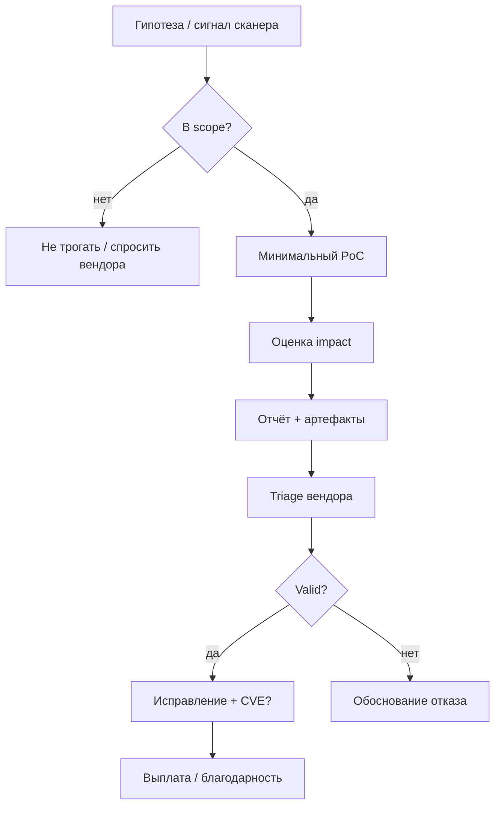
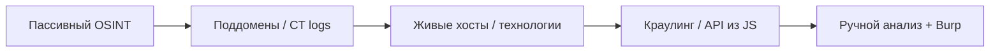

# Как ищут и оформляют уязвимости

<div class="article-tags">
  <span class="tag tag-required">ОБЯЗАТЕЛЬНО</span>
</div>

<span class="complexity-badge">Тестировщику</span>
<span class="complexity-badge">Разработчику</span>

> **Раздел 8.09, шаг 2 из 6.** Предыдущий — [основы](./1.md); далее — [Bug Bounty](./3.md).

---

## Жизненный цикл одной находки



Хороший отчёт экономит недели споров: инженер безопасности на стороне вендора **не видел** ваш эксперимент и должен **повторить** его по тексту.

---

## Scope — что можно трогать

**Scope** (область тестирования) задаётся в правилах Bug Bounty или договоре на пентест.

Типичные элементы:

| Поле | Примеры |
|------|---------|
| **In scope** | `*.example.com`, мобильное приложение v3+, API `api.example.com` |
| **Out of scope** | staging без отдельной пометки, сторонние виджеты, физический офис |
| **Запрещено** | социальная инженерия на сотрудников, DoS, спам пользователям |
| **Особые условия** | только тестовые аккаунты; не скачивать реальные ПДн |

<div class="callout callout--warning">
  <div class="callout-title">Out of scope = риск для вас</div>

  <div class="callout-body">
  Находка на забытом поддомене `old-api.example.com` может быть **ценной для компании**, но **не оплачиваемой** по правилам. Перед глубоким тестом сверяйте asset inventory в программе (иногда публикуют список IP и доменов).
  </div>
</div>

### Типы программ по доступу

| Тип | Кто видит | Для кого |
|-----|-----------|----------|
| **Public** | Все зарегистрированные | Старт, обучение |
| **Private** | По приглашению (репутация, CTF) | Опытные, выше выплаты |
| **VDP** | Все, без обязательной оплаты | Первый легальный контакт с вендором |

---

## Как выявляют уязвимости

### Разведка (reconnaissance)

- Пассивная: DNS, сертификаты (Certificate Transparency), архивы URL, утечки в открытых базах (без взлома).
- Активная: скан портов, перечисление поддоменов, анализ JavaScript и API из фронтенда.

См. [легальный сбор информации](/encyclopedia/8-infra-security/8-07-informatsionnaya-bezopasnost/122).

#### Пайплайн recon (веб, упрощённо)



Инструменты по этапам (примеры, не реклама):

| Этап | Инструмент | Зачем |
|------|------------|-------|
| Поддомены | subfinder, amass, crt.sh | Расширить scope внутри `*.example.com` |
| Скан портов | nmap (осторожно с rate) | Сервисы, версии |
| HTTP | httpx, whatweb | Живые URL, стек |
| Директории | ffuf, feroxbuster | Скрытые `/admin`, backup |
| Прокси | Burp Suite, ZAP | Ручная логика |

<div class="callout callout--caution">
  <div class="callout-title">Агрессивный скан</div>

  <div class="callout-body">
  Массовый nmap по всем IP компании может нарушить правило «no DoS / no aggressive scanning». В policy часто просят **ограничить** частоту запросов (например, ≤ 5 req/s).
  </div>
</div>

### Анализ поверхности атаки

- Все входы: формы, REST, GraphQL, WebSocket, загрузки файлов, заголовки.
- Логика: обход оплаты, IDOR, race condition, цепочки из двух «низких» багов.

### Инструменты (вспомогательно)

| Класс | Примеры | Роль |
|-------|---------|------|
| Прокси / перехват | Burp Suite, OWASP ZAP | Правка запросов, повтор, пассивный анализ |
| Сканеры | nuclei, nmap, специализированные DAST | Широкий охват, много шума |
| Фаззинг | ffuf, wfuzz | Поиск скрытых путей и параметров |
| Зависимости | OWASP Dependency-Check, Snyk | Известные CVE в библиотеках |

Автоматика находит **известные** шаблоны; цепочки бизнес-логики почти всегда требуют руки. Подробнее — [тестирование ИБ](/encyclopedia/7-project/7-05-testirovanie/123).

### Частые классы находок в Bug Bounty (веб)

| Класс | Суть | Типичный bounty |
|-------|------|-----------------|
| **IDOR / BOLA** | Доступ к чужому объекту по id | Medium–High |
| **SSRF** | Сервер ходит по URL атакующего | High–Critical |
| **SQLi** | Инъекция в БД | High (реже на зрелых продуктах) |
| **XSS** | Скрипт в браузере жертвы | Low–High (зависит от контекста) |
| **Auth bypass** | Обход входа или 2FA | Critical |
| **RCE** | Выполнение кода | Critical |
| **Business logic** | Цена 0, двойное списание | High (спорный triage) |
| **Subdomain takeover** | Чужой DNS на забытый CNAME | Medium |
| **Leaked secrets** | Ключ в JS / Git | High |

Технические детали — [инъекции](/encyclopedia/8-infra-security/8-07-informatsionnaya-bezopasnost/123), [уязвимости API](/encyclopedia/8-infra-security/8-07-informatsionnaya-bezopasnost/128), [12 советов по API](/encyclopedia/2-system-network/2-09-osnovy-integratsionnogo-vzaimodeystviya/132).

### Рабочий процесс в Burp Suite

1. Настроить браузер на прокси `127.0.0.1:8080`, установить CA Burp.
2. Пройти сценарий приложения — **Target** → Site map.
3. Отправить интересные запросы в **Repeater**, менять параметры.
4. **Intruder** — для перебора id (осторожно с rate limit).
5. **Scanner** (Pro) — только если policy разрешает активное сканирование.
6. Экспорт запроса: правый клик → **Copy as curl** → в отчёт.

### Мобильные приложения и API

- Декомпиляция APK/IPA (jadx, Ghidra) — только если policy разрешает reverse engineering.
- Перехват TLS — Frida, objection, кастомный CA на тестовом устройстве.
- Сравнение **мобильного API** с вебом: часто мобильный backend слабее защищён.
- Жёсткая привязка к **версии** сборки в отчёте (`versionCode`, bundle id).

---

## Цепочки уязвимостей (chaining)

Один **Information Disclosure** (утечка внутреннего URL) + **SSRF** + доступ к metadata облака = Critical. В отчёте опишите **цепочку** по шагам:

1. Шаг A — что получаем (токен, URL).
2. Шаг B — как используем в другом эндпоинте.
3. Итоговый impact (чтение секретов, RCE).

Вендоры (особенно Apple, Google) платят за **chain** больше, чем за сумму частей.

---

## Proof of Concept (PoC)

**PoC** — минимальная демонстрация, что уязвимость **реальна**, без лишнего ущерба.

Принципы хорошего PoC:

1. **Воспроизводимость** — пошагово, с указанием версии, учётки (тестовой), времени.
2. **Минимальность** — один HTTP-запрос лучше, чем полный RCE с установкой бэкдора.
3. **Безопасность** — не exfiltrировать реальные данные клиентов; заменить на `test-user-123`.
4. **Доказательство impact** — что именно получает атакующий (чтение чужого файла, выполнение команд от имени службы).

Пример структуры шага для IDOR:

```http
GET /api/v1/orders/1001 HTTP/1.1
Host: shop.example.com
Authorization: Bearer <token_user_A>

HTTP/1.1 200 OK
{"order_id":1001,"owner":"user_B","total":5000}
```

Комментарий в отчёте: «Пользователь A получил заказ пользователя B, сменив только id в URL».

---

## Оценка серьёзности

Чаще всего используют **CVSS** (Common Vulnerability Scoring System) — число 0.0–10.0 и вектор (`CVSS:3.1/AV:N/AC:L/...`). Вендор может **скорректировать** оценку с учётом реальной эксплуатации в своей среде.

| Диапазон | Условная метка | Пример |
|----------|----------------|--------|
| 9.0–10.0 | Critical | RCE на публичном сервере без аутентификации |
| 7.0–8.9 | High | обход авторизации к админ-функциям |
| 4.0–6.9 | Medium | XSS с ограниченным контекстом |
| 0.1–3.9 | Low / Info | раскрытие версии сервера без эксплуатации |

В Bug Bounty выплата привязана к **severity после triage**, а не к вашей первоначальной оценке.

### Как читать вектор CVSS 3.1

Пример: `CVSS:3.1/AV:N/AC:L/PR:N/UI:N/S:U/C:H/I:H/A:H` — сеть, низкая сложность, без аутентификации, высокий ущерб по CIA.

Калькулятор: [FIRST CVSS Calculator](https://www.first.org/cvss/calculator/3.1). В отчёте укажите **свою** оценку и кратко обоснуйте `PR` (нужны ли права пользователя) и `UI` (нужно ли действие жертвы).

### Severity в HackerOne / MSRC

Платформы могут использовать **свою** шкалу (Low/Medium/High/Critical) с маппингом на CVSS. Спор о «High vs Critical» — частая причина appeal; приложите **видео** с полной цепочкой.

---

## Шаблон отчёта

Универсальный каркас (адаптируйте под портал MSRC, HackerOne, GitLab Security):

### 1. Резюме (2–3 предложения)

Что сломано, кто страдает, максимальный ущерб.

### 2. Продукт и версия

Сервис, сборка, URL, идентификатор мобильной версии.

### 3. Шаги воспроизведения

Нумерованный список. К каждому шагу — скриншот или запрос из Burp (экспорт в файл).

### 4. PoC

Код, curl, видео (короткое), **без** паролей реальных пользователей.

### 5. Impact

Конфиденциальность / целостность / доступность; соответствие OWASP (например, Broken Access Control).

### 6. Рекомендации по исправлению

Конкретика: «проверять owner_id на сервере», «параметризованные запросы», «CSP с nonce».

### 7. Вложения

- HAR, pcap (если уместно);
- логи с **замаскированными** токенами;
- дата и час отправки (для доказательства приоритета при дубликатах).

<div class="callout callout--tip">
  <div class="callout-title">Дубликаты</div>

  <div class="callout-body">
  Если два исследователя нашли одно и то же, обычно платят **первому valid отчёту**. Фиксируйте время отправки и не выкладывайте PoC публично до эмбарго.
  </div>
</div>

### Пример заполнения (фрагмент для HackerOne)

```markdown
## Summary
Any authenticated user can export billing data of another organization
by changing the numeric `org_id` in POST /api/v2/reports/export.

## Steps to reproduce
1. Log in as user-a@test.example.com (org 100).
2. Intercept POST /api/v2/reports/export with Burp.
3. Replace `"org_id":100` with `"org_id":101`.
4. Observe HTTP 200 and CSV containing PII of org 101.

## Impact
Broken Access Control — confidentiality of all customers in other tenants (GDPR-relevant).

## Remediation
Authorize org_id against session membership on server side.

## Supporting material
- request-export-org101.http (attached)
- screen-recording.mp4 (90s)
```

Поля **Asset**, **Weakness** (CWE), **Severity** на платформе выбирайте из списка — это ускоряет маршрутизацию.

---

## Артефакты и доказательная база

При спорах (выплата, приоритет, «мы не получали отчёт») решают **логи портала**, а не переписка в мессенджере.

Рекомендуется:

- скриншоты **страницы отправки** с номером тикета;
- экспорт переписки из портала (PDF/HTML, если доступно);
- локальная копия отчёта с хешем файла (SHA-256) и датой;
- **не** полагаться только на почту, если программа требует MSRC / HackerOne.

Тема конфликтов и удалённых аккаунтов — в [статье про сбои доверия](./6.md).

### Журнал исследователя (рекомендуемые колонки)

| Дата | Программа | ID тикета | Кратко | Статус | Выплата |
|------|-----------|-----------|--------|--------|---------|
| 2026-05-01 | Example SaaS | #88421 | IDOR export | Triaged | — |
| 2026-05-10 | Example SaaS | #88421 | | Resolved | $2 500 |

Храните в зашифрованном виде: в журнале не должно остаться живых токенов и ПДн.

---

## Отчёт внутри компании (штатный пентест)

Тот же каркас плюс:

- **Executive summary** для руководства (риск в деньгах и сроках);
- матрица находок (таблица: ID, severity, статус, владелец);
- план **ретеста** после патча;
- ссылка на требования (PCI DSS, 152-ФЗ, внутренний стандарт).

---

## Типичные причины отклонения отчёта

| Ответ вендора | Что это значит | Ваши действия |
|---------------|----------------|---------------|
| **Duplicate** | Уже известно | Проверить CVE, спросить ссылку на оригинальный тикет |
| **Informative** | Поведение признано, риск низкий | Уточнить impact; иногда повышают после доп. PoC |
| **Not applicable** | Out of scope / сторонний продукт | Перечитать scope |
| **Won't fix** | Принятый риск | Зафиксировать для себя; не публиковать без согласования |
| **N/A** | Не воспроизвели | Дать больше деталей, видео, тестовую учётку |

### Appeal (обжалование)

Если уверены в severity:

1. Вежливо приложите **расширенный** PoC (цепочка, количество затронутых пользователей).
2. Сошлитесь на **аналогичный** CVE у конкурента (осторожно, не как ультиматум).
3. Используйте формальную кнопку **Request mediation** на HackerOne при тупике.

---

## Краткий итог

Поиск уязвимостей — цикл **гипотеза → scope → PoC → отчёт**. Качество отчёта определяет, примут ли находку и как быстро выпустят патч. Следующий шаг — [как устроены Bug Bounty и CVD](./3.md).

---
