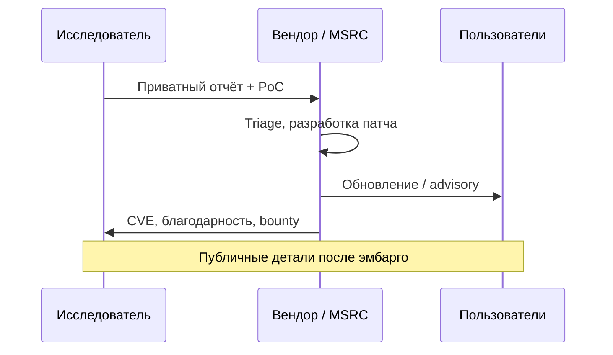
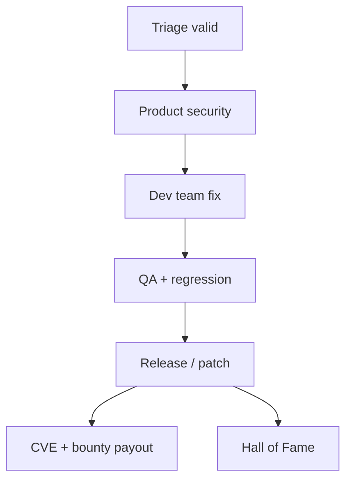

# Bug Bounty и координированное раскрытие

<div class="article-tags">
  <span class="tag tag-required">ОБЯЗАТЕЛЬНО</span>
</div>

<span class="complexity-badge">Разработчику</span>
<span class="complexity-badge">Тестировщику</span>

> **Раздел 8.09, шаг 3 из 6.** Детали по вендорам — [программы техгигантов](./4.md).

---

## Bug Bounty и VDP

| Программа | Оплата | Цель |
|-----------|--------|------|
| **Bug Bounty** | Денежное вознаграждение (иногда swag, Hall of Fame) | Мотивировать поиск серьёзных уязвимостей |
| **VDP** (Vulnerability Disclosure Program) | Обычно без выплаты | Легальный канал сообщить о проблеме |

Многие гиганты совмещают оба канала: VDP принимает любой отчёт, bounty платит за подтверждённые уязвимости **в scope** с достаточным severity.

Экономика для компании — тысячи исследователей × фракция рабочего времени часто **дешевле**, чем содержать Red Team того же масштаба, но появляются расходы на **triage**, юристов и выплаты ($500 – $250 000+ за критичные цепочки в облаке и мобильных ОС).

### ROI для бизнеса (упрощённая логика)

| Фактор | Пентест 2 раза в год | Bug Bounty круглый год |
|--------|----------------------|-------------------------|
| Охват | Ограничен сроком проекта | Постоянный поток глаз |
| Стоимость | Фикс $50k–$200k+ | Переменная, только за valid |
| Риск | Предсказуемый бюджет | Всплеск при критичном RCE |
| Шум | Мало ложных срабатываний при хорошем SoW | Много duplicate / informative |

Зрелые программы считают **стоимость инцидента** (простой, штрафы 152-ФЗ/GDPR, репутация) и сравнивают с суммой bounty + FTE triage.

---

## Координированное раскрытие (CVD)

**Coordinated Vulnerability Disclosure** — договорённость: исследователь сообщает вендору **приватно**, вендор готовит патч, затем публикуется [CVE](https://www.cve.org/) и advisory. Сроки часто **90 дней** (Google Project Zero) или индивидуально.

Этапы:



**Full disclosure** (немедленная публикация без ожидания патча) иногда оправдывают давлением на бездействующего вендора, но увеличивает риск массовой эксплуатации и **юридических** претензий к автору. Сообщество чаще поддерживает CVD при работающем канале связи.

### Сроки эмбарго у разных организаций (ориентир)

| Инициатор | Типичный срок | Примечание |
|-----------|---------------|------------|
| **Google Project Zero** | 90 дней (+ grace) | Жёсткий дедлайн публикации |
| **Microsoft MSRC** | Согласование в тикете | Patch Tuesday влияет на дату |
| **CERT/CC** | Координация нескольких вендоров | Для библиотек с цепочкой поставок |
| **Многие SaaS** | 45–90 дней | В policy программы |

Исследователь фиксирует **дату начала** отсчёта (день valid triage, не день первого "мы посмотрим").

### ISO/IEC 29147 и 30111 — что это даёт на практике

- **29147** — *как принимать* отчёты (каналы, SLA, форматы).
- **30111** — *как обрабатывать* внутри вендора (исправление, тесты, advisory).

Для исследователя достаточно знать: крупные вендоры формально следуют этим рамкам, даже если портал выглядит как простая форма.

---

## Платформы-посредники

| Платформа | Роль |
|-----------|------|
| [HackerOne](https://www.hackerone.com/) | Крупнейший хаб программ, triage, выплаты |
| [Bugcrowd](https://www.bugcrowd.com/) | Аналогично, корпоративные заказчики |
| [Intigriti](https://www.intigriti.com/) | Сильное присутствие в ЕС |
| [YesWeHack](https://www.yeswehack.com/) | Европа, open source программы |
| [Synack](https://www.synack.com/) | Закрытые приглашённые исследователи |

Собственные порталы — **Microsoft MSRC**, **Google bughunter**, **Apple Security Research**, **Meta Whitehat**, **GitHub Security Lab**.

Компания выбирает модель:

- **Self-managed** — свой портал (MSRC);
- **Platform-managed** — HackerOne ведёт triage за процент;
- **Гибрид** — публичная программа на платформе + внутренний SOC.

### Поля отчёта на HackerOne (типичные)

| Поле | Что писать |
|------|------------|
| **Asset** | Точный хост / приложение из scope |
| **Weakness** | CWE из списка |
| **Severity** | CVSS + краткое обоснование |
| **Title** | Одна строка — суть бага |
| **Description** | Шаги + impact + remediation |
| **Attachments** | curl, видео, скриншоты |

Статусы: `New` → `Triaged` → `Resolved` / `Duplicate` / `Informative`. Уведомления на email — дублируйте важные ответы в локальный журнал.

---

## Safe harbor

**Safe harbor** — формулировка в правилах: "если вы следуете этой политике, мы **не будем** преследовать вас за исследование". Без неё даже "белый" тест может трактоваться как нарушение ToS или CFAA.

Проверяйте:

- явное разрешение на типы тестов (автоматическое сканирование, социнженерия);
- ограничение ответственности за случайный сбой;
- контакт для экстренной связи при критичной находке.

---

## Triage — что происходит после отправки

1. **Автоматическая проверка** — дубликат, спам, out of scope.
2. **Аналитик безопасности** — воспроизведение PoC.
3. **Классификация severity** — CVSS, внутренняя матрица риска.
4. **Маршрутизация** — команде продукта (Windows, облако, веб).
5. **Исправление** — патч, конфиг, WAF как временная мера.
6. **Закрытие** — выплата, CVE, Hall of Fame.

Сроки — от **часов** (критичный RCE) до **месяцев** (спорный low, очередь, праздники). Исследователи жалуются на "тихие" фиксы без выплаты, когда баг закрыли как дубликат внутреннего тикета — предмет [конфликтов](./6.md).

### Внутри вендора после triage



Временный **WAF-rule** или отключение функции — не замена патчу; в отчёте можно спросить, планируется ли полноценное исправление.

---

## Выплаты и налоги

- Валюта чаще **USD**; для резидентов РФ актуальны санкционные ограничения, SWIFT, крипто-выплаты через платформу — смотрите FAQ программы.
- Формы — PayPal, банковский перевод, HackerOne Payments.
- **Налоги** — обязанность исследователя (ИП, самозанятость, декларация в зависимости от юрисдикции).
- **Дубликат** — второй отчёт обычно **без** оплаты; спорят редко, если разница в минутах.

#### Россия — практические заметки

- Выплаты в USD/EUR могут идти через **HackerOne**, Payoneer, крипто — смотрите актуальный FAQ и санкционные ограничения.
- Доход физлица подлежит декларированию; удобные режимы — **самозанятость** (НПД) или **ИП** при регулярных суммах.
- Договор с платформой — оферта; сохраняйте **выписки** для бухгалтерии.

Типовые вилки (ориентиры, меняются):

| Severity | Web / SaaS | Mobile / OS kernel |
|----------|------------|---------------------|
| Low | $100 – — 000 | $500 – $5 000 |
| Medium | — 000 – $5 000 | $5 000 – $15 000 |
| High | $5 000 – $20 000 | $15 000 – $100 000 |
| Critical | $10 000 – $50 000+ | $100 000 – $250 000+ |

Точные таблицы — только в **актуальной** политике каждой программы ([шаг 4](./4.md)).

---

## Vulnerability Disclosure Policy (публичная)

Крупные компании публикуют **security.txt** по [RFC 9116](https://www.rfc-editor/rfc/rfc9116.html):

```
https://example.com/.well-known/security.txt
Contact: mailto:security@example.com
Policy: https://example.com/security-policy
Acknowledgments: https://example.com/hall-of-fame
```

Поле `Policy` ведёт на правила scope и safe harbor.

---

## Связь с разработкой

Эффективная программа bounty **встроена** в SDLC:

- triage дублирует баги в Jira/Azure DevOps;
- исправления проходят CI с тестами регрессии;
- критичные CVE попадают в release notes.

Для разработчика полезно знать — отчёт исследователя — такой же вход, как finding от SAST, только с **готовым PoC** с продакшена.

### Программы для open source

- **GitHub Security Advisories** — coordinated disclosure в репозитории.
- **Google Patch Rewards** — фикс в upstream (OpenSSL, ядро Linux).
- **Internet Bug Bounty** (через HackerOne) — openssl, nginx, curl и др.

Maintainer получает время на патч; исследователь не публикует 0-day в Issues "для красоты".

### Hall of Fame и репутация

Публичный список `@nickname` — портфолио для **private** программ. Репутация на HackerOne (signal, impact) влияет на приглашения. Разумная OPSEC: отдельный ник и email для bounty, не смешивать с личным GitHub без необходимости.

---

## Краткий итог

Bug Bounty легализует краудсорсинг безопасности; CVD защищает пользователей до публикации деталей. Успех исследователя зависит от **scope**, **safe harbor** и качества отчёта. Далее — [конкретные программы Microsoft, Google, Apple и других](./4.md).

---
