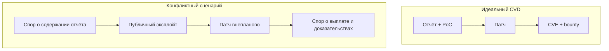

# Когда доверие между вендором и исследователем ломается

  ОБЯЗАТЕЛЬНО

Инженеру
Тестировщику

> **Раздел 8.09, шаг 6 из 6.** Учебный разбор **процесса**, а не судебный вердикт.

---

## Зачем эта статья

Программы Bug Bounty держатся на **взаимном доверии**: исследователь не публикует эксплойт раньше времени, вендор **принимает** отчёт, исправляет и платит по правилам. Когда цепочка рвётся, страдают пользователи (0-day в дикой природе), репутация индустрии и конкретные люди. Разобрать типичные **узлы напряжения** полезно, чтобы выстраивать свою практику устойчивее.

---

## Типичные точки конфликта

| Тема спора | Позиция исследователя | Позиция вендора |
|------------|----------------------|-----------------|
| **Prior disclosure** | «Я сообщил за 90 дней до публикации» | «Деталей эксплуатации не было в тикете» |
| **Severity / выплата** | Critical, $$$ | Informative / duplicate / out of scope |
| **Тихий патч** | Исправили без CVE и без оплаты | «Уже знали внутри» |
| **Срок triage** | Месяцы тишины | Очередь, нехватка людей |
| **Публичное раскрытие** | «Вынужденная мера» | «Нарушение политики, угроза пользователям» |
| **Аккаунты и доступ** | Блокировка GitHub как давление | «Нарушение ToS, публикация эксплойтов» |

Истина часто лежит в **логах портала**, которые стороны по-разному интерпретируют или к которым у исследователя нет доступа после блокировки аккаунта.

---

## Учебный кейс — Microsoft и Nightmare-Eclipse (2025–2026)

В начале 2026 года в профессиональных медиа и соцсетях обсуждали конфликт между **Microsoft** и исследователем **Nightmare-Eclipse**.

**Суть по публичным заявлениям сторон** (без оценки, кто прав по факту):

- Исследователь опубликовал серию материалов об уязвимостях Windows (в т.ч. под именами вроде BlueHammer, RedSun, UnDefend и др.) и заявил, что **ранее** пытался сообщить о них через **MSRC** в рамках Bug Bounty, но столкнулся с игнорированием.
- Microsoft в [официальном посте MSRC](https://www.microsoft.com/en-us/msrc/blog/2026/05/a-shared-responsibility-protecting-customers-through-coordinated-vulnerability-disclosure) указала, что **детали до публикации** компании не передавались в объёме, достаточном для воспроизведения, и предупредила о возможном **судебном** преследовании при нарушении координированного раскрытия.
- Для части находок (например, **CVE-2026-33825**, BlueHammer) патч появился **до** или параллельно публичным публикациям исследователя — что не отменяет спора о **prior report** и выплате.
- Сообщалось о **блокировке** аккаунтов на GitHub/GitLab и об **удалении** MSRC-аккаунта, из-за чего, по словам исследователя, исчезли тикеты и возможность сделать новые скриншоты переписки.
- Исследователь анонсировал дальнейшие публикации; другие специалисты (в т.ч. **Kevin Beaumont**, бывший сотрудник Microsoft) в публичном поле **понимали** мотив вынужденного раскрытия при отсутствии реакции, **не отменяя** рисков для пользователей.
- Параллельно в соцсетях появились **аналогичные истории** о долгом triage, закрытии отчётов как «не баг» и исправлениях без bounty — у разных вендоров, включая обсуждение **Apple**.

**Слепые зоны** для внешнего наблюдателя:

- содержимое приватных тикетов MSRC;
- была ли передана рабочая эксплуатация или только заявление о наличии бага;
- внутренние дубликаты и известность проблемы до отчёта;
- правовые основания блокировок на платформах.

Полная картина возможна только при **судебном** или формальном арбитраже с доступом к логам обеих сторон.

#### Хронология публичных событий (по открытым источникам)

| Этап | Что сообщалось |
|------|----------------|
| За несколько месяцев до волны | Исследователь заявлял попытки связи с MSRC |
| Публикация материалов | Серия названий (BlueHammer, RedSun, UnDefend, YellowKey, GreenPlasma, MiniPlasma и др.) |
| Реакция Microsoft | [Пост MSRC](https://www.microsoft.com/en-us/msrc/blog/2026/05/a-shared-responsibility-protecting-customers-through-coordinated-vulnerability-disclosure) — спор о prior disclosure, предупреждение о legal action |
| Патчи | CVE-2026-33825 (BlueHammer) и другие исправления |
| Эскалация | Блокировки на GitHub/GitLab; удаление MSRC-аккаунта (по заявлению исследователя) |
| Сообщество | Поддержка «вынужденного» раскрытия (Kevin Beaumont и др.); волна похожих историй у других вендоров |
| Прогноз | Анонс новых публикаций (в т.ч. на июль 2026) |

Читателю важно отделить **техническую** ценность находок (патч нужен пользователям) от **процессуальной** справедливости (была ли корректная переписка).

### Параллель — дискуссия вокруг Apple

Ряд исследователей публично заявили о **паузе** в отправке отчётов в Apple из-за:

- долгого triage;
- споров о суммах за partial chains;
- ощущения «тихих» исправлений.

Это иллюстрирует **системный** риск: если топ-вендоры теряют доверие, больше 0-day уйдёт в теневой рынок или в публичный GitHub без патча.

---

## Full disclosure — когда его оправдывают

Аргументы **за** публичное давление:

- вендор **месяцами** не отвечает;
- уязвимость **уже эксплуатируется** в дикой природе;
- пользователи не могут защититься без знания деталей.

Аргументы **против**:

- массовое вооружение скрипт-кидди;
- удар по исследователю (иск, блокировки);
- подрыв будущих программ bounty для других.

Компромисс индустрии — **deadline** (90 дней) + прозрачный статус тикета. Если дедлайн истёк — публикация advisory **исследователем** с минимальным PoC иногда считается этичной; юридически риск остаётся.

### Роли посредников

| Организация | Функция |
|-------------|---------|
| **CERT/CC** (SEI) | Координация мульти-вендорных уязвимостей |
| **national CERT** (ГосСОПКА и др.) | Инциденты в юрисдикции |
| **HackerOne mediation** | Спор исследователь ↔ заказчик |

При тупике иногда подключают **mediation** на платформе — нейтральный аналитик перечитывает PoC и scope.

### Этика публикации для СМИ и блогеров

- Не размножать **рабочий** эксплойт без анализа необходимости.
- Указывать **CVE** и ссылку на патч, если есть.
- Не демонизировать исследователя или вендора без доступа к тикетам.

---

## Как защитить себя как исследователя

1. **Только** официальный портал (MSRC, HackerOne) — не «написал в Twitter сотруднику».
2. PoC в первом же отчёте или чётко обозначенный срок допоставки.
3. Скриншоты **номера тикета**, PDF-экспорт, локальная копия с датой.
4. При эскалации — запрос **письменного** статуса; некоторые программы имеют appeal.
5. **Не** публиковать рабочий эксплойт до эмбарго без осознанного юридического риска.
6. Отдельный юридический контакт, если суммы и ставки высоки.

См. [оформление отчёта](./2.md).

### Чек-лист доказательств prior disclosure

- [ ] PDF/скрин с **ID отчёта** и timestamp портала
- [ ] Первая версия отчёта с **PoC** (не «скоро пришлю»)
- [ ] Хеш файла отчёта (SHA-256) и дата в доверенном журнале
- [ ] Ответ triage (даже автоматический)
- [ ] Логи отправки email на `security@` только если policy это разрешает
- [ ] Резервная копия **до** удаления аккаунта на платформе

Если аккаунт MSRC удалён, восстановить переписку может только **судебный** запрос к вендору — внешний наблюдатель этого не увидит.

---

## Как вендору снижать риск скандала

- SLA на первый ответ triage (например, 48–72 ч).
- Понятные причины **отклонения** с ссылкой на scope.
- CVE и благодарность при **тихих** исправлениях, если отчёт был valid.
- Канал **appeal** для спорных severity.
- Не удалять тикеты без экспорта данных исследователю (best practice).

### Метрики зрелости программы

| Метрика | Здоровое значение |
|---------|-------------------|
| Time to first response | менее 3 рабочих дней |
| Time to triage | менее 10 дней для High+ |
| % отчётов с финальным статусом | выше 95 % за 90 дней |
| Доля «молчаливых» фиксов | стремится к нулю (CVE или явный duplicate) |

Публичный отчёт раз в год (как у Google, Microsoft) снижает недоверие сообщества.

---

## Уроки для читателя энциклопедии

| Урок | Практика |
|------|----------|
| Bug Bounty — контракт | Читать policy как договор |
| Доказательства — в портале | Артефакты с первого дня |
| Публичность — крайняя мера | Сначала эскалация и дедлайн |
| Конфликты неизбежны при масштабе | Не делать вывод «все вендоры злы» / «все исследователи шантажисты» |
| Пользователь в центре | Любой спор не отменяет срочности патча |

---

## Краткий итог

Индустрия держится на CVD, но реальность включает споры о **prior disclosure**, выплатах и блокировках. Кейс Microsoft 2026 — напоминание вести отчётность дисциплинированно и понимать, что публичная драма — худший сценарий для всех, кроме злоумышленников. Закрепите раздел — [итоги](./998.md) и [чек-лист](./999.md).

---
