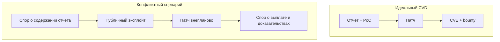

# Когда доверие между вендором и исследователем ломается

  ОБЯЗАТЕЛЬНО

Инженеру
Тестировщику

> Вендор — это компания или организация, которая создаёт, владеет и продаёт программное обеспечение (ПО), компьютерное железо, веб-сервисы или инфраструктуру. Microsoft, Apple, Google, Яндекс, Сбер, Лаборатория Касперского, а также любой банк, интернет-магазин или стартап, у которого есть свой сайт или мобильное приложение. Вендор несёт юридическую и финансовую ответственность за уязвимости (дыры) в своих продуктах.

> Исследователь безопасности (часто его называют «белым» хакером или этичным хакером) — это независимый IT-специалист или эксперт по информационной безопасности (ИБ), который ищет уязвимости в системах вендора. Студент-программист, штатный пентестер (тестировщик на проникновение) из ИБ-компании или независимый багхантер (охотник за головами), работающий на платформах Bug Bounty. Исследователями движет профессиональный интерес, желание сделать интернет безопаснее, заработать легальные деньги (выплаты Bug Bounty) и прокачать свою репутацию (профиль в рейтингах, выступления на конференциях).

Доверие между вендором (производителем ПО) и исследователем безопасности (хакером) ломается, когда одна из сторон нарушает правила Responsible Disclosure (ответственного разглашения):
- Вендор молчит неделями или присылает автоматические отписки.
- Уязвимости присваивают низкий статус (Low вместо High), чтобы меньше платить по программе Bug Bounty.
- Вендор обвиняет исследователя во взломе и привлекает юристов вместо исправления бага.
- Исправление уязвимости откладывается на долгие месяцы без объяснения причин.
- Отказ выплачивать вознаграждение под предлогом «мы уже знали об этом».
- Публикация деталей уязвимости в сети до того, как вендор успел выпустить патч.
- Требование денег под угрозой немедленного слива информации хакерам или конкурентам.
- Тестирование систем вендора, которые были явно запрещены в правилах Bug Bounty.
- Выкачивание конфиденциальной информации пользователей для «доказательства» уязвимости.

Программы Bug Bounty держатся на **взаимном доверии** — исследователь не публикует эксплойт раньше времени, вендор **принимает** отчёт, исправляет и платит по правилам. Когда цепочка рвётся, страдают пользователи (0-day в дикой природе), репутация индустрии и конкретные люди. Разобрать типичные **узлы напряжения** полезно, чтобы выстраивать свою практику устойчивее.

Последствия разрыва доверия серьёзные:
- Исследователи перестают слать баги вендору и продают их на черном рынке.
- Публичные скандалы вредят имиджу бренда и снижают капитализацию.
- Продукты вендора становятся более уязвимыми для реальных кибератак.

---

## Типичные точки конфликта

| Тема спора | Позиция исследователя | Позиция вендора |
|------------|----------------------|-----------------|
| **Prior disclosure** | "Я сообщил за 90 дней до публикации" | "Деталей эксплуатации не было в тикете" |
| **Severity / выплата** | Critical, $$$ | Informative / duplicate / out of scope |
| **Тихий патч** | Исправили без CVE и без оплаты | "Уже знали внутри" |
| **Срок triage** | Месяцы тишины | Очередь, нехватка людей |
| **Публичное раскрытие** | "Вынужденная мера" | "Нарушение политики, угроза пользователям" |
| **Аккаунты и доступ** | Блокировка GitHub как давление | "Нарушение ToS, публикация эксплойтов" |

> Prior disclosure (или преждевременное разглашение) — это публикация информации об уязвимости до того, как производитель (вендор) успел выпустить исправляющий патч.

Связь между Severity (критичностью) и выплатой (Bounty) — это главная точка финансового взаимодействия и самый частый источник конфликтов. Если этот механизм непрозрачен, доверие рушится окончательно. В основе лежит стандартная матрица, где размер вознаграждения напрямую зависит от уровня угрозы по шкале CVSS (Common Vulnerability Scoring System):
- Critical (9.0–10.0): Полный захват системы (RCE), утечка всей БД. Максимальные выплаты (от $5,000 до $100,000+).
- High (7.0–8.9): Обход авторизации, чтение чужих данных. Высокие выплаты (от $2,000 до $5,000).
- Medium (4.0–6.9): Межсайтовый скриптинг (XSS), CSRF. Средние выплаты (от $500 до $2,000).
- Low (0.1–3.9): Раскрытие версий ПО, пустые директории. Минимальные выплаты или мерч (до $500).

Почему здесь ломается доверие?
- Вендор намеренно снижает Severity (например, с High до Medium), аргументируя это «сложностью эксплуатации» или «специфической конфигурацией», чтобы заплатить меньше за реальный баг.
- Исследователь показывает рабочий вектор атаки, но вендор закрывает отчет как Low, заявляя, что «в реальности это никого не затронет».
- Исследователь раздувает масштаб проблемы в отчете, требуя Critical за мелкую ошибку, которая не несет реальной угрозы бизнесу.
- Если баг позволяет уронить 10 серверов, вендор платит за одну уязвимость (так как патч один), а исследователь ждет выплату за каждый сервер отдельно.

> Тихий патч (Silent Patch) — это исправление уязвимости в коде, которое вендор выпускает тайно, без публичного объявления, без присвоения идентификатора CVE и без упоминания проблемы в Changelog (списке изменений). Продукт просто обновляется, а баг исчезает. Это акт агрессии и прямое предательство, которое мгновенно уничтожает доверие.

Исследователь тратит недели на поиск сложного бага и написание отчета, а вендор берет этот отчет, молча закрывает дыру, а исследователю не достается ни денег, ни признания (Credit) в титрах к обновлению. Вендор делает вид, что нашел и исправил ошибку самостоятельно в рамках «планового рефакторинга». Тихий патч не работает против профессиональных злоумышленников (Exploit Developers). Когда выходит новая версия ПО, хакеры запускают дифференциальный анализ (Patch Diffing) — они сравнивают старый бинарный файл с новым с помощью декомпиляторов (IDA Pro, Ghidra). Любые изменения в коде видны как на ладони. Хакеры мгновенно понимают, какое именно место исправил вендор, воссоздают уязвимость и пишут рабочий эксплойт. При этом обычные пользователи и системные администраторы не знают об опасности. Поскольку вендор не выпустил предупреждение (Advisory), админы не спешат ставить обновление, считая его минорным, и остаются уязвимыми для атак. Последние скандалы с крупными вендорами (например, нашумевшие истории с тихими патчами критических уязвимостей у Fortinet) это наглядно доказали.

Если исследователь обнаруживает, что его отчет закрыли, а баг тихо пропал из системы (срезали), он имеет полное моральное право прибегнуть к Full Disclosure (полному разглашению). Исследователь публикует статью с текстом: «Я нашел уязвимость X, вендор проигнорировал меня, но тихо исправил ее в версии Y. Вот описание бага и готовый эксплойт для тех, кто еще не обновился». Это полностью уничтожает репутацию вендора.

> Срок triage (триажа) — это время, которое требуется вендору на первичный анализ отчета об уязвимости, проверку его на валидность (дубликат или нет) и подтверждение наличия проблемы.

Долгая тишина со стороны вендора на этом шаге — одна из главных причин, почему исследователи теряют терпение и уходят в Prior Disclosure. В сфере Bug Bounty и Vulnerability Disclosure существуют жесткие негласные стандарты, которые вендоры стараются соблюдать ради сохранения репутации:
- Идеально: 1–3 рабочих дня.
- Приемлемо (норма): До 5–7 рабочих дней.
- Критическая зона: Более 2 недель. Исследователь начинает подозревать, что его отчет игнорируют или баг пытаются «тихо пропатчить».

Большинство топовых платформ (HackerOne, Bugcrowd, BI.ZONE Bug Bounty) отслеживают «Time to Triage» как ключевую метрику здоровья программы и показывают ее хакерам публично.

> Публичное раскрытие (Public Disclosure) — это финальная точка в цикле обработки уязвимости, когда информация о ней становится доступной всему миру.Публичное раскрытие (Public Disclosure) — это финальная точка в цикле обработки уязвимости, когда информация о ней становится доступной всему миру. Это самый взрывоопасный этап. Если стороны не договорились о правилах раскрытия заранее, этот шаг превращается в репутационную войну.

Некоторые компании выплачивают Bug Bounty, но заставляют подписать жесткое NDA, навсегда запрещающее исследователю рассказывать о своей находке на конференциях или в блоге. Исследователи ненавидят это, так как публичные кейсы — это их резюме и репутация.  Даже если патч выпущен сегодня, крупным корпорациям требуются недели на его тестирование и установку. Если хакер публикует готовый эксплойт на следующий день, он подставляет под удар миллионы систем.

Аккаунты и доступ (Accounts & Access) — это критическая зона контроля в Bug Bounty. Конфликты здесь возникают, когда вендор некорректно изолирует тестовую среду, а исследователь непреднамеренно (или намеренно) выходит за рамки дозволенного доступа:
- Вместо создания тестовых аккаунтов исследователь эксплуатирует уязвимость (например, IDOR или захват учетной записи) на живых клиентах вендора. Это прямое нарушение правил, ведущее к блокировке хакера.
- Правила вендора обычно требуют регистрироваться со специальным префиксом (например, `user_bugbounty@gmail.com`). Если исследователь использует свою обычную почту, автоматические системы ИБ (SIEM/SOC) принимают его действия за реальную хакерскую атаку.
- Вендор видит подозрительную активность, пугается и блокирует тестовый аккаунт исследователя прямо посреди проверки, срывая демонстрацию цепочки уязвимостей.
- Вендор предоставляет хакеру специальный доступ во внутреннюю сеть (VPN/Staging) или API-токены, но забывает вовремя их аннулировать после закрытия отчета.
- Исследователь получает тестовый доступ с правами «Менеджер», находит баг, повышает свои права до «Супер-администратора» всей инфраструктуры и начинает изучать конфиденциальные настройки, которые не входили в Scope.

Истина часто лежит в **логах портала**, которые стороны по-разному интерпретируют или к которым у исследователя нет доступа после блокировки аккаунта.

---

## Учебный кейс — Microsoft и Nightmare-Eclipse (2025–2026)

В начале 2026 года в профессиональных медиа и соцсетях обсуждали конфликт между **Microsoft** и исследователем **Nightmare-Eclipse**.

**Суть по публичным заявлениям сторон** (без оценки, кто прав по факту):

- Исследователь опубликовал серию материалов об уязвимостях Windows (в т.ч. под именами вроде BlueHammer, RedSun, UnDefend и др.) и заявил, что **ранее** пытался сообщить о них через **MSRC** в рамках Bug Bounty, но столкнулся с игнорированием.
- Microsoft в [официальном посте MSRC](https://www.microsoft.com/en-us/msrc/blog/2026/05/a-shared-responsibility-protecting-customers-through-coordinated-vulnerability-disclosure) указала, что **детали до публикации** компании не передавались в объёме, достаточном для воспроизведения, и предупредила о возможном **судебном** преследовании при нарушении координированного раскрытия.
- Для части находок (например, **CVE-2026-33825**, BlueHammer) патч появился **до** или параллельно публичным публикациям исследователя — что не отменяет спора о **prior report** и выплате.
- Сообщалось о **блокировке** аккаунтов на GitHub/GitLab и об **удалении** MSRC-аккаунта, из-за чего, по словам исследователя, исчезли тикеты и возможность сделать новые скриншоты переписки.
- Исследователь анонсировал дальнейшие публикации; другие специалисты (в т.ч. **Kevin Beaumont**, бывший сотрудник Microsoft) в публичном поле **понимали** мотив вынужденного раскрытия при отсутствии реакции, **не отменяя** рисков для пользователей.
- Параллельно в соцсетях появились **аналогичные истории** о долгом triage, закрытии отчётов как "не баг" и исправлениях без bounty — у разных вендоров, включая обсуждение **Apple**.

**Слепые зоны** для внешнего наблюдателя:

- содержимое приватных тикетов MSRC;
- была ли передана рабочая эксплуатация или только заявление о наличии бага;
- внутренние дубликаты и известность проблемы до отчёта;
- правовые основания блокировок на платформах.

Полная картина возможна только при **судебном** или формальном арбитраже с доступом к логам обеих сторон.

#### Хронология публичных событий (по открытым источникам)

| Этап | Что сообщалось |
|------|----------------|
| За несколько месяцев до волны | Исследователь заявлял попытки связи с MSRC |
| Публикация материалов | Серия названий (BlueHammer, RedSun, UnDefend, YellowKey, GreenPlasma, MiniPlasma и др.) |
| Реакция Microsoft | [Пост MSRC](https://www.microsoft.com/en-us/msrc/blog/2026/05/a-shared-responsibility-protecting-customers-through-coordinated-vulnerability-disclosure) — спор о prior disclosure, предупреждение о legal action |
| Патчи | CVE-2026-33825 (BlueHammer) и другие исправления |
| Эскалация | Блокировки на GitHub/GitLab; удаление MSRC-аккаунта (по заявлению исследователя) |
| Сообщество | Поддержка "вынужденного" раскрытия (Kevin Beaumont и др.); волна похожих историй у других вендоров |
| Прогноз | Анонс новых публикаций (в т.ч. на июль 2026) |

Читателю важно отделить **техническую** ценность находок (патч нужен пользователям) от **процессуальной** справедливости (была ли корректная переписка).

### Параллель — дискуссия вокруг Apple

Ряд исследователей публично заявили о **паузе** в отправке отчётов в Apple из-за:

- долгого triage;
- споров о суммах за partial chains;
- ощущения "тихих" исправлений.

Это иллюстрирует **системный** риск: если топ-вендоры теряют доверие, больше 0-day уйдёт в теневой рынок или в публичный GitHub без патча.

---

## Full disclosure — когда его оправдывают

Аргументы **за** публичное давление:

- вендор **месяцами** не отвечает;
- уязвимость **уже эксплуатируется** в дикой природе;
- пользователи не могут защититься без знания деталей.

Аргументы **против**:

- массовое вооружение скрипт-кидди;
- удар по исследователю (иск, блокировки);
- подрыв будущих программ bounty для других.

Компромисс индустрии — **deadline** (90 дней) + прозрачный статус тикета. Если дедлайн истёк — публикация advisory **исследователем** с минимальным PoC иногда считается этичной; юридически риск остаётся.

### Роли посредников

| Организация | Функция |
|-------------|---------|
| **CERT/CC** (SEI) | Координация мульти-вендорных уязвимостей |
| **national CERT** (ГосСОПКА и др.) | Инциденты в юрисдикции |
| **HackerOne mediation** | Спор исследователь ↔ заказчик |

При тупике иногда подключают **mediation** на платформе — нейтральный аналитик перечитывает PoC и scope.

### Этика публикации для СМИ и блогеров

- Не размножать **рабочий** эксплойт без анализа необходимости.
- Указывать **CVE** и ссылку на патч, если есть.
- Не демонизировать исследователя или вендора без доступа к тикетам.

---

## Как защитить себя как исследователя

1. **Только** официальный портал (MSRC, HackerOne) — не "написал в Twitter сотруднику".
2. PoC в первом же отчёте или чётко обозначенный срок допоставки.
3. Скриншоты **номера тикета**, PDF-экспорт, локальная копия с датой.
4. При эскалации — запрос **письменного** статуса; некоторые программы имеют appeal.
5. **Не** публиковать рабочий эксплойт до эмбарго без осознанного юридического риска.
6. Отдельный юридический контакт, если суммы и ставки высоки.

См. [оформление отчёта](./2.md).

### Чек-лист доказательств prior disclosure

- [ ] PDF/скрин с **ID отчёта** и timestamp портала
- [ ] Первая версия отчёта с **PoC** (не "скоро пришлю")
- [ ] Хеш файла отчёта (SHA-256) и дата в доверенном журнале
- [ ] Ответ triage (даже автоматический)
- [ ] Логи отправки email на `security@` только если policy это разрешает
- [ ] Резервная копия **до** удаления аккаунта на платформе

Если аккаунт MSRC удалён, восстановить переписку может только **судебный** запрос к вендору — внешний наблюдатель этого не увидит.

---

## Как вендору снижать риск скандала

- SLA на первый ответ triage (например, 48–72 ч).
- Понятные причины **отклонения** с ссылкой на scope.
- CVE и благодарность при **тихих** исправлениях, если отчёт был valid.
- Канал **appeal** для спорных severity.
- Не удалять тикеты без экспорта данных исследователю (best practice).

### Метрики зрелости программы

| Метрика | Здоровое значение |
|---------|-------------------|
| Time to first response | менее 3 рабочих дней |
| Time to triage | менее 10 дней для High+ |
| % отчётов с финальным статусом | выше 95 % за 90 дней |
| Доля "молчаливых" фиксов | стремится к нулю (CVE или явный duplicate) |

Публичный отчёт раз в год (как у Google, Microsoft) снижает недоверие сообщества.

---

## Уроки для читателя энциклопедии

| Урок | Практика |
|------|----------|
| Bug Bounty — контракт | Читать policy как договор |
| Доказательства — в портале | Артефакты с первого дня |
| Публичность — крайняя мера | Сначала эскалация и дедлайн |
| Конфликты неизбежны при масштабе | Не делать вывод "все вендоры злы" / "все исследователи шантажисты" |
| Пользователь в центре | Любой спор не отменяет срочности патча |

---

## Краткий итог

Индустрия держится на CVD, но реальность включает споры о **prior disclosure**, выплатах и блокировках. Кейс Microsoft 2026 — напоминание вести отчётность дисциплинированно и понимать, что публичная драма — худший сценарий для всех, кроме злоумышленников. Закрепите раздел — [итоги](./998.md) и [чек-лист](./999.md).

---
