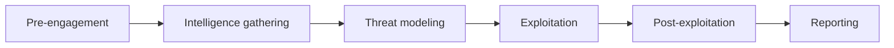
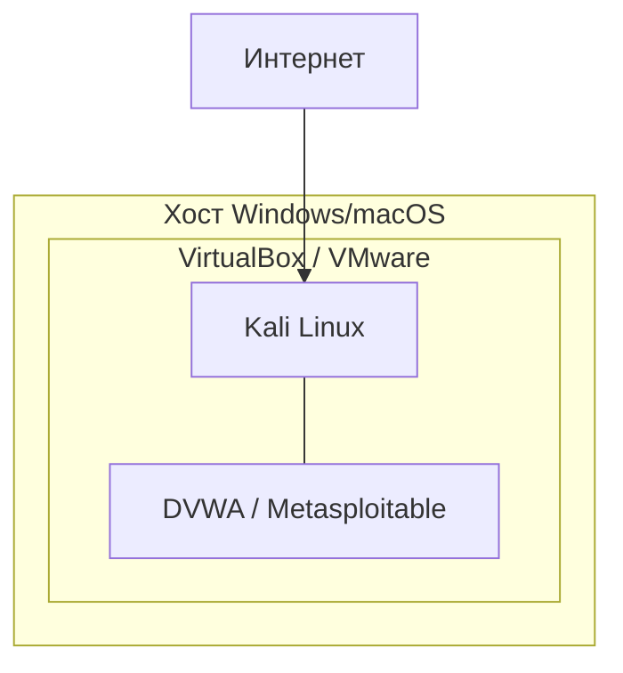

# Kali Linux — установка и настройка

<div class="article-tags">
  <span class="tag tag-required">ОБЯЗАТЕЛЬНО</span>
  <span class="tag tag-beginner">ДЛЯ НОВИЧКОВ</span>
</div>

<span class="complexity-badge">Инженеру</span>
<span class="complexity-badge">Тестировщику</span>

> **Раздел 8.10, шаг 1 из 9.** Дальше — [процессы пентестинга](./6.md).

---

## Тестирование на проникновение — зачем нужна среда

**Тестирование на проникновение** (penetration testing, пентест) — контролируемая имитация действий атакующего с целью найти уязвимости до реального злоумышленника. Результат — **отчёт с рисками**, шагами воспроизведения и рекомендациями. Kali Linux — **инструментальная платформа** для такой работы, одна из нескольких (Parrot OS, BlackArch, отдельные Docker-образы с `nmap` и Burp).

Пентест отличается от других видов проверки:

| Вид проверки | Фокус | Глубина эксплуатации |
|--------------|-------|----------------------|
| **Vulnerability scan** | Известные CVE, misconfiguration | Обычно без ручной цепочки атак |
| **Penetration test** | Реалистичный сценарий "как злоумышленник" | До доказательства impact (флаг, дамп тестовых данных) |
| **Red Team** | Обход SOC, длительная скрытность | Многоэтапная кампания, не только техника |
| **Bug Bounty** | Отдельные уязвимости в scope | PoC на одну находку, см. [8.09](/encyclopedia/8-infra-security/8-09-belyy-haking-i-bug-bounty/intro) |

Стандарты, на которые опираются методологии:

- **PTES** (Penetration Testing Execution Standard) — pre-engagement, intelligence gathering, threat modeling, exploitation, post-exploitation, reporting.
- **OWASP Testing Guide** — чек-листы для веб-приложений и API.
- **NIST SP 800-115** — техническое руководство по тестированию безопасности.
- **OSSTMM** — акцент на *измеримости* поверхности атаки.



### Black, grey и white box

| Тип | Что знает тестировщик | Плюсы | Минусы |
|-----|----------------------|-------|--------|
| **Black box** | Только публичный scope (URL, IP) | Близко к внешнему атакующему | Дольше recon, можно пропустить внутренние сервисы |
| **Grey box** | Учётные записи, схема сети частично | Баланс времени и реализма | Нужно согласовать уровень подсказок |
| **White box** | Исходный код, архитектура, AD | Глубокий аудит логики | Далеко от "слепого" взлома |

Kali используют на **любом** из этих типов; меняется объём recon, а не набор дистрибутивов.

---

## Что такое Kali Linux

**Kali Linux** — дистрибутив GNU/Linux на базе Debian, поддерживаемый Offensive Security. Он поставляется с **сотнями инструментов** для аудита безопасности, форензики и пентеста — сканеры, прокси, утилиты для Wi-Fi, фреймворки эксплуатации и др. Kali **не заменяет** знание сетей, веба и методологии пентеста, но сокращает время на сбор рабочей среды.

| Характеристика | Значение |
|----------------|----------|
| База | Debian Testing (rolling) |
| Пакетный менеджер | `apt` / `dpkg` |
| Пользователь по умолчанию | `kali` |
| Root | через `sudo` (с Kali 2020.1 отдельный вход root отключён) |
| Официальный сайт | [kali.org](https://www.kali.org/) |

<div class="callout callout--info">
  <div class="callout-title">Kali для обучения и аудита</div>

  <div class="callout-body">
  Дистрибутив предназначен для **легального** тестирования. Установка Kali сама по себе не делает вас пентестером — нужны договор или учебный стенд, навыки и отчётность. См. [белое хакерство — основы](/encyclopedia/8-infra-security/8-09-belyy-haking-i-bug-bounty/1).
  </div>
</div>

### История и место в экосистеме

Kali вырос из **BackTrack Linux** (слияние WHAX и Auditor). С 2013 года — самостоятельный rolling-дистрибутив на Debian. Offensive Security также известна курсами **PEN-200 (OSCP)**, **PEN-300**, **WEB-200** — Kali часто используют как среду на экзаменах и в лабораториях.

Сравнение с "обычным" Debian/Ubuntu:

| Аспект | Kali | Debian Server |
|--------|------|---------------|
| Назначение | Offensive security, audit | Универсальный сервер |
| Набор пакетов | Metapackages с hack-tools | Минимальный base |
| Hardening по умолчанию | Нет (рабочая станция аудитора) | Можно harden под роль |
| Ядро | Патчи для wireless injection и т.п. | Стандартное |

Для **продакшен-сервера** Kali не подходит. Для **лаборатории пентестера** — де-факто стандарт в обучении.

### Архитектура системы

Kali наследует **FHS** (Filesystem Hierarchy Standard) Debian:

| Путь | Содержимое |
|------|------------|
| `/usr/bin`, `/usr/sbin` | Бинарники утилит (`nmap`, `hydra`) |
| `/usr/share` | Словари, скрипты nmap NSE, wordlists |
| `/usr/share/wordlists` | `rockyou.txt`, `dirb`, `seclists` (часто отдельным пакетом) |
| `/etc` | Конфигурация сервисов и apt |
| `/var/lib/apt` | Кэш пакетов |

Понимание путей важно: многие туториалы ссылаются на `/usr/share/wordlists/rockyou.txt` — файл из пакета `wordlists`, который иногда нужно **доустановить** (`sudo apt install wordlists`).

---

## Способы установки

### Виртуальная машина (рекомендуется для старта)

Самый безопасный вариант для обучения: Kali изолирована от основной ОС, легко откатывается snapshot.

| Гипервизор | Плюсы |
|------------|-------|
| **VirtualBox** | Бесплатен, прост для новичков |
| **VMware Workstation / Fusion** | Удобные снапшоты, лучше производительность |
| **Hyper-V** (Windows Pro) | Встроен в Windows, нужен образ Generation 2 |

Рекомендуемые параметры VM:

- **RAM** — 4 ГБ минимум, 8 ГБ комфортно
- **Диск** — 80 ГБ динамический
- **CPU** — 2 ядра
- **Сеть** — NAT или **Host-Only** для лаборатории; **Bridged** только если понимаете последствия (Kali видна в локальной сети)

Скачайте проверенный ISO с [kali.org/get-kali](https://www.kali.org/get-kali/). Проверьте SHA256 сумму из [документации Kali](https://www.kali.org/docs/development/sha256sum/).

### Dual boot

Установка рядом с Windows или macOS даёт прямой доступ к Wi-Fi-адаптеру (важно для [Wi-Fi-аудита](./3.md)), но повышает риск ошибок при разметке диска. Делайте резервную копию данных и отдельный раздел под `/` и `/home`.

### WSL2 (Windows Subsystem for Linux)

Kali доступна в Microsoft Store как дистрибутив WSL. Удобно для CLI-утилит (`nmap`, `sqlmap`), но **ограничена** для Wi-Fi (нет полноценного monitor mode) и некоторых raw-socket операций. Для полного курса лучше VM.

### Облако и ARM

Kali публикует образы для Raspberry Pi, облачных AMI/Azure и Docker. Docker-образ подходит для отдельных инструментов, полноценный рабочий стол в контейнере обычно не нужен.

### Сетевая модель лаборатории

Для учебного пентеста схема сети **определяет**, что вы можете атаковать:



| Режим адаптера | Поведение | Когда использовать |
|----------------|-----------|-------------------|
| **NAT** | Kali в частной сети гипервизора, выход в интернет через хост | Обновления, OSINT, scanme.nmap.org |
| **Host-only** | Только Kali ↔ другие VM на хосте | Изолированная lab без утечки в LAN офиса |
| **Bridged** | Kali получает IP в вашей домашней/офисной LAN | Wi-Fi passthrough, тест **своего** роутера |
| **Internal** | VM видят друг друга, хост — нет | Комplex lab из 3+ машин |

<div class="callout callout--caution">
  <div class="callout-title">Bridged в корпоративной сети</div>

  <div class="callout-body">
  Ошибочный bridged-адаптер превращает Kali в **полноценный участник** корпоративной LAN. Случайный `nmap` или Responder может вызвать инцидент. В офисе используйте Host-only или выделенный VLAN lab.
  </div>
</div>

---

## Первая установка и вход

1. Загрузитесь с ISO, выберите **Graphical install** (или Guided).
2. Задайте hostname, пользователя `kali`, пароль.
3. Разметка диска — "Guided — use entire disk" для VM; для dual boot — вручную.
4. После перезагрузки войдите под `kali`.

Первые команды после входа:

```bash
# Проверка версии
cat /etc/os-release

# Обновление индекса пакетов и системы
sudo apt update
sudo apt full-upgrade -y

# Перезагрузка после обновления ядра (если предложено)
sudo reboot
```

---

## Репозитории и пакеты

Kali использует **репозитории Debian** с дополнительным каналом Kali. Файл `/etc/apt/sources.list` и фрагменты в `/etc/apt/sources.list.d/` должны указывать на официальные зеркала.

Проверка:

```bash
grep -r ^deb /etc/apt/sources.list /etc/apt/sources.list.d/
```

Типичная строка (ветка может меняться с релизом):

```
deb http://http.kali.org/kali kali-rolling main contrib non-free non-free-firmware
```

<div class="callout callout--warning">
  <div class="callout-title">Не смешивайте репозитории</div>

  <div class="callout-body">
  Подключение репозиториев **Ubuntu** или **Debian Stable** к Kali ломает зависимости и может сделать систему нерабочей. Используйте только официальные источники Kali и `kali-linux-*` metapackages.
  </div>
</div>

### Metapackages — наборы инструментов

Kali группирует инструменты в metapackages:

| Пакет | Назначение |
|-------|------------|
| `kali-linux-default` | Базовый набор (часто уже установлен) |
| `kali-linux-large` | Расширенный набор |
| `kali-linux-everything` | Все инструменты (много места на диске) |
| `kali-tools-web` | Веб-пентест |
| `kali-tools-wireless` | Wi-Fi |
| `kali-tools-passwords` | Брутфорс и работа с хешами |

Установка группы:

```bash
sudo apt install kali-tools-web
```

Поиск пакета по инструменту:

```bash
apt search nmap
dpkg -L nmap   # какие файлы установил пакет
```

### Как устроен apt в Kali

**apt** (Advanced Package Tool) разрешает зависимости между `.deb`-пакетами. Цикл обслуживания:

1. `apt update` — загрузка индексов с зеркал (не обновляет пакеты).
2. `apt upgrade` / `apt full-upgrade` — установка новых версий (`full-upgrade` может удалять конфликтующие пакеты).
3. `apt install <pkg>` — установка с зависимостями.
4. `apt remove` / `apt purge` — удаление (purge чистит конфиги).

Rolling-модель Kali означает **непрерывный поток обновлений** без "большого релиза" раз в два года, как Debian Stable. Плюс — свежие инструменты; минус — редкий риск сломать окружение после `full-upgrade`. Перед экзаменом или демо — **snapshot VM**.

Полезные команды диагностики:

```bash
apt list --installed | grep kali-tools
apt show nmap
sudo apt autoremove -y
```

---

## Настройка рабочей среды

### Локаль и клавиатура

```bash
sudo dpkg-reconfigure locales
sudo dpkg-reconfigure keyboard-configuration
```

### Сеть в лаборатории

Для учебного стенда часто используют **изолированную сеть**:

- VirtualBox Host-Only + вторая VM (Metasploitable, DVWA).
- Отключите автоматическое обновление во время экзамена/лабораторной, если мешает.

Проверка интерфейсов:

```bash
ip a
ip route
ping -c 2 10.0.2.2   # шлюз NAT VirtualBox по умолчанию
```

### Снапшоты

Перед экспериментами с опасными командами создайте **snapshot** VM. Откат занимает секунды и спасает от "сломанной" конфигурации.

### Полезные пакеты поверх default

```bash
sudo apt install -y git curl vim tmux python3-pip
```

### Меню Kali

Приложения сгруппированы в меню **Kali Linux** по категориям (Information Gathering, Web Application Analysis, Password Attacks и т.д.). Это тот же набор, что доступен из терминала; удобно для первого знакомства перед [обзором инструментов](./2.md).

### Время, locale и журналирование

Пентест-отчёт требует **точных меток времени** (когда выполнен скан, в каком часовом поясе). Проверьте:

```bash
timedatectl
```

Синхронизация NTP (`systemd-timesyncd`) снижает расхождение с логами SIEM заказчика.

### SSH и удалённый доступ к lab

Если Kali в VM на сервере дома, иногда поднимают SSH для доступа с ноутбука:

```bash
sudo systemctl enable ssh
sudo systemctl start ssh
```

Используйте **ключи** (`ssh-copy-id`), отключите парольный вход в `/etc/ssh/sshd_config` (`PasswordAuthentication no`). Kali с открытым SSH в интернет — частая мишень ботов.

### Документирование окружения

В начале engagement зафиксируйте в `notes.md`:

- Версия Kali (`cat /etc/os-release`)
- Версии ключевых tools (`nmap --version`, `burpsuite --version` если CLI)
- Схема сети lab (IP Kali, IP целей)
- Дата последнего `full-upgrade`

Это попадает в приложение отчёта как **reproducibility**.

---

## Безопасность самой Kali

Kali по умолчанию **не hardened** для работы как сервер в интернете:

- Смените пароль по умолчанию, если образ был преднастроен.
- Не выставляйте Kali с открытыми портами в публичную сеть.
- SSH включайте только при необходимости и с ключами, не с паролем root.
- Регулярно выполняйте `sudo apt update && sudo apt full-upgrade`.

---

## Типичные проблемы

| Симптом | Решение |
|---------|---------|
| `apt update` — ошибка GPG | `sudo apt-key adv --keyserver keyserver.ubuntu.com --recv-keys <KEY>` или переустановка с чистого ISO |
| Нет интернета в VM | Проверьте режим адаптера (NAT), DNS (`cat /etc/resolv.conf`) |
| Чёрный экран после install | Увеличьте видеопамять VM, попробуйте safe graphics mode в GRUB |
| Wi-Fi не виден | Для встроенного адаптера ноутбука часто нужен **USB Wi-Fi** с поддержкой monitor mode в VM — passthrough USB |

---

## Практическое задание

1. Установите Kali в VirtualBox с 4 ГБ RAM и 40+ ГБ диска.
2. Выполните `full-upgrade`, установите `kali-tools-web`.
3. Создайте snapshot "clean-after-update".
4. Найдите в меню три утилиты категории **Information Gathering** и запишите их назначение одной строкой каждая.

---

## Связанные материалы

- [Инструменты Kali и сбор информации](./2.md)
- [Deb-пакеты](/encyclopedia/8-infra-security/8-04-devops-ci-cd/214) — формат пакетов Debian/Kali
- [Системное администрирование](/encyclopedia/2-system-network/2-06-sistemnoe-administrirovanie/intro)

---
