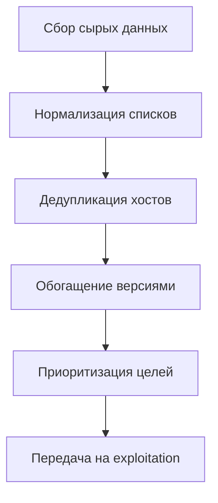
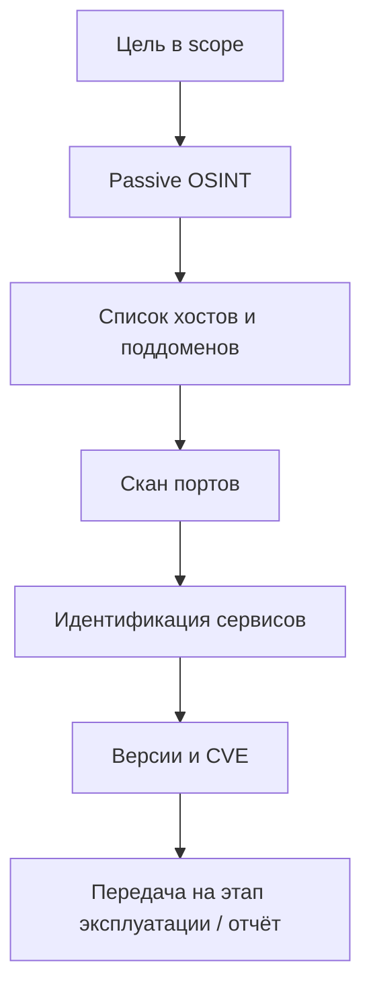

# Инструменты Kali и сбор информации

<div class="article-tags">
  <span class="tag tag-required">ОБЯЗАТЕЛЬНО</span>
</div>

<span class="complexity-badge">Инженеру</span>
<span class="complexity-badge">Тестировщику</span>

> **Раздел 8.10, шаг 3 из 9.** Предыдущий — [процессы](./6.md); далее — [сканирование и брутфорс](./5.md).

---

## Теория разведки в пентесте

**Разведка** (reconnaissance) — первый технический этап после подписания scope. Цель — построить **карту поверхности атаки** — домены, IP, сервисы, технологии, сотрудники, утечки. Без recon пентестер стреляет вслепую; с качественным recon — приоритизирует время на слабые места.

В модели **MITRE ATT&CK** reconnaissance включает тактики:

| Тактика | Пример | Passive / Active |
|--------|--------|------------------|
| Active Scanning | `nmap`, скан портов | Active |
| Gather Victim Host Information | WHOIS, DNS | Passive |
| Gather Victim Identity Information | e-mail, LinkedIn | Passive |
| Gather Victim Network Information | BGP, ASN | Passive |
| Search Open Technical Databases | Shodan, GitHub | Passive |
| Phishing for Information | **часто out of scope** | Active |

Разведка делится на **passive** (без прямого взаимодействия с инфраструктурой цели) и **active** (пакеты и запросы на системы в scope). Заказчик может **запретить** active scan в prod в рабочее время — это фиксируют в Statement of Work.

### Цикл обработки разведданных



**Нормализация** — приведение `www.example.com`, `example.com:443` и `93.184.216.34` к единым записям. Инструменты вроде **dnsx**, **httpx** и таблицы в spreadsheet экономят часы на ручной сверке.

### DNS как источник intelligence

**DNS** (Domain Name System) — распределённая база имён. Для пентестера важны типы записей:

| Тип | Содержимое | Зачем пентестеру |
|-----|------------|------------------|
| **A / AAAA** | IPv4 / IPv6 | Точки входа, обход CDN |
| **CNAME** | Псевдоним | Часто S3, Azure, legacy |
| **MX** | Почтовые серверы | Фишинг **если в scope**, SPF/DMARC audit |
| **TXT** | SPF, DKIM, verification | Поддомены верификации, misconfig |
| **NS** | Authoritative NS | Перенос зоны (редко), sub takeover |
| **SRV** | Сервисы (_ldap, _sip) | AD, VoIP |
| **CAA** | Разрешённые CA | Политика сертификатов |

**Zone transfer (AXFR)** — если NS misconfigured и отдаёт полную зону:

```bash
dig AXFR example.com @ns1.example.com
```

Успешный AXFR — **критичная находка** (полный список поддоменов).

**Subdomain takeover** — CNAME указывает на освобождённый ресурс (старый S3 bucket, Heroku). Пассивная recon через crt.sh может выявить `dev.example.com` → `dead.herokuapp.com`.

---

## Сетевое перечисление

**Network enumeration** — построение карты **хостов, портов и сервисов** в scope. Идёт после passive OSINT (когда уже есть домены/IP) и **только** с разрешения.

### Host discovery

Перед полным сканом портов — кто **живой**:

```bash
nmap -sn 192.168.56.0/24
fping -a -g 192.168.56.0/24 2>/dev/null
sudo arp-scan --localnet
```

| Метод | Уровень | Когда |
|-------|---------|-------|
| **ICMP ping sweep** | L3 | Без жёсткого firewall |
| **ARP scan** | L2 | Тот же broadcast domain |
| **TCP ACK/SYN ping** | L4 | ICMP filtered (`-Pn` на всём скане) |

### Перечисление портов и сервисов

Стратегия **layered scan** (быстрее и тише, чем `-p-` сразу):

1. Top 1000 TCP (`nmap -sV -T4 target`).
2. Full TCP на интересных хостах (`-p-`).
3. UDP top 100 на DNS/SNMP/SNMP (`-sU --top-ports 100`).

```bash
nmap -sS -sV -O -oA recon/target 10.0.0.5
masscan 10.0.0.0/24 -p1-65535 --rate 5000  # только с approval
```

### Перечисление в AD-среде (internal)

| Протокол | Инструмент | Данные |
|----------|------------|--------|
| **LDAP** | `ldapsearch`, `windapsearch` | Users, groups, computers |
| **SMB** | `enum4linux`, `crackmapexec` | Shares, sessions |
| **RPC** | `rpcclient` | User enum (legacy) |
| **DNS** | `dig SRV _ldap._tcp.dc._msdcs` | DC location |

Детали AD — [ст. 8](./8.md).

### SNMP и другие "забытые" UDP

**SNMP** (161/udp) с community `public` — таблицы маршрутизации, процессы, иногда credentials in MIB.

```bash
onesixtyone -c /usr/share/doc/onesixtyone/dict.txt 192.168.56.0/24
snmpwalk -v2c -c public 192.168.56.1
```

---

## Снятие отпечатков (fingerprinting)

**Fingerprinting** — определение **версии и типа** системы без полной эксплуатации.

### Стек TCP/IP и ОС

Nmap **OS detection** (`-O`) сравнивает ответы на зонды с сигнатурной базой. Точность ~80–90%; VM и firewall вводят ошибки.

```bash
nmap -O --osscan-guess 192.168.56.101
```

### Banner grabbing

Подключение к порту и чтение приветствия:

```bash
nc -vn 192.168.56.101 22
curl -sI http://192.168.56.101
openssl s_client -connect example.com:443 </dev/null 2>/dev/null | openssl x509 -noout -subject -dates
```

### Прикладной fingerprint

| Инструмент | Выявляет |
|------------|----------|
| **whatweb**, **httpx -tech-detect** | CMS, JS frameworks |
| **Wappalyzer** (browser) | Frontend stack |
| **nmap NSE** `http-server-header` | Server version |
| **smb-os-discovery** | Windows build |

Сопоставление с CVE — следующий этап [оценки уязвимостей](./7.md).

---

## Веб-разведка

**Web recon** — поверхность HTTP-приложения до ручного Burp.

### Crawling и URL discovery

| Источник | Метод |
|----------|--------|
| Robots / sitemap | `curl /robots.txt`, `/sitemap.xml` |
| Wayback | web.archive.org CDX API |
| Google dorks | `site:example.com filetype:pdf` (passive) |
| **Katana**, **gospider** | Active crawl from seed URL |
| **Burp** spider | In-scope crawl with auth |

### Параметры и API

- JavaScript bundles → endpoints (`/api/v1/`, GraphQL).
- **Linkfinder**, **getJS** — URL из `.js` files.
- **Arjun** — hidden HTTP parameters.
- **Kiterunner** — API route brute.

```bash
ffuf -u https://target/FUZZ -w /usr/share/seclists/Discovery/Web-Content/raft-medium-directories.txt -mc 200,301,302,403
```

### Виртуальные хосты и TLS

Один IP — **много** сайтов:

```bash
curl -H "Host: dev.example.com" http://93.184.216.34/
nmap --script ssl-cert -p 443 target
```

SAN в сертификате — список дополнительных hostname для scope.

### WAF и CDN detection

**wafw00f**, ответы 403 с fingerprint Cloudflare/Akamai — меняют тактику (slow, encoded payloads). CDN скрывает origin IP → искать в passive DNS, historical records, misconfigured subdomains.

---

## Карта инструментов Kali

Меню Kali отражает **фазы пентеста** по PTES и OWASP Testing Guide. Ниже — ориентир по категориям, а не полный список (он меняется с релизами).

| Категория в меню | Задача | Примеры утилит |
|------------------|--------|----------------|
| Information Gathering | Recon, OSINT | `nmap`, `amass`, `theHarvester`, `whois` |
| Vulnerability Analysis | Поиск известных CVE | `nikto`, `openvas`, `legion` |
| Web Application Analysis | HTTP-логика | `burpsuite`, `zaproxy`, `sqlmap`, `ffuf` |
| Password Attacks | Хеши и перебор | `hashcat`, `john`, `hydra` |
| Wireless Attacks | Wi-Fi | `aircrack-ng`, `kismet`, `reaver` |
| Sniffing & Spoofing | Перехват | `wireshark`, `bettercap`, `responder` |
| Exploitation Tools | Эксплуатация | `metasploit-framework` |
| Forensics | Разбор артеfactов | `autopsy`, `binwalk` |
| Reporting Tools | Отчёты | `faraday`, `pipal` |

<div class="callout callout--tip">
  <div class="callout-title">Меньше инструментов — глубже навык</div>

  <div class="callout-body">
  На старте достаточно связки **nmap + httpx/ffuf + Burp + sqlmap**. Десятки утилит дублируют функции; важнее понимать **этап** (recon → scan → exploit → report), см. [жизненный цикл атаки](/encyclopedia/8-infra-security/8-07-informatsionnaya-bezopasnost/129).
  </div>
</div>

### Fingerprinting и banner grabbing

**Fingerprinting** — определение ОС, версий сервисов и технологий без (или до) эксплуатации.

| Метод | Что выявляет |
|-------|--------------|
| **Banner grabbing** | Строка при подключении к порту (`SSH-2.0-OpenSSH_8.4`) |
| **TCP/IP stack fingerprinting** | ОС по особенностям стека (nmap `-O`) |
| **HTTP headers** | `Server`, `X-Powered-By`, cookies (`PHPSESSID`) |
| **TLS certificate** | Организация, SAN (альтернативные имена) |
| **Wappalyzer / whatweb** | CMS, фреймворки, аналитика |

Версия в banner сопоставляется с **CVE** (Common Vulnerabilities and Exposures). Одна устаревшая `OpenSSH` или `Apache` может дать быстрый win; чаще версия **задана неверно** (honeypot, прокси) — нужна ручная проверка.

### OSINT — открытые источники

**OSINT** (Open Source Intelligence) — сбор данных из **легально доступных** публикаций. Граница этики проходит по **использованию**, а не по просмотру:

- Просмотр LinkedIn сотрудников — OSINT для понимания оргструктуры.
- Отправка фишингового письма без пункта в scope — нарушение договора и закона.

Категории OSINT для IT-пентеста:

| Категория | Источники |
|-----------|-----------|
| Инфраструктура | crt.sh, SecurityTrails, BGPView |
| Код и секреты | GitHub, GitLab, paste sites |
| Люди | LinkedIn, конференции, e-mail формат |
| Технические базы | Shodan, Censys, Fofa |
| Медиа | Wayback Machine (старые endpoints) |

---

## Passive recon — без прямого контакта с целью

**Пассивная разведка** использует открытые источники; целевой сервер может не зафиксировать ваш IP.

| Источник | Что даёт | Инструмент / сайт |
|----------|----------|-------------------|
| WHOIS / RDAP | Владелец домена, NS | `whois`, `rdap` |
| Certificate Transparency | Поддомены из сертификатов | [crt.sh](https://crt.sh), `crt` |
| DNS | A, MX, TXT, SPF | `dig`, `dnsenum` |
| Поисковики | Индексированные URL, файлы | `site:`, `filetype:pdf` |
| GitHub / Paste | Утечки ключей, `.env` | ручной поиск, `trufflehog` |
| Shodan / Censys | Интернет-сканеры (OSINT) | веб-сервисы |

Пример пассивного DNS:

```bash
dig example.com ANY +short
dig _dmarc.example.com TXT +short
```

<div class="callout callout--caution">
  <div class="callout-title">Граница OSINT</div>

  <div class="callout-body">
  Скачивание открытых данных — одно; **использование** найденных учётных данных против чужой системы без разрешения — другое. См. [легальный сбор информации](/encyclopedia/8-infra-security/8-07-informatsionnaya-bezopasnost/122) и scope в [8.09/2](/encyclopedia/8-infra-security/8-09-belyy-haking-i-bug-bounty/2).
  </div>
</div>

---

## Active recon — контакт с инфраструктурой

**Активная разведка** отправляет пакеты и запросы на цель. Её проводят **только в scope** договора или лаборатории.

### Перечисление поддоменов

```bash
# amass (пример пассивного + активного режимов)
amass enum -passive -d example.com
amass enum -active -d example.com -p 80,443
```

### Сканирование портов и сервисов

**Nmap** — базовый инструмент:

```bash
# Быстрое сканирование топ-портов
nmap -sV -T4 scanme.nmap.org

# Полный TCP (медленно, шумно)
nmap -p- -sV 192.168.56.101
```

Флаги:

| Флаг | Смысл |
|------|-------|
| `-sS` | SYN scan (нужны root-права) |
| `-sV` | Определение версий сервисов |
| `-O` | ОС (эвристика) |
| `-A` | Aggressive (OS, версии, скрипты, traceroute) |
| `-Pn` | Без ping (если ICMP фильтруется) |

NSE-скрипты:

```bash
nmap --script http-title,ssl-cert -p 443 example.com
```

### Теория сканирования портов

**Порт** — число (0–65535), идентифицирующее приложение на хосте. Сканер проверяет, **открыт** ли порт (accept), **закрыт** (reset) или **фильтруется** (drop/firewall).

| Тип скана nmap | Механизм | След в логах |
|----------------|----------|--------------|
| **TCP Connect (`-sT`)** | Полное TCP handshake | Высокий |
| **SYN (`-sS`)** | Half-open, нужен root | Средний (SYN без завершения) |
| **UDP (`-sU`)** | Датаграмма на UDP-порт | Зависит от сервиса |
| **ACK (`-sA`)** | Карта firewall rules | Низкий для версий |

**Timing template** (`-T0` … `-T5`) управляет агрессивностью: `-T4` — разумный default; `-T5` на legacy-оборудовании может вызвать **отказ сервиса**.

Состояния в выводе nmap:

| State | Значение |
|-------|----------|
| `open` | Сервис принимает соединения |
| `closed` | Порт доступен, но нет listener |
| `filtered` | Firewall блокирует проверку |
| `open\|filtered` | UDP-неопределённость |

---

```bash
# Живые URL
httpx -u https://example.com -status-code -title -tech-detect

# Перебор директорий (осторожно с rate limit)
ffuf -u https://example.com/FUZZ -w /usr/share/wordlists/dirb/common.txt -mc 200,301,302
```

### HTTP-разведка



### Что фиксировать в заметках

- Дата и время каждого шага (для отчёта и доказательства scope).
- Команды и ключевые флаги.
- Скриншоты или вывод в файл (`nmap -oA lab/target`).
- Источник данных (пассивный OSINT vs активный скан).

Шаблон структуры каталога на Kali:

```
~/engagements/client-name/
  recon/
    nmap-full.xml
    subdomains.txt
  screenshots/
  notes.md
```

---

## theHarvester и сбор e-mail

```bash
theHarvester -d example.com -b google,bing -l 100
```

Используется для понимания **поверхности социальной инженерии** и возможных логинов. Применение собранных адресов для фишинга **вне scope** запрещено правилами большинства программ.

---

## Recon-ng и Maltego

**Recon-ng** — модульный фреймворк recon в CLI (аналог Metasploit для разведки):

```bash
recon-ng
marketplace install all   # осторожно, много модулей
```

**Maltego** — визуализация связей (домен → e-mail → IP). Удобно для отчёта заказчику; Community Edition имеет лимиты.

### Threat modeling после recon

Когда список хостов и сервисов собран, полезно построить **модель угроз** (упрощённо STRIDE или "что атакующий хочет получить"):

| Актив | Угроза | Вектор из recon |
|-------|--------|-----------------|
| Клиентская база | Утечка PII | SQLi на `/api/users` |
| Админ-панель | Захват | Скрытый `/admin`, default creds |
| Облако | Metadata SSRF | Внутренний URL в параметре |

Приоритизация: **вероятность × impact**. Критичный бизнес-процесс + открытый legacy FTP поднимается выше информационного блога на том же IP.

---

## Ограничения и шум

| Риск | Смягчение |
|------|-----------|
| IDS/IPS блокирует IP | Согласовать rate, использовать jump box заказчика |
| DoS случайным сканом | Избегать `-T5` на хрупких сервисах, не сканировать prod без окна |
| Юридический | Scope in writing, IP whitelist |

<div class="callout callout--warning">
  <div class="callout-title">Aggressive scanning</div>

  <div class="callout-body">
  В Bug Bounty policy часто прямо запрещают "массовый" или "intrusive" скан. Читайте правила программы перед `nmap -A` по всему `/16`.
  </div>
</div>

---

## Практическое задание

1. На [scanme.nmap.org](https://scanme.nmap.org/) (разрешённая цель) выполните `nmap -sV` и сохраните вывод в файл.
2. Пассивно соберите поддомены учебного домена через crt.sh (без дальнейшей атаки).
3. Установите `httpx` и проверьте заголовок одного учебного URL.
4. Оформите полстраницы заметок в формате "цель — метод — результат".

---

## Связанные материалы

- [Сканирование, перехват и брутфорс](./5.md) — углублённый nmap и перехват
- [Как ищут уязвимости](/encyclopedia/8-infra-security/8-09-belyy-haking-i-bug-bounty/2) — пайплайн recon в веб-bounty
- [Жизненный цикл атаки](/encyclopedia/8-infra-security/8-07-informatsionnaya-bezopasnost/129)

---
