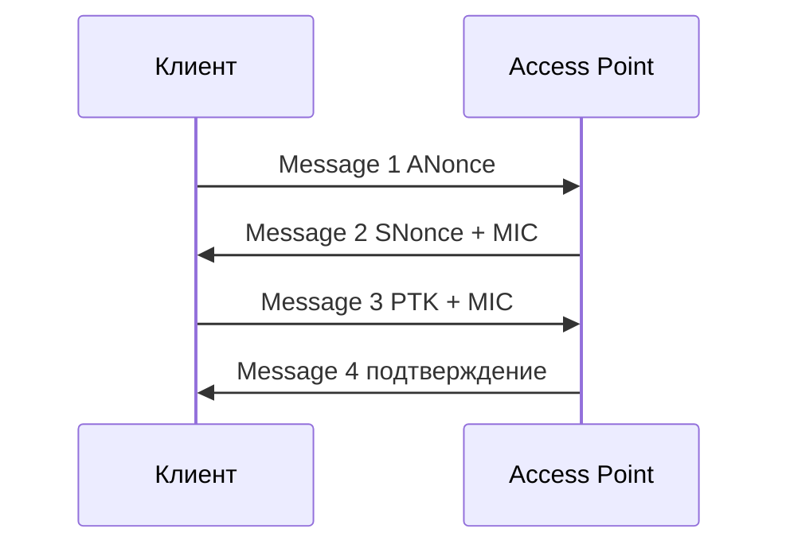

# Тестирование беспроводных сетей

<div class="article-tags">
  <span class="tag tag-required">ОБЯЗАТЕЛЬНО</span>
</div>

<span class="complexity-badge">Инженеру</span>

> **Раздел 8.10, шаг 5 из 9.** Предыдущий — [сканирование](./5.md); далее — [веб-пентест](./4.md).

---

## Основы 802.11 и модель угроз Wi-Fi

**Wi-Fi** (IEEE 802.11) — семейство протоколов беспроводной LAN. В отличие от Ethernet, среда **общая**: любой в радиусе действия может **принимать** кадры (frames), даже без подключения к SSID. Отсюда класс угроз: пассивное прослушивание, подмена AP, deauth, offline-атаки на PSK.

### Типы кадров 802.11

| Тип | Примеры | Роль |
|-----|---------|------|
| **Management** | Beacon, Probe, Deauth | Объявление сети, отключение клиента |
| **Control** | ACK, RTS/CTS | Доставка данных |
| **Data** | Payload | IP-трафик клиента |

**Beacon** — AP периодически шлёт «я здесь, SSID=X, канал=Y, шифрование=Z». **Probe request** — клиент ищет знакомые сети. Пассивный мониторинг (`airodump-ng`, Kismet) собирает эти кадры **без** ассоциации.

### Каналы и помехи

2.4 ГГц — каналы 1–13 (перекрываются); 5 ГГц — больше каналов, меньше помех. Пентестер выбирает канал цели (`-c` в airodump) или прыгает по каналам. **Широкий канал** (40/80 MHz) повышает скорость и **увеличивает** зону перехвата.

### Режимы работы адаптера

| Режим | Поведение |
|-------|-----------|
| **Managed (client)** | Подключение к одной AP |
| **Monitor** | Приём всех кадров на канале |
| **Master (AP)** | Точка доступа (hostapd) |

Для аудита нужен **monitor**; встроенный Wi-Fi ноутбука в VM часто недоступен — USB passthrough внешнего адаптера.

---

## Зачем аудировать Wi-Fi

Беспроводной трафик **покидает контролируемый периметр** офиса: сигнал доступен с парковки, соседнего этажа, двора. Слабый пароль, устаревший WPA, открытая гостевая сеть или rogue AP часто становятся **точкой входа** во внутреннюю сеть. Пентест Wi-Fi проверяет, насколько реалистичен такой сценарий.

<div class="callout callout--danger">
  <div class="callout-title">Только своя сеть или договор</div>

  Сканирование и атаки на **чужие** точки доступа без письменного разрешения незаконны (в т. ч. ст. 272 УК РФ). Для обучения используйте **собственный роутер**, изолированную лабораторию или специализированные стенды (WiFi Pineapple в lab mode с согласованием).
</div>

---

## Аппаратная часть

### Адаптер с monitor mode

Не все Wi-Fi-чипы поддерживают **режим монитора** (приём всех кадров в эфире). В Kali обычно рекомендуют USB-адаптеры на чипах:

- Atheros AR9271
- Ralink RT3070 / RT5372
- Realtek RTL8812AU (часто нужны драйверы)

Проверка:

```bash
iwconfig
# или
ip link show
```

Перевод интерфейса в monitor (пример `wlan0`):

```bash
sudo ip link set wlan0 down
sudo iw dev wlan0 set type monitor
sudo ip link set wlan0 up
```

Пакет **aircrack-ng** включает `airmon-ng` для автоматизации:

```bash
sudo airmon-ng check kill   # останавливает процессы, мешающие monitor mode
sudo airmon-ng start wlan0
# создаётся wlan0mon
```

---

## Наблюдение за эфиром

### airodump-ng

Сканирование точек доступа и клиентов:

```bash
sudo airodump-ng wlan0mon
```

Колонки:

| Поле | Смысл |
|------|-------|
| BSSID | MAC точки доступа |
| CH | Канал |
| ENC | WPA2, WPA, WEP, OPN |
| ESSID | Имя сети |
| STATION | Подключённые клиенты |

Захват трафика одной цели (в **своей** лаборатории):

```bash
sudo airodump-ng -c 6 --bssid AA:BB:CC:DD:EE:FF -w capture wlan0mon
```

Файлы `capture-01.cap` используются для анализа handshake.

---

## Криптография WPA2/WPA3 — теория

### WPA2-PSK (Personal)

Домашние и многие офисные сети используют **Pre-Shared Key** — один пароль для всех. Реальный ключ шифрования **PMK** (Pairwise Master Key) получают из парольной фразы (PSK) и SSID через **PBKDF2-SHA1** (4096 итераций). PMK не передаётся по эфиру.

При **подключении** клиент и AP выполняют **4-way handshake** (четыре EAPOL-кадра):



**PTK** (Pairwise Transient Key) — сеансовый ключ для шифрования данных. Атакующий **захватывает** handshake (или PMKID) и **офлайн** перебирает пароли: для каждого кандидата вычисляет PMK → проверяет MIC в EAPOL. Успех **не требует** оставаться в радиусе после захвата.

| Параметр | Следствие для атаки |
|----------|---------------------|
| Короткий пароль | Минуты на GPU с rockyou |
| Уникальный длинный PSK (20+ символов) | Практически не взламывается словарём |
| Один PSK на тысячи сотрудников | Утечка у одного = компромисс LAN |

### WPA2-Enterprise (802.1X)

Каждый пользователь логинится **индивидуально** (EAP-TLS, PEAP, MSCHAPv2) через **RADIUS**. Offline-брут PSK **не применим**; атаки смещаются к **evil twin + фишинг credentials**, rogue RADIUS, слабым EAP-методам. Защита — **EAP-TLS с клиентскими сертификатами**, проверка CN сервера.

### WPA3

**WPA3-Personal** использует **SAE** (Simultaneous Authentication of Equals, Dragonfly) — устойчивее к offline dictionary при **слабом** пароле. **Forward secrecy** для сессии. Старые клиенты без WPA3 остаются на WPA2 — **mixed mode** снижает выигрыш.

### WEP — исторический провал

**WEP** использовал статический ключ и слабый RC4. IV (initialization vector) повторялся → ключ восстанавливался за минуты. Сегодня WEP — индикатор **критического** технического долга.

---

## WPA/WPA2 и захват handshake

При **WPA2-PSK** (Pre-Shared Key) пароль не передаётся открытым текстом. Атакующий пытается:

1. Захватить **4-way handshake** (или PMKID для некоторых AP).
2. Офлайн-подобрать пароль по словарю (`aircrack-ng`, `hashcat`).

Имитация deauth для переподключения клиента (только **своя** lab-сеть):

```bash
sudo aireplay-ng -0 5 -a AA:BB:CC:DD:EE:FF wlan0mon
```

Подбор по словарю:

```bash
aircrack-ng -w /usr/share/wordlists/rockyou.txt capture-01.cap
```

<div class="callout callout--warning">
  <div class="callout-title">Deauthentication flood</div>

  Массовый deauth на чужую сеть может трактоваться как DoS и нарушение policy. В пентесте deauth **согласуют** с заказчиком и проводят точечно.
</div>

### PMKID (hashcat)

Современный метод без ожидания клиента:

```bash
sudo hcxdumptool -i wlan0mon -o pmkid.pcapng --enable_status=1
hcxpcapngtool -o hash.22000 pmkid.pcapng
hashcat -m 22000 hash.22000 /usr/share/wordlists/rockyou.txt
```

**PMKID** — хеш из первого сообщения RSN IE на некоторых AP; позволяет атаковать PSK **без** ожидания клиента. Метод полезен в аудите, когда deauth запрещён policy.

---

## WPS и слабые конфигурации

**WPS** (Wi-Fi Protected Setup) исторически имел уязвимости (PIN brute-force). Инструмент `reaver`:

```bash
sudo reaver -i wlan0mon -b AA:BB:CC:DD:EE:FF -vv
```

Рекомендация защитника: **отключить WPS** на роутере.

| Слабость | Риск | Мера |
|----------|------|------|
| WPA2-PSK + короткий пароль | Офлайн-брут после handshake | WPA3 или длинная passphrase (15+ символов) |
| Открытая гостевая сеть | Доступ в интернет, иногда в LAN | Изоляция клиентов (AP isolation), VLAN |
| WEP | Разбивается за минуты | Заменить на WPA2/WPA3 |
| Один SSID для corp и IoT | Lateral movement | Отдельные SSID/VLAN |
| Старый firmware AP | Известные CVE | Обновления вендора |

---

## Evil Twin и rogue AP

**Evil Twin** — поддельная точка с тем же ESSID, что и легитимная, чтобы клиент подключился к атакующему. Инструменты вроде **hostapd** + **dnsmasq** или **bettercap** используются в **контролируемых** учебных сценариях для демонстрации риска.

Защита:

- **802.1X** (WPA2-Enterprise) с сертификатами
- Проверка сертификата RADIUS на клиенте
- WIDS (Wireless IDS) — Cisco, Aruba, open source

### Deauthentication — механизм и этика

**Deauth**-кад (management frame) сообщает клиенту «отключись». В старых стандартах **не требовалась** аутентификация отправителя — возможен **deauth flood** (DoS). Современные **802.11w** (Protected Management Frames) частично закрывают проблему, но не везде включены.

В пентесте deauth применяют **точечно**, чтобы получить один handshake, а не вывести офис из строя. Альтернатива — ждать естественного переподключения или PMKID.

---

## Kismet — пассивный мониторинг

**Kismet** собирает данные о сетях без активных deauth:

```bash
sudo kismet -c wlan0mon
```

Веб-интерфейс (порт по умолчанию уточняйте в версии) показывает карту AP, клиентов, нестандартные устройства (IoT).

---

## Отчёт по Wi-Fi-аудиту

В отчёте заказчику укажите:

1. Методология (пассивный обход, активный тест PSK, попытка rogue AP — что было в scope).
2. Список обнаруженных SSID, шифрование, каналы.
3. Успешность подбора пароля (без публикации самого пароля — «взломан за N минут словарём X»).
4. Рекомендации: WPA3, длина PSK, отключение WPS, сегментация гостевой сети.
5. Доказательства: скрин airodump (замазать чужие BSSID вне scope).

---

## Практическое задание

1. Подключите совместимый USB Wi-Fi к Kali (VM с USB passthrough или bare metal).
2. Поднимите **свой** тестовый роутер с WPA2-PSK и паролем `password123`.
3. Захватите handshake и подберите пароль словарём.
4. Смените пароль на 20+ символов и повторите — зафиксируйте время без успеха.
5. Отключите WPS и опишите настройки в чек-листе защитника.

---

## Связанные материалы

- [Сканирование, перехват и брутфорс](./5.md) — hashcat и Hydra
- [Шифрование](/encyclopedia/8-infra-security/8-07-informatsionnaya-bezopasnost/115)
- [Kali Linux — установка](./1.md) — USB passthrough в VM

---
