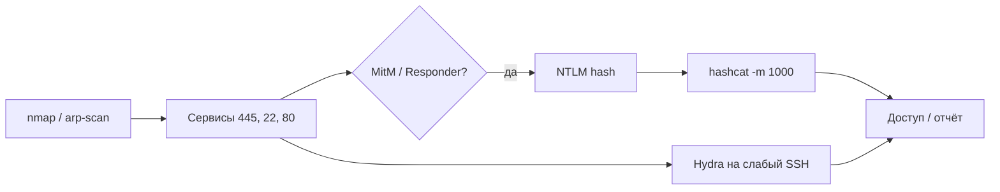

# Сканирование, перехват и брутфорс

<div class="article-tags">
  <span class="tag tag-required">ОБЯЗАТЕЛЬНО</span>
</div>

<span class="complexity-badge">Инженеру</span>
<span class="complexity-badge">Тестировщику</span>

> **Раздел 8.10, шаг 4 из 9.** Предыдущий — [recon](./2.md); далее — [Wi-Fi](./3.md).

---

## Теория сетевого сканирования

Сканирование отвечает на вопрос **«что слушает сеть и какова версия?»**. На канальном уровне (L2) — ARP; на транспортном (L4) — TCP/UDP порты; на прикладном (L7) — banner и HTTP.

### Модель TCP и состояния порта

**TCP handshake** (SYN → SYN-ACK → ACK) устанавливает соединение. SYN-scan отправляет SYN и анализирует ответ:

| Ответ | Интерпретация nmap |
|-------|-------------------|
| SYN-ACK | `open` |
| RST | `closed` |
| Нет ответа / ICMP filter | `filtered` |

**UDP** — без handshake; отсутствие ответа не означает closed → состояние `open|filtered` часто.

### Сегментация и pivot

В корпоративной сети пентестер может начать с **DMZ**, затем **pivot** через скомпрометированный хост во внутреннюю VLAN. Kali на jump host сканирует **изнутри** периметра — другая карта, чем внешний black-box. Теория та же; меняется **точка обзора**.

### IDS/IPS и evasion

**IDS** (Intrusion Detection) сигнализирует; **IPS** блокирует. Скан может вызвать алерт SOC. Техники снижения шума (использовать **только** с разрешением):

- Медленный timing (`-T2`, `--scan-delay`)
- Сканирование с IP whitelist заказчика
- Фрагментация (устаревшие IDS обходились; современные — реже)

<div class="callout callout--info">
  <div class="callout-title">Цель пентеста — не «обойти IDS»</div>

  Если задача — проверить **детект**, скан делают **явно шумным** и смотрят, пришёл ли алерт. Если задача — найти уязвимости без лишнего шума — согласуют rate и окно.
</div>

---

## Сканирование сетей

### Nmap — углубление

Базовые команды — в [статье про recon](./2.md). Дополнительные сценарии:

```bash
# UDP (медленно, часто нужен для DNS/SNMP)
sudo nmap -sU --top-ports 100 192.168.56.0/24

# Сохранение всех форматов для отчёта
nmap -sV -oA reports/target 192.168.56.101

# Скрипты уязвимостей (осторожно)
nmap --script vuln 192.168.56.101
```

### Masscan

Очень быстрый скан больших диапазонов (C):

```bash
masscan 10.0.0.0/8 -p80,443 --rate 1000
```

Высокий `--rate` может перегрузить сеть — **согласуйте** с заказчиком.

### Netdiscover / arp-scan

Поиск хостов в **локальном L2** (ARP):

```bash
sudo arp-scan --localnet
```

Полезно в lab VLAN перед targeted nmap.

---

## Перехват и анализ трафика

### Wireshark / tshark

**Wireshark** — GUI для разбора pcap; **tshark** — CLI.

Захват на интерфейсе:

```bash
sudo tshark -i eth0 -w capture.pcapng
```

Фильтры:

| Фильтр | Назначение |
|--------|------------|
| `http` | HTTP (без TLS) |
| `tls.handshake.type == 1` | Client Hello |
| `ip.addr == 192.168.56.101` | Трафик хоста |
| `dns.qname contains "login"` | DNS-запросы |

<div class="callout callout--info">
  <div class="callout-title">HTTPS и шифрование</div>

  Современный TLS **не расшифровывается** без ключей или MitM с доверенным CA на клиенте. В пентесте веба чаще используют **Burp** как прокси с установленным CA, а не raw Wireshark на WAN.
</div>

### tcpdump

Минимальный захват:

```bash
sudo tcpdump -i any port 443 -w tls.pcap
```

### Модель OSI и полезные протоколы

| Уровень | Протоколы | Что видит пентестер |
|---------|-----------|---------------------|
| L2 | ARP, Ethernet | MitM в LAN, MAC flooding |
| L3 | IP, ICMP | Traceroute, host discovery |
| L4 | TCP, UDP | Порты, state |
| L7 | HTTP, DNS, SMB | Credentials, логика |

**ARP** (Address Resolution Protocol) связывает IP и MAC в локальной сети. **ARP spoofing** — атакующий отвечает «я — шлюз» на ARP who-has → трафик жертвы идёт через Kali.

**DNS** в pcap — утечки имён внутренних сервисов (`dev-db.corp.local`). **SMB** (445) — NTLM authentication, EternalBlue-class CVE на legacy Windows.

---

## Man-in-the-Middle в лаборатории

**MitM** — атакующий находится между жертвой и сервером (ARP spoofing, rogue DHCP, DNS spoof).

### bettercap

```bash
sudo bettercap -iface eth0
# в консоли bettercap:
net.probe on
set arp.spoof.targets 192.168.56.102
arp.spoof on
```

Параллельно `wireshark` на интерфейсе покажет перенаправленный трафик **в изолированной сети**.

### Ettercap / mitmproxy

Классические инструменты; **mitmproxy** удобен для HTTP/API:

```bash
mitmproxy --listen-port 8080
```

<div class="callout callout--danger">
  <div class="callout-title">MitM вне lab</div>

  ARP-spoofing в корпоративной сети без явного разрешения — перехват чужих данных и возможное уголовное преследование. В договоре на пентест часто отдельный пункт про «sniffing on internal segment».
</div>

### Responder (LLMNR/NBT-NS)

В Windows-сетях клиенты могут резолвить имена через LLMNR. **Responder** перехватывает запросы и собирает **NTLM-хеши** (для offline crack):

```bash
sudo responder -I eth0 -A
```

Защита: отключить LLMNR/NBT-NS через GPO, SMB signing.

### Kerberos и NTLM

В **Active Directory** доменная аутентификация идёт через **Kerberos** (ticket-based) или fallback **NTLM**. Responder ловит **NTLMv2 hash** — формат для hashcat `-m 5600`. **Pass-the-Hash** — использование hash без plaintext на SMB. **Kerberoasting** — запрос TGS для SPN service account, offline crack пароля сервиса. Эти темы уходят в **internal AD pentest**; для lab достаточно понимать, почему LLMNR опасен.

---

## Атаки на пароли

### Теория хеширования паролей

Системы **не хранят** пароли plaintext (в идеале). Хранят **хеш** + соль. Атакующий с дампом БД или перехваченным hash атакует **offline** — без rate limit.

| Алгоритм | Свойства | Crack |
|----------|----------|-------|
| MD5 / SHA1 (без salt) | Быстрый | Тривиален для GPU |
| bcrypt / scrypt / Argon2 | Adaptive cost | Медленный перебор |
| NTLM | Без salt, быстрый | hashcat `-m 1000` |
| WPA-PMK | PBKDF2 4096 iter | hashcat `-m 22000` |

**Salt** — уникальная строка на пароль; защищает от **rainbow tables**. **Pepper** — секрет сервера в коде; не в дампе БД.

**Online** vs **offline**:

| | Online (Hydra) | Offline (Hashcat) |
|---|----------------|-------------------|
| Лимит | Lockout, CAPTCHA, WAF | Только скорость GPU |
| След | Логи auth | Нет на целевой системе |
| Scope | Живой сервис | Уже украденный hash |

### Офлайн — Hashcat

**Hashcat** использует GPU для перебора хешей.

| Режим `-m` | Тип |
|------------|-----|
| 0 | MD5 |
| 1000 | NTLM |
| 1800 | sha512crypt ($6$) |
| 22000 | WPA-PMKID |
| 3200 | bcrypt |

Пример:

```bash
hashcat -m 0 hashes.txt /usr/share/wordlists/rockyou.txt
hashcat -m 0 hashes.txt -a 3 ?a?a?a?a?a?a?a?a   # маска 8 символов
```

Правила мутаций (`-r rules/best64.rule`) увеличивают шанс на `Password1`, `p@ssw0rd`.

**Mask attack** (`-a 3`) — перебор по маске `?d?d?d?d` (цифры), когда известен формат (PIN банковской карты — **только** учебные примеры).

**Wordlist + rules** покрывает human passwords лучше чистого brute force 8 символов `?a`.

### John the Ripper

Универсальный cracker; удобен для `/etc/shadow` и множества форматов:

```bash
john --wordlist=/usr/share/wordlists/rockyou.txt unshadowed.txt
```

Формат `unshadow` из `/etc/passwd` + `/etc/shadow` — только **свои** учебные VM.

### Онлайн — Hydra

Перебор **сервисов** по сети (SSH, RDP, HTTP form):

```bash
hydra -l admin -P /usr/share/wordlists/rockyou.txt ssh://192.168.56.101 -t 4
hydra -l user -P passwords.txt 192.168.56.101 http-post-form \
  "/login:username=^USER^&password=^PASS^:Invalid"
```

| Флаг | Смысл |
|------|-------|
| `-t` | Параллельные потоки (не DDOS) |
| `-L` / `-P` | Файлы логинов и паролей |
| `-f` | Остановиться после первого успеха |

<div class="callout callout--warning">
  <div class="callout-title">Account lockout</div>

  Hydra на prod без согласования может **заблокировать** учётные записи. Используйте тестовые аккаунты, rate limit и окно maintenance.
</div>

### Medusa, ncrack

Альтернативы Hydra для массовых протоколов; принцип тот же — **онлайн** перебор с риском lockout.

---

## Связка «скан → перехват → crack»



Типичный **учебный** сценарий: Metasploitable + Kali — nmap находит `vsftpd` backdoor или слабый SSH; отчёт описывает цепочку без публикации exploit-кода.

---

## Защитные меры

| Угроза | Контроль |
|--------|----------|
| Сканирование | Firewall, IDS, сегментация |
| MitM | 802.1X, ARP inspection, DNSSEC |
| NTLM relay | SMB signing, EPA |
| Слабые пароли | MFA, политика длины, deny list |
| Hash leak | bcrypt/Argon2, pepper, rate limit |

См. [авторизация и аутентификация](/encyclopedia/8-infra-security/8-07-informatsionnaya-bezopasnost/116).

---

## Практическое задание

1. В lab-сети выполните `arp-scan` и `nmap -sV` на Metasploitable (или аналог).
2. Захватите 30 секунд трафика в Wireshark, найдите DNS-запрос.
3. Создайте файл с MD5-хешем слова `secret` (`echo -n secret | md5sum`) и взломайте через hashcat.
4. На учебном SSH с паролем `root/toor` проверьте успех Hydra с малым словарём.
5. Опишите, какие меры защиты на каждом этапе остановили бы атаку.

---

## Связанные материалы

- [Инструменты Kali и recon](./2.md)
- [Wi-Fi и handshake](./3.md)
- [Обеспечение безопасности](/encyclopedia/8-infra-security/8-07-informatsionnaya-bezopasnost/2)

---
