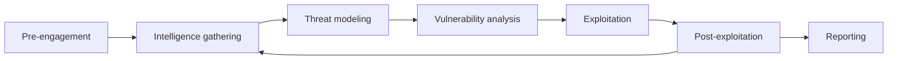
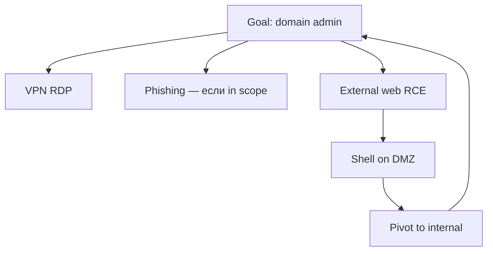

# Процессы пентестинга

  ОБЯЗАТЕЛЬНО
  ДЛЯ НОВИЧКОВ

Инженеру
Тестировщику
Менеджеру

> **Раздел 8.10, шаг 2 из 9.** Предыдущий — [Kali Linux](./1.md); далее — [recon](./2.md).

---

## Что такое пентест как процесс

**Тестирование на проникновение** — проект с началом, концом, артеfactами и отчётом. Техника (`nmap`, Burp) — лишь часть; без процесса заказчик получает "список CVE" без приоритетов, а исполнитель рискует выйти за scope или уничтожить prod.

Цели процесса:

- **Верифицировать** гипотезы угроз на реальной инфраструктуре в согласованных границах.
- **Измерить** ущерб (impact), а не только факт наличия уязвимости.
- **Дать** заказчику воспроизводимые шаги и roadmap исправлений.
- **Зафиксировать** правовую и операционную рамку (кто, когда, что можно ломать).

| Роль | Ответственность в процессе |
|------|---------------------------|
| **Заказчик (business owner)** | Приоритеты активов, окно работ, контакт on-call |
| **Технический контакт** | Whitelist IP, учётные записи grey box, rollback |
| **Пентестер / команда** | Методология, артеfactы, отчёт |
| **SOC / Blue Team** | Опционально — проверка детекта (purple team) |

---

## PTES — семь фаз

**PTES** (Penetration Testing Execution Standard) — наиболее цитируемый каркас. Фазы **не всегда линейны**: после post-exploitation часто возвращаются к recon внутренней сети.

| Фаза | Содержание | Артеfactы |
|------|------------|-----------|
| **Pre-engagement** | Договор, scope, ROE, emergency contact | SoW, NDA, правила |
| **Intelligence gathering** | OSINT, скан, перечисление | Списки хостов, заметки |
| **Threat modeling** | Активы × угрозы × векторы | Матрица приоритетов |
| **Vulnerability analysis** | Скан + ручная верификация | Findings draft, CVSS |
| **Exploitation** | PoC доступа | Скриншоты, session proof |
| **Post-exploitation** | Pivot, privesc, data (в scope) | Карта сети, paths |
| **Reporting** | Executive + technical | PDF, презентация, retest plan |

См. [сбор информации](./2.md), [оценку уязвимостей](./7.md), [post-exploitation](./9.md).

---

## Pre-engagement — до первого пакета

### Statement of Work (SoW)

SoW фиксирует **что продаётся** и **что не входит**:

- Тип теста (external, internal, web-only, AD).
- Black / grey / white box.
- Количество IP, приложений, дней.
- **Окна** (business hours only vs 24/7).
- Запреты — DoS, social engineering, фишинг сотрудников, destruction.
- **Retest** после исправлений (часто отдельная опция).

### Rules of Engagement (ROE)

ROE — операционные правила **во время** теста:

| Тема | Пример формулировки |
|------|---------------------|
| Rate limit | Не более 100 req/s на один хост |
| Deauth Wi-Fi | Только по запросу, max N кадров |
| Exploit | Только PoC; без ransomware-simulation без согласования |
| Данные | Не скачивать реальные ПДн; маскировать в отчёте |
| Эскалация | При риске падения prod — звонок контакту X за 15 мин |

  
Устные "можно всё"

  

  Без письменного scope и ROE "разрешение CTO в чате" не защитит ни заказчика, ни пентестера в споре после инцидента. См. [белое хакерство — основы](/encyclopedia/8-infra-security/8-09-belyy-haking-i-bug-bounty/1).
  

### Kick-off meeting

На старте согласуют:

- Список активов in/out of scope (домены, IP, mobile apps).
- Учётные записи для grey box (user, admin test).
- Ожидания по **goal** (флаг domain admin vs "найти все Critical").
- Канал связи (Telegram, Signal, ticket system).
- Нужен ли **stealth** (имитация APT без шумного скана).

---

## Типы пентеста по периметру

| Тип | Точка старта | Типичный сценарий |
|-----|--------------|-------------------|
| **External** | Интернет | Компромисс публичного веба → VPN |
| **Internal** | LAN / guest Wi-Fi | Lateral movement после "утечки" ноутбука |
| **Web application** | URL + API | OWASP, логика, auth |
| **Wireless** | Эфир офиса | PSK / rogue AP → LAN |
| **AD / Windows** | Домен | Kerberoasting, relay, DCSync (в scope) |
| **Cloud** | AWS/Azure/GCP account | IAM, metadata, misconfig buckets |
| **Mobile** | APK/IPA | Reverse, API backend |
| **Social engineering** | Люди | Фишинг — **отдельный** договор |

Один engagement может комбинировать external + internal **после** получения foothold.

---

## OSSTMM и NIST — дополнение к PTES

**OSSTMM** (Open Source Security Testing Methodology Manual) акцентирует **измеримость** каналов (human, physical, wireless, telecom, data networks) и матрицу "видимость × доступ × trust". Полезен для RFP и сравнения подрядчиков.

**NIST SP 800-115** — техническое руководство для федеральных систем США; структура "planning → discovery → attack → reporting" пересекается с PTES. Часто цитируют в enterprise RFP.

| Стандарт | Сильная сторона |
|----------|-----------------|
| PTES | Практический цикл пентестера |
| OWASP WSTG | Веб-чек-листы |
| MITRE ATT&CK | Тактики для Red Team / отчёта |
| OSSTMM | Широта каналов, метрики |

---

## Threat modeling в пентесте

После recon строят **модель угроз** под конкретного заказчика (упрощённо STRIDE или attack trees):

**STRIDE** (Spoofing, Tampering, Repudiation, Information disclosure, Denial of service, Elevation of privilege) помогает классифицировать находки в отчёте для архитекторов.

Приоритизация effort:

1. Пути к ** crown jewels** (БД клиентов, billing, AD).
2. **Chainability** — два Medium → один Critical.
3. **Exploitability** в срок engagement (не тратить неделю на blind SSRF без impact).

---

## Команда и роли на проекте

| Роль | Задачи |
|------|--------|
| **Lead pentester** | Методология, отчёт, клиент |
| **Web specialist** | Burp, API, mobile backend |
| **Network / AD** | Internal, BloodHound, relay |
| **Wireless** | Wi-Fi audit |
| **Project manager** | Сроки, scope creep, billing |

На малом проекте одна person в Kali закрывает всё; на enterprise — **parallel workstreams** с ежедневным sync.

---

## Purple team и continuous pentest

**Purple team** — Red (атака) и Blue (SOC) работают **вместе**: атака согласована, SOC проверяет алерты. Не конкуренция "обойти все IDS", а улучшение детекта.

**Continuous / rolling pentest** — подписка вместо разового аудита раз в год; scope меняется с релизами. Bug Bounty — краудсорсинг variant; см. [8.09](/encyclopedia/8-infra-security/8-09-belyy-haking-i-bug-bounty/intro).

---

## Метрики успеха engagement

| Метрика | Зачем заказчику |
|---------|-----------------|
| Time to first Critical | Реалистичность периметра |
| % findings с PoC | Качество, не "scanner noise" |
| Mean time to remediate (после retest) | Зрелость процессов |
| Coverage scope | % IP/apps протестировано |
| Detected vs undetected (purple) | Эффективность SOC |

---

## Типичные ошибки процесса

| Ошибка | Последствие |
|--------|-------------|
| Scope "весь интернет" без границ | Юридический риск |
| Нет emergency contact | Prod лежит часами |
| Только automated scan | Ложное чувство безопасности |
| Отчёт без remediation | Findings не закрываются |
| Пропуск retest | "Починили" на половину |

---

## Практическое задание

1. Составьте одностраничный **SoW** для учебного lab (1 VM DVWA + 1 Metasploitable, 3 дня, grey box).
2. Напишите 5 пунктов **ROE** (rate, данные, запрет DoS).
3. Постройте attack tree: цель — "прочитать файл /flag.txt" на internal host.
4. Сопоставьте фазы PTES со статьями 8.10 (таблица в заметках).

---

## Связанные материалы

- [Анализ и тестирование безопасности](/encyclopedia/8-infra-security/8-07-informatsionnaya-bezopasnost/1131)
- [Жизненный цикл атаки](/encyclopedia/8-infra-security/8-07-informatsionnaya-bezopasnost/129)
- [Pivoting и отчёты](./9.md)

---
