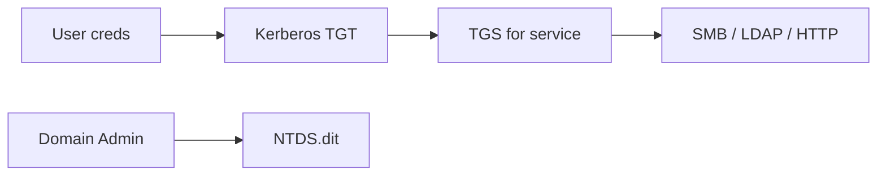

# Active Directory и типовые сервисы

<div class="article-tags">
  <span class="tag tag-required">ОБЯЗАТЕЛЬНО</span>
</div>

<span class="complexity-badge">Инженеру</span>

> **Раздел 8.10, шаг 8 из 9.** Предыдущий — [эксплуатация](./7.md); далее — [pivot и отчёты](./9.md).

---

## Active Directory — модель угроз

**Active Directory (AD)** — служба каталогов Microsoft: пользователи, группы, компьютеры, **Group Policy**, **Kerberos**, **LDAP**. Компромисс AD часто означает **компромисс всей организации** (Domain Admin → все рабочие станции, файловые серверы, почта).

Ключевые сущности:

| Сущность | Роль |
|----------|------|
| **Domain** | Граница аутентификации `corp.local` |
| **DC** (Domain Controller) | Хранит NTDS.dit, выдаёт TGT/TGS |
| **OU** | Организационные unit для GPO |
| **SPN** | Service Principal Name — привязка сервиса к учётке |
| **Trust** | Связь между доменами / лесами |

Пентест AD **только** в lab (GOAD, HackTheBox Pro Labs, собственный DC) или internal engagement с письменным scope.



---

## Kerberos и NTLM — теория для пентестера

### Kerberos (порт 88)

1. **AS-REQ** — пользователь просит TGT у KDC.
2. **AS-REP** — TGT зашифрован hash пароля пользователя.
3. **TGS-REQ** — запрос билета на сервис (CIFS, HTTP).
4. **TGS-REP** — service ticket.

**Атаки** (lab / scope):

| Атака | Суть |
|-------|------|
| **Kerberoasting** | Запрос TGS для SPN с weak service account password → offline crack |
| **AS-REP Roasting** | User без pre-auth → hash offline |
| **Golden Ticket** | Подделка TGT при компромиссе krbtgt hash |
| **Silver Ticket** | Подделка TGS для одного сервиса |
| **Pass-the-Ticket** | Импорт украденного ticket |

Инструменты: **Rubeus**, **Impacket** (`GetUserSPNs.py`, `ticketer.py`).

### NTLM

Challenge-response; hash **NTLMv2** можно перехватить (Responder) или relay:

| Атака | Условие |
|-------|---------|
| **Pass-the-Hash** | Hash + SMB без plaintext |
| **NTLM Relay** | SMB signing off, no EPA |
| **Coercing** | PetitPotam, PrinterBug → auth на атакующего |

Защита: **SMB signing**, **LDAP signing**, **EPA**, отключение NTLM где возможно.

---

## BloodHound и перечисление AD

**BloodHound** (SharpHound collector + Neo4j graph) визуализирует **пути** к Domain Admin:

```bash
# На Kali — ingest JSON с Windows host (lab)
bloodhound-python -u user -p 'Password1' -d corp.local -ns 192.168.56.10 -c All
```

В UI ищут **Shortest Paths to Domain Admins**. Типовые edges:

- **GenericAll** на user → reset password.
- **WriteDACL** → shadow credentials.
- **MemberOf** → nested groups.
- **HasSession** → creds на workstation admin.

BloodHound отвечает «**куда** идти дальше», не «авто-взлом».

---

## Типовые сетевые сервисы

После [recon](./2.md) и [nmap](./5.md) пентестер встречает повторяющийся набор портов.

| Порт | Сервис | Что проверять |
|------|--------|---------------|
| 22 | SSH | Weak keys, `PermitRootLogin`, known CVE |
| 23 | Telnet | Plaintext — critical finding |
| 25/587 | SMTP | VRFY, open relay |
| 53 | DNS | Zone transfer, cache snooping |
| 80/443 | HTTP(S) | Веб-пентест [ст. 4](./4.md) |
| 135/445 | SMB | Signing, null session, EternalBlue-class |
| 3389 | RDP | NLA, BlueKeep-class, brute |
| 5985/5986 | WinRM | Cred reuse |
| 1433 | MSSQL | `sa` empty, xp_cmdshell |
| 3306 | MySQL | weak root, UDF |
| 5432 | PostgreSQL | trust auth misconfig |
| 6379 | Redis | no auth → write cron |
| 27017 | MongoDB | no auth exposed |
| 9200 | Elasticsearch | open index |

### SMB / Windows file sharing

```bash
enum4linux -a 192.168.56.101
smbclient -L //192.168.56.101 -N
crackmapexec smb 192.168.56.0/24 -u user -p pass --shares
```

**CrackMapExec** (CME / NetExec) — Swiss army knife для AD lab: spray passwords, exec, dump SAM.

### SSH

```bash
ssh-audit 192.168.56.101
hydra -l root -P small.txt ssh://192.168.56.101 -t 4
```

Проверка: ключи вместо пароля, `AllowUsers`, fail2ban.

### RDP

```bash
nmap -p3389 --script rdp-enum-encryption 192.168.56.101
hydra -l administrator -P pass.txt rdp://192.168.56.101
```

Blue Team: NLA, MFA (RD Gateway), ограничение по IP.

### FTP / TFTP

Anonymous upload → webshell path; TFTP на Cisco — config leak.

### Databases

**Redis** без auth:

```bash
redis-cli -h 192.168.56.101 INFO
# lab only — write cron for reverse shell
```

**PostgreSQL** `trust` в `pg_hba.conf` — подключение без пароля с «доверенной» сети.

---

## Атаки на пароли в контексте сервисов

См. [ст. 5](./5.md) для hashcat/Hydra. Здесь — **стратегия**:

| Стратегия | Инструмент | Риск |
|-----------|------------|------|
| **Password spraying** | CME, Spray | Lockout — 1–2 попытки на user |
| **Credential stuffing** | Утечки + Hydra | ToS breach sites |
| **Default creds** | Vendor docs | Low hanging fruit |
| **Offline crack** | hashcat NTDS, WPA | После dump |

**Spraying** — один пароль `Winter2026!` на **всех** users с паузой; не классический brute «aaa, aab».

<div class="callout callout--warning">
  <div class="callout-title">Lockout policy</div>

  Перед spraying на AD узнайте **Account lockout threshold** у заказчика. В ROE часто лимит 3 попытки на весь engagement.
</div>

---

## Веб + AD — связка

Многие атаки начинаются с **веба**:

- **ASPX ViewState** с weak machine key → RCE.
- **LDAP injection** в login → bypass.
- **NTLM relay** через HTTP auth к SMB.

Internal **web apps** на `*.corp.local` без WAF — цель после foothold.

---

## Linux vs Windows post-foothold (preview)

| Windows | Linux |
|---------|-------|
| `whoami /priv`, `systeminfo` | `id`, `uname -a` |
| `net user /domain` | `/etc/passwd` |
| Mimikatz / sekurlsa | `/etc/shadow` if root |
| Autoruns, services | cron, systemd |

Детали privesc — [ст. 9](./9.md).

---

## Практическое задание

1. Разверните **GOAD** или HTB «Active» machine (lab).
2. `bloodhound-python` или SharpHound → один path to DA в UI.
3. На Metasploitable: перечислите SMB, MySQL, SSH; один weak service.
4. Password spray **одним** паролем на 3 учётных записи (lab) с документированием lockout policy.

---

## Связанные материалы

- [Авторизация и аутентификация](/encyclopedia/8-infra-security/8-07-informatsionnaya-bezopasnost/116)
- [Pivoting и post-exploitation](./9.md)
- [Сканирование и брутфорс](./5.md)

---
