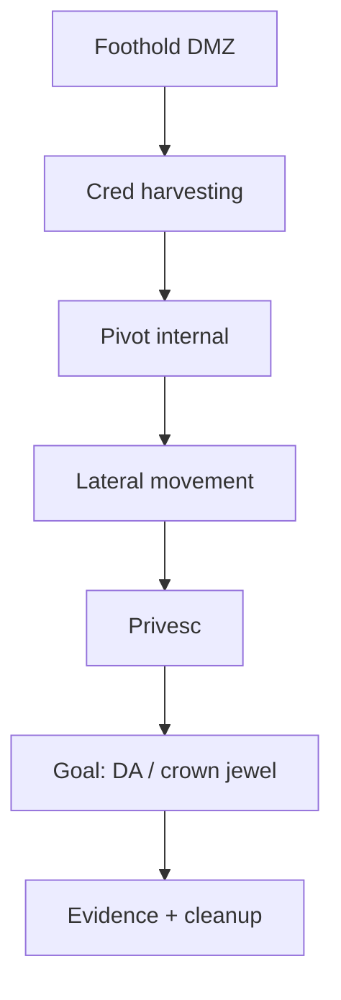

# Pivoting, post-exploitation и отчёты

<div class="article-tags">
  <span class="tag tag-required">ОБЯЗАТЕЛЬНО</span>
</div>

<span class="complexity-badge">Инженеру</span>
<span class="complexity-badge">Менеджеру</span>

> **Раздел 8.10, шаг 9 из 9.** Предыдущий — [AD и сервисы](./8.md). Итоги — [998](./998.md).

---

## Post-exploitation — зачем после shell

**Foothold** (первая shell на DMZ) редко равен цели engagement. **Post-exploitation** отвечает на вопросы:

- Какие **учётные данные** на хосте (memory, files, tickets)?
- Куда **pivot** дальше (internal VLAN, AD)?
- Какой **максимальный impact** доказуем за оставшееся время?
- Что **зафиксировать** для отчёта без лишнего exfil?

Фаза **строго** в scope: «достичь Domain Admin» vs «только доказать возможность чтения /etc/shadow на одном host».



---

## Pivoting и lateral movement

### Pivoting

**Pivot** — использование скомпрометированного хоста как **моста** в сеть, недоступную напрямую с Kali.

| Метод | Суть |
|-------|------|
| **SSH -D / -L** | SOCKS или port forward через jump host |
| **Metasploit route** | `route add` + `socks_proxy` |
| **ligolo / chisel** | Reverse tunnel modern |
| **Proxychains** | Направить nmap через SOCKS |

Пример SSH dynamic forward (lab):

```bash
ssh -D 1080 user@pivot-host
proxychains nmap -sT -Pn 10.10.10.0/24
```

### Lateral movement

Переход **между** хостами одной сети с новыми creds:

- **Pass-the-Hash** (SMB).
- **PSExec / WinRM / WMI** (Impacket `psexec.py`, `wmiexec.py`).
- **RDP** с украденными creds.
- **SSH** key reuse (`id_rsa` в home).

**CrackMapExec** для lateral (lab):

```bash
crackmapexec smb 10.10.10.0/24 -u admin -H NTLM_HASH --local-auth
```

---

## Privilege escalation — Windows

Цель — **SYSTEM** или **Domain Admin**.

### Enumeration

```cmd
whoami /priv
whoami /groups
systeminfo
wmic qfe
```

Инструменты: **WinPEAS**, **PowerUp**, **Seatbelt** (lab).

### Типовые векторы

| Вектор | Пример |
|--------|--------|
| **Unquoted service path** | `C:\Program Files\ vuln svc.exe` |
| **Weak service ACL** | `sc sdshow service` → modifiable |
| **AlwaysInstallElevated** | MSI as SYSTEM |
| **Token impersonation** | SeImpersonate → PrintSpoofer, GodPotato |
| **Kernel exploit** | CVE для версии OS (last resort) |
| **GPO / AD misconfig** | BloodHound path |

**Potato**-family exploits abusing SeImpersonate — часты на IIS app pools в lab.

### Credentials

- **Mimikatz** / **sekurlsa** (lab, triggers EDR).
- **LSASS dump** → offline `secretsdump.py`.
- **SAM** if local admin.

---

## Privilege escalation — Linux

```bash
sudo -l
find / -writable -type f 2>/dev/null
getcap -r / 2>/dev/null
uname -a
```

| Вектор | Пример |
|--------|--------|
| **SUID** | `find`, `vim`, custom binary |
| **Sudo misconfig** | `sudo vim` → `:!/bin/sh` |
| **Cron** | Writable script run as root |
| **Kernel exploit** | DirtyPipe, PwnKit (match kernel) |
| **Docker socket** | `/var/run/docker.sock` → mount host |

**LinPEAS** — автоматический enum (осторожно — шумный).

---

## Persistence — граница ethics

**Persistence** (backdoor, scheduled task, golden ticket) **вне** scope обычного пентеста. Допустимо **только** если ROE явно требует Red Team simulation и есть **cleanup date**.

Для стандартного пентеста достаточно доказать **временный** доступ + рекомендация «атакующий мог бы установить persistence».

---

## Сбор доказательств

| Артеfact | Назначение |
|----------|------------|
| Скриншоты | `whoami`, `ipconfig`, sensitive **masked** |
| Command log | Redacted history |
| Network map | До/после pivot |
| Timestamps | UTC + local |
| Hashes files | Integrity of PoC scripts |
| pcap (optional) | Для спорных findings |

**Не включать** в отчёт: реальные пароли, полные дампы БД, private customer data. Заменить на «[REDACTED]» и synthetic rows.

---

## Отчёт коммерческого уровня

Enterprise-отчёт состоит из **двух слоёв**:

### Executive summary (1–3 страницы)

- **Overall posture** (Critical/High count, trend vs прошлый год).
- **Top 3 business risks** на языке бизнеса («утечка договоров через IDOR»).
- **Key recommendations** с owners и сроками.
- **Scope** и limitations («internal AD out of scope»).

### Technical report

Структура:

1. **Methodology** — PTES, инструменты, даты, team.
2. **Scope** — таблица in/out.
3. **Findings summary** — таблица ID, title, severity, status.
4. **Detailed findings** — каждая уязвимость:
   - Title + ID (PT-2026-001)
   - Severity (CVSS vector + narrative risk)
   - Affected assets
   - Description
   - Steps to reproduce (numbered)
   - Evidence (figures)
   - Impact (CIA + compliance если уместно)
   - Remediation (specific)
   - References (CWE, CVE, OWASP)
5. **Attack narrative** — story одной цепочки (optional, high value).
6. **Appendices** — glossary, tool output samples, scan configs.

<div class="callout callout--tip">
  <div class="callout-title">Attack narrative</div>

  Заказчики запоминают **историю** («атакующий за 4 часа дошёл от VPN до payroll DB») лучше, чем 40 disconnected Medium. Выделите 2–4 страницы на один реалистичный path.
</div>

### Шкала severity в enterprise

Помимо CVSS — **contextual risk**:

| Фактор | Повышает risk |
|--------|---------------|
| Asset tier | Production, PCI, ПДн |
| Exploitability | No auth, public internet |
| Compensating controls | WAF bypass доказан |
| Blast radius | Domain-wide |

Шаблон finding — см. [8.09/2](/encyclopedia/8-infra-security/8-09-belyy-haking-i-bug-bounty/2).

### Remediation roadmap

| Priority | SLA (пример) | Пример finding |
|----------|--------------|----------------|
| P0 | 24–72 h | External unauth RCE |
| P1 | 2 weeks | AD Kerberoastable SPN weak |
| P2 | 30 days | Missing HSTS |
| P3 | 90 days | Version disclosure |

### Retest (validation)

После патча — **retest** только затронутых findings. Статусы:

- **Fixed** — не воспроизводится.
- **Partially fixed** — обход остаётся.
- **Not fixed** — без изменений.
- **Accepted risk** — подписанное исключение.

---

## Презентация для стейкholders

- 30 мин max; без live exploit demo на prod.
- Diagram attack path.
- Demo **redacted** screenshots.
- Q&A с SOC и dev leads.

---

## Практическое задание

1. С foothold на lab: SSH pivot или `proxychains` на internal /24.
2. Windows или Linux privesc одним documented vector.
3. Напишите **attack narrative** (1 страница) от initial access до goal.
4. Оформите **2 findings** + executive summary (half page) по шаблону выше.

---

## Связанные материалы

- [Процессы пентестинга](./6.md)
- [Оценка уязвимостей](./7.md)
- [Тестирование ИБ](/encyclopedia/7-project/7-05-testirovanie/123)

---
