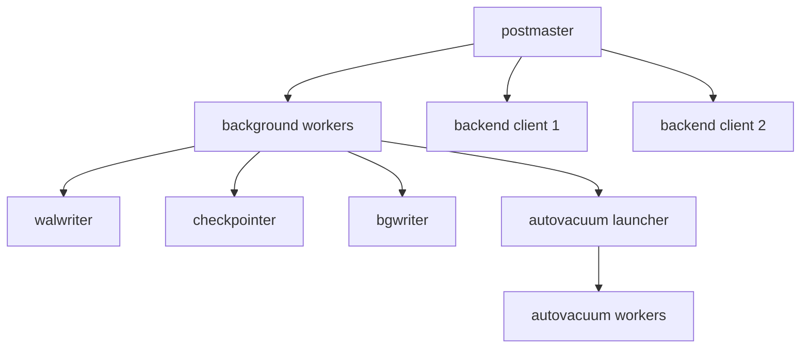
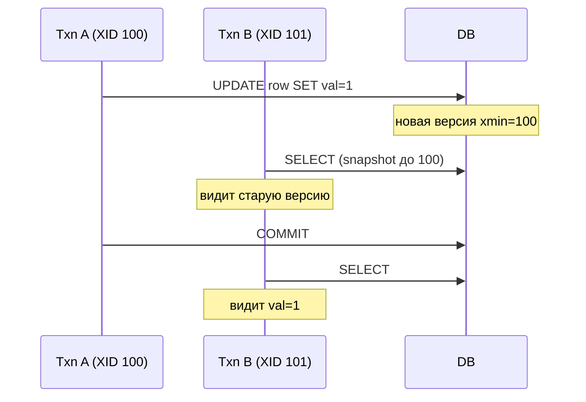
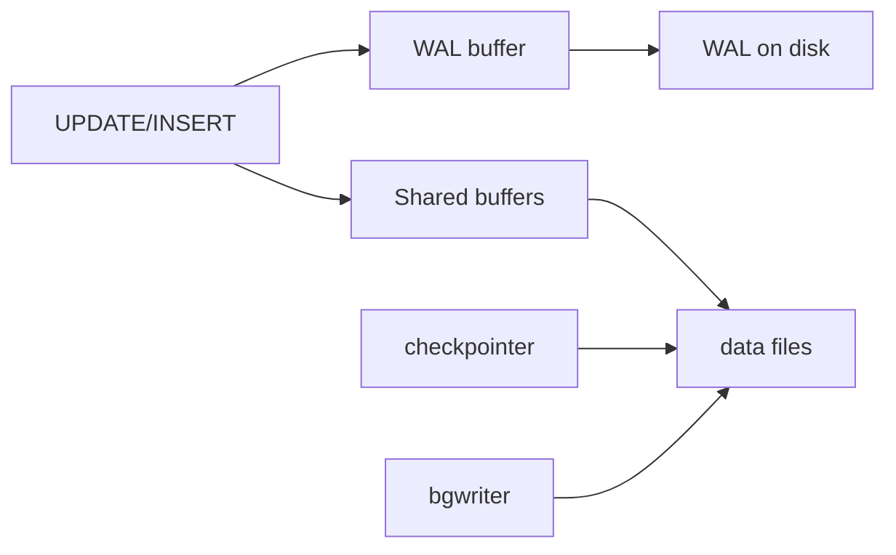

# Архитектура PostgreSQL и внутреннее устройство

<div class="article-tags">
  <span class="tag tag-required">ОБЯЗАТЕЛЬНО</span>
</div>

<span class="complexity-badge">Инженеру</span>
<span class="complexity-badge">Бэкенду</span>

> **Раздел 8.11, шаг 1 из 12.** Дальше — [оптимизация и индексы](./2.md).

---

## Зачем знать внутренности

PostgreSQL на первый взгляд ведёт себя как «ещё одна SQL-база», но многие production-инциденты связаны именно с **механизмами ядра** — раздуванием таблиц (bloat), задержкой autovacuum, исчерпанием идентификаторов транзакций (wraparound) или неправильным пониманием WAL. Без этой базы тюнинг `postgresql.conf` и выбор стратегии бэкапов остаются угадыванием.

Общая теория транзакций и журналов — в [главе 8 основ БД](/encyclopedia/3-data-markup/3-05-osnovy-baz-dannyh/8.md); здесь — **как это реализовано в Postgres**.

---

## Процессная модель

После запуска `postgres` (postmaster) создаёт **отдельный OS-процесс на каждое клиентское соединение** — backend. Это дорого по памяти и файловым дескрипторам, поэтому в production почти всегда ставят **PgBouncer** ([шаг 6](./6.md)).



| Процесс | Назначение |
|---------|------------|
| **postmaster** | Принимает соединения, форкает backend, перезапускает упавшие фоновые процессы |
| **backend** | Выполняет SQL одного клиента |
| **checkpointer** | Периодически сбрасывает «грязные» страницы из shared buffers на диск, создаёт checkpoint в WAL |
| **background writer (bgwriter)** | Заранее выталкивает изменённые страницы, снижая пиковую нагрузку checkpoint |
| **walwriter** | Группирует запись WAL на диск |
| **autovacuum launcher** | Запускает worker-процессы VACUUM/ANALYZE |
| **stats collector** | Собирает статистику для `pg_stat_*` |

---

## MVCC — многоверсионность

**MVCC** (Multi-Version Concurrency Control) позволяет читателям **не блокировать** писателей и наоборот. При `UPDATE` PostgreSQL **не перезаписывает** строку на месте — создаёт **новую версию** строки, а старую помечает «мёртвой» для текущих транзакций.

Каждая версия строки несёт служебные поля (системные колонки):

| Поле | Смысл |
|------|-------|
| **xmin** | ID транзакции, создавшей версию |
| **xmax** | ID транзакции, удалившей/заменившей версию (0 = активна) |
| **ctid** | Физический адрес версии (block, offset) |
| **tableoid** | OID таблицы (полезно в наследовании/партициях) |

Проверить системные поля можно так:

```sql
SELECT xmin, xmax, ctid, *
FROM orders
WHERE id = 42;
```

Транзакция видит только те версии, которые **видимы в её снимке** (snapshot).

---

## XID и снимки данных

**XID** (Transaction ID) — 32-битный счётчик транзакций. Каждая транзакция получает XID при первой записи в БД.

**Snapshot** фиксирует для транзакции:

- какие XID уже **завершились** (committed);
- какие ещё **в процессе** (in-progress);
- горизонт — минимальный XID среди активных транзакций.

Правило видимости (упрощённо):

- версия строки видна;
- если `xmin` committed **до** снимка;
- (`xmax` пуст или aborted, или xmax committed **после** снимка).



Долгие транзакции (открытый idle-in-transaction) **удерживают horizon** и мешают VACUUM удалять старые версии — типичный источник bloat.

---

## VACUUM и autovacuum

**VACUUM** — сборщик «мусора» MVCC:

- помечает мёртвые версии как **переиспользуемое** место в страницах;
- обновляет **visibility map** (ускоряет index-only scan);
- защищает от **transaction ID wraparound** (см. ниже);
- при `VACUUM FULL` — переписывает таблицу целиком (блокирует таблицу, освобождает место ОС).

**Autovacuum** запускает VACUUM автоматически, когда число мёртвых строк превышает порог:

```
threshold = autovacuum_vacuum_threshold + autovacuum_vacuum_scale_factor × reltuples
```

Проверка bloat и autovacuum:

```sql
SELECT relname, n_live_tup, n_dead_tup, last_autovacuum, last_autoanalyze
FROM pg_stat_user_tables
ORDER BY n_dead_tup DESC
LIMIT 20;
```

<div class="callout callout--warning">
  <div class="callout-title">Bloat</div>

  <div class="callout-body">
  **Bloat** — когда физический размер таблицы/индекса сильно больше «полезных» данных из-за накопившихся мёртвых версий и фрагментации. Симптомы — медленные seq scan, раздутая БД на диске при малом объёме логических данных. Лечение — настроить autovacuum, убрать долгие транзакции; в крайних случаях `pg_repack` или `VACUUM FULL` в окно обслуживания.
  </div>
</div>

---

## Wraparound — зацикливание XID

XID — 32-бита (~4 млрд значений). PostgreSQL использует **кольцевую арифметику**: «старые» XID считаются «в будущем» относительно текущего.

Если autovacuum **не успевает** «заморозить» (freeze) старые строки, БД может перейти в режим **anti-wraparound vacuum** и в конце — **отказ в новых транзакциях**, пока freeze не завершится.

Мониторинг:

```sql
SELECT datname, age(datfrozenxid) AS xid_age
FROM pg_database
ORDER BY xid_age DESC;
```

Порог тревоги — обычно `age` > 200 млн (из 2 млрд до wraparound). Для таблиц — `pg_class.relfrozenxid`.

---

## Shared Buffers и WAL

**Shared buffers** — кэш страниц данных (8 KB блоки) в разделяемой памяти всех процессов. Чтение идёт через буфер; при промахе — чтение с диска.

**WAL** (Write-Ahead Log) — append-only журнал **логических изменений**. Правило WAL: изменения сначала попадают в WAL и сбрасываются на диск, **потом** (лениво) — dirty-страницы в data files.



| Компонент | Роль |
|-----------|------|
| **WAL buffer** | Буферизация записи WAL в памяти |
| **walwriter** | Сброс WAL buffer на диск |
| **checkpointer** | Checkpoint — точка, с которой crash recovery короче |
| **bgwriter** | Плавная запись dirty pages между checkpoint |

При падении питания PostgreSQL **восстанавливает** состояние, проигрывая WAL после последнего checkpoint ([теория](/encyclopedia/3-data-markup/3-05-osnovy-baz-dannyh/8.md)). Отсюда — требования к **PITR-бэкапам** ([шаг 10](./10.md)).

---

## Что PostgreSQL даёт сверх «базового SQL»

Стандарт SQL покрывает запросы и DDL; Postgres добавляет на уровне ядра и экосистемы:

| Возможность | Кратко |
|-------------|--------|
| MVCC без блокировки читателей | см. выше |
| Rich types | массивы, JSONB, UUID, геометрия (PostGIS) |
| Расширения | `CREATE EXTENSION` — citext, pg_trgm, … |
| Процедурные языки | PL/pgSQL, PL/Python ([шаг 5](./5.md)) |
| LISTEN/NOTIFY | pub/sub внутри БД |
| Logical replication | репликация на уровне изменений |
| Foreign Data Wrappers | запросы к внешним источникам |

---

## Практика в lab

1. Создайте таблицу, выполните серию `UPDATE` одной строки, смотрите рост `n_dead_tup` в `pg_stat_user_tables`.
2. Откройте транзакцию `BEGIN; SELECT …` и **не коммитьте** — в другой сессии обновите те же строки, проверьте autovacuum.
3. `SELECT pg_current_wal_lsn();` до и после массовой записи — рост LSN показывает объём WAL.

---

## Связанные материалы

- [Конфигурация postgresql.conf](./3.md) — `shared_buffers`, `wal_*`, autovacuum.
- [Блокировки в PostgreSQL](/encyclopedia/3-data-markup/3-07-sql/110) — когда MVCC недостаточно.
- [Транзакции](/encyclopedia/3-data-markup/3-07-sql/77) — TCL в SQL-разделе.
- [phpPgAdmin — SQL-вкладка](/encyclopedia/5-languages/5-07-php/phppgadmin/3) — проверка `xmin`, `pg_stat_user_tables` из браузера.
- [Восстановление после сбоя](/encyclopedia/3-data-markup/3-05-osnovy-baz-dannyh/8.md) — теория WAL.

---
