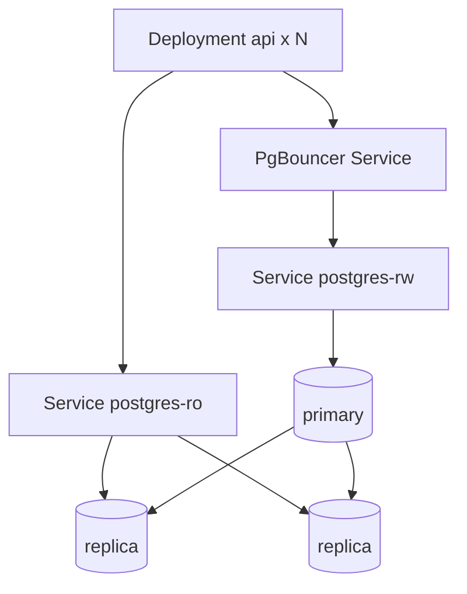

# PostgreSQL в облаке и Kubernetes

<div class="article-tags">
  <span class="tag tag-required">ОБЯЗАТЕЛЬНО</span>
</div>

<span class="complexity-badge">Инженеру</span>

> **Раздел 8.11, шаг 8 из 12.** Дальше — [HA-кластеры](./9.md).

---

## On-premise, облако, Kubernetes — выбор

| Среда | Плюсы | Минусы |
|-------|-------|--------|
| **Bare metal / VM** | Полный контроль GUC, I/O | Сами HA, бэкапы, patching |
| **Managed (RDS, Azure DB, Cloud SQL, Yandex MDB)** | HA, бэкапы, patching | Лимиты параметров, vendor lock-in |
| **Self-hosted в Kubernetes** | Единая платформа с приложением | Сложность stateful, нужен оператор |
| **DBaaS в K8s (CloudNativePG, Zalando)** | GitOps-friendly Postgres | Требует зрелого кластера и storage |

Общая модель shared responsibility в облаке — [3.08/3](/encyclopedia/3-data-markup/3-08-upravlenie-rsubd/3.md).

---

## Managed PostgreSQL

Типовой набор возможностей:

- автоматические **ежедневные snapshot** + WAL/PITR;
- **Multi-AZ** / regional HA;
- read replicas в один клик;
- параметр-группы (часть GUC);
- **Private endpoint** — без публичного IP.

Подключение приложения в K8s:

```yaml
env:
  - name: DATABASE_URL
    valueFrom:
      secretKeyRef:
        name: app-db-credentials
        key: url
```

Secret создаётся Terraform/External Secrets из vault провайдера — [шаг 12](./12.md).

---

## StatefulSet — минимальный паттерн

PostgreSQL в Kubernetes **stateful**: нужны stable network ID и persistent disk.

```yaml
apiVersion: apps/v1
kind: StatefulSet
metadata:
  name: postgres
spec:
  serviceName: postgres
  replicas: 1
  selector:
    matchLabels:
      app: postgres
  template:
    metadata:
      labels:
        app: postgres
    spec:
      containers:
        - name: postgres
          image: postgres:16-alpine
          ports:
            - containerPort: 5432
          envFrom:
            - secretRef:
                name: postgres-credentials
          volumeMounts:
            - name: pgdata
              mountPath: /var/lib/postgresql/data
          readinessProbe:
            exec:
              command: ["pg_isready", "-U", "app"]
            initialDelaySeconds: 10
            periodSeconds: 5
  volumeClaimTemplates:
    - metadata:
        name: pgdata
      spec:
        accessModes: ["ReadWriteOnce"]
        storageClassName: fast-ssd
        resources:
          requests:
            storage: 100Gi
```

**Headless Service** `postgres` даёт DNS `postgres-0.postgres.default.svc.cluster.local`.

<div class="callout callout--danger">
  <div class="callout-title">Один pod без оператора</div>

  StatefulSet с `replicas: 1` без Patroni/оператора — **single point of failure**. Pod reschedule на другой node возможен (RWO volume attach), но failover и replication — ваши задачи ([шаг 9](./9.md)).
</div>

---

## Storage в Kubernetes

| Требование | Почему |
|------------|--------|
| **ReadWriteOnce** SSD | Latency WAL и random I/O |
| **StorageClass** с retain | Случайное удаление PVC не стирает prod |
| Достаточный IOPS | WAL sync — чувствителен к latency |
| Snapshots CSI | Бэкап на уровне volume — дополнение к pg_dump/Wal-G |

Local SSD (local-path-provisioner) даёт скорость, но **привязку к node** — complicates failover.

---

## Операторы PostgreSQL

Вместо «голого» StatefulSet используют **операторы**:

| Оperator | Особенности |
|----------|-------------|
| **CloudNativePG** | CNCF, backup Barman/Wal-G, failover |
| **Zalando Postgres Operator** | Patroni, Spilo образ, UI |
| **Crunchy PGO** | Enterprise-функции, pgBackRest |

Оператор создаёт CRD `Cluster`, управляет Patroni, backup jobs, connection pooler (PgBouncer sidecar).

Пример идеи (CloudNativePG — псевдо):

```yaml
apiVersion: postgresql.cnpg.io/v1
kind: Cluster
metadata:
  name: app-db
spec:
  instances: 3
  storage:
    size: 100Gi
  bootstrap:
    initdb:
      database: app
      owner: app
  backup:
    barmanObjectStore:
      destinationPath: s3://backups/app-db/
```

---

## Несколько pod и сервисов



- **postgres-rw** — только primary (оператор выставляет label role=primary).
- **postgres-ro** — load balance SELECT на replicas.

---

## Секреты и конфигурация

- Пароли — Kubernetes Secrets + rotation (External Secrets Operator).
- `postgresql.conf` — ConfigMap + merge оператором или `-c` в spec.
- **NetworkPolicy** — только namespace `app` → port 5432.

---

## Anti-patterns

1. Postgres в Deployment (не StatefulSet) с emptyDir.
2. Horizontal Pod Autoscaler по CPU на primary — **нельзя** scale write master.
3. Liveness probe, убивающая pod при long query.
4. Общий NFS RWX для PGDATA — corruption risk; RWO на block storage.
5. Запуск `VACUUM FULL` на prod без окна.

---

## Практика

1. Minikube/kind — StatefulSet + PVC, проверка survive pod delete.
2. Установите CloudNativePG или Zalando operator, кластер из 3 inst.
3. Сравните latency managed vs self-hosted в том же регионе (pgbench).

---

## Связанные материалы

- [HA-кластеры Patroni](./9.md)
- [Kubernetes — справочник](/encyclopedia/8-infra-security/8-06-konteynerizatsiya-i-orkestratsiya/211)
- [Terraform для облака](./12.md)

---
