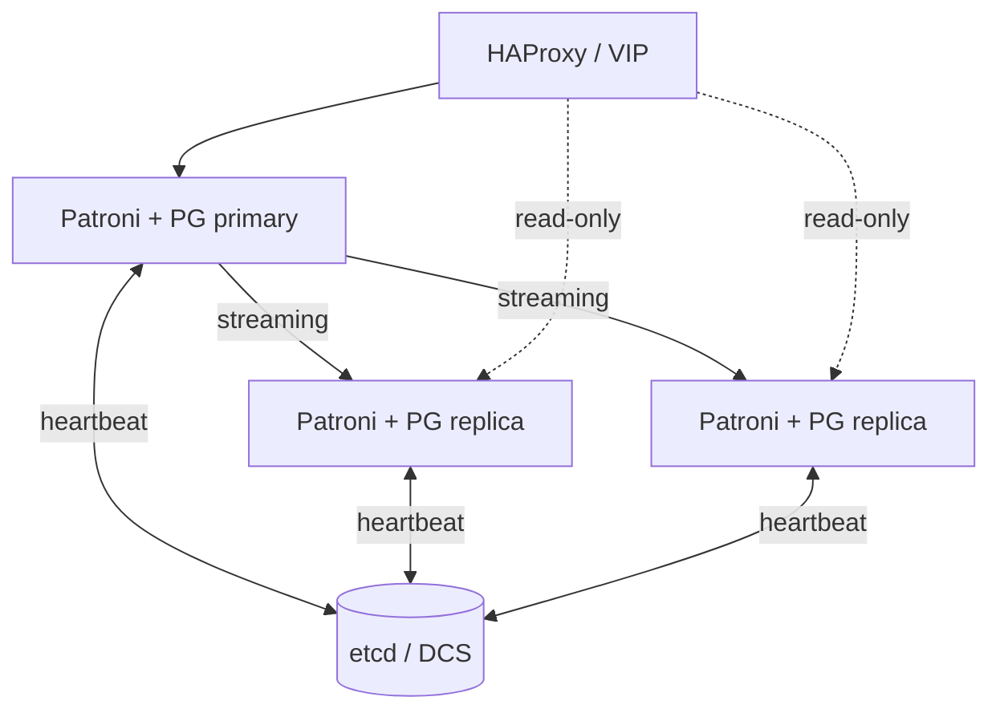
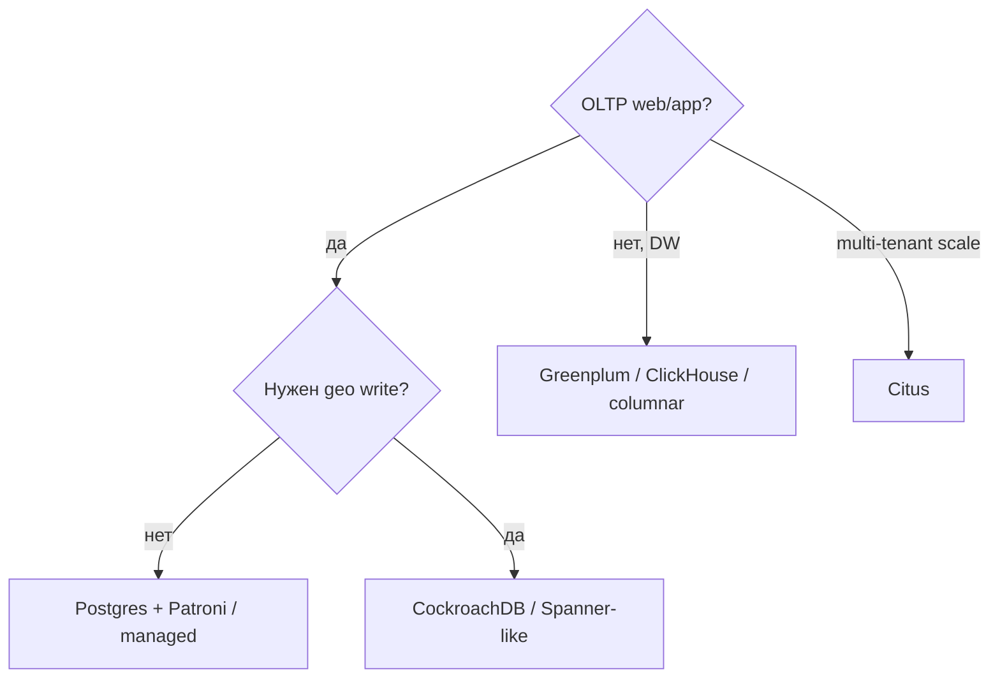

# HA-кластеры PostgreSQL и распределённые СУБД

<div class="article-tags">
  <span class="tag tag-required">ОБЯЗАТЕЛЬНО</span>
</div>

<span class="complexity-badge">Инженеру</span>

> **Раздел 8.11, шаг 9 из 12.** Дальше — [бэкапы](./10.md).

---

## Patroni — автоматический failover

**Patroni** — шаблон высокой доступности для PostgreSQL. Каждый узел запускает Postgres + Patroni agent. **Leader election** через distributed configuration store (DCS):

- **etcd** (типично в Kubernetes);
- Consul;
- ZooKeeper;
- Kubernetes API (native).



При падении primary Patroni:

1. обнаруживает timeout leader key;
2. выбирает наиболее актуальную replica;
3. выполняет `pg_promote`;
4. обновляет endpoint в DCS / HAProxy.

Spilo (образ Zalando) = PostgreSQL + Patroni + env bootstrap.

---

## Стек HA on-premise

| Компонент | Роль |
|-----------|------|
| 3+ узла Postgres + Patroni | Quorum, failover |
| etcd cluster | DCS |
| HAProxy / keepalived | Стабильный VIP для приложения |
| PgBouncer | Пулинг, optional |
| Wal-G / pgBackRest | Бэкапы ([шаг 10](./10.md)) |

Приложение подключается к **одному DNS/VIP**; Patroni REST API сообщает, кто primary.

---

## Greenplum — MPP-аналитика

**Greenplum** — форк PostgreSQL для **massively parallel processing** (MPP). Данные **распределены по сегментам** (sharding на уровне СУБД), запросы выполняются параллельно на всех segment nodes.

| Аспект | OLTP Postgres | Greenplum |
|--------|---------------|-----------|
| Модель | Один primary + replicas | Master + N segments |
| Нагрузка | Короткие транзакции | Тяжёлые аналитические scan |
| SQL | Стандарт Postgres + extensions | Похож, но не 100% совместим |
| Конкурентные UPDATE | Сильная сторона | Слабая сторона |

Greenplum выбирают для **DW / BI**, не для типичного web-backend.

---

## CockroachDB — распределённый SQL

**CockroachDB** реализует **distributed SQL** с **Raft** репликацией на каждый range данных. Совместимость с PostgreSQL wire protocol **частичная** — многие ORM работают, но не все функции Postgres.

| | PostgreSQL + Patroni | CockroachDB |
|--|---------------------|-------------|
| Архитектура | Single primary write | Multi-active nodes |
| CAP при partition | CP ( один primary ) | CP, geo-распределение |
| Миграция с Postgres | Native | Адаптация SQL, типов |
| Latency OLTP | Низкая локально | Выше из-за Raft |

CockroachDB уместен для **geo-redundant** write с единым SQL и готовностью платить latency/complexity.

---

## Citus — extension для sharding

**Citus** (Microsoft) — расширение PostgreSQL: **coordinator + worker nodes**, sharding по distribution column.

```sql
SELECT create_distributed_table('events', 'tenant_id');
```

Подходит для **multi-tenant SaaS** с ростом одной таблицы beyond одного сервера, сохраняя Postgres-экосистему.

---

## Когда что выбирать



| Задача | Рекомендация |
|--------|--------------|
| Обычный backend | Managed Postgres или Patroni 3-node |
| Read scale | Replicas + PgBouncer |
| Write scale одной таблицы | Citus, partitioning, или redesign |
| Petabyte analytics | Greenplum, BigQuery, Snowflake |
| Global active-active | CockroachDB, YugabyteDB |

---

## Greenplum vs «просто Postgres»

Не путайте **логическое партиционирование** Postgres ([шаг 4](./4.md)) с **MPP**. Партиции на одном узле не добавляют CPU других машин.

---

## Практика

1. Поднимите **Patroni** lab (docker-compose patroni + etcd), выполните `docker kill` primary, замерьте RTO failover.
2. Прочитайте release notes Citus для вашей версии Postgres.
3. Составьте таблицу «наши SLA → архитектура» для учебного проекта.

---

## Связанные материалы

- [Репликация](./6.md)
- [NoSQL и распределённость](/encyclopedia/3-data-markup/3-06-nosql/5.md)
- [Масштабирование](/encyclopedia/8-infra-security/8-05-mikroservisy-i-integratsiya/1)

---
