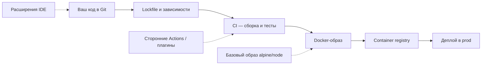
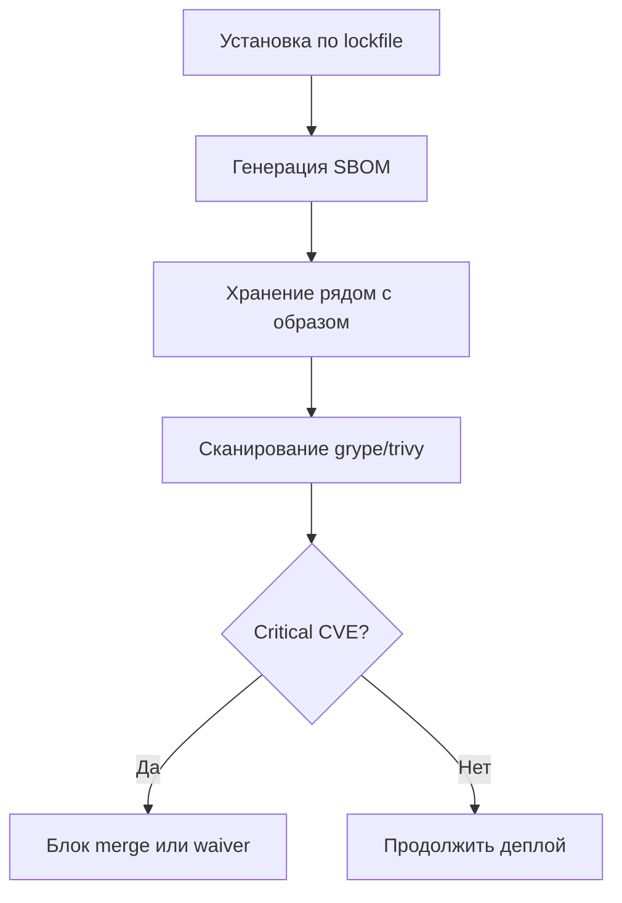
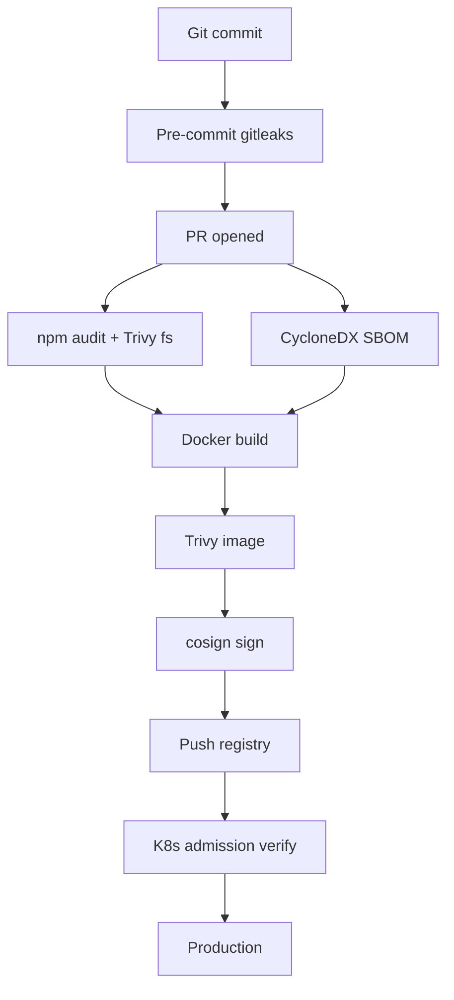

import ExternalPlayEmbed from '@site/src/components/ExternalPlayEmbed';

# Supply chain и SBOM

<div class="article-tags">
  <span class="tag tag-required">ОБЯЗАТЕЛЬНО</span>
</div>
<span class="complexity-badge">Разработчику</span>
<span class="complexity-badge">Инженеру</span>

<ExternalPlayEmbed example="infra-security/sbom-blast-radius-play" title="SBOM blast radius" minHeight={420} />
**Software supply chain** (цепочка поставок программного обеспечения) — все артефакты и процессы между вашим исходным кодом и **prod** (production, боевая среда), куда ходят пользователи. Сюда входят не только библиотеки, но и инструменты сборки, образы, плагины CI и даже расширения IDE.

Атакующие всё чаще компрометируют **чужую зависимость** или **пайплайн сборки**, обходя периметровый **firewall** (межсетевой экран). Ваш код может быть чистым, а prod — скомпрометирован из-за пакета `left-pad@1.0.0` или подменённого GitHub Action.

Подробнее о зависимостях — [раздел 4.09](/encyclopedia/4-code-dev/4-09-zavisimosti/intro), о манифестах — [4.04/103](/encyclopedia/4-code-dev/4-04-proekt-i-freymvorki/103). Встраивание контролей в CI — [DevSecOps](./3.md).

---

## Почему тема критична в 2025–2026

| Фактор | Что изменилось |
|--------|----------------|
| Объём зависимостей | Типичный npm-проект тянет сотни **транзитивных** пакетов (зависимостей зависимостей) |
| Скорость атак | **CVE** (Common Vulnerabilities and Exposures, каталог уязвимостей) публикуются быстрее, чем команды успевают патчить |
| Регуляторика | B2B и госсектор спрашивают про **SBOM** и происхождение компонентов |
| CI как цель | Утечка `GITHUB_TOKEN` даёт доступ к репозиторию и секретам |

Референсные инциденты:

- **Log4Shell (2021)** — уязвимость в Log4j затронула миллионы Java-приложений; без SBOM поиск занял недели.
- **SolarWinds (2020)** — компрометация цепочки обновлений ПО поставщика.
- **node-ipc / colors.js (2022)** — саботаж популярных npm-пакетов.
- **Codecov bash uploader (2021)** — утечка секретов CI через скрипт установки.
- **3CX (2023)** — заражение десктопного клиента через цепочку поставок.

---

## Из чего состоит цепочка



### Звенья и риски

| Звено | Риск | Пример инцидента |
|-------|------|------------------|
| **Прямая зависимость** | Устаревшая версия с CVE | `lodash` с prototype pollution |
| **Транзитивная зависимость** | Вы не знаете о пакете, пока не сканируете | уязвимость в `minimist` глубоко в дереве |
| **Typosquatting** | Пакет с именем, похожим на популярный | `crossenv` вместо `cross-env` |
| **Базовый образ** | Устаревший OpenSSL в теге `latest` | образ без pin по digest |
| **CI/CD** | Утечка токена, malicious action | подмена `uses: org/action@v1` |
| **Registry** | Pull без проверки подписи | подмена тега `:latest` |
| **Секреты в артефакте** | Ключ в слое Docker | `docker history` находит `ENV API_KEY` |
| **Скрипты установки** | `curl \| bash` из непроверенного URL | [8.03/101](/encyclopedia/8-infra-security/8-03-zabota-o-kode-i-dannyh/101) |

Контейнеры и registry — [8.06](/encyclopedia/8-infra-security/8-06-konteynerizatsiya-i-orkestratsiya/intro), безопасность Docker — [8.07/125](/encyclopedia/8-infra-security/8-07-informatsionnaya-bezopasnost/125).

---

## SBOM — "составная" приложения

**SBOM** (Software Bill of Materials, программная ведомость материалов) — машиночитаемый список всех компонентов, версий, лицензий и связей в сборке. Аналогия — этикетка на продукте в магазине: вы видите каждый ингредиент.

### Форматы

| Формат | Кто использует | Ссылка |
|--------|----------------|--------|
| **SPDX** (Software Package Data Exchange) | Linux Foundation, enterprise | [spdx.dev](https://spdx.dev/) |
| **CycloneDX** | OWASP, security tooling | [cyclonedx.org](https://cyclonedx.org/) |

Оба формата принимают аудиторы; CycloneDX чаще интегрируется с сканерами уязвимостей.

### Зачем SBOM команде

- Быстрый ответ на вопрос "есть ли у нас Log4j 2.14.1?"
- Аудит и контракты (B2B, госсектор, **PCI DSS** — стандарт платёжных карт)
- Привязка CVE к конкретному образу в registry
- Доказательство due diligence при инциденте

### Типичный пайплайн SBOM



**Пошагово:**

1. `npm ci` / `pip install -r requirements.txt` / `go mod download` — строго по lockfile.
2. Генерация SBOM (`syft`, `trivy sbom`, `cyclonedx-npm`, `cyclonedx-py`).
3. Сохранение SBOM в артефакте CI и в registry (рядом с образом).
4. Сканирование (`grype`, `trivy image`) — fail при **critical** без **waiver** (формального исключения с ticket и сроком).

---

## Практикум — генерация SBOM локально

### Node.js проект

```bash
# Установка syft (универсальный генератор SBOM)
# Windows (scoop/chocolatey) или Linux — см. https://github.com/anchore/syft

npm ci
syft dir:. -o cyclonedx-json > sbom.json
```

**Ожидаемый результат:** файл `sbom.json` с полем `components` — список пакетов и версий.

### Docker-образ

```bash
docker build -t myapp:local .
syft myapp:local -o spdx-json > sbom-image.json
grype myapp:local --fail-on critical
```

**Ожидаемый результат:** отчёт CVE; exit code 1 при critical (если включён `--fail-on`).

### Troubleshooting

| Проблема | Причина | Решение |
|----------|---------|---------|
| Пустой SBOM | Сканируете каталог без `node_modules` | Сначала `npm ci` |
| Слишком много false positives | Сканер не знает ваш контекст | Triage в [DevSecOps](./3.md), waiver с обоснованием |
| Образ не найден | Локальный тег другой | `docker images`, проверьте имя |

---

## Lockfile и pin версий

### Правила для разработчика

- **Коммитьте** `package-lock.json`, `poetry.lock`, `go.sum`, `Gemfile.lock` — без исключений.
- Не удаляйте lockfile "чтобы CI прошёл" — это ломает воспроизводимость.
- Обновления — через PR от **Renovate** или **Dependabot**, с прогоном тестов.

### Docker — pin по digest

```dockerfile
# Плохо — тег latest меняется
FROM node:latest

# Хорошо — digest фиксирует содержимое слоя
FROM node:20.11-alpine@sha256:abcdef1234567890...
```

Узнать digest:

```bash
docker pull node:20.11-alpine
docker inspect node:20.11-alpine --format='{{index .RepoDigests 0}}'
```

---

## Сканирование в CI

| Инструмент | Что проверяет | Когда запускать |
|------------|---------------|-----------------|
| **Dependabot / Renovate** | известные CVE в deps | Постоянно, PR с обновлениями |
| **Trivy / Grype** | образы и файловая система | Каждый PR и main |
| **Semgrep / CodeQL** | опасные паттерны в коде (SAST) | Каждый PR |
| **gitleaks / trufflehog** | секреты в истории Git | Каждый PR, pre-commit |
| **npm audit / pip-audit** | уязвимости в экосистеме | CI после install |

### Минимальный фрагмент GitHub Actions

```yaml
name: supply-chain
on: [pull_request]
jobs:
  scan:
    runs-on: ubuntu-latest
    steps:
      - uses: actions/checkout@v4
      - run: npm ci
      - run: npx @cyclonedx/cyclonedx-npm --output-file sbom.json
      - uses: aquasecurity/trivy-action@master
        with:
          scan-type: fs
          scan-ref: .
          severity: HIGH,CRITICAL
          exit-code: 1
      - run: gitleaks detect --source . --no-git
```

Полные рецепты — [lab/Примеры/1134](/lab/Примеры/1134). Gates и waivers — [DevSecOps](./3.md).

**Минимальный gate для старта:** secret scan + dependency scan на каждый PR.

---

## Доверие к CI

CI — привилегированная среда: там есть секреты, доступ к registry и возможность писать в prod.

### Чек-лист hardening CI

- [ ] GitHub Actions закреплены по **commit SHA**, без `@main` и плавающих `@v1`
- [ ] Минимальные **permissions** для `GITHUB_TOKEN` (`contents: read` где возможно)
- [ ] Секреты только в protected branches и environment secrets
- [ ] **OIDC** (OpenID Connect) в облако вместо долгоживущих ключей — [OIDC для разработчика](./8.md)
- [ ] Fork PR не получают секреты без явного approval
- [ ] Self-hosted runners изолированы, если используются

### Pin Action по SHA — пример

```yaml
# Плохо
- uses: actions/checkout@v4

# Лучше — полный SHA коммита
- uses: actions/checkout@b4ffde65f46336ab88ebabbe1e6c7f8f3c8b2e0e # v4.1.1
```

Проверить SHA можно на странице тега в репозитории action.

---

## Подпись артефактов

| Технология | Что даёт |
|------------|----------|
| **Sigstore / cosign** | Криптографическая подпись Docker-образов |
| **SLSA** (Supply-chain Levels for Software Artifacts) | Уровни воспроизводимости и защиты сборки |
| **in-toto** | Метаданные шагов пайплайна |

В **Kubernetes** (K8s): **admission controller** (контроллер допуска) отклоняет неподписанные образы.

```bash
# Подпись образа cosign (упрощённо)
cosign sign --key cosign.key myregistry.io/myapp:v1.2.3
cosign verify --key cosign.pub myregistry.io/myapp:v1.2.3
```

На старте достаточно SBOM + сканирование; подпись добавляют при зрелости процессов.

---

## Typosquatting и социальная инженерия в registry

Атакующие публикуют пакеты с именами, похожими на популярные:

- `requets` вместо `requests` (Python)
- `crossenv` вместо `cross-env` (npm)

**Защита:**

- Копировать имя пакета из официальной документации, не из Stack Overflow без проверки
- Смотреть количество загрузок, возраст пакета, репозиторий автора
- В корпоративной среде — **private registry** с allowlist

---

## Роли в supply chain security

| Роль | Ответственность |
|------|-----------------|
| **Разработчик** | Lockfile, не коммитить секреты, реагировать на Dependabot PR |
| **DevOps** | CI gates, SBOM в пайплайне, pin образов |
| **AppSec** | Политики severity, triage, waivers |
| **Менеджмент** | SLA на critical CVE (например, 72 часа) |

---

## Чек-лист разработчика

1. Есть lockfile и он актуален?
2. Базовый образ с digest, без `latest`?
3. В CI есть scan deps + secrets?
4. Сторонние Actions закреплены по SHA?
5. SBOM генерируется хотя бы для prod-образов?
6. Есть процесс ответа на новый critical CVE в зависимости?
7. Секреты не попадают в `docker history` и артефакты сборки?

---

## Чек-лист инженера (расширенный)

1. Registry с аутентификацией и сканированием при push
2. Политика: prod тянет только образы из trusted registry
3. Renovate/Dependabot включены на все репозитории
4. Документированный waiver process с owner и expiry date
5. Учебная тревога — "как за 1 час найти все вхождения пакета X" по SBOM

---

## Метрики

| Метрика | Зачем |
|---------|-------|
| **MTTR** (Mean Time To Repair) для critical CVE в deps | Скорость реакции |
| % PR с зелёным security gate с первого раза | Качество процесса |
| Количество секретов в истории Git (тренд → 0) | Культура |
| Возраст самой старой critical без waiver | Риск |

---

## Антипаттерны

1. **Сканировать только main** — уязвимости дороже исправлять после merge.
2. **Игнорировать devDependencies** — они попадают в CI и иногда в образ.
3. **`npm install` без lockfile в CI** — недетерминированная сборка.
4. **1000 alerts без triage** — команда отключает сканер.
5. **SBOM ради галочки** — файл генерируется, но никто не умеет им пользоваться при инциденте.

---

## Реагирование на компрометацию зависимости — playbook

Когда выходит critical CVE (например, в `openssl`, `log4j`, `spring-framework`), команда действует по часам:

| Время | Действие | Ответственный |
|-------|----------|---------------|
| 0–1 ч | Поиск вхождений по SBOM / `npm ls` / `trivy` | DevOps + разработчики |
| 1–4 ч | Оценка эксплуатируемости в вашем контексте | AppSec |
| 4–24 ч | Патч или компенсирующая мера (WAF rule) | Разработка |
| 24–72 ч | Деплой исправления на prod | DevOps |
| После | Post-mortem, обновление политики waivers | Все |

```bash
# Быстрый поиск пакета в Node-проекте
npm ls vulnerable-package-name --all

# Сканирование образа перед экстренным патчем
trivy image --severity CRITICAL myregistry.io/myapp:current
```

Если патча нет — документируйте **risk acceptance** с датой пересмотра. См. [DevSecOps](./3.md).

---

## Private registry и прокси — для корпоративной среды

| Решение | Назначение |
|---------|------------|
| **Nexus / Artifactory** | Кэш npm, Maven, Docker; allowlist пакетов |
| **npm proxy** | Единая точка для всех разработчиков |
| **Harbor** | Registry с сканированием и подписью |

Поток: разработчик → корпоративный proxy → проверенный upstream. Новый пакет без approval не попадает в prod-сборки.

---

## Уязвимости в CI-плагинах — кейс Codecov 2021

Скомпрометированный bash-скрипт установки **Codecov** мог читать переменные окружения CI, включая секреты. Уроки:

- не запускать `curl | bash` без проверки хеша и источника;
- минимизировать секреты в env runner'а;
- pin версий скриптов установки.

См. [опасные скрипты](/encyclopedia/8-infra-security/8-03-zabota-o-kode-i-dannyh/101), [OWASP CI/CD Security Cheat Sheet](https://cheatsheetseries.owasp.org/cheatsheets/CI_CD_Security_Cheat_Sheet.html).

---

## SLSA уровни — что означают

**SLSA** (Supply-chain Levels for Software Artifacts) — градация зрелости сборки:

| Уровень | Суть |
|---------|------|
| **L1** | Документированный процесс сборки |
| **L2** | Hosted build, signed provenance |
| **L3** | Hardened build platform |
| **L4** | Hermetic, reproducible builds |

Большинство pet-проектов — L0–L1. Цель enterprise — L3+ с cosign и изолированными runners.

---

## Лицензии в supply chain

SBOM содержит не только CVE, но и **лицензии** (MIT, GPL, AGPL). Несовместимость лицензий — юридический риск при распространении продукта.

Инструменты: `license-checker` (npm), FOSSA, Scancode. При AGPL в зависимостях — консультация с юристом перед SaaS-релизом.

---

## Практикум — полный pipeline supply chain (чек-лист)

### Подготовка репозитория

```bash
git init myapp && cd myapp
npm init -y
npm install express
# package-lock.json должен появиться — закоммитьте его
```

### Dockerfile с digest

```dockerfile
FROM node:20.11-alpine@sha256:YOUR_DIGEST_HERE
WORKDIR /app
COPY package-lock.json package.json ./
RUN npm ci --omit=dev
COPY . .
USER node
CMD ["node", "server.js"]
```

### GitHub Actions — полный job

```yaml
name: supply-chain-full
on: [pull_request]
permissions:
  contents: read
  security-events: write
jobs:
  build-scan:
    runs-on: ubuntu-latest
    steps:
      - uses: actions/checkout@v4
      - run: npm ci
      - run: npx @cyclonedx/cyclonedx-npm -o sbom.json
      - uses: aquasecurity/trivy-action@master
        with:
          scan-type: fs
          format: sarif
          output: trivy.sarif
          severity: HIGH,CRITICAL
          exit-code: 1
      - run: gitleaks detect --source . --verbose
      - run: docker build -t myapp:${{ github.sha }} .
      - run: trivy image --exit-code 1 --severity CRITICAL myapp:${{ github.sha }}
```

**Ожидаемый результат на чистом проекте:** все шаги зелёные, артефакты `sbom.json` и отчёт Trivy сохранены в CI.

---

## Интеграция с Kubernetes admission

Пример политики **Kyverno** — только образы из trusted registry:

```yaml
apiVersion: kyverno.io/v1
kind: ClusterPolicy
metadata:
  name: restrict-image-registries
spec:
  validationFailureAction: enforce
  rules:
    - name: validate-registries
      match:
        any:
          - resources:
              kinds: [Pod]
      validate:
        message: "Недоверенный registry образа"
        pattern:
          spec:
            containers:
              - image: "myregistry.io/* | ghcr.io/myorg/*"
```

Связь с [GitOps](./4.md) и [8.06 K8s](/encyclopedia/8-infra-security/8-06-konteynerizatsiya-i-orkestratsiya/117).

---

## Вопросы для самопроверки

1. Назовите пять звеньев supply chain от Git до prod.
2. Чем **SPDX** отличается от **CycloneDX** по сравнению с практикой использования?
3. Зачем pin Docker-образа по digest?
4. Что делать при critical CVE в транзитивной зависимости без патча?
5. Почему `curl | bash` в CI опасен?

Ответы — в разделах выше. Закрепление — [DevSecOps](./3.md), [чек-лист 8.12](./999.md).

---

## История атак на registry и пакеты — хронология

| Год | Инцидент | Урок |
|-----|----------|------|
| 2016 | `left-pad` удалён из npm | Pin lockfile, зеркало |
| 2018 | `event-stream` backdoor | Мaintainer fatigue, аудит transfer |
| 2020 | SolarWinds | Подпись и provenance |
| 2021 | Codecov bash uploader | CI secrets hygiene |
| 2022 | `node-ipc` protestware | Pin версий, review updates |
| 2023 | PyPI malware waves | 2FA на maintainer, scan |

Каждый кейс — аргумент для SBOM и автоматических gates, а не для отказа от open source.

---

## Кейс xz-utils (2024) — backdoor в транзитивной цепочке

**Суть.** Злоумышленник годами завоевывал доверие maintainer'а **xz-utils**, внедрил backdoor в liblzma. Пакет попадал в OpenSSH на Linux через цепочку сборки дистрибутивов.

**Уроки для команды:**

- Транзитивные зависимости на уровне **системных библиотек** тоже в scope supply chain.
- Мониторинг аномалий в поведении (latency SSH) дополняет CVE-сканирование.
- SBOM на уровне **образа ОС** и application deps.

**Действия:**

1. Сканировать базовые образы (`trivy image` на `FROM debian:...`).
2. Pin digest базового слоя и пересборка при security advisory дистрибутива.
3. Подпись образов cosign — см. раздел "Подпись артефактов".

---

## Кейс подмены GitHub Action (2024–2025)

**Суть.** Компрометация популярного Action или typosquatting имени `uses: vendor/action@v1` — malicious код в runner с доступом к `GITHUB_TOKEN`.

**Защита:**

```yaml
# .github/workflows/hardened-ci.yml
name: hardened-supply-chain
on: [pull_request]
permissions:
  contents: read
  packages: write
jobs:
  build:
    runs-on: ubuntu-latest
    steps:
      - uses: actions/checkout@b4ffde65f46336ab88ebabbe1e6c7f8f3c8b2e0e
      - name: Allowlist actions only
        run: |
          grep -r "uses:" .github/workflows/ | grep -vE "actions/checkout|aquasecurity/trivy-action" && exit 1 || true
      - run: npm ci
      - run: npm audit --audit-level=high
```

Дополнительно — [GitHub Actions allowlist](https://docs.github.com/en/actions/security-for-github-actions/using-github-actions/using-github-actions-in-your-enterprise/enterprise-policies-for-github-actions), org-level pin policies.

---

## Кейс PyPI malware (2023–2024)

**Суть.** Волны вредоносных пакетов с typosquatting имён (`requets`, `python-dateutil` с опечаткой). Maintainer account takeover после фишинга.

**Защита для Python-команд:**

```bash
pip install pip-audit
pip-audit -r requirements.txt --desc on

# Генерация SBOM
cyclonedx-py environment -o sbom-python.json
```

```yaml
# GitHub Actions — Python supply chain
name: python-supply-chain
on: [pull_request]
jobs:
  scan:
    runs-on: ubuntu-latest
    steps:
      - uses: actions/checkout@v4
      - uses: actions/setup-python@v5
        with:
          python-version: "3.12"
      - run: pip install -r requirements.txt
      - run: pip install pip-audit && pip-audit -r requirements.txt
      - run: pip install cyclonedx-bom && cyclonedx-py environment -o sbom.json
      - uses: aquasecurity/trivy-action@master
        with:
          scan-type: fs
          scan-ref: .
          severity: HIGH,CRITICAL
          exit-code: 1
```

Lockfile — `requirements.txt` с hashes (`pip-compile`) или `poetry.lock`. См. [4.09 зависимости](/encyclopedia/4-code-dev/4-09-zavisimosti/intro).

---

## Renovate — автоматизация обновлений deps

**Renovate** — бот, открывающий PR с обновлениями зависимостей по расписанию. Альтернатива Dependabot с гибкой конфигурацией.

```json
{
  "$schema": "https://docs.renovatebot.com/renovate-schema.json",
  "extends": ["config:recommended"],
  "packageRules": [
    {
      "matchUpdateTypes": ["patch", "pin"],
      "automerge": true,
      "automergeType": "pr"
    },
    {
      "matchManagers": ["npm"],
      "matchDepTypes": ["devDependencies"],
      "groupName": "devDependencies"
    }
  ],
  "vulnerabilityAlerts": {
    "enabled": true,
    "labels": ["security"]
  }
}
```

Файл — `renovate.json` в корне репозитория. PR с label `security` — приоритет merge в SLA 72 часа для critical.

---

## GitLab CI — supply chain pipeline

```yaml
# .gitlab-ci.yml
stages:
  - test
  - scan
  - build

variables:
  TRIVY_NO_PROGRESS: "true"

test:
  stage: test
  script:
    - npm ci
    - npm test

secret-scan:
  stage: scan
  image:
    name: zricethezav/gitleaks:latest
    entrypoint: [""]
  script:
    - gitleaks detect --source . --verbose

dependency-scan:
  stage: scan
  script:
    - npm ci
    - npm audit --audit-level=high
    - npx @cyclonedx/cyclonedx-npm -o sbom.json
  artifacts:
    paths:
      - sbom.json

container-scan:
  stage: build
  script:
    - docker build -t $CI_REGISTRY_IMAGE:$CI_COMMIT_SHA .
    - trivy image --exit-code 1 --severity CRITICAL $CI_REGISTRY_IMAGE:$CI_COMMIT_SHA
```

См. [8.04 DevOps](/encyclopedia/8-infra-security/8-04-devops-ci-cd/intro) для сравнения GitHub Actions и GitLab CI.

---

## Расширенный глоссарий supply chain

| Термин | Определение |
|--------|-------------|
| **Provenance** | Метаданные о том, кто, когда и как собрал артефакт |
| **Attestation** | Подписанное утверждение о provenance (Sigstore, in-toto) |
| **Transitive dependency** | Зависимость вашей зависимости — часто сотни уровней |
| **Direct dependency** | Пакет, указанный явно в package.json / requirements |
| **Typosquatting** | Пакет с именем, похожим на популярный, для обмана |
| **Protestware** | Легитимный пакет, намеренно сломан автором (node-ipc) |
| **Maintainer fatigue** | Выгорание maintainer'а — риск передачи прав злоумышленнику |
| **Allowlist** | Список разрешённых пакетов или registry |
| **Waiver** | Формальное исключение из gate с ticket и expiry |
| **Digest** | SHA256 идентификатор содержимого Docker-слоя |
| **Admission controller** | Компонент K8s, проверяющий Pod перед запуском |
| **Hermetic build** | Сборка без сетевого доступа — SLSA L4 |

---

## Что делать если — troubleshooting supply chain

### npm audit показывает 200 уязвимостей после `npm ci`

1. Разделите direct и transitive — `npm audit --json | jq`.
2. Обновите direct deps через Renovate PR.
3. Для transitive без патча — waiver + оценка эксплуатируемости (dev-only часто lower risk).
4. Не отключайте audit — настройте `--audit-level=high` для gate.

### Trivy находит CVE в базовом образе alpine

1. `docker pull alpine:3.19 && trivy image alpine:3.19` — сравните версии.
2. Обновите `FROM` с новым digest.
3. Если CVE в пакете, который вы не используете — документируйте waiver с обоснованием.

### Dependabot PR ломает тесты

1. Не мержите вслепую — CI должен быть зелёным.
2. Major update — отдельный PR, review changelog breaking changes.
3. Группируйте patch через Renovate `groupName`.

### SBOM на 50 MB, CI падает по timeout

1. Генерируйте SBOM только для prod-образа, не для monorepo целиком на каждый PR.
2. Кэшируйте `node_modules` между job'ами.
3. Используйте `syft packages` вместо полного dir scan где достаточно.

### cosign verify failed в prod

1. Проверьте, что образ подписан тем же ключом, что в K8s policy.
2. Rotation ключей — dual-sign период, обновление public key в cluster.
3. См. [Sigstore docs](https://docs.sigstore.dev/).

### Fork PR пытается украсть секреты через malicious workflow

1. GitHub — "Require approval for first-time contributors".
2. Не давайте secrets fork PR без manual approval.
3. Pin Actions по SHA — раздел "Доверие к CI".

---

## Maven и Java — supply chain кратко

```xml
<!-- pom.xml — OWASP Dependency-Check plugin -->
<plugin>
  <groupId>org.owasp</groupId>
  <artifactId>dependency-check-maven</artifactId>
  <version>10.0.3</version>
  <executions>
    <execution>
      <goals><goal>check</goal></goals>
    </execution>
  </executions>
</plugin>
```

```bash
mvn org.cyclonedx:cyclonedx-maven-plugin:makeAggregateBom
# target/bom.json
```

Log4Shell — напоминание pin версии `log4j-core` и SBOM для всех Java-сервисов.

---

## Матрица инструментов — когда что включать

| Зрелость | Secret scan | SCA / SBOM | SAST | Подпись | Admission K8s |
|----------|-------------|------------|------|---------|---------------|
| Старт | gitleaks | npm audit | — | — | — |
| Базовая | pre-commit | Trivy + CycloneDX | Semgrep p/ci | — | — |
| Зрелая | + history scan | SBOM в registry | CodeQL | cosign | Kyverno |
| Enterprise | org policy | FOSSA + waiver DB | custom rules | SLSA L3 | OPA Gatekeeper |



---

## Расширенный FAQ

### "Нужен ли SBOM для внутреннего pet-проекта?"

Для обучения — да, один раз сгенерировать и посмотреть `components`. Для prod B2B — часто контрактное требование.

### "Dependabot или Renovate?"

Оба работают. Dependabot — zero config на GitHub. Renovate — гибче для monorepo и automerge rules.

### "Сканировать devDependencies?"

Да в CI — они выполняются на runner и могут содержать malware. В prod-образ — `npm ci --omit=dev`.

### "Как часто пересматривать waivers?"

Expiry 30–90 дней. Weekly review открытых waivers с AppSec.

### "Достаточно ли npm audit?"

Как минимум. Дополните Trivy/grype — npm audit не покрывает все транзитивные CVE и образы.

### "Что такое provenance в GitHub Actions?"

Attestation о workflow run — кто собрал артефакт. SLSA L2+. См. [GitHub artifact attestations](https://docs.github.com/en/actions/security-for-github-actions/using-artifact-attestations).

---

## Интеграция SBOM с Jira при CVE

При выходе critical CVE автоматический скрипт:

```bash
#!/bin/bash
# find-affected.sh PACKAGE_NAME
PKG=$1
find . -name "sbom.json" -exec jq -r --arg p "$PKG" \
  '.components[] | select(.name==$p) | .version' {} \;
```

Результат — ticket на каждый сервис с версией. MTTR измеряйте от публикации CVE до deploy патча.

---

## Связанные материалы

- [DevSecOps](./3.md) — встраивание в пайплайн
- [Secure SDLC](./10.md) — процесс на уровне команды
- [Безопасность в Docker](/encyclopedia/8-infra-security/8-07-informatsionnaya-bezopasnost/125)
- [Опасные скрипты](/encyclopedia/8-infra-security/8-03-zabota-o-kode-i-dannyh/101)
- [Основы работы с Git](/encyclopedia/4-code-dev/4-13-osnovy-raboty-s-git/intro)
- OWASP [Software Component Verification Standard](https://owasp.org/www-project-software-component-verification-standard/)
- OWASP [Dependency-Check](https://owasp.org/www-project-dependency-check/)
- [SLSA framework](https://slsa.dev/)

---
