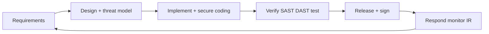
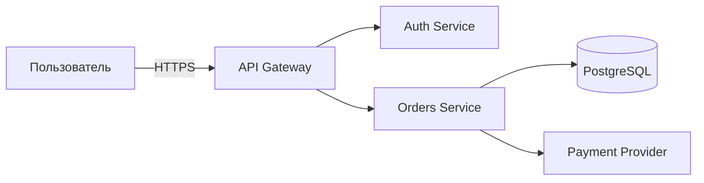
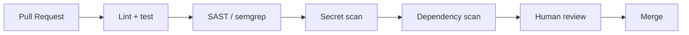
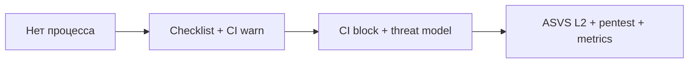
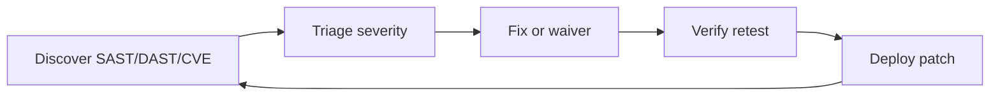

# Secure SDLC — маршрут для команды

<div class="article-tags">
  <span class="tag tag-required">ОБЯЗАТЕЛЬНО</span>
</div>

<span class="complexity-badge">Разработчику</span>
<span class="complexity-badge">Тестировщику</span>
<span class="complexity-badge">Инженеру</span>

**Secure SDLC** (Secure Software Development Life Cycle) — подход, при котором безопасность встроена в **каждый этап** создания ПО: от идеи фичи до вывода из эксплуатации. Безопасность здесь — **непрерывный процесс** на протяжении всего цикла, включая design, coding, testing и эксплуатацию.

Большинство уязвимостей дешевле исправить на этапе проектирования, чем после инцидента. Secure SDLC даёт команде из 5–15 человек практический маршрут, который можно внедрить **за один спринт** без отдельного отдела AppSec.

Теория STRIDE и threat modeling — в [8.07/1132](/encyclopedia/8-infra-security/8-07-informatsionnaya-bezopasnost/1132). Здесь — пошаговый план действий.

---

## Этапы жизненного цикла



| Этап | Вопрос безопасности | Артефакт |
|------|---------------------|----------|
| **Requirements** | Какие данные обрабатываем? Какие регуляторные требования? | Security user stories |
| **Design** | Где границы доверия? Какие угрозы? | Threat model, diagram |
| **Implement** | Следуем ли secure coding guidelines? | Code + review checklist |
| **Verify** | Находим ли уязвимости до prod? | SAST/DAST reports, test cases |
| **Release** | Подписан ли артефакт? Нет ли critical CVE? | SBOM, signed image |
| **Respond** | Как узнаем об инциденте? Кто реагирует? | Runbook, on-call |

---

## Спринт внедрения (2 недели)

План рассчитан на команду, которая ещё не имеет формального Secure SDLC. Каждый день — конкретное действие с измеримым результатом.

### Неделя 1 — процесс и люди

| День | Действие | Артефакт | Время |
|------|----------|----------|-------|
| 1 | Workshop: OWASP Top 10 для вашего стека | 1-pager cheatsheet на Confluence/Notion | 2 часа |
| 2 | Threat model **одной** критичной фичи (STRIDE) | Диаграмма + таблица угроз | 3 часа |
| 3 | Включить secret scan + dependency scan в CI | PR template с checkbox | 2 часа |
| 4 | Назначить security champions (1 dev + 1 QA) | RACI-матрица | 1 час |
| 5 | Чек-лист code review (auth, input, logs) | Секция в CONTRIBUTING.md | 2 часа |

#### День 1 — Workshop OWASP Top 10

Соберите команду и разберите [OWASP Top 10](https://owasp.org/www-project-top-ten/) на примерах **вашего** стека:

- Broken Access Control — есть ли IDOR в ваших endpoint?
- Cryptographic Failures — где хранятся пароли, какой TLS?
- Injection — ORM или raw SQL?
- Insecure Design — threat model есть?
- Security Misconfiguration — открыты ли debug endpoint в prod?
- Vulnerable Components — кто обновляет зависимости?
- Authentication Failures — OAuth, MFA, session management
- Software and Data Integrity — подпись артефактов, CI/CD
- Logging Failures — логируете ли failed login?
- SSRF — есть ли исходящие HTTP из backend?

Результат — одностраничная шпаргалка "Top 10 → наши риски → что делаем".

#### День 2 — Threat model одной фичи

Выберите фичу с PII или деньгами (оплата, экспорт данных, admin panel). Нарисуйте DFD (Data Flow Diagram):



Для каждого элемента и потока примените **STRIDE**:

| Угроза | STRIDE | Пример | Митигация |
|--------|--------|--------|-----------|
| Подмена user_id в URL | Tampering | IDOR на `/orders/123` | AuthZ check owner |
| Утечка чужих заказов | Information Disclosure | Нет проверки owner | Тест + code review |
| Brute force login | Denial of Service | 1000 req/s на /login | Rate limit |

Подробнее — [8.07/1132](/encyclopedia/8-infra-security/8-07-informatsionnaya-bezopasnost/1132).

#### День 3 — CI scans

Минимальный набор в pipeline:

| Инструмент | Что ищет | Интеграция |
|------------|----------|------------|
| **gitleaks** / **trufflehog** | Секреты в git diff | GitHub Actions, GitLab CI |
| **npm audit** / **pip-audit** / **trivy** | CVE в зависимостях | На каждый PR |
| **hadolint** | Плохие практики в Dockerfile | При изменении Dockerfile |

Начните с **warning**, через 2 спринта переключите critical на **block merge**.

#### День 4 — Security champions

**Security champion** — разработчик или QA с **дополнительной** ответственностью за безопасность (без выделенной full-time роли security engineer):

- Первый review security-аспектов в PR
- Координация с DevOps по CI gates
- Эскалация находок pentest

RACI-пример:

| Активность | Dev | QA champion | DevOps | Product |
|------------|-----|-------------|--------|---------|
| Threat model | R | C | I | I |
| SAST tuning | C | I | R | I |
| Pentest triage | C | R | I | A |
| Patch SLA | C | I | R | A |

R = Responsible, A = Accountable, C = Consulted, I = Informed.

#### День 5 — Code review checklist

Добавьте в CONTRIBUTING.md:

- Новый endpoint — есть AuthZ?
- User input — валидация и parameterization?
- Секреты — не в коде?
- Логи — нет PII и паролей?
- Ошибки — не раскрывают stack trace в prod?

### Неделя 2 — automation и операции

| День | Действие | Артефакт |
|------|----------|----------|
| 1 | [DevSecOps](./3.md) gates — block critical CVE | CI config |
| 2 | [SBOM](./1.md) для prod-образа | SPDX/CycloneDX файл в артефактах |
| 3 | Staging DAST (OWASP ZAP baseline) | Отчёт в CI |
| 4 | Runbook "security incident" (1 страница) | Confluence / repo docs |
| 5 | Retro + опционально [фишинг-учение](./11.md) | Метрики, action items |

#### День 1 — DevSecOps gates

- Critical/High CVE в зависимостях → block PR (с waiver process)
- Secret в diff → block PR
- Dockerfile без non-root user → warning → block через месяц

#### День 2 — SBOM

**SBOM** (Software Bill of Materials) — машиночитаемый список всех компонентов в артефакте. Нужен для:

- Быстрого ответа на CVE (Log4Shell — есть ли в prod?)
- Compliance и аудитов
- Supply chain transparency

Генерация: `syft`, `trivy sbom`, `cyclonedx-cli`. Храните SBOM рядом с каждым prod-образом.

#### День 3 — DAST baseline

**DAST** (Dynamic Application Security Testing) — сканирование работающего приложения. OWASP ZAP baseline scan против staging:

```bash
docker run -t owasp/zap2docker-stable zap-baseline.py \
  -t https://staging.myapp.com \
  -r zap-report.html
```

Начните с informational, фиксируйте High. Не заменяет pentest, но ловит очевидные misconfiguration.

#### День 4 — Incident runbook

Одна страница:

1. Как сообщить (security@, Slack #incidents)
2. Кто incident commander (ротация)
3. Шаги: contain → assess → notify → fix → post-mortem
4. Контакты: legal, PR, hosting provider
5. Шаблон post-mortem (blameless)

#### День 5 — Retro

Что сработало, что нет. Запланируйте повтор threat model для следующей фичи. Опционально — учебный фишинг для проверки human layer.

---

## OWASP ASVS как чек-лист

**ASVS** (Application Security Verification Standard) — структурированный стандарт проверки безопасности приложений. Три уровня:

| Уровень | Для кого | Примеры требований |
|---------|----------|-------------------|
| **L1** | Большинство приложений | Baseline security |
| **L2** | B2B SaaS, PII | Строгая AuthN/AuthZ |
| **L3** | Банкинг, health, critical infra | High assurance |

Для типичного B2B SaaS начните с **L1**, постепенно закрывайте L2.

### Ключевые главы ASVS для старта

| Глава | Тема | Ссылка в энциклопедии |
|-------|------|----------------------|
| V2 | Authentication | [OAuth/Passkeys](./8.md), [116](/encyclopedia/8-infra-security/8-07-informatsionnaya-bezopasnost/116) |
| V4 | Access control | No IDOR — [128](/encyclopedia/8-infra-security/8-07-informatsionnaya-bezopasnost/128) |
| V5 | Validation | [Инъекции](/encyclopedia/8-infra-security/8-07-informatsionnaya-bezopasnost/123) |
| V7 | Cryptography | TLS, hashing — [115](/encyclopedia/8-infra-security/8-07-informatsionnaya-bezopasnost/115) |
| V13 | API security | [132](/encyclopedia/2-system-network/2-09-osnovy-integratsionnogo-vzaimodeystviya/132) |
| V14 | Configuration | Secure defaults, no debug in prod |

Пример требования V4.1.3: "Приложение enforces access control на trusted service layer, не только на клиенте".

[OWASP ASVS](https://owasp.org/www-project-application-security-verification-standard/)

---

## Gates в pull request

### PR template

```markdown
## Security
- [ ] No secrets in diff (CI gitleaks green)
- [ ] User input validated / parameterized queries
- [ ] AuthZ checked for new endpoints
- [ ] Threat model updated (if architecture changed)
- [ ] Dependencies scanned (no unapproved critical CVE)
```

### CI gates (автоматические)



| Gate | Block или warn | Waiver |
|------|----------------|--------|
| Secret in diff | Block | Нет |
| Critical CVE | Block | Да, с expiry date и risk acceptance |
| High CVE | Warn → Block через месяц | Да |
| SAST High | Warn | Да, false positive |

### Release gate

Перед prod deploy:

- Critical CVE = 0 или approved waiver с датой истечения
- SBOM сгенерирован и сохранён
- DAST staging — нет новых High
- Pentest или bug bounty triage для major release (опционально) — [8.09](/encyclopedia/8-infra-security/8-09-belyy-haking-i-bug-bounty/intro)
- Threat model актуален для изменённой архитектуры

---

## Secure coding — ключевые правила

| Категория | Правило | Пример нарушения |
|-----------|---------|------------------|
| Input | Валидируйте всё от пользователя | SQL injection через `?id=` |
| Output | Экранируйте при выводе в HTML | XSS в comment field |
| Auth | Проверяйте на каждом endpoint | Forgotten AuthZ на DELETE |
| Secrets | Только env / Vault | API key в git |
| Crypto | bcrypt/argon2 для паролей | MD5 password hash |
| Errors | Generic message в prod | Stack trace в 500 response |
| Logs | Без паролей и полных PAN | `log.info(password)` |

Языковые гайды: [OWASP Cheat Sheet Series](https://cheatsheetseries.owasp.org/).

---

## Роли и ответственность

| Secure SDLC activity | Owner | Backup |
|----------------------|-------|--------|
| Threat model | Dev + architect | Security champion |
| SAST/DAST tuning | DevOps + security champion | Dev lead |
| Pentest coordination | Security champion / external | CTO |
| Patch SLA (critical CVE) | Product + infra | 48h target |
| User report channel | security@ / HackerOne | On-call rotation |
| Security training | HR + security champion | External vendor |
| Incident response | On-call engineer | Incident commander |

---

## Инструменты по этапам

| Этап | Open source | Commercial |
|------|-------------|------------|
| Secret scan | gitleaks, trufflehog | GitGuardian |
| SAST | semgrep, bandit, gosec | SonarQube, Checkmarx |
| Dependency | trivy, dependabot, socket | Snyk |
| DAST | OWASP ZAP | Burp Suite Enterprise |
| Container | trivy, grype | Aqua |
| Pentest | — | Cobalt, HackerOne |
| Threat model | OWASP Threat Dragon | IriusRisk |

Не обязательно внедрять всё сразу. Минимум: gitleaks + trivy + semgrep + ZAP baseline.

---

## Метрики зрелости

Отслеживайте прогресс ежемесячно:

| Метрика | Цель | Как измерять |
|---------|------|--------------|
| % PR с security checklist | > 90% | PR template analytics |
| Mean time to patch critical CVE | < 48h | Ticket timestamps |
| Secrets found in CI | → 0 | gitleaks count per month |
| Repeat findings in pentest | Снижение YoY | Pentest report comparison |
| DAST High findings open | < 5 | ZAP report |
| Threat models для critical features | 100% | Confluence inventory |
| Security training completion | 100% team/year | LMS |



---

## Связь с DevSecOps и Supply Chain

Secure SDLC — **процесс и люди**. DevSecOps — **автоматизация** этого процесса в CI/CD.

| Secure SDLC | DevSecOps |
|-------------|-----------|
| Threat model на design | SAST в PR |
| Code review checklist | Automated policy gates |
| Pentest перед major release | Container scan в pipeline |
| Security training | SBOM generation |

Подробнее — [DevSecOps](./3.md), [Supply chain и SBOM](./1.md).

---

## Pentest в жизненном цикле

| Когда | Тип | Кто |
|-------|-----|-----|
| Перед launch MVP | Lightweight review | Internal / freelancer |
| Major release (раз в год) | Full pentest | External firm — [8.10](/encyclopedia/8-infra-security/8-10-testirovanie-na-proniknovenie/intro) |
| После инцидента | Targeted retest | External |
| Continuous | Bug bounty | [8.09](/encyclopedia/8-infra-security/8-09-belyy-haking-i-bug-bounty/intro) |

Результаты pentest → backlog с приоритетом → verification retest.

---

## Обучение команды

| Формат | Частота | Содержание |
|--------|---------|------------|
| OWASP Top 10 workshop | При onboarding + ежегодно | Актуальные угрозы |
| Secure coding lab | 1 раз в квартал | SQLi, XSS hands-on |
| Threat modeling session | На каждую major feature | STRIDE practice |
| Фишинг simulation | 2 раза в год | [Учебный фишинг](./11.md) |
| Post-mortem review | После инцидента | Blameless learning |

15 минут security tip на каждом sprint planning — хорошая привычка.

---

## Threat modeling — углубление

### Когда обновлять threat model

| Событие | Действие |
|---------|----------|
| Новая фича с PII/платежами | Threat model до coding |
| Новый внешний интегратор | DFD + trust boundary |
| Смена auth (OAuth, passkeys) | Пересмотр V2 ASVS |
| Pentest finding (архитектурный) | Обновить model + митигации |
| Major release | Review актуальности |

### Шаблон таблицы угроз

| ID | Компонент | STRIDE | Угроза | Likelihood | Impact | Митигация | Owner |
|----|-----------|--------|--------|------------|--------|-----------|-------|
| T-01 | `/orders/{id}` | I | IDOR | High | High | AuthZ owner check | Backend team |
| T-02 | Login form | S | Credential stuffing | Med | High | Rate limit + MFA | Auth team |
| T-03 | File upload | T | Malware upload | Med | Med | MIME check + sandbox | Backend |

Likelihood и Impact — qualitative (Low/Med/High). Фокус на High/High — в sprint backlog.

### Инструменты threat modeling

- [OWASP Threat Dragon](https://owasp.org/www-project-threat-dragon/) — free, JSON export
- Miro / Excalidraw — для workshop
- Markdown table в repo — version controlled

---

## Security в agile-церемониях

| Церемония | Security activity | Время |
|-----------|-------------------|-------|
| Refinement | "Есть ли PII? Нужен threat model?" | 5 мин на story |
| Sprint planning | Security tasks в sprint (CVE patch) | 10% capacity max |
| Daily | Блокеры по CI security gates | По необходимости |
| Review | Demo + security checklist | 2 мин |
| Retro | Одна security action item | 5 мин |

Не превращайте каждый refinement в hour-long threat model. Risk-based approach: глубокий анализ только для high-risk stories.

---

## Waiver process для CVE

Иногда critical CVE не имеет патча или patch ломает совместимость.

```markdown
## Security Waiver Request

**CVE:** CVE-2024-XXXX
**Component:** library-name@1.2.3
**Severity:** Critical (CVSS 9.1)
**Justification:** Нет fix; компонент не exposed to user input
**Compensating controls:** Network isolation, WAF rule
**Expiry:** 2026-08-01 (max 90 days)
**Approver:** CTO / Security champion
```

Waiver хранится в repo или ticket system. CI разрешает merge с label `security-waiver-approved`. По expiry — block снова.

---

## Compliance mapping

| Framework | Связь с Secure SDLC |
|-----------|---------------------|
| 152-ФЗ | Threat model для ПДн, encryption, access control |
| PCI DSS | ASVS V4, V6, pentest, logging |
| SOC 2 | Change management, access review, incident runbook |
| ISO 27001 | Risk assessment = threat model, controls = ASVS |

Secure SDLC даёт **технические** артефакты. Юридическую интерпретацию — с compliance officer.

---

## Onboarding нового разработчика

| День | Security activity |
|------|-------------------|
| 1 | Security policy, acceptable use, password manager |
| 2 | OWASP Top 10 cheatsheet команды |
| 3 | Как работают CI gates (demo failed PR) |
| 5 | Shadow security champion на code review |
| 10 | Доступ к staging (no prod без training) |
| 30 | Участие в threat model workshop |

---

## Vulnerability management lifecycle



| Severity | SLA patch | Escalation |
|----------|-----------|------------|
| Critical (CVSS 9+) | 48 часов | CTO + on-call |
| High (7–8.9) | 7 дней | Team lead |
| Medium | 30 дней | Sprint backlog |
| Low | 90 дней | Best effort |

Источники discover: dependabot, pentest, bug bounty, user report, security advisory.

---

## Secure defaults для нового сервиса

Шаблон "новый микросервис" в Platform Engineering должен включать:

| Компонент | Secure default |
|-----------|----------------|
| HTTP server | TLS only, no debug endpoints |
| Auth | JWT validation middleware включён |
| Logging | Structured JSON, no PII |
| Health | `/health` без sensitive data |
| Dockerfile | non-root user, distroless base |
| K8s manifest | readOnlyRootFilesystem, drop capabilities |
| CI | gitleaks + trivy + unit tests |

Golden path из [Platform Engineering](./6.md) + Secure SDLC checklist = security by default.

---

## Post-mortem после security инцидента

Blameless template:

```markdown
# Security Post-Mortem — [дата]

## Summary
Что произошло, impact, duration.

## Timeline
- HH:MM — обнаружение
- HH:MM — containment
- HH:MM — eradication
- HH:MM — recovery

## Root cause
Техническая и процессная причина.

## What went well
- Быстрый report от сотрудника

## What went wrong
- Нет rate limit на /login

## Action items
| Action | Owner | Due |
|--------|-------|-----|
| Add rate limit | Backend | 2026-06-20 |
| Update threat model T-02 | Architect | 2026-06-25 |

## Lessons for Secure SDLC
Какой gate мог поймать раньше?
```

Храните post-mortems в repo. Ссылайтесь на них в threat model updates.

---

## Bug bounty и responsible disclosure

| Канал | Описание |
|-------|----------|
| security@company.ru | Email для researchers |
| HackerOne / Bugcrowd | Managed platform |
| security.txt | `/.well-known/security.txt` по RFC 9116 |

Политика disclosure:

- Acknowledge в 24 часа
- Triage severity в 72 часа
- Fix timeline по SLA
- Credit researcher (если хочет)
- No legal action при good-faith research

Связь с [8.09 Bug bounty](/encyclopedia/8-infra-security/8-09-belyy-haking-i-bug-bounty/intro).

---

## Seasonal security calendar

| Месяц | Activity |
|-------|----------|
| Январь | Annual OWASP Top 10 refresh |
| Март | Dependency audit всех repos |
| Июнь | Pentest или retest |
| Сентябрь | Фишинг-симуляция |
| Ноябрь | Access review (who has prod) |
| Декабрь | Retro года, maturity metrics |

Не всё в одном спринте. Распределите нагрузку по кварталам.

---

## Чек-лист Secure SDLC

- [ ] OWASP Top 10 workshop проведён
- [ ] Threat model для критичной фичи
- [ ] Security champions назначены
- [ ] PR template с security checkbox
- [ ] gitleaks + dependency scan в CI
- [ ] Critical CVE блокирует merge
- [ ] SBOM для prod-образов
- [ ] DAST baseline на staging
- [ ] Incident runbook (1 страница)
- [ ] ASVS L1 — прогресс > 50%
- [ ] Метрики зрелости на dashboard

---

## Runbook — critical CVE в prod dependency

| Шаг | Действие | SLA |
|-----|----------|-----|
| 1 | Triage severity CVSS + exploitability | 2 ч |
| 2 | Identify affected services via SBOM | 4 ч |
| 3 | Patch version или workaround | 24–72 ч |
| 4 | Emergency PR, expedited review | Same day |
| 5 | Deploy staging → prod | Per policy |
| 6 | Verify scan clean post-deploy | 1 ч |
| 7 | Waiver только с CISO sign-off | — |

Держите **pre-approved** patch window для critical — on-call может merge без полного sprint cycle.

---

## Runbook — security incident P1

| Фаза | Действия |
|------|----------|
| Detect | SIEM alert, user report, bug bounty |
| Contain | Isolate service, revoke tokens, block IP |
| Eradicate | Patch vuln, remove malware |
| Recover | Restore from backup, monitor |
| Learn | Post-mortem 5 business days |

Единый канал `#security-incident` в Slack/Teams. CISO или delegate — incident commander.

---

## Compliance — Secure SDLC и регуляторика РФ

| Норма | Требование к SDLC | Артефакт |
|-------|-------------------|----------|
| 152-ФЗ | Защита ПДн by design | Threat model PII stories |
| 187-ФЗ КИИ | Актуализация уязвимостей | Vuln register |
| PCI DSS 6.x | Secure coding, review | ASVS checklist |
| ГОСТ Р 57580 | Управление уязвимостями | Scan reports |
| ISO 27001 | Change management | PR + CI gates |

Mapping ведёт security champion совместно с compliance officer. Обновление раз в полгода или при новом контракте.

---

## Расширенный пример — fintech, два релиза в неделю

Компания 80 разработчиков, PCI scope, GitLab self-hosted.

| Gate | Tool | Blocks merge |
|------|------|--------------|
| Secret scan | gitleaks | Да |
| SAST | Semgrep OWASP | Critical only |
| Dependency | Trivy + OSV | Critical CVE |
| Container | Trivy image | Critical |
| Manual | Security champion review | Payment modules |

Threat model обновляют при каждой фиче с card data. DAST OWASP ZAP nightly на staging. Pentest external раз в год.

Метрика — **mean time to patch critical < 7 days**, waiver rate < 5%.

---

## Сравнение SAST для CI

| Tool | Языки | CI time | False positives | Лицензия |
|------|-------|---------|-----------------|----------|
| **Semgrep** | Multi | Быстро | Средние | OSS + Team |
| **CodeQL** | Multi | Медленно | Низкие | Free for OSS |
| **SonarQube** | Multi | Средне | Средние | Community + Enterprise |
| **Bandit** | Python | Быстро | Средние | OSS |
| **gosec** | Go | Быстро | Средние | OSS |

Старт — Semgrep с curated ruleset. CodeQL для critical repos при наличии GitHub Advanced Security.

---

## Сравнение DAST baseline

| Tool | Deployment | CI integration | Примечание |
|------|------------|----------------|------------|
| **OWASP ZAP** | Docker | GitLab/Jenkins | Baseline scan |
| **Nuclei** | CLI | Pipeline | Templates community |
| **Burp Enterprise** | Server | Scheduled | Pentest team |
| **StackHawk** | SaaS | PR comments | Startup friendly |

DAST на staging после deploy, не на prod без scope agreement.

---

## Региональная специфика — обучение и HR в РФ

| Тема | Практика |
|------|----------|
| Трудовой договор | Security training в onboarding |
| Дистанционная работа | Secure SDLC для home office |
| Подрядчики | NDA + access review 90 days |
| Увольнение | Same-day revoke Git, VPN, IdP |
| Учебный фишинг | Safe harbor письменно — [11.md](./11.md) |

HR участвует в seasonal calendar — [Seasonal security calendar](#seasonal-security-calendar).

---

## Расширенный пример — waiver с expiration

```markdown
# Security Waiver — CVE-2026-1234

Service: legacy-billing
Package: openssl 1.1.1 (EOL)
Risk: medium, no public exploit, air-gapped segment
Compensating: network ACL, no inbound
Owner: @ivanov
Expires: 2026-09-01
Review: monthly until migration complete
```

Expired waiver — CI блокирует merge автоматически. Migration ticket linked в waiver doc.

---

## Runbook — false positive SAST блокирует release

| Шаг | Действие |
|-----|----------|
| 1 | Triage finding — true или false positive |
| 2 | If FP — suppress с justification в `.semgrepignore` |
| 3 | PR review security champion |
| 4 | Track suppressions — quarterly audit |
| 5 | Upstream rule fix — contribute или custom rule |

Suppressions без expiry запрещены — max 90 days или привязка к migration ticket.

---

## Compliance — хранение scan reports

| Тип отчёта | Retention | Хранилище |
|------------|-----------|-----------|
| SAST PR scan | 1 год | CI artifacts |
| Container scan | 3 года | Registry metadata |
| Pentest report | 5 лет | Secure doc repo |
| SBOM | Life of service | Artifact registry |

Аудитор запросит proof scan на дату release — tag CI artifact к release tag.

---

## Расширенный пример — security champion program

| Роль | Нагрузка | Ответственность |
|------|----------|-----------------|
| Champion | 4 h/нед | PR review security checklist |
| Backup champion | 2 h/нед | Coverage при отпуске |
| Security team | 2 h/нед | Office hours для champions |
| CISO | 1 h/мес | Sponsor meeting |

Champion не заменяет security team — эскалация сложных findings обязательна.

---

## Compliance — 187-ФЗ КИИ и patch SLA

| Категория значимости | Patch critical | Pentest |
|---------------------|----------------|---------|
| Кат. 1 | 24–72 ч | 1 раз в год min |
| Кат. 2 | 7 дней | По регламенту |
| Кат. 3 | 30 дней | Risk-based |

Waiver для КИИ — только с согласованием регулятора или внутреннего комитета, не team lead alone.

---

## Связанные материалы

- [1132 Threat modeling STRIDE](/encyclopedia/8-infra-security/8-07-informatsionnaya-bezopasnost/1132).
- [DevSecOps](./3.md), [Supply chain](./1.md).
- [7.05 Тестирование ИБ](/encyclopedia/7-project/7-05-testirovanie/123).
- [Разработка и отладка](/encyclopedia/4-code-dev/4-14-razrabotka-i-otladka/intro).
- [Учебный фишинг](./11.md) — human layer в Secure SDLC.
- [OWASP ASVS](https://owasp.org/www-project-application-security-verification-standard/).
- [OWASP Top 10](https://owasp.org/www-project-top-ten/).

---
