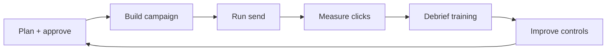
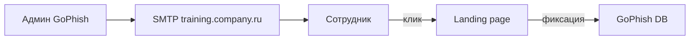

# Фишинг — учебная симуляция для команды

<div class="article-tags">
  <span class="tag tag-required">ОБЯЗАТЕЛЬНО</span>
</div>

<span class="complexity-badge">Руководителю</span>
<span class="complexity-badge">Инженеру</span>

**Фишинг** — атака, при которой злоумышленник выдаёт себя за доверенный источник (банк, IT-отдел, коллегу) и подталкивает жертву кликнуть ссылку, открыть вложение или ввести пароль на поддельном сайте.

**Учебный фишинг** — контролируемая имитация такой атаки внутри организации. Цель — измерить готовность сотрудников к реальным угрозам и улучшить процессы. Фокус на **обучении** — без санкций за клик по учебной ссылке.

Техническая база атак — [социальная инженерия](/encyclopedia/8-infra-security/8-07-informatsionnaya-bezopasnost/1291). Эта статья — практическое руководство для CISO, IT-руководителя или security champion.

<div class="callout callout--warning">
  <div class="callout-title">Только с согласованием</div>

  <div class="callout-body">
  Согласуйте симуляцию с HR, юристами и руководством. Без письменного scope — риск нарушения трудового законодательства и доверия. Никогда не собирайте реальные пароли в учебной форме.
  </div>
</div>

---

## Зачем проводить учебный фишинг

| Причина | Пояснение |
|---------|-----------|
| Реальные атаки растут | 80%+ инцидентов начинаются с фишинга или social engineering |
| Техника не спасает одна | MFA без phishing-resistant фактора обходится через fake login |
| Измеримость | Click rate показывает, где нужно обучение |
| Культура репорта | Учим отправлять подозрительные письма в security@ |
| Compliance | Аудиторы спрашивают про security awareness program |

Учебный фишинг — часть [Secure SDLC](./10.md) на уровне людей, дополнение к техническим контролям.

---

## Фазы проекта



| Фаза | Длительность | Ключевой результат |
|------|--------------|-------------------|
| Plan + approve | 1–2 недели | Подписанный scope, sponsor |
| Build | 3–5 дней | Шаблон письма, landing page |
| Run | 1 день | Рассылка, сбор метрик |
| Measure | 1–3 дня | Dashboard click/report rate |
| Debrief | 48 часов после | Обучение, Q&A |
| Improve | 2–4 недели | DMARC, MFA, playbooks |

---

## 1. Планирование

### Вопросы до старта

| Вопрос | Решение | Кто решает |
|--------|---------|------------|
| Кто sponsor? | CISO / CTO / HR director | Руководство |
| Scope | Только corp email? Исключить board? | Sponsor + HR |
| Safe harbor | "Кликнувшие не штрафуются, это учеб" | HR + письменно |
| Данные | Только факт клика, без паролей | Legal + DPO |
| 152-ФЗ | Минимизация ПДн, срок хранения logs | DPO / юрист |
| Частота | 2–4 раза в год | CISO |
| Сценарий | Близкий к реальным угрозам компании | Security team |

### Документ scope (шаблон)

```markdown
# Учебная фишинг-симуляция — Scope

**Дата:** 2026-06-15
**Sponsor:** CTO Ivan Petrov
**Ответственный:** security@company.ru

## Цель
Измерить готовность сотрудников к фишингу, провести обучение.

## Охват
- Все сотрудники с корпоративной почтой @company.ru
- Исключения: CEO, board (по согласованию)

## Safe harbor
Клик по учебной ссылке не влечёт дисциплинарных мер.
Данные используются только в агрегированном виде.

## Данные
- Фиксируем: факт клика, время, отдел (агрегат)
- НЕ собираем: пароли, содержимое форм

## Хранение
Логи кампании — 90 дней, затем удаление.

## Согласования
- [x] HR Director
- [x] Legal
- [x] DPO (152-ФЗ)
```

### Выбор сценария

Сценарий должен быть **правдоподобным** для вашей организации:

| Сценарий | Реалистичность | Рекомендация |
|----------|----------------|--------------|
| "Обновление пароля IT до пятницы" | Высокая | Хороший старт |
| "Подписать документ в DocuSign" | Высокая | Для офисных компаний |
| "Новая политика VPN" | Высокая | Для remote-first |
| "Вы выиграли сертификат Amazon" | Низкая | Слишком очевидно |
| "Срочный перевод от CEO" | Средняя | Только для зрелых программ (BEC) |

Первую кампанию делайте средней сложности. Слишком очевидный фишинг даст 5% click rate и ложное чувство безопасности. Слишком сложный — демотивирует и вызовет жалобы.

---

## 2. Юридические и этические рамки

### 152-ФЗ и персональные данные

Учебный фишинг обрабатывает ПДн (email, факт клика, возможно ФИО из AD):

- **Минимизация** — собирайте только необходимое
- **Срок хранения** — 90 дней, затем удаление
- **Прозрачность** — сотрудники знают, что симуляции проводятся (в policy, без раскрытия даты)
- **Согласие** — в рамках трудового договора и security policy

### Трудовое право

- Safe harbor в письменном виде
- Никаких публичных "досок позора"
- HR участвует в debrief
- Индивидуальные результаты — только для агрегированной отчётности руководству

### Чего нельзя делать

- Собирать реальные пароли (даже "для статистики")
- Использовать темы зарплаты, увольнения, медицины без extreme care и legal review
- Проводить симуляцию без debrief
- Наказывать за клик

---

## 3. Инструменты

| Класс | Примеры | Когда |
|-------|---------|-------|
| **Phishing platforms** | KnowBe4, Proofpoint, Microsoft Attack Simulation | Enterprise, нужна отчётность |
| **Self-hosted** | GoPhish (open source) | Lab, mid-size, полный контроль |
| **Email infra** | Отдельный subdomain `training.company.ru` | SPF/DKIM/DMARC |
| **Landing page** | Fake login без отправки пароля | Только фиксация клика |

### GoPhish — быстрый старт

**GoPhish** — open source платформа для учебного фишинга. Подходит для lab и компаний до 500 человек.

Компоненты:

- **Campaign** — кампания с датой отправки
- **Email template** — HTML письмо с `{{.URL}}` для tracking link
- **Landing page** — страница "входа" с сообщением после клика
- **Sending profile** — SMTP настройки
- **Results** — dashboard кликов и отчётов



### Email deliverability

Письма должны **доходить**, иначе метрики бессмысленны:

- Отдельный subdomain (`training.company.ru`), не основной corp domain
- SPF, DKIM, DMARC настроены
- Whitelist в корпоративном spam filter (осторожно — документируйте)
- Тестовая рассылка на 5 человек перед основной

---

## 4. Создание кампании

### Шаблон письма — элементы

| Элемент | Учебный пример | Признак фишинга (для debrief) |
|---------|----------------|-------------------------------|
| Sender | `it-support@training.company.ru` | Неофициальный домен |
| Subject | "Обязательное обновление пароля до 17.06" | Срочность, deadline |
| Body | "Перейдите по ссылке для обновления" | Generic greeting, нет имени |
| Link | `https://training.company.ru/login` | Домен отличается от корпоративного |
| Вложение | Не используйте в первой кампании | — |

### Landing page

После клика сотрудник видит страницу, похожую на корпоративный login. **Критически важно:**

- Форма **не отправляет** пароль на сервер
- При submit — сообщение "Это была учебная симуляция. Пройдите обучение по ссылке …"
- HTTPS на landing domain
- Фиксируется только факт визита и submit

### Tracking

GoPhish автоматически отслеживает:

- Email sent
- Email opened (tracking pixel — ненадёжно, многие клиенты блокируют)
- Link clicked
- Form submitted

---

## 5. Метрики

| Метрика | Формула | Интерпретация |
|---------|---------|---------------|
| **Delivery rate** | Доставлено / Отправлено | Техническая доставляемость |
| **Open rate** | Открыто / Доставлено | Слабый signal (pixel blocked) |
| **Click rate** | Кликнули / Доставлено | **Главный KPI** симуляции |
| **Submit rate** | Ввели данные / Кликнули | Глубина попадания |
| **Report rate** | Отправили в security@ / Доставлено | **Желаемый рост** |
| **Time to report** | Медиана времени до репорта | Зрелость SOC culture |

### Benchmark

| Показатель | Первый запуск | После 3–4 циклов обучения |
|------------|---------------|---------------------------|
| Click rate | 20–40% | < 10% |
| Report rate | 5–10% | > 30% |
| Time to report | Часы / дни | < 1 час |

Не сравнивайте с другими компаниями напрямую — контекст разный. Сравнивайте **свои** результаты quarter-over-quarter.

### Dashboard для руководства

Агрегированный отчёт (без имён):

- Click rate по департаментам
- Тренд за 4 кампании
- Report rate trend
- Top 3 признака, которые пропустили (из debrief feedback)

---

## 6. Debrief (обязателен)

Debrief — **самая важная** часть программы. Без него симуляция — просто surveillance.

### Сроки

В течение **48 часов** после кампании:

1. Email от HR/CISO: "Вчера мы провели учебную симуляцию фишинга".
2. All-hands или department sessions (30 мин).
3. Запись для тех, кто пропустил.

### Содержание debrief

| Блок | Время | Содержание |
|------|-------|------------|
| Объявление | 2 мин | "Это была учеб, safe harbor действует" |
| Разбор письма | 10 мин | Sender, URL, urgency, grammar |
| Live demo | 5 мин | Как проверить URL, hover over link |
| MFA / Passkeys | 5 мин | [Passkeys](./2.md) — phishing-resistant |
| UGC и доверенные магазины | 5 мин | Steam Workshop, расширения — [Стилеры](/encyclopedia/8-infra-security/8-07-informatsionnaya-bezopasnost/134) |
| Как репортить | 5 мин | security@, кнопка в Outlook, [1291](/encyclopedia/8-infra-security/8-07-informatsionnaya-bezopasnost/1291) |
| Q&A | 5 мин | Без публичного shaming |

### Правила debrief

- **Никакого** публичного называния кликнувших
- Фокус на признаках, а не на людях
- Признать, что современный фишинг сложен
- Дать конкретные действия (что делать при подозрении)

---

## 7. Улучшения после симуляции

Технические контроли, которые снижают ущерб от успешного фишинга:

| Контроль | Что даёт | Ссылка |
|----------|----------|--------|
| **DMARC reject** | Поддельные письма с вашего домена не доставляются | DNS настройки |
| **External sender banner** | "Это письмо от внешнего отправителя" | Exchange / Google |
| **FIDO2 / Passkeys** | Phishing-resistant MFA для VPN и admin | [Passkeys](./2.md) |
| **Phish alert mailbox** | security@ + playbooks в SIEM | [8.07/114](/encyclopedia/8-infra-security/8-07-informatsionnaya-bezopasnost/114) |
| **Browser isolation** | Изоляция опасных ссылок | Enterprise browser |
| **Conditional Access** | Блок login с незнакомых устройств | Azure AD, Google |

Повтор симуляции **через 3–6 месяцев** — проверка retention обучения.

---

## 8. Интеграция с SOC

```mermaid
flowchart LR
  user[Сотрудник] -->|репорт| mailbox[security@]
  mailbox --> triage[SOC triage]
  triage -->|"учебная кампания?"| gophish[GoPhish whitelist]
  triage -->|"реальная угроза?"| ir[Incident Response]
```

Во время кампании предупредите SOC, чтобы учебные письма не запускали полный IR. После кампании — сравните report rate с реальными репортами за тот же период.

---

## 9. Программа на год

| Квартал | Действие |
|---------|----------|
| Q1 | Baseline кампания (средняя сложность) + debrief |
| Q2 | Технические улучшения (DMARC, banner) |
| Q3 | Вторая кампания (повышенная сложность) + debrief |
| Q4 | Третья кампания (BEC / Teams phishing) + annual report |

Связь с [Secure SDLC](./10.md): фишинг-симуляция — пункт в awareness module.

---

## Мини-сценарий для учебной группы (10 человек)

Пошаговый lab для курса или внутреннего пилота:

| Шаг | Действие | Время |
|-----|----------|-------|
| 1 | Развернуть GoPhish в Docker на lab-сервере | 30 мин |
| 2 | Настроить SMTP (Mailhog для lab) | 15 мин |
| 3 | Создать template "корпоративный опрос" | 30 мин |
| 4 | Landing page с fake Google Form | 20 мин |
| 5 | Запустить campaign на 10 email | 5 мин |
| 6 | Через 1 день — 30-минутный разбор | 30 мин |
| 7 | Обсудить [Secure SDLC](./10.md) awareness | 15 мин |

```bash
docker run -d --name gophish -p 3333:3333 -p 8080:80 gophish/gophish
```

Admin panel: `https://localhost:3333` (default credentials в документации GoPhish — смените сразу).

---

## Каналы кроме email

Современный фишинг выходит за рамки почты:

| Канал | Сценарий | Сложность | Когда |
|-------|----------|-----------|-------|
| **SMS / мессенджеры** | "Ваш VPN истекает" | Средняя | После 2+ email циклов |
| **Teams / Slack** | Fake IT bot | Высокая | Зрелая программа |
| **Voice (vishing)** | "IT support, продиктуйте код" | Высокая | C-level training |
| **USB drop** | Флешка "Зарплаты 2026" | Физическая | Офис с security guard |

Начинайте только с email. Расширяйте каналы, когда click rate < 10% и report rate > 25%.

---

## За пределами фишинга: «доверенные» площадки

Симуляция учит распознавать **поддельный** источник — чужой домен, fake IT. Но значительная доля компрометаций начинается иначе: пользователь **сам** устанавливает контент из площадки, которой уже доверяет. На debrief полезно расширить тему за рамки почты — особенно для геймеров и remote-сотрудников с личными ПК.

| Ситуация | Почему опасно | Что сказать на debrief |
|----------|---------------|------------------------|
| **Steam Workshop + Wallpaper Engine (2025–2026)** | В пакеты обоев вшивали EXE, DLL и скрипты; встречались стилеры Lumma и Vidar, загрузчик RenEngine, перехват сессий Steam. Отдельные наборы скачали десятки тысяч раз; модерация не успевает за массовой загрузкой. | Клиент Steam легитимен, но **каждый UGC-пакет — нет**. Обои и моды — только от авторов с историей публикаций, не от случайного аккаунта с красивой превью. |
| Расширения браузера | Права «читать данные на всех сайтах» = доступ к корпоративным SaaS | Ставить только из IT-whitelist; личные расширения — не на рабочем профиле |
| «Бесплатные» утилиты и моды | Стилеры маскируются под кряки, читы, «ускорители» | Тот же принцип, что с вложением `.exe` в письме — не запускать неизвестное |

Подробный разбор вектора и семейств malware — в [Стилеры](/encyclopedia/8-infra-security/8-07-informatsionnaya-bezopasnost/134). Источник по кампании Wallpaper Engine — [отчёт «Лаборатории Касперского»](https://www.gazeta.ru/tech/news/2026/06/17/28703407.shtml).

<div class="callout callout--info">
  <div class="callout-title">Связь с программой awareness</div>

  <div class="callout-body">
  Фишинг-симуляция измеряет реакцию на <strong>чужой</strong> домен. Кейсы вроде Steam Workshop показывают второй класс ошибок — доверие к <strong>легитимному каналу доставки</strong> без проверки автора контента. Обе темы закрывают debrief: сначала разбор письма, затем 5 минут про UGC и установку софта.
  </div>
</div>

---

## Работа с сопротивлением

| Возражение | Ответ |
|------------|-------|
| "Это слежка" | Объясните safe harbor, агрегированные метрики, цель — защита |
| "HR не согласовала" | Без HR — не запускайте, это hard gate |
| "Я и так всё знаю" | Даже security team кликает на хороший spear-phishing |
| "Отвлекает от работы" | 30 мин debrief раз в квартал против недели recovery после ransomware |

Sponsor от руководства (CTO, CISO) снимает большинство возражений.

---

## Spear-phishing для executives

Отдельная программа для board и C-level (с extreme care):

- Сценарии BEC (Business Email Compromise)
- Fake DocuSign от "юриста"
- Согласование с CEO и legal обязательно
- Индивидуальный coaching, не group shaming
- Результаты — только CEO/CISO, не department breakdown

Executives — главная цель реальных атак. Учебная симуляция для них критична.

---

## Шаблон письма HR после кампании

```markdown
Тема: Результаты учебной проверки кибербезопасности

Коллеги,

В [дата] мы провели плановую учебную симуляцию фишинга.
Это часть программы информационной безопасности [Компания].

Результаты (агрегированно):
- Доставлено писем: N
- Доля переходов по ссылке: X% (цель — снижение)
- Доля сообщений в security@: Y% (цель — рост)

[Дата] пройдёт 30-минутный разбор признаков фишинга.

Напоминаем: клик по учебной ссылке не влечёт санкций.
Подозрительные письма — на security@company.ru.

С уважением,
[HR Director] / [CISO]
```

---

## Интеграция с LMS

Для компаний 500+ сотрудников:

| LMS функция | Связь с фишингом |
|-------------|------------------|
| Авто-assign курс | Кликнувшим — "Phishing 101" (без указания имён в LMS admin) |
| Completion tracking | Метрика обучения рядом с click rate |
| Annual refresh | Обязательный курс + симуляция |

KnowBe4 совмещает simulation + training. GoPhish + отдельный LMS (Moodle, iSpring) — для self-hosted.

---

## Метрики для аудита

Аудиторы (SOC 2, ISO 27001) спрашивают:

| Вопрос аудитора | Артефакт |
|-----------------|----------|
| Есть ли awareness program? | Политика + calendar кампаний |
| Как измеряете эффективность? | Click/report rate trend |
| Как реагируете на низкие показатели? | Debrief + LMS + tech controls |
| Согласовано ли с HR? | Подписанный scope |

Храните отчёты кампаний 1–3 года (согласуйте с legal retention policy).

---

## Красные флаги в письме — памятка для debrief

Распечатайте или разошлите после кампании:

| # | Признак | Пример |
|---|---------|--------|
| 1 | Чужой домен отправителя | `it-support@mail.ru` вместо `@company.ru` |
| 2 | Срочность | "До 18:00 сегодня или блокировка" |
| 3 | Общее обращение | "Уважаемый сотрудник" без имени |
| 4 | Подозрительная ссылка | Hover показывает другой домен |
| 5 | Неожиданное вложение | `.exe`, `.html`, password-protected zip |
| 6 | Грамматика | Ошибки, нехарактерный стиль |
| 7 | Запрос credentials | Пароль, OTP, "подтвердите учётку" |
| 8 | Несоответствие контексту | "Вы выиграли" в корпоративной почте |

Попросите сотрудников добавить памятку в закладки.

### Дополнение: установка софта и UGC

После разбора письма — короткий блок про контент вне почты:

| # | Вопрос себе | Пример риска |
|---|-------------|--------------|
| 1 | Кто автор? Есть ли история публикаций? | Массовая загрузка однотипных обоев в Steam Workshop |
| 2 | Зачем пакету DLL, скрипты или пароль в имени архива? | Вредонос в Wallpaper Engine (2025–2026) |
| 3 | Это рабочий или личный профиль? | Личный Steam на корпоративном ноутбуке — общий риск для VPN и почты |
| 4 | Есть ли MFA / FIDO2 на ценных аккаунтах? | Украденная cookie сессии Steam обходит только пароль |

---

## A/B тестирование сценариев

Зрелая программа тестирует разные подходы:

| Вариант A | Вариант B | Что измеряем |
|-----------|-----------|--------------|
| Срочность в subject | Нейтральный subject | Click rate delta |
| Fake IT | Fake HR | Какой отдел уязвимее |
| Ссылка в тексте | Кнопка HTML | Формат влияния |
| Утро (9:00) | После обеда (14:00) | Time of day |

Делите компанию пополам (random by department). Не тестируйте на CEO без согласования.

---

## Связь с MFA rollout

Если параллельно внедряете MFA:

| Фаза | Фишинг + MFA |
|------|--------------|
| До MFA | Baseline click rate |
| MFA announcement | Фишинг "обновите MFA по ссылке" (fake) |
| После MFA | Повторная кампания, сравнение |
| FIDO2 rollout | Кампания на обход MFA через fake login |

Учебный фишинг **после** MFA показывает, что MFA без phishing-resistant factor (SMS, TOTP) обходится fake proxy.

---

## Privacy by design в кампании

| Принцип | Реализация |
|---------|------------|
| Data minimization | Только email + click timestamp |
| Purpose limitation | Только security awareness |
| Storage limitation | 90 дней, auto-delete |
| Transparency | Policy mentions simulations |
| Access control | Только security team + sponsor |

DPO должен подписать Data Processing Record для кампании.

---

## Пример отчёта для совета директоров

```markdown
# Security Awareness — Q2 2026

## Учебная фишинг-кампания
- Охват: 450 сотрудников
- Click rate: 12% (было 28% в Q4 2025)
- Report rate: 34% (было 11%)
- Time to report: 45 мин median

## Технические меры
- DMARC: reject (внедрено Q1)
- External banner: 100% писем
- FIDO2: 78% admin accounts

## План Q3
- Вторая кампания (Teams scenario)
- LMS курс для новых сотрудников
- Passkeys pilot для VPN

## Budget request
- KnowBe4 license: $X (optional)
- 2 YubiKeys for executives: $Y
```

---

## Чек-лист учебного фишинга

- [ ] Письменный scope с HR, legal, DPO
- [ ] Safe harbor объявлен
- [ ] Сценарий правдоподобен для компании
- [ ] Пароли НЕ собираются
- [ ] SPF/DKIM настроены
- [ ] SOC предупреждён
- [ ] Debrief в течение 48 часов
- [ ] Агрегированный отчёт для руководства
- [ ] Технические улучшения запланированы
- [ ] Повтор через 3–6 месяцев

---

## Runbook — сотрудник кликнул и ввёл пароль

| Шаг | Действие | Срок |
|-----|----------|------|
| 1 | Landing page показала debrief — не паника | Immediate |
| 2 | Reset password через официальный IdP | 15 мин |
| 3 | Revoke active sessions user | 15 мин |
| 4 | Check sign-in logs — foreign IP | 1 ч |
| 5 | Если real credential entered — treat as incident | P1 |
| 6 | Assign LMS модуль без blame | 24 ч |
| 7 | SOC ticket closed с resolution | 48 ч |

**Никогда** не используйте введённый пароль — даже для "проверки". Discard immediately.

---

## Runbook — утечка плана кампании до запуска

| Шаг | Действие |
|-----|----------|
| 1 | Cancel scheduled send |
| 2 | Rotate tracking domain если скомпрометирован |
| 3 | Reschedule с новым scenario |
| 4 | Brief HR — возможны слухи |
| 5 | Post-mortem — кто имел access к GoPhish |

Campaign plan — confidential, access только security + HR sponsor.

---

## Compliance — учебный фишинг и трудовое право РФ

| Вопрос | Рекомендация | Документ |
|--------|--------------|----------|
| Можно ли симулировать без согласия? | Только при policy в ТД или local act | HR + legal |
| Наказание за клик | Запрещено при safe harbor | Written scope |
| Хранение click data | Minimization, 90 days | DPO record |
| Уведомление профсоюза | При массовом охвате | Legal review |
| 152-ФЗ | Email не передаётся третьим лицам без DPA | Vendor contract |

GoPhish self-hosted предпочтительнее SaaS без localisation для данных сотрудников.

---

## Compliance — отраслевые требования

| Сектор | Дополнительно | Практика |
|--------|---------------|----------|
| Банки | ЦБ, информирование ИБ | CISO approval каждой кампании |
| Госсектор | Local act, приказ руководителя | Письменный приказ |
| КИИ | Согласование с SOC | Pre-brief SOC 24 ч |
| Медицина | Минимизация PHI в сценариях | Generic IT scenarios only |

Юристы проверяют формулировку safe harbor на соответствие локальным act.

---

## Расширенный пример — первая кампания 500 человек

Компания IT 500 FTE, Microsoft 365, цель baseline click rate.

| Неделя | Activity |
|--------|----------|
| W-4 | HR + legal scope, safe harbor email |
| W-3 | GoPhish install, SPF/DKIM test |
| W-2 | Pilot 20 человек IT |
| W-1 | SOC brief, executive notify |
| W0 | Send 09:30 вторник, scenario "password reset IT" |
| W0+2d | Debrief all-hands 30 min |
| W+2 | Report CISO — click 22%, report 8% |

Follow-up — external banner, DMARC reject, вторая кампания через 4 месяца scenario "DocuSign".

---

## Сравнение платформ учебного фишинга

| Платформа | Hosting | LMS | Цена | РФ data residency |
|-----------|---------|-----|------|-------------------|
| **GoPhish** | Self-hosted | External | Free OSS | Полный контроль |
| **KnowBe4** | SaaS | Built-in | Per user | Уточнять DPA |
| **Microsoft Attack Simulation** | M365 cloud | Integrated | E5 bundle | Microsoft RU region |
| **Phished.io** | SaaS EU | Built-in | Subscription | EU, проверять DPA |
| **Custom script** | Internal | Manual | Dev time | On-prem |

Enterprise РФ с M365 E5 — начать с Attack Simulation. Без M365 — GoPhish on Selectel VPS.

---

## Сравнение технических контрмер после кампании

| Контроль | Эффект против фишинга | Сложность |
|----------|----------------------|-----------|
| **DMARC reject** | Блок spoof домена | Средняя |
| **External banner** | Внимание к sender | Низкая |
| **FIDO2/WebAuthn** | Anti-credential harvest | Высокая |
| **Safe Links** | Scan URL click | Средняя (M365) |
| **Browser isolation** | Zero trust browse | Высокая |
| **SEG advanced** | ML detection | Enterprise cost |

Комбинация DMARC + banner + FIDO2 для admin — минимум для regulated.

---

## Региональная специфика — российские почтовые провайдеры

| Провайдер | Особенность доставки | Рекомендация |
|-----------|---------------------|--------------|
| **Корпоративная почта M365** | Attack Simulation native | SPF include Microsoft |
| **Yandex 360** | Строгий spam filter | Warm-up test send |
| **Mail.ru biz** | Проверка PTR | Dedicated sending IP |
| **Self-hosted Exchange** | Настройка connector | IT admin в loop |

Тестовое письмо на 5 mailbox **до** массовой кампании — проверка inbox, не spam.

---

## Расширенный пример — debrief для кликнувших

Структура 45-минутной сессии:

| Блок | Время | Содержание |
|------|-------|------------|
| Intro | 5 мин | Safe harbor, цели программы |
| Reveal | 5 мин | "Это была симуляция" |
| Demo | 10 мин | Hover link, проверка домена |
| Памятка | 10 мин | 8 красных флагов |
| Q&A | 10 мин | Без имён кликнувших |
| Action | 5 мин | Куда report real phishing |

Запись для remote офисов. Slides на русском, примеры из локального контекста (1С, Контур, СБИС).

---

## Runbook — ложное срабатывание SOC на учебную кампанию

| Шаг | Действие |
|-----|----------|
| 1 | SOC playbook ссылка на campaign ID |
| 2 | Auto-tag emails с campaign header `X-Phish-Train: true` |
| 3 | Close ticket как authorized simulation |
| 4 | Metrics — report rate включает SOC tickets |

Header согласуйте с GoPhish template — SOC фильтрует по нему.

---

## Интеграция с 1С и корпоративными порталами

Сценарии для офисов РФ:

- Fake "обновление 1С через ссылку"
- "Новая версия Контур.Экстерн"
- "СБИС — подписать акт"

Правдоподобие высокое — debrief объясняет, что **официальные обновления** только через известные каналы, не email link.

---

## Метрики maturity программы

| Уровень | Click rate | Report rate | Технические меры |
|---------|------------|-------------|------------------|
| L0 | более 30% | менее 5% | Нет DMARC |
| L1 | 15–30% | 5–15% | SPF/DKIM |
| L2 | 5–15% | 15–30% | DMARC reject |
| L3 | менее 5% | более 30% | FIDO2 admins |
| L4 | менее 3% | более 40% | Full phishing-resistant MFA |

Стремитесь к L2 за первый год, L3 за второй при поддержке руководства.

---

## Runbook — сотрудник сообщил о real phishing

| Шаг | Действие | SLA |
|-----|----------|-----|
| 1 | SOC triage — IOC extract | 15 min |
| 2 | Block sender/domain/url | 30 min |
| 3 | Search same IOC across mailbox | 1 ч |
| 4 | User debrief — thank for report | Same day |
| 5 | Update SEG rules if pattern | 24 ч |

Report rate растёт, когда SOC **благодарит** публично без имён — на all-hands.

---

## Расширенный пример — годовая программа awareness

| Квартал | Кампания | Техника |
|---------|----------|---------|
| Q1 | Password reset IT | Email |
| Q2 | Fake Teams meeting | Link |
| Q3 | USB drop (офис) | Physical |
| Q4 | Vishing IT support | Phone pilot |

Между кампаниями — micro-learning 5 min в LMS. Metrics dashboard для CISO ежемесячно.

---

## Compliance — vendor GoPhish hosting

| Check | Self-hosted | SaaS |
|-------|-------------|------|
| Data in РФ | Да | DPA required |
| Subprocessor list | N/A | Legal review |
| Encryption at rest | Disk encrypt VPS | Vendor cert |
| Access log | SSH audit | Vendor SOC2 |

Contract с SaaS vendor — clause delete data после кампании 90 days.

---

## Сравнение метрик эффективности кампаний

| Метрика | Хорошо | Требует внимания |
|---------|--------|------------------|
| Click rate | < 10% | > 25% |
| Report rate | > 25% | < 10% |
| Time to report | < 1 h median | > 4 h |
| Repeat clickers | < 5% same users | > 15% |
| Credential submit | 0% | Any — fix landing |

Trend важнее абсолютного значения — сравнивайте квартал к кварталу.

---

## Региональная специфика — удалёнка и BYOD

| Риск | Мера |
|------|------|
| Personal email forward | DLP + policy |
| Mobile click | MDM + separate profile |
| Messengers | Campaign после email maturity |
| Contractors | Separate domain banner |

Remote-first компании — debrief включает проверку URL на телефоне, не только desktop.

---

## Runbook — кампания ушла в spam у 40% users

| Шаг | Действие |
|-----|----------|
| 1 | Stop remaining queue |
| 2 | Check SPF/DKIM/DMARC alignment |
| 3 | Review sending IP reputation |
| 4 | Reschedule after warm-up sends |
| 5 | Exclude spam-folder users from metrics |

Pilot 20 mailbox across providers перед enterprise send обязателен.

---

## Связанные материалы

- [Социальная инженерия](/encyclopedia/8-infra-security/8-07-informatsionnaya-bezopasnost/1291) — техники атак.
- [Стилеры и cookie theft](/encyclopedia/8-infra-security/8-07-informatsionnaya-bezopasnost/134) — почему MFA без phishing-resistant factor слаба.
- [GoPhish documentation](https://docs.getgophish.com/) — официальная документация.
- [Passkeys и WebAuthn](./2.md) — phishing-resistant аутентификация.
- [Secure SDLC](./10.md) — встраивание awareness в процесс.
- [Microsoft Attack Simulation](https://learn.microsoft.com/en-us/microsoft-365/security/office-365-security/attack-simulation-training) — для Microsoft 365.

---
