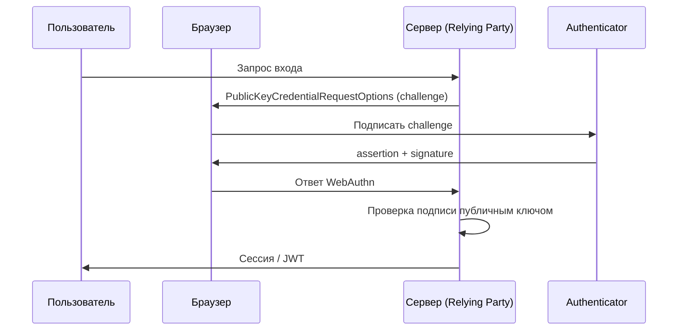
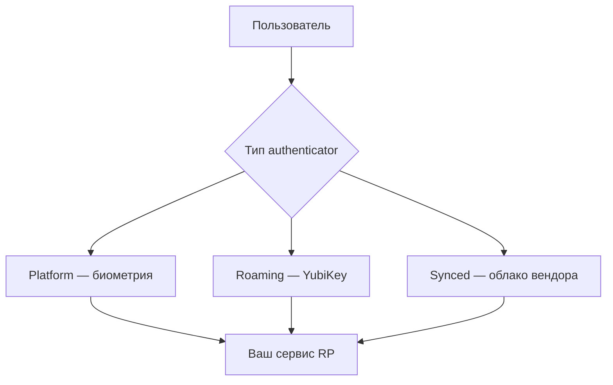
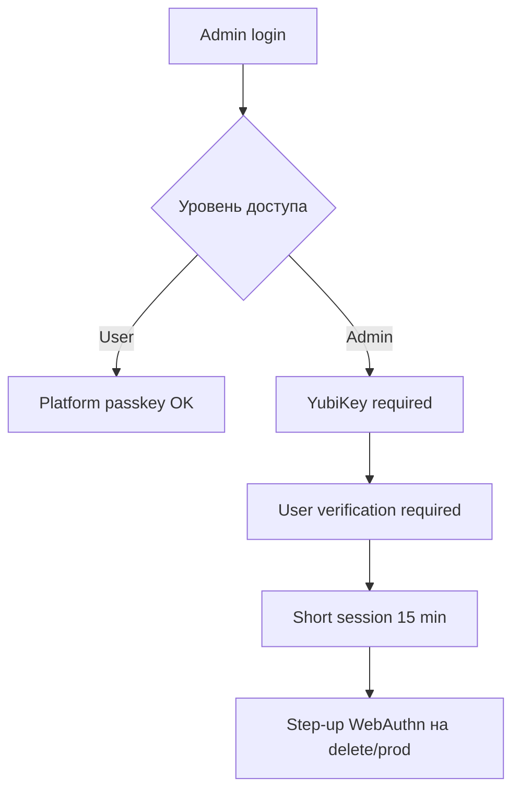
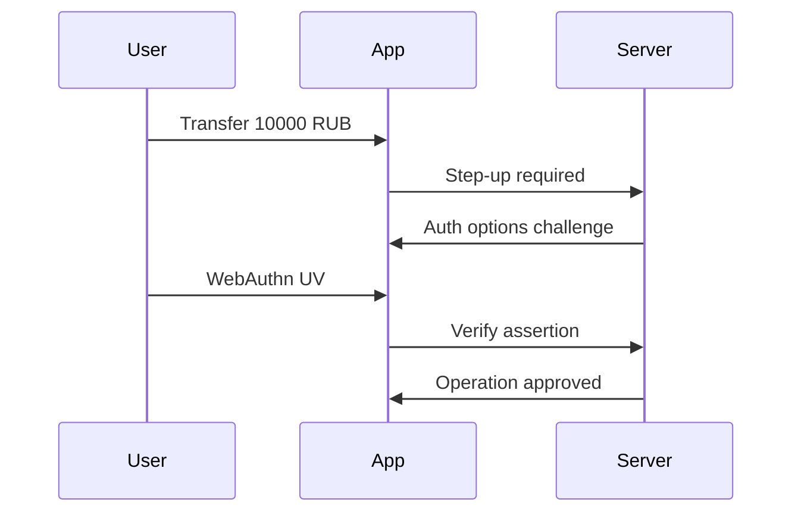

# Passkeys и WebAuthn

<div class="article-tags">
  <span class="tag tag-required">ОБЯЗАТЕЛЬНО</span>
</div>

<span class="complexity-badge">Разработчику</span>

**Passkey** (ключ доступа) — способ входа через стандарты **WebAuthn** (Web Authentication) и **FIDO2** (Fast IDentity Online 2). Пользователь подтверждает личность биометрией, PIN или физическим ключом (YubiKey). На сервер уходит криптографическая **подпись**, пароль по сети **не передаётся**.

Фишинговый сайт-клон не сможет использовать ключ — браузер привязан к **origin** (домену и схеме `https://`). Это принципиальное отличие от классического пароля, который можно ввести на поддельной странице.

Базовая теория auth — [8.07/116](/encyclopedia/8-infra-security/8-07-informatsionnaya-bezopasnost/116), OAuth как дополнение — [OIDC и OAuth](./8.md).

---

## Ключевые термины

| Термин | Значение |
|--------|----------|
| **Relying Party (RP)** | Ваш сервис — сайт или API, который принимает вход |
| **Authenticator** | Устройство или ПО, хранящее ключ (Touch ID, Hello, YubiKey) |
| **Credential** | Пара ключей + идентификатор, зарегистрированная на RP |
| **Challenge** | Одноразовая случайная строка от сервера для подписи |
| **Assertion** | Ответ authenticator при входе (подпись challenge) |
| **rpId** | Домен, к которому привязан ключ (например `example.com`) |
| **Discoverable credential** | Ключ с resident storage — вход без ввода логина |

---

## Как это работает



### Регистрация и вход

| Этап | Регистрация | Вход |
|------|-------------|------|
| Сервер | Выдаёт **challenge**, сохраняет **credential id** + **public key** | Выдаёт challenge для известного credential |
| Клиент | `navigator.credentials.create()` | `navigator.credentials.get()` |
| Хранение секрета | Только на устройстве (Secure Enclave, TPM) | — |
| Проверка | Attestation (опционально), origin, rpId | Signature, sign count, origin |

**Sign count** — счётчик подписей authenticator. Если значение не растёт при повторных входах, возможна копия ключа (replay клонированного authenticator).

---

## Режимы passkeys

### 1. Platform authenticator

Встроенный в устройство — Face ID, Touch ID, Windows Hello. Удобно для массового B2C.

### 2. Roaming (security key)

Переносной ключ YubiKey, Feitian. Часто для админов, DevOps и корпоративного доступа.

### 3. Discoverable credentials (resident keys)

Вход **без логина** — браузер предлагает "Continue with passkey", как у Apple и Google. Требует хранения credential на устройстве.

### 4. Synced passkeys

Синхронизация между устройствами через iCloud Keychain или Google Password Manager. Удобство выше, доверие смещается к экосистеме вендора.



---

## Реализация на практике

### Используйте проверенные библиотеки

Криптографию WebAuthn на сервере пишут редко — используйте готовые решения:

| Стек | Библиотека / сервис |
|------|---------------------|
| Node.js | `@simplewebauthn/server`, `@simplewebauthn/browser` |
| Python | `py_webauthn`, плагины Django/Flask |
| .NET | `Fido2.AspNet` |
| Java | `webauthn4j` |
| Готовый IdP | Auth0, Keycloak, Firebase, Microsoft Entra ID |

Официальные гайды — [passkeys.dev](https://passkeys.dev/), спецификация — [W3C WebAuthn](https://www.w3.org/TR/webauthn-3/).

---

## Пошагово — регистрация passkey (Node.js)

### Шаг 1. Сервер генерирует options

```javascript
import { generateRegistrationOptions } from '@simplewebauthn/server';

const options = await generateRegistrationOptions({
  rpName: 'My App',
  rpID: 'localhost',
  userID: user.id,
  userName: user.email,
  attestationType: 'none',
  authenticatorSelection: {
    residentKey: 'preferred',
    userVerification: 'preferred',
  },
});
// Сохранить options.challenge в сессии
```

### Шаг 2. Браузер вызывает create

```javascript
import { startRegistration } from '@simplewebauthn/browser';

const attResp = await startRegistration({ optionsJSON: options });
await fetch('/webauthn/register', {
  method: 'POST',
  body: JSON.stringify(attResp),
});
```

### Шаг 3. Сервер проверяет и сохраняет

```javascript
import { verifyRegistrationResponse } from '@simplewebauthn/server';

const verification = await verifyRegistrationResponse({
  response: attResp,
  expectedChallenge: session.challenge,
  expectedOrigin: 'https://localhost:3000',
  expectedRPID: 'localhost',
});
// Сохранить verification.registrationInfo.credentialID и credentialPublicKey в БД
```

**Ожидаемый результат:** запись в таблице `webauthn_credentials` с `credential_id`, `public_key`, `sign_count`.

---

## Пошагово — вход по passkey

```javascript
// Сервер
const options = await generateAuthenticationOptions({
  rpID: 'example.com',
  allowCredentials: [{ id: credentialId, type: 'public-key' }],
});
// Клиент
const assertion = await startAuthentication({ optionsJSON: options });
// Сервер
const verification = await verifyAuthenticationResponse({
  response: assertion,
  expectedChallenge: session.challenge,
  expectedOrigin: 'https://example.com',
  expectedRPID: 'example.com',
  authenticator: storedCredential,
});
// Обновить sign_count в БД
```

---

## Требования к серверу (обязательно)

- Генерировать **случайный challenge** (32+ байта) и хранить в сессии до проверки (one-time)
- Проверять **origin** и **rpId** — совпадение с вашим доменом
- Сохранять **public key**, **credential id**, **sign count**
- Поддерживать **fallback** — recovery codes, второй фактор, OAuth — потеря устройства не должна блокировать аккаунт навсегда
- Использовать **HTTPS** в prod (WebAuthn требует secure context, кроме localhost)

---

## UX — как не потерять пользователей

| Рекомендация | Почему |
|--------------|--------|
| Предлагать passkey **после** первого успешного входа по паролю/OAuth | Пользователь уже доверяет аккаунту |
| Объяснить, что ключ привязан к **этому сайту** | Путают с "общим паролем Apple ID" |
| На desktop без биометрии — **QR для телефона** | Cross-device auth по стандарту |
| Не удалять пароль сразу | Плавный переход, recovery |
| Показать список устройств с passkey в настройках | Управление и отзыв |

---

## Passkeys (WebAuthn) и OAuth "Войти через Google"

| Критерий | Passkeys (WebAuthn) | OAuth "Войти через Google" |
|----------|---------------------|----------------------------|
| Кто хранит identity | **Ваш** RP | **Google** как IdP (Identity Provider) |
| Фишинг пароля | Пароль не используется | Зависит от Google и redirect URI |
| Привязка к домену | Жёсткая (WebAuthn origin) | Redirect URI, client_id |
| Типичный кейс | Основной login на **вашем** сайте | Делегирование учётки |
| Offline / локальный ключ | Roaming key возможен | Нужна сеть к IdP |

Часто **комбинируют** — OAuth для onboarding, passkey как основной login или второй фактор — [OIDC и OAuth](./8.md).

---

## Хранение данных в БД

Минимальная схема (логическая):

| Поле | Тип | Назначение |
|------|-----|------------|
| `user_id` | UUID | Связь с пользователем |
| `credential_id` | bytea / base64 | Идентификатор credential |
| `public_key` | bytea | Проверка подписи |
| `sign_count` | integer | Anti-replay |
| `transports` | text[] | usb, nfc, internal |
| `created_at` | timestamp | Аудит |

Публичный ключ — не секрет. **Приватный ключ** никогда не покидает authenticator.

---

## Ошибки и риски

| Ошибка | Последствие | Как избежать |
|--------|-------------|--------------|
| **Challenge reuse** | Replay старого assertion | One-time challenge, TTL 5 мин |
| **Слабый rpId** | Ключ работает на чужом поддомене | Явная политика поддоменов |
| **Нет recovery** | Блокировка аккаунта | Backup codes, второй фактор |
| **Игнор sign count** | Клон authenticator незаметен | Обновлять и проверять счётчик |
| **Passkeys как единственный канал support** | Социальная инженерия на сброс | Identity proof по процедуре [8.07/133](/encyclopedia/8-infra-security/8-07-informatsionnaya-bezopasnost/133) |

Passkeys снижают классический фишинг пароля, но **не** закрывают BEC (Business Email Compromise, компрометация деловой почты) — [социальная инженерия](/encyclopedia/8-infra-security/8-07-informatsionnaya-bezopasnost/1291).

---

## Troubleshooting для разработчика

| Симптом | Возможная причина | Действие |
|---------|-------------------|----------|
| `NotAllowedError` | Пользователь отменил, нет UV | Проверить userVerification |
| `SecurityError` | Неверный origin/rpId | Сравнить URL и rpID в логах |
| Работает локально, нет в prod | HTTP вместо HTTPS | Включить TLS |
| Не находит credential | Другой authenticator | allowCredentials, discoverable flow |
| sign_count mismatch | Копия ключа или баг | Отозвать credential, перерегистрация |

---

## Тестирование

- **localhost** — исключение для secure context в браузерах
- Инструменты — [WebAuthn.io](https://webauthn.io/) для ручных тестов
- E2E — Playwright с виртуальным authenticator (Chrome DevTools protocol)
- Регрессия — сценарии "новое устройство", "потеря ключа", "отзыв credential"

---

## Чек-лист внедрения passkeys

- [ ] HTTPS в prod, корректный rpId
- [ ] Challenge одноразовый, в сессии или Redis с TTL
- [ ] Проверка origin на сервере
- [ ] sign_count обновляется
- [ ] Fallback и recovery документированы
- [ ] UX — предложение после первого входа
- [ ] Страница управления устройствами в личном кабинете
- [ ] Логи аудита регистрации и входа

---

## Безопасность enterprise — passkeys в корпорации

| Сценарий | Рекомендация |
|----------|--------------|
| Все сотрудники на Windows | Windows Hello + Entra ID passkeys |
| Админы инфраструктуры | Roaming YubiKey + запасной ключ в сейфе |
| B2C массовый сервис | Platform passkeys + fallback SMS/email recovery |
| Регуляторные требования | Документировать методы recovery и аудит |

**Attestation** — проверка модели authenticator при регистрации. В enterprise можно разрешать только определённые типы ключей (например, только FIDO2 certified).

---

## WebAuthn в мобильных приложениях

Нативные приложения используют **passkeys** через:

- **iOS** — ASAuthorizationPlatformPublicKeyCredentialProvider
- **Android** — Credential Manager API
- **Кросс-платформа** — Flutter/React Native плагины поверх тех же API

Веб-вью внутри приложения часто **не** поддерживает WebAuthn полноценно — предпочтительны нативные SDK или системный браузер (Custom Tabs / ASWebAuthenticationSession).

---

## Тестовые сценарии — таблица QA

| # | Сценарий | Ожидание |
|---|----------|----------|
| 1 | Регистрация passkey на Chrome/Windows Hello | Успех, credential в БД |
| 2 | Вход с тем же passkey | Успех, sign_count +1 |
| 3 | Вход с другого браузера без synced key | Ошибка или fallback |
| 4 | Поддельный origin в DevTools | SecurityError на сервере |
| 5 | Повтор assertion со старым challenge | Отказ |
| 6 | Удаление passkey в ЛК | Следующий вход только через fallback |
| 7 | Cross-device QR (desktop) | Успех с телефона |

---

## Миграция с паролей на passkeys — план команды

| Фаза | Действие |
|------|----------|
| 1 | Добавить опциональную регистрацию passkey после логина |
| 2 | Показать баннер "защитите аккаунт ключом" |
| 3 | Метрика adoption % пользователей с passkey |
| 4 | Для новых пользователей — passkey-first onboarding |
| 5 | Сократить политику паролей для оставшихся (длинный пароль + MFA) |

Не отключайте пароли массово до recovery flow и поддержки.

---

## API и мобильный backend — JWT после WebAuthn

После успешной проверки WebAuthn сервер выдаёт сессию или **JWT** (JSON Web Token):

```javascript
// После verifyAuthenticationResponse === true
const accessToken = jwt.sign(
  { sub: user.id, amr: ['webauthn'] },
  process.env.JWT_SECRET,
  { expiresIn: '15m' }
);
```

Поле `amr` (Authentication Methods References) документирует, что вход был по passkey — полезно для step-up auth на чувствительных операциях. См. [8.07/116](/encyclopedia/8-infra-security/8-07-informatsionnaya-bezopasnost/116).

---

## Конфигурация rpId и поддоменов

| rpId | Работает на |
|------|-------------|
| `example.com` | `example.com`, `www.example.com`, `app.example.com` |
| `app.example.com` | Только `app.example.com` |

Ошибка — `rpId: example.com` при хостинге на `tenant1.example.com` и `tenant2.example.com` без единой политики — ключ может работать шире, чем задумано.

---

## Соответствие стандартам

| Стандарт | Связь с passkeys |
|----------|------------------|
| **NIST SP 800-63B** | Уровни assurance для аутентификаторов |
| **PSD2 SCA** | Сильная аутентификация для платежей в ЕС |
| **FIDO2** | Базовый стандарт passkeys |

Passkeys соответствуют phishing-resistant аутентификаторам в терминологии NIST AAL2–AAL3 при правильной настройке UV (user verification).

---

## Дополнительные ресурсы и демо

| Ресурс | URL |
|--------|-----|
| W3C WebAuthn Level 3 | https://www.w3.org/TR/webauthn-3/ |
| passkeys.dev | https://passkeys.dev/ |
| WebAuthn.io demo | https://webauthn.io/ |
| SimpleWebAuthn docs | https://simplewebauthn.dev/ |
| FIDO Alliance | https://fidoalliance.org/ |

---

## Вопросы для самопроверки

1. Где хранится приватный ключ passkey?
2. Что такое challenge и почему он одноразовый?
3. Чем **platform authenticator** отличается от **roaming**?
4. Зачем проверять sign_count?
5. Какой fallback нужен при потере устройства?

---

## Кейс — внедрение passkeys в B2C fintech

**Контекст.** Мобильный банк с 2M пользователей, высокий риск фишинга SMS и паролей.

**Подход:**

1. Фаза 1 — optional passkey после успешного входа по паролю + SMS OTP.
2. Фаза 2 — баннер "защитите вход ключом" с коротким видео.
3. Фаза 3 — passkey-first для новых регистраций на iOS/Android 16+.
4. Recovery — видеозвонок в поддержку + паспорт для high-value операций.

**Метрики через 6 месяцев:**

- Adoption passkey ~35% MAU
- Снижение ticket "не могу войти" на 12% за счёт synced keys
- Zero successful password phishing на аккаунтах только с passkey

**Связь с [OIDC](./8.md)** — социальный login оставили для onboarding, passkey стал primary для returning users.

---

## Кейс — корпоративный доступ админов через YubiKey

**Контекст.** DevOps-команда с root-доступом к AWS и K8s.

**Политика:**

- Roaming FIDO2 key (YubiKey 5) — обязателен для admin panel
- Запасной ключ в сейфе офиса — второй credential на аккаунт
- **Attestation** — только FIDO Certified keys
- Platform passkey (Hello) — запрещён для admin tier



---

## Полный пример API routes — Express + SimpleWebAuthn

```javascript
// routes/webauthn.js — упрощённый каркас
import express from 'express';
import {
  generateRegistrationOptions,
  verifyRegistrationResponse,
  generateAuthenticationOptions,
  verifyAuthenticationResponse,
} from '@simplewebauthn/server';

const router = express.Router();
const rpID = process.env.RP_ID || 'localhost';
const origin = process.env.ORIGIN || 'https://localhost:3000';

router.post('/register/options', async (req, res) => {
  const user = req.session.user;
  const options = await generateRegistrationOptions({
    rpName: 'My App',
    rpID,
    userID: user.id,
    userName: user.email,
    attestationType: 'none',
    authenticatorSelection: { residentKey: 'preferred', userVerification: 'preferred' },
  });
  req.session.challenge = options.challenge;
  res.json(options);
});

router.post('/register/verify', async (req, res) => {
  const verification = await verifyRegistrationResponse({
    response: req.body,
    expectedChallenge: req.session.challenge,
    expectedOrigin: origin,
    expectedRPID: rpID,
  });
  if (!verification.verified) return res.status(400).json({ error: 'Verification failed' });
  await saveCredential(req.session.user.id, verification.registrationInfo);
  delete req.session.challenge;
  res.json({ ok: true });
});

router.post('/login/options', async (req, res) => {
  const creds = await getCredentialsForUser(req.body.email);
  const options = await generateAuthenticationOptions({
    rpID,
    allowCredentials: creds.map(c => ({ id: c.credentialId, type: 'public-key' })),
  });
  req.session.challenge = options.challenge;
  res.json(options);
});

router.post('/login/verify', async (req, res) => {
  const cred = await getCredential(req.body.id);
  const verification = await verifyAuthenticationResponse({
    response: req.body,
    expectedChallenge: req.session.challenge,
    expectedOrigin: origin,
    expectedRPID: rpID,
    authenticator: cred,
  });
  if (!verification.verified) return res.status(401).json({ error: 'Auth failed' });
  await updateSignCount(cred.id, verification.authenticationInfo.newCounter);
  req.session.userId = cred.userId;
  res.json({ ok: true });
});

export default router;
```

Сессии — Redis с TTL для challenge. Prod — HTTPS, `trust proxy` за load balancer.

---

## Discoverable credentials — passwordless UX

Для входа без email используйте **resident keys** (discoverable credentials):

```javascript
const options = await generateAuthenticationOptions({
  rpID: 'example.com',
  userVerification: 'preferred',
  // allowCredentials не указываем — браузер предложит все ключи для rpId
});
```

UX — кнопка "Continue with passkey" как у [passkeys.dev](https://passkeys.dev/). Fallback — "Use another method" с email + magic link.

---

## CI — E2E тест WebAuthn в Playwright

```yaml
# .github/workflows/webauthn-e2e.yml
name: webauthn-e2e
on: [pull_request]
jobs:
  e2e:
    runs-on: ubuntu-latest
    steps:
      - uses: actions/checkout@v4
      - uses: actions/setup-node@v4
        with:
          node-version: 20
      - run: npm ci && npm run build
      - run: npx playwright install chromium
      - name: Run WebAuthn tests
        run: npx playwright test tests/webauthn.spec.ts
        env:
          CI: true
```

```javascript
// tests/webauthn.spec.ts — виртуальный authenticator
import { test, expect } from '@playwright/test';

test('register and login passkey', async ({ page, context }) => {
  const client = await context.newCDPSession(page);
  await client.send('WebAuthn.enable');
  const { authenticatorId } = await client.send('WebAuthn.addVirtualAuthenticator', {
    options: {
      protocol: 'ctap2',
      transport: 'internal',
      hasResidentKey: true,
      hasUserVerification: true,
      isUserVerified: true,
    },
  });
  await page.goto('https://localhost:3000/login');
  await page.getByRole('button', { name: 'Sign in with passkey' }).click();
  await expect(page).toHaveURL(/dashboard/);
  await client.send('WebAuthn.removeVirtualAuthenticator', { authenticatorId });
});
```

Локально — `playwright test` с HTTPS dev-сервером (mkcert).

---

## Расширенный глоссарий WebAuthn

| Термин | Определение |
|--------|-------------|
| **CTAP2** | Client to Authenticator Protocol — протокол браузер ↔ ключ |
| **Attestation** | Подпись производителя authenticator при регистрации |
| **AAGUID** | Authenticator Attestation GUID — модель устройства |
| **User verification (UV)** | PIN или биометрия перед подписью |
| **User presence (UP)** | Подтверждение "человек нажал" |
| **Resident key** | Credential хранится на устройстве — discoverable login |
| **PRF extension** | Pseudo-random function — деривация секретов из passkey |
| **Hybrid transport** | QR + Bluetooth для cross-device auth |
| **Secure Enclave** | Изолированный чип Apple для ключей |
| **TPM** | Trusted Platform Module — аппаратный модуль Windows |
| **AAL** | Authenticator Assurance Level — уровень NIST 800-63B |
| **AMR** | Authentication Methods References — claim в JWT о способе входа |

---

## Что делать если — troubleshooting passkeys

### Пользователь потерял телефон с единственным passkey

1. Recovery codes — одноразовые коды при регистрации passkey.
2. Backup passkey на втором устройстве — предлагайте при onboarding.
3. Identity verification в support — [8.07/133](/encyclopedia/8-infra-security/8-07-informatsionnaya-bezopasnost/133).
4. После recovery — отзыв старого credential по `credential_id`.

### Passkey работает в Chrome, но не в Safari

1. Проверьте **rpId** — Safari строже к subdomain.
2. iCloud Keychain sync — пользователь должен быть залогинен в Apple ID.
3. `userVerification: 'required'` может блокировать без биометрии — попробуйте `preferred`.

### Enterprise блокирует WebAuthn на прокси

1. Secure context требует HTTPS end-to-end.
2. Некоторые прокси режут WebAuthn API — whitelist домена RP.
3. Fallback — roaming key по USB, минуя corporate proxy для auth domain.

### sign_count уменьшился

1. Возможен clone authenticator или restore из backup.
2. Отзовите credential, force re-registration.
3. Алерт в SIEM — аномалия входа.

### Cross-device QR не сканируется

1. Проверьте **hybrid** transport в `authenticatorSelection`.
2. Desktop и phone должны быть в одной экосистеме или поддерживать FIDO cross-device.
3. Документируйте "use phone to sign in" в help center.

---

## Расширенный FAQ

### "Passkeys заменяют MFA?"

Passkey с UV часто считается MFA-equivalent (something you have + something you are). Для high-risk операций добавляйте step-up — повторный WebAuthn или аппаратный ключ.

### "Нужна ли attestation в B2C?"

Обычно `attestationType: 'none'` — проще UX. Enterprise admin — attestation для allowlist моделей ключей.

### "Как мигрировать 1M пользователей с паролей?"

Постепенно — optional passkey, метрики adoption, passkey-first для новых. Пароли оставьте до стабильного recovery. См. раздел "Миграция с паролей".

### "WebAuthn и LDAP/Active Directory?"

Entra ID и Okta поддержива passkeys как федерацию. On-prem AD — через FIDO2 security keys + Windows Hello for Business.

### "Хранить credential_id в plain text?"

`credential_id` публичен по дизайну. **public_key** тоже. Шифруйте at-rest по политике, но это не секреты как пароли.

### "Passkeys для API-only mobile app?"

Credential Manager API (Android) / ASAuthorization (iOS). Backend тот же — challenge/verify. Не используйте WebView для WebAuthn.

---

## Безопасность session после WebAuthn

```javascript
// Короткая сессия + rotation
app.use(session({
  store: new RedisStore({ client: redisClient }),
  secret: process.env.SESSION_SECRET,
  resave: false,
  saveUninitialized: false,
  cookie: {
    secure: true,
    httpOnly: true,
    sameSite: 'lax',
    maxAge: 15 * 60 * 1000,
  },
}));
```

Sensitive operations — повторный `generateAuthenticationOptions` с `userVerification: 'required'`.



---

## Сравнение способов входа — таблица для product

| Способ | Фишинг | UX | Recovery | Подходит для |
|--------|--------|-----|----------|--------------|
| Пароль | Высокий риск | Знакомо | Email reset | Legacy |
| SMS OTP | SIM-swap | Средне | Support | Fallback |
| OAuth Google | Зависит от IdP | Быстро | Google account | Onboarding |
| Passkey platform | Низкий | Отлично | Backup key | B2C primary |
| YubiKey roaming | Низкий | Нужен ключ | Запасной ключ | Admin |

Часто комбинируют passkey + OAuth + recovery codes — [OIDC](./8.md).

---

## Связанные материалы

- [Аутентификация и авторизация](/encyclopedia/8-infra-security/8-07-informatsionnaya-bezopasnost/116) — JWT, сессии, MFA
- [12 советов по безопасности API](/encyclopedia/2-system-network/2-09-osnovy-integratsionnogo-vzaimodeystviya/132)
- [OIDC и OAuth](./8.md)
- [W3C WebAuthn](https://www.w3.org/TR/webauthn-3/)
- [passkeys.dev](https://passkeys.dev/)
- [FIDO Alliance](https://fidoalliance.org/)

---
