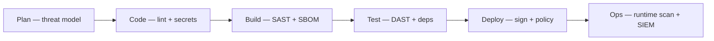
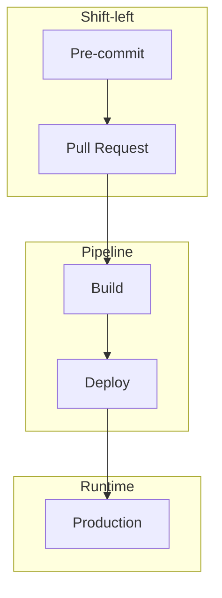
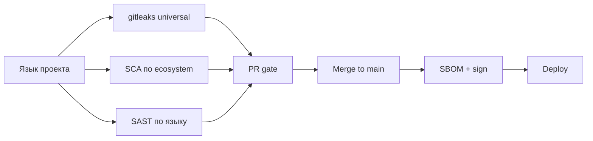

import ExternalPlayEmbed from '@site/src/components/ExternalPlayEmbed';

# DevSecOps

<div class="article-tags">
  <span class="tag tag-required">ОБЯЗАТЕЛЬНО</span>
</div>
<span class="complexity-badge">Разработчику</span>
<span class="complexity-badge">Инженеру</span>

<ExternalPlayEmbed example="infra-security/security-gate-pipeline-play" title="DevSecOps security gates" minHeight={520} />
**DevSecOps** — подход, при котором безопасность **встроена в каждый этап** **delivery** (поставки ПО) — от коммита до **prod**. Цель — дешёвое раннее исправление, автоматические **gates** (блокирующие проверки) и прозрачные политики для разработчиков.

**Pentest** (тестирование на проникновение) остаётся важным этапом, но выполняется **параллельно** с разработкой, а не за неделю до релиза. **AppSec** (Application Security, безопасность приложений) консультирует, разработка владеет кодом, **DevOps** поддерживает пайплайн.

Основы CI/CD — [8.04](/encyclopedia/8-infra-security/8-04-devops-ci-cd/intro), threat modeling — [8.07/1132](/encyclopedia/8-infra-security/8-07-informatsionnaya-bezopasnost/1132), supply chain — [Supply chain и SBOM](./1.md).



---

## Типы проверок — словарь

| Аббревиатура | Расшифровка | Когда |
|--------------|-------------|-------|
| **SAST** | Static Application Security Testing — анализ исходного кода без запуска | PR, каждый коммит |
| **DAST** | Dynamic Application Security Testing — атаки на работающее приложение | Staging, периодически prod |
| **SCA** | Software Composition Analysis — уязвимости в зависимостях | PR, CI |
| **IaC scan** | Проверка Terraform/Kubernetes манифестов | Infra PR |
| **Secret scan** | Поиск ключей и паролей в Git | Pre-commit, PR |

---

## Слои контроля

| Слой | Когда | Инструменты (примеры) |
|------|-------|------------------------|
| **Pre-commit** | До push | gitleaks, detect-secrets, husky hooks |
| **PR / CI** | Каждый merge request | Semgrep, CodeQL, Trivy, npm audit |
| **Build** | Образ / артефакт | SBOM, cosign sign |
| **Deploy** | K8s / cloud | OPA/Gatekeeper, Kyverno, checkov |
| **Runtime** | Prod | Falco, WAF, EDR |

Подробнее про supply chain — [Supply chain и SBOM](./1.md). Про IaC-политики — [8.04/13](/encyclopedia/8-infra-security/8-04-devops-ci-cd/13).



**Shift-left** — перенос проверок безопасности влево по времени, ближе к написанию кода.

---

## Минимальный pipeline для pet-проекта

```yaml
# Фрагмент — полные рецепты: /lab/Примеры/1134
name: devsecops-minimal
on: [pull_request]
jobs:
  security:
    runs-on: ubuntu-latest
    permissions:
      contents: read
    steps:
      - uses: actions/checkout@v4
        with:
          fetch-depth: 0
      - name: Secret scan
        run: |
          docker run -v $(pwd):/path zricethezav/gitleaks:latest \
            detect --source /path --no-git -v
      - name: Dependency audit
        run: npm ci && npm audit --audit-level=high
      - name: Filesystem scan
        uses: aquasecurity/trivy-action@master
        with:
          scan-type: fs
          severity: HIGH,CRITICAL
          exit-code: 1
```

**Правило:** один красный gate — блок merge; исключения (**waivers**) с ticket, owner и сроком действия.

### Ожидаемый вывод при успехе

- gitleaks — exit 0, "no leaks found"
- npm audit — 0 vulnerabilities уровня high+
- trivy — отчёт без CRITICAL (или согласованный waiver)

### Ожидаемый вывод при провале

- gitleaks находит AWS key в `config.old` — job failed
- npm audit — уязвимость в `express` — требуется обновление или waiver

---

## Практикум — pre-commit локально

```bash
pip install pre-commit
# .pre-commit-config.yaml
cat <<'EOF' > .pre-commit-config.yaml
repos:
  - repo: https://github.com/gitleaks/gitleaks
    rev: v8.18.2
    hooks:
      - id: gitleaks
EOF
pre-commit install
pre-commit run --all-files
```

**Ожидаемый результат:** хук срабатывает до каждого коммита; секрет в файле блокирует commit.

---

## Policy-as-Code

**Policy-as-Code** — правила безопасности в машиночитаемом виде, проверяемые автоматически.

### Kubernetes (Rego / OPA — Open Policy Agent)

Примеры политик:

- все Pod'ы с `resources.limits`
- запрет тега `latest` и публичных registry без allowlist
- обязательный label `team`, `env`
- секреты только из External Secrets / Vault — [практикум Vault](/encyclopedia/8-infra-security/8-14-praktikum-vault/intro)

```rego
# Упрощённый пример Gatekeeper — запрет latest
package k8sdisallowedtags
violation[{"msg": msg}] {
  container := input.review.object.spec.containers[_]
  endswith(container.image, ":latest")
  msg := sprintf("image %v uses forbidden tag latest", [container.image])
}
```

### Terraform

- **checkov**, **tfsec** — статический анализ
- `terraform plan` в CI с обязательным review infra PR — [8.04/22](/encyclopedia/8-infra-security/8-04-devops-ci-cd/22)

---

## Роли и ответственность

| Роль | DevSecOps-задача |
|------|------------------|
| **Разработчик** | Исправляет findings, не коммитит секреты, участвует в threat model |
| **DevOps** | Поддерживает scanners, gates, runners, SBOM в пайплайне |
| **AppSec** | Политики severity, threat model, triage false positives |
| **Менеджмент** | SLA на critical CVE, бюджет на инструменты, risk acceptance |

DevSecOps — **совместная** модель. Без владельца findings превращаются в шум.

---

## Triage — как не утонуть в алертах

| Шаг | Действие |
|-----|----------|
| 1 | Классификация — true positive / false positive / accepted risk |
| 2 | Severity по CVSS и эксплуатируемости в вашем контексте |
| 3 | Ticket с owner и дедлайном |
| 4 | Waiver с expiry для исключений |
| 5 | Еженедельный review открытых findings |

**False positive** — Semgrep сработал на тестовый файл с словом `password`. Решение — exclude path или правило.

**True positive** — реальный SQL injection в прод-коде. Решение — исправление до merge.

---

## Метрики

| Метрика | Зачем |
|---------|-------|
| **MTTR** (Mean Time To Repair) для critical CVE в deps | Скорость реакции |
| **% PR** с прошедшим security gate с первого раза | Качество процесса |
| **Количество секретов** в истории Git (тренд к нулю) | Культура |
| **Время** от merge до deploy signed artifact | Зрелость pipeline |
| **Открытые critical без owner** | Риск накопления |

---

## Реальные сценарии

### Утечка AWS ключа в публичный GitHub

1. gitleaks в CI должен был заблокировать PR
2. Если ключ попал в main — ротация ключа в IAM, git filter-repo или BFG для истории
3. Post-mortem — почему pre-commit не сработал

См. [секреты 8.03/117](/encyclopedia/8-infra-security/8-03-zabota-o-kode-i-dannyh/117).

### Critical CVE в зависимости в пятницу вечером

1. SBOM показывает все сервисы с пакетом
2. Dependabot PR уже открыт — приоритет merge
3. Если нет патча — waiver с компенсирующими мерами (WAF rule, отключение функции)

См. [Supply chain](./1.md).

### DAST нашёл XSS на staging

1. Ticket разработчику с PoC
2. Исправление до prod deploy
3. Регрессионный тест в CI

---

## Антипаттерны

1. **100500 alerts** без triage — разработчики игнорируют всё.
2. **Scan только на main** — баги дороже исправлять после merge.
3. **DAST только на prod** — лучше staging с синтетическими данными.
4. **"Security said no"** без альтернативы — нужен диалог и **risk acceptance** (формальное принятие риска).
5. **Инструменты без обучения** — команда не знает, как читать отчёт Semgrep.
6. **Gates без waivers** — люди обходят CI вручную.

---

## Чек-лист DevSecOps для команды

### Старт (неделя 1)

- [ ] Secret scan на каждый PR
- [ ] Dependency scan (npm audit / Trivy)
- [ ] Protected branch на main
- [ ] Документ "что делать при красном gate"

### Базовая зрелость (месяц 1–3)

- [ ] SAST (Semgrep или CodeQL)
- [ ] SBOM для prod-образов
- [ ] Renovate/Dependabot на все репо
- [ ] Triage process с owner

### Продвинутая зрелость

- [ ] DAST на staging
- [ ] Policy-as-Code в K8s
- [ ] Подпись образов cosign
- [ ] Метрики MTTR и dashboard
- [ ] Threat modeling на новые фичи — [Secure SDLC](./10.md)

---

## Связь с Secure SDLC

**Secure SDLC** (Secure Software Development Lifecycle) — процессы на уровне команды: threat modeling, требования ASVS, релизные gates. **DevSecOps** — техническая реализация части этих gates в CI/CD.

| Secure SDLC | DevSecOps |
|-------------|-----------|
| Threat model на фичу | Правила SAST под ваши угрозы |
| ASVS Level 2 | Набор обязательных scanners |
| Релизный gate | Красный pipeline блокирует deploy |

Подробный маршрут — [Secure SDLC ./10.md](./10.md).

---

## Полный пример GitHub Actions — DevSecOps

```yaml
name: devsecops-full
on:
  pull_request:
  push:
    branches: [main]
permissions:
  contents: read
  pull-requests: write
jobs:
  sast-secrets:
    runs-on: ubuntu-latest
    steps:
      - uses: actions/checkout@v4
        with:
          fetch-depth: 0
      - name: Gitleaks
        uses: gitleaks/gitleaks-action@v2
      - name: Semgrep
        uses: returntocorp/semgrep-action@v1
        with:
          config: p/ci
  sca:
    runs-on: ubuntu-latest
    steps:
      - uses: actions/checkout@v4
      - uses: actions/setup-node@v4
        with:
          node-version: 20
      - run: npm ci
      - run: npm audit --audit-level=high
      - uses: aquasecurity/trivy-action@master
        with:
          scan-type: fs
          severity: HIGH,CRITICAL
          exit-code: 1
  build-sign:
    needs: [sast-secrets, sca]
    runs-on: ubuntu-latest
    if: github.ref == 'refs/heads/main'
    steps:
      - uses: actions/checkout@v4
      - run: docker build -t app:${{ github.sha }} .
      - run: syft app:${{ github.sha }} -o cyclonedx-json > sbom.json
      # cosign sign — при наличии ключа
```

**Ожидаемый результат:** PR без уязвимостей и секретов мержится; на main появляется образ и SBOM.

---

## Severity и приоритизация — практическая таблица

| Severity | SLA исправления (пример) | Действие |
|----------|--------------------------|----------|
| Critical + exploitable | 24–72 ч | Hotfix, возможен emergency deploy |
| High | 1–2 недели | В спринте |
| Medium | 1 месяц | Backlog |
| Low / Info | По capacity | Triage |

CVSS (Common Vulnerability Scoring System) — числовая оценка, но контекст важнее: RCE (Remote Code Execution) на публичном API важнее informational в dev-скрипте.

---

## DAST на staging — минимальный старт

**OWASP ZAP** (Zed Attack Proxy) в baseline mode:

```bash
docker run -t owasp/zap2docker-stable zap-baseline.py \
  -t https://staging.example.com \
  -r zap-report.html
```

Запускать на staging с тестовыми данными, не на prod с реальными ПДн. Интеграция в CI — nightly job, не блокирующий каждый PR на старте.

---

## Runtime security — краткий обзор

| Инструмент | Что ловит |
|------------|-----------|
| **Falco** | Подозрительные syscall в K8s |
| **WAF** | SQLi, XSS на периметре |
| **EDR** | Вредонос на хосте |
| **SIEM** | Корреляция логов |

Runtime — последний слой, не замена SAST/SCA. См. [8.07](/encyclopedia/8-infra-security/8-07-informatsionnaya-bezopasnost/intro).

---

## Обучение команды — без "security theater"

| Формат | Частота | Содержание |
|--------|---------|------------|
| Lunch & learn | Раз в месяц | Разбор одного finding из Semgrep |
| Onboarding | При найме | Где секреты, как читать отчёт CI |
| Game day | Раз в квартал | Учебная утечка ключа — отработка runbook |
| Office hours AppSec | Еженедельно | Помощь с false positives |

Цель — разработчики чинят findings сами, AppSec не становится bottleneck.

---

## Интеграция с Jira / GitHub Issues

Автоматическое создание ticket при critical finding:

```yaml
- name: Create issue on failure
  if: failure()
  uses: actions/github-script@v7
  with:
    script: |
      github.rest.issues.create({
        owner: context.repo.owner,
        repo: context.repo.repo,
        title: 'Security gate failed on ' + context.sha,
        body: 'Проверьте лог job security в Actions.',
        labels: ['security', 'blocked']
      })
```

Каждый ticket — owner и due date в SLA.

---

## Сравнение инструментов SAST (ориентир)

| Инструмент | Плюсы | Ограничения |
|------------|-------|-------------|
| **Semgrep** | Быстрый, свои правила | Нужен тюнинг правил |
| **CodeQL** | Глубокий анализ, GitHub native | Тяжелее, learning curve |
| **Bandit** | Python | Только Python |
| **gosec** | Go | Только Go |

Старт — один SAST + secret scan + SCA. Добавляйте второй SAST при зрелости.

---

## Compliance mapping — DevSecOps и аудит

| Требование аудита | DevSecOps-контроль |
|-------------------|-------------------|
| Статический анализ кода | SAST в CI |
| Управление уязвимостями | SCA + SBOM |
| Защита секретов | gitleaks, Vault |
| Изменения в prod | GitOps, approval gates |
| Логирование | CI audit log, deployment history |

Документируйте, какой gate закрывает какой пункт чек-листа аудитора.

---

## Вопросы для самопроверки

1. Чем **SAST** отличается от **DAST** и **SCA**?
2. Что такое shift-left?
3. Назовите три слоя контроля до prod.
4. Что такое waiver и когда он уместен?
5. Какая метрика показывает зрелость DevSecOps?

---

## Таймлайн внедрения DevSecOps по месяцам

| Месяц | Цель | Артефакт |
|-------|------|----------|
| 1 | Secret scan + npm audit на PR | Зелёный gate, 0 секретов в main |
| 2 | SAST (Semgrep) + Trivy fs | Политика severity |
| 3 | SBOM для prod-образов | sbom.json в CI artifacts |
| 4 | DAST nightly на staging | Отчёт ZAP |
| 5 | Policy K8s / Terraform | OPA или checkov |
| 6 | Метрики MTTR, dashboard | Grafana panel |

Не пытайтесь включить всё в первую неделю — команда привыкнет к шуму и отключит сканеры.

---

## Кейс — Semgrep нашёл SQL injection до prod

**Ситуация.** Разработчик добавил конкатенацию строк в SQL-запросе. Semgrep rule `javascript.express.security.injection.raw-query` сработал на PR.

**Flow:**

1. PR blocked — developer видит snippet и rule id.
2. Исправление — parameterized query через ORM.
3. AppSec добавляет custom rule для вашего query builder.
4. Регрессия — unit test с malicious input.

**Без DevSecOps** — уязвимость дошла бы до DAST на staging или pentest за неделю до релиза. Shift-left сэкономил цикл исправления.

---

## Кейс — утечка DATABASE_URL в monorepo

**Ситуация.** `.env.example` случайно содержал реальный URL. gitleaks в pre-commit заблокировал commit локально.

**Если бы попало в main:**

```bash
# Ротация + очистка истории (осторожно, координация с командой)
git filter-repo --invert-paths --path .env.example --force
# Ротация пароля БД в managed service
# Post-mortem — почему .env.example не в .gitleaksignore с комментарием
```

Runbook — [8.03 секреты](/encyclopedia/8-infra-security/8-03-zabota-o-kode-i-dannyh/117), [Supply chain](./1.md) для CI hardening.

---

## GitLab CI — полный DevSecOps pipeline

```yaml
# .gitlab-ci.yml
stages:
  - validate
  - security
  - build

include:
  - template: Security/SAST.gitlab-ci.yml
  - template: Security/Secret-Detection.gitlab-ci.yml
  - template: Security/Dependency-Scanning.gitlab-ci.yml

variables:
  SECRET_DETECTION_ENABLED: "true"

semgrep:
  stage: security
  image: returntocorp/semgrep
  script:
    - semgrep --config=p/ci --error .
  rules:
    - if: $CI_PIPELINE_SOURCE == "merge_request_event"

trivy-fs:
  stage: security
  image:
    name: aquasec/trivy:latest
    entrypoint: [""]
  script:
    - trivy fs --severity HIGH,CRITICAL --exit-code 1 .

build-image:
  stage: build
  needs: [semgrep, trivy-fs]
  script:
    - docker build -t $CI_REGISTRY_IMAGE:$CI_COMMIT_SHA .
    - trivy image --exit-code 1 --severity CRITICAL $CI_REGISTRY_IMAGE:$CI_COMMIT_SHA
  rules:
    - if: $CI_COMMIT_BRANCH == "main"
```

GitLab Ultimate включает SAST/secret detection из коробки. Free tier — Semgrep + Trivy вручную как выше.

---

## Pre-commit — расширенная конфигурация

```yaml
# .pre-commit-config.yaml
repos:
  - repo: https://github.com/gitleaks/gitleaks
    rev: v8.18.2
    hooks:
      - id: gitleaks
  - repo: https://github.com/returntocorp/semgrep
    rev: v1.45.0
    hooks:
      - id: semgrep
        args: ["--config", "p/ci", "--error"]
  - repo: local
    hooks:
      - id: npm-audit
        name: npm audit
        entry: bash -c 'npm audit --audit-level=high'
        language: system
        files: package-lock.json
        pass_filenames: false
```

```bash
pre-commit autoupdate
pre-commit run --all-files
```

Hooks локальные — быстрая обратная связь до push. CI дублирует для bypass protection.

---

## OPA Gatekeeper — полный пример ConstraintTemplate

```yaml
apiVersion: templates.gatekeeper.sh/v1
kind: ConstraintTemplate
metadata:
  name: k8srequiredlabels
spec:
  crd:
    spec:
      names:
        kind: K8sRequiredLabels
  targets:
    - target: admission.k8s.gatekeeper.sh
      rego: |
        package k8srequiredlabels
        violation[{"msg": msg}] {
          not input.review.object.metadata.labels.team
          msg := "Pod must have label team"
        }
---
apiVersion: constraints.gatekeeper.sh/v1beta1
kind: K8sRequiredLabels
metadata:
  name: require-team-label
spec:
  match:
    kinds:
      - apiGroups: [""]
        kinds: ["Pod"]
  parameters: {}
```

Deploy через GitOps — [4.md GitOps](./4.md). Violation блокирует `kubectl apply`.

---

## Расширенный глоссарий DevSecOps

| Термин | Определение |
|--------|-------------|
| **Gate** | Автоматическая проверка, блокирующая merge или deploy |
| **Shift-left** | Проверки на ранних этапах — pre-commit, PR |
| **Shift-right** | Runtime monitoring — Falco, SIEM в prod |
| **Triage** | Классификация findings — fix, ignore, waiver |
| **True positive** | Реальная уязвимость, требует исправления |
| **False positive** | Ложное срабатывание сканера |
| **Waiver** | Исключение с owner, ticket, expiry date |
| **Risk acceptance** | Формальное принятие риска менеджментом |
| **CVSS** | Common Vulnerability Scoring System — 0–10 severity |
| **CWE** | Common Weakness Enumeration — класс бага |
| **SARIF** | Static Analysis Results Interchange Format — отчёт для GitHub |
| **Break-glass** | Emergency bypass gate с audit log |
| **Security theater** | Проверки ради галочки без реального эффекта |

---

## Что делать если — troubleshooting DevSecOps

### Semgrep 500 findings на первом запуске

1. Начните с `p/ci` — ~50 правил, не `--config auto`.
2. Exclude `tests/`, `vendor/`, `*.min.js`.
3. Fix critical first — injection, secrets, auth bypass.
4. Постепенно включайте custom rules.

### CodeQL слишком долго на monorepo

1. `paths-ignore` для docs и generated code.
2. Incremental analysis на PR — только changed files где поддерживается.
3. Full scan nightly, не на каждый push.

### npm audit fix ломает production

1. Никогда `npm audit fix --force` без review на main.
2. Dependabot PR + тесты + staging deploy.
3. Major bump — отдельный спринт task.

### DAST ZAP блокирует CI каждую ночь

1. Baseline mode для starter — не full scan.
2. Authenticated scan — отдельные credentials staging.
3. Triage HTML report — fix или suppress с обоснованием.

### Разработчик обходит gate через `--no-verify`

1. Branch protection — required status checks.
2. Pre-commit hooks не заменяют server-side CI.
3. Culture — объяснить cost of bypass в post-mortem.

### Waiver expired, CVE всё ещё open

1. Автоматический ticket за 7 дней до expiry.
2. Escalation к менеджменту — renew или fix.
3. Dashboard метрика "expired waivers" → 0.

---

## Расширенный FAQ

### "SAST или SCA первым?"

SCA + secret scan — быстрый win за день. SAST — неделя 2 после настройки triage.

### "Нужен ли DAST если есть SAST?"

Да — SAST не видит runtime config, WAF, auth flow. DAST на staging ловит другой класс багов.

### "Кто владелец waiver?"

AppSec создаёт policy, **owner** — developer или team lead сервиса. AppSec approves renew.

### "DevSecOps заменяет pentest?"

Pentest остаётся для logic bugs и business flow. DevSecOps снижает базовый шум до pentest.

### "Как интегрировать с SonarQube?"

SonarQube — quality + security rules. Можно дублировать SAST — выберите один primary для gate, второй advisory.

### "Security gate для infra repo?"

Да — checkov/tfsec на Terraform, gitleaks на modules, policy на `terraform plan` output.

---

## Матрица "какой scanner на какой язык"

| Язык | Secret | SCA | SAST |
|------|--------|-----|------|
| JavaScript/TS | gitleaks | npm audit, Trivy | Semgrep, CodeQL |
| Python | gitleaks | pip-audit | Bandit, Semgrep |
| Go | gitleaks | govulncheck | gosec |
| Java | gitleaks | OWASP Dep-Check | Semgrep |
| Terraform | gitleaks | — | checkov, tfsec |
| Docker | — | Trivy image | hadolint |



---

## Dashboard метрик — пример Grafana queries

| Панель | Источник данных | Query idea |
|--------|-----------------|------------|
| Open critical findings | DefectDojo / GitHub Issues | count label=security, severity=critical, state=open |
| MTTR CVE | Jira | avg(resolve_date - created) where type=cve |
| PR pass rate | GitHub API | % PR with all security checks green |
| Secrets trend | gitleaks history | count per week → 0 |
| Waiver expiry | Custom DB | count expiry < 7 days |

Инструмент учёта — [DefectDojo](https://github.com/DefectDojo/django-DefectDojo), GitHub Advanced Security, или Jira с labels.

---

## Break-glass procedure — emergency deploy

Когда critical prod bug и gate красный по unrelated finding:

1. AppSec + engineering manager approval в ticket.
2. Deploy через documented break-glass pipeline с audit log.
3. Fix finding в течение 24 ч после deploy.
4. Post-mortem — почему gate blocked unrelated.

Break-glass редок — злоупотребление убивает доверие к gates.

---

## Связанные материалы

- [Secure SDLC — маршрут](./10.md)
- [Supply chain и SBOM](./1.md)
- [Безопасность на ранних этапах](/encyclopedia/8-infra-security/8-07-informatsionnaya-bezopasnost/1132)
- [GitHub Actions — CI/CD рецепты](/lab/Примеры/1134)
- [Разработка и отладка](/encyclopedia/4-code-dev/4-14-razrabotka-i-otladka/intro)
- OWASP [DevSecOps Guideline](https://owasp.org/www-project-devsecops-guideline/)
- OWASP [CI/CD Security Cheat Sheet](https://cheatsheetseries.owasp.org/cheatsheets/CI_CD_Security_Cheat_Sheet.html)

---
