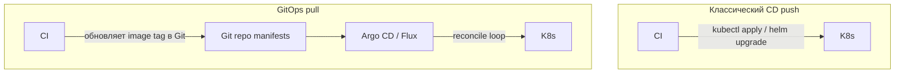
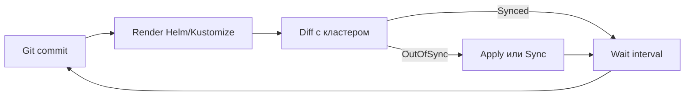
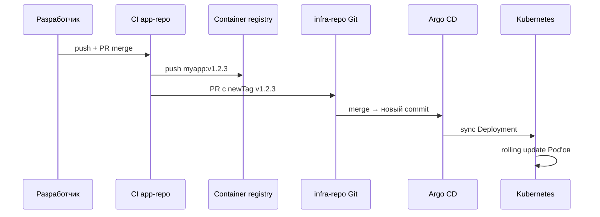

# GitOps

<div class="article-tags">
  <span class="tag tag-required">ОБЯЗАТЕЛЬНО</span>
</div>

<span class="complexity-badge">Инженеру</span>
<span class="complexity-badge">Разработчику</span>

**GitOps** — подход к управлению инфраструктурой и приложениями, при котором **желаемое состояние** системы хранится в **Git** (системе контроля версий), а специальный **контроллер** внутри кластера постоянно **синхронизирует** реальное состояние с тем, что записано в репозитории.

Проще говоря, если вы хотите изменить prod (production, боевая среда), вы **не подключаетесь к серверу вручную**. Вы открываете pull request (PR, запрос на слияние) в репозитории с манифестами, проходите review (проверку коллег) и делаете merge. Контроллер сам замечает новый commit и приводит кластер в соответствие с Git.

Типичные контроллеры — **Argo CD** и **Flux CD**. Оба работают с **Kubernetes** (K8s, оркестратор контейнеров). Основы Git в DevOps — [8.04/12](/encyclopedia/8-infra-security/8-04-devops-ci-cd/12), Kubernetes — [8.06/117](/encyclopedia/8-infra-security/8-06-konteynerizatsiya-i-orkestratsiya/117), справочник YAML — [8.06/211](/encyclopedia/8-infra-security/8-06-konteynerizatsiya-i-orkestratsiya/211).

---

## Ключевые термины

| Термин | Расшифровка | Зачем нужен в GitOps |
|--------|-------------|----------------------|
| **Git** | Система контроля версий | Хранит историю всех изменений инфраструктуры |
| **CI/CD** | Continuous Integration / Continuous Delivery | Сборка образов и автоматизация delivery |
| **K8s** | Kubernetes | Платформа, где крутятся контейнеры |
| **Manifest** | YAML-файл с описанием ресурса | Deployment, Service, Ingress и т.д. |
| **Reconcile** | Цикл согласования | Контроллер сравнивает Git и кластер |
| **Drift** | Расхождение | Кластер отличается от Git — ручной `kubectl apply` |
| **PR** | Pull Request | Точка review перед изменением prod |

---

## Два подхода к доставке изменений

В классическом **push-деплое** пайплайн **CI/CD** (Continuous Integration / Continuous Delivery, непрерывная интеграция и доставка) сам **отправляет** изменения в кластер — через `kubectl apply`, `helm upgrade` или аналоги. Для этого у CI нужен **kubeconfig** (файл доступа к кластеру) с правами на запись.

В **pull-модели GitOps** агент **внутри** кластера **забирает** изменения из Git. CI только собирает Docker-образ и обновляет tag (метку версии) в репозитории манифестов. Применение манифестов — задача Argo CD или Flux.



| Критерий | Push CD | GitOps pull |
|----------|---------|-------------|
| Кто применяет манифest | CI с kubeconfig | Агент в кластере |
| Аудит изменений | Логи CI | **Git history** — каждый commit с автором |
| Drift | Возможен после ручного `kubectl` | Detect + auto-sync или alert |
| Откат | Redeploy старого образа | **Revert commit** в Git |
| Секреты CI | Нужен долгоживущий kubeconfig | CI без доступа к кластеру |
| Blast radius | Компрометация CI = доступ к prod | Компрометация CI = только Git write |

Push-модель остаётся рабочей для небольших проектов. GitOps добавляет **прозрачность**, **аудит** и **контроль drift**, когда кластеров и сред становится много.

Подробнее о CI/CD — [8.04/13](/encyclopedia/8-infra-security/8-04-devops-ci-cd/13), стратегии выката — [8.04/111](/encyclopedia/8-infra-security/8-04-devops-ci-cd/111).

---

## Как работает reconcile loop

Контроллер GitOps постоянно выполняет цикл **reconcile** (согласование):

1. Читает commit из Git (ветку, tag или Helm chart version).
2. Рендерит манифесты (Helm, Kustomize, plain YAML).
3. Сравнивает желаемое состояние с фактическим в кластере.
4. Если есть расхождение (**OutOfSync**) — применяет diff или шлёт alert.
5. Ждёт интервал (30 сек — 3 мин) и повторяет.



Статус **Synced** означает, что кластер совпадает с Git. **OutOfSync** — кто-то изменил ресурс вручную или в Git появился новый commit. UI Argo CD показывает diff построчно — удобно для review инцидентов.

---

## Принципы OpenGitOps

Сообщество **OpenGitOps** (открытый стандарт, [opengitops.dev](https://opengitops.dev/)) формулирует четыре принципа. Разберём каждый подробнее.

### Декларативность

Вы описыете **что** должно быть — без пошаговых императивных скриптов про **как** это сделать. Вместо скрипта "создай 3 Pod'а, потом Service" пишете Deployment с `replicas: 3` и Service с нужными портами. Контроллер сам создаёт, обновляет и удаляет ресурсы.

Форматы деклараций:

- plain YAML (Deployment, Service, ConfigMap);
- **Helm** — шаблоны с параметрами (`values.yaml`);
- **Kustomize** — патчи поверх base-манифестов без шаблонного синтаксиса.

Helm и Kustomize — [8.06/1171](/encyclopedia/8-infra-security/8-06-konteynerizatsiya-i-orkestratsiya/1171).

### Версионирование

Git — **single source of truth** (единственный источник правды). Любое изменение prod проходит через commit. История Git отвечает на вопросы "кто", "когда" и "зачем" — через message и blame.

Protected branches (защищённые ветки) и обязательный review на `main` для prod — базовая практика. Tag `v2025.06.15-prod` фиксирует точное состояние на момент релиза.

### Автоматическое применение

После merge контроллер **сам** подтягивает изменения. Ручной `kubectl apply` с ноутбука становится исключением (break-glass), а не нормой.

Режимы sync:

- **Auto-sync** — изменения применяются сразу после merge;
- **Manual sync** — оператор нажимает Sync в UI (часто для prod);
- **Sync windows** — авто-sync только в разрешённые часы.

### Наблюдаемость и drift detection

Контроллер **видит** расхождение между Git и кластером. Argo CD подсвечивает OutOfSync, Flux шлёт alerts в Prometheus/Grafana. Можно включить **self-heal** — автоматический откат ручных правок в кластере к состоянию из Git.

Мониторинг GitOps — [8.04/19](/encyclopedia/8-infra-security/8-04-devops-ci-cd/19).

---

## Структура репозиториев

Организация repo влияет на скорость onboarding и безопасность. Ниже — типичные схемы и когда их выбирают.

| Схема | Суть | Плюсы | Минусы |
|-------|------|-------|--------|
| **Mono repo** | Код приложения и manifests в одном repo | Простой старт, один PR на фичу + деплой | Размытые права доступа, шум в history |
| **App + infra split** | Код в repo A, manifests в repo B | Чёткое разделение ролей | CI в A должен писать в B (bot token) |
| **Environment branches** | `main` → prod, `develop` → staging | Привычная модель Git Flow | Drift между ветками, merge-конфликты |
| **Kustomize overlays** | `base/` + `overlays/dev\|staging\|prod/` | DRY, один base — много сред | Нужно знать Kustomize |
| **Helm umbrella chart** | Chart зависит от subcharts | Версионирование компонентов | Сложнее debug |

### Рекомендуемая схема для роста

```
infra-repo/
├── apps/
│   ├── frontend/
│   │   ├── base/
│   │   └── overlays/
│   │       ├── dev/
│   │       ├── staging/
│   │       └── prod/
│   └── api/
│       └── ...
├── clusters/
│   ├── dev-cluster/
│   │   └── argocd-apps.yaml
│   └── prod-cluster/
│       └── argocd-apps.yaml
└── policies/
    └── kyverno/
```

Папка `clusters/` описывает, **какие** Application'ы Argo CD должен следить за каждым кластером. Паттерн **app of apps** — одно корневое Application создаёт остальные.

---

## Пример полного потока деплоя

Рассмотрим типичный сценарий обновления микросервиса `myapp`.

**Шаг 1.** Разработчик пушит код в `app-repo`, открывает PR.

**Шаг 2.** CI в `app-repo` прогоняет тесты, собирает Docker-образ `registry.example.com/myapp:v1.2.3`, пушит в registry.

**Шаг 3.** CI (или **Renovate** / **Argo CD Image Updater**) открывает PR в `infra-repo`:

```yaml
# infra-repo/apps/myapp/overlays/prod/kustomization.yaml (фрагмент)
images:
  - name: registry.example.com/myapp
    newTag: v1.2.3
```

**Шаг 4.** Platform-инженер или lead review PR, merge в `main`.

**Шаг 5.** Argo CD видит новый commit, показывает diff (меняется только image tag), выполняет sync.

**Шаг 6.** Kubernetes делает **rolling update** — постепенно заменяет Pod'ы. Стратегии — [8.04/111](/encyclopedia/8-infra-security/8-04-devops-ci-cd/111).

**Шаг 7.** Мониторинг проверяет error rate и latency. При проблемах — **revert commit** в `infra-repo`, Argo CD откатывает tag.



---

## Argo CD

**Argo CD** — CNCF-graduated проект с богатым web UI. Устанавливается в целевой кластер (или management cluster для multi-cluster).

### Основные компоненты

| Компонент | Назначение |
|-----------|------------|
| **Application CR** | Custom Resource — что и откуда деплоить |
| **ApplicationSet** | Генерация Application'ов по шаблону (monorepo, clusters) |
| **Repo Server** | Клонирование Git, render Helm/Kustomize |
| **API Server** | UI, CLI, webhook |
| **Application Controller** | Reconcile loop |

### Пример Application

```yaml
apiVersion: argoproj.io/v1alpha1
kind: Application
metadata:
  name: myapp-prod
  namespace: argocd
spec:
  project: default
  source:
    repoURL: https://git.example.com/infra/myapp.git
    targetRevision: main
    path: overlays/prod
  destination:
    server: https://kubernetes.default.svc
    namespace: myapp
  syncPolicy:
    automated:
      prune: true
      selfHeal: true
    syncOptions:
      - CreateNamespace=true
```

- `prune: true` — удалять ресурсы, убранные из Git;
- `selfHeal: true` — откатывать ручные изменения в кластере;
- `CreateNamespace=true` — создать namespace, если его нет.

Официальная документация — [argo-cd.readthedocs.io](https://argo-cd.readthedocs.io/en/stable/).

---

## Flux CD

**Flux CD** (Flux) — Git-native контроллер от CNCF. UI минималистичный; управление чаще через `kubectl` и Git. Хорошо вписывается в культуру "everything as YAML".

### Основные CRD

| CRD | Назначение |
|-----|------------|
| **GitRepository** | Источник — URL, branch, interval |
| **Kustomization** | Путь, зависимости, sync |
| **HelmRepository** + **HelmRelease** | Helm charts из Git или OCI |
| **ImageRepository** + **ImagePolicy** | Автообновление tag по semver |

### Пример Kustomization

```yaml
apiVersion: kustomize.toolkit.fluxcd.io/v1
kind: Kustomization
metadata:
  name: myapp-prod
  namespace: flux-system
spec:
  interval: 1m
  path: ./apps/myapp/overlays/prod
  prune: true
  sourceRef:
    kind: GitRepository
    name: infra-repo
  healthChecks:
    - apiVersion: apps/v1
      kind: Deployment
      name: myapp
      namespace: myapp
```

Flux проверяет **health** Deployment перед тем как считать sync успешным.

Официальная документация — [fluxcd.io](https://fluxcd.io/flux/concepts/).

---

## Argo CD и Flux — что выбрать

| Критерий | Argo CD | Flux CD |
|----------|---------|---------|
| Web UI | Богатый, diff, rollback | Минимальный, Grafana dashboards |
| Модель | Application CR | GitRepository + Kustomization |
| Helm | Application с chart | HelmRelease CR |
| Multi-tenancy | AppProject, RBAC | Namespace-scoped |
| Image auto-update | Image Updater (отдельно) | Image Automation встроена |
| Экосистема | Enterprise, платформенные команды | Cloud-native, GitOps Toolkit |

Оба поддерживают **multi-cluster**, **secrets** (External Secrets, SOPS), **policy** (OPA, Kyverno). Миграция между ними возможна — манифесты приложений те же, меняется только слой доставки.

Практикум на kind/minikube — [8.13](/encyclopedia/8-infra-security/8-13-praktikum-gitops/intro).

---

## Helm и Kustomize в GitOps

**Helm** упаковывает шаблоны + values. Удобен, когда один chart деплоится в 10 сред с разными параметрами. Argo CD и Flux рендерят Helm на лету.

**Kustomize** патчит base без шаблонного языка — overlays для dev/prod. Встроен в `kubectl kustomize`. Меньше магии, проще code review.

| Задача | Helm | Kustomize |
|--------|------|-----------|
| Параметризация replicas, image | values.yaml | patch в overlay |
| Зависимости между charts | dependencies | нет (compose вручную) |
| Сторонние charts (nginx-ingress) | helm repo | helm + kustomize wrapper |
| Learning curve | Средняя | Ниже для простых случаев |

Часто комбинируют — Helm chart как base, Kustomize overlay поверх для env-specific патчей.

---

## Несколько сред и кластеров

Типичная карта сред:

| Среда | Назначение | Sync policy |
|-------|------------|-------------|
| **dev** | Ежедневная разработка | Auto-sync, self-heal |
| **staging** | Pre-prod тесты | Auto-sync или manual |
| **prod** | Боевые пользователи | Manual sync + approval |

**Promotion** (продвижение) версии между средами — merge tag или PR из `staging` overlay в `prod` overlay. Образ уже протестирован; меняется только tag в prod overlay.

Multi-cluster — один Argo CD (management) с несколькими `destination.server`, или Flux на каждом кластере с общим Git.

Platform Engineering оборачивает это в golden path — [Platform Engineering](./6.md).

---

## Секреты в GitOps

**Plaintext secrets в Git запрещены.** Даже private repo — риск утечки через fork, CI log или компрометацию аккаунта.

Подходы:

| Подход | Как работает | Ссылка |
|--------|--------------|--------|
| **SOPS** (Mozilla) | Шифрует values в Git, ключ в KMS/Vault | [Mozilla SOPS](https://github.com/getsops/sops) |
| **Sealed Secrets** | Публичный ключ шифрует, только кластер расшифровывает | Bitnami Sealed Secrets |
| **External Secrets Operator** | Секрет живёт в Vault/AWS SM, в K8s — ссылка | [практикум Vault](/encyclopedia/8-infra-security/8-14-praktikum-vault/intro) |
| **ESO + Vault** | Централизованное хранение, rotation | [8.14](/encyclopedia/8-infra-security/8-14-praktikum-vault/intro) |

Argo CD поддерживает SOPS через plugin или helm-secrets. Flux — native SOPS decryption с age/PGP ключом в cluster.

---

## Безопасность GitOps

### RBAC в Argo CD

Кто может нажать **Sync** на prod Application? Настройте **AppProject** с ограничениями:

- allowed repos и paths;
- allowed cluster destinations;
- orphaned resources policy.

Интеграция с SSO (OIDC) — группы `platform-admins`, `developers-readonly`.

### CI без kubeconfig

CI, обновляющий `infra-repo`, работает через **Git token** или **OIDC** (OpenID Connect) к GitHub/GitLab — [OIDC в CI](./8.md). Статический kubeconfig в secrets CI **убирается** — blast radius меньше.

### Policy gates на манифесты

Перед sync Kyverno или OPA Gatekeeper проверяют:

- нет `latest` tag;
- есть `resources.limits`;
- образ из allowlist registry;
- Pod не privileged.

DevSecOps — [./3.md](/encyclopedia/8-infra-security/8-12-aktualnye-praktiki/3).

### Подпись commits и branches

Protected branch `main` для prod infra-repo. Required reviewers — минимум 2 для prod. Signed commits (GPG, Sigstore) — дополнительный audit trail.

---

## Drift, sync и откат

**Drift** — кластер разошёлся с Git. Причины:

- ручной `kubectl edit`;
- сторонний оператор изменил ресурс;
- сбой sync на полпути.

**Self-heal** возвращает ресурс к Git-состоянию. Осторожно с CRD и data — иногда self-heal ломает stateful workload.

**Откат:**

1. `git revert` commit в infra-repo — предпочтительный способ;
2. Rollback в Argo CD UI — откат к предыдущему Git revision;
3. Rollback Deployment в K8s — **временная** мера, Git останется OutOfSync.

Argo Rollouts для canary/blue-green — [8.04/111](/encyclopedia/8-infra-security/8-04-devops-ci-cd/111).

---

## Наблюдаемость

Метрики и алерты для GitOps:

- `argocd_app_sync_total`, `argocd_app_health_status` — Prometheus;
- alert на OutOfSync дольше N минут;
- alert на Degraded health после sync;
- лог sync в Loki/ELK с correlation id.

Dashboard в Grafana — статус всех Application'ов по командам. Связь с SRE — [8.04/2111](/encyclopedia/8-infra-security/8-04-devops-ci-cd/2111).

---

## Типичные ошибки

| Ошибка | Последствие | Как избежать |
|--------|-------------|--------------|
| Секреты в plain YAML | Утечка через Git | SOPS, External Secrets |
| Auto-sync в prod без review | Сломанный commit сразу в prod | Manual sync + PR |
| Один kubeconfig на всех | Нет audit, широкий доступ | GitOps pull, RBAC |
| `latest` tag | Непредсказуемые деплои | Semver или digest |
| Нет prune | "Зомби" ресурсы в кластере | `prune: true` |
| Игнор drift | Ручные правки копятся | self-heal + политика "только через Git" |

---

## Когда GitOps уместен

GitOps хорошо работает, когда:

- есть **Kubernetes** (или совместимый оркестратор);
- **несколько сред** (dev, staging, prod);
- команда **больше 3 человек** — нужен общий процесс;
- нужен **audit trail** для compliance (152-ФЗ, SOC2);
- platform team строит **IDP** — [Platform Engineering](./6.md).

---

## Когда можно начать проще

Для маленького проекта GitOps может быть избыточен:

- один **VPS** (Virtual Private Server);
- **docker compose** на одной машине;
- solo pet-project — достаточно [Compose](/lab/Примеры/11111) и простого CI push.

Когда появится второй сервис, staging и Kubernetes — возвращайтесь к GitOps. Миграция с compose на K8s + GitOps — постепенная: сначала K8s с ручным apply, потом Argo CD.

---

## ApplicationSet и monorepo

**ApplicationSet** — CRD Argo CD для генерации множества Application из одного шаблона. Полезен, когда в monorepo десятки микросервисов в `apps/*/overlays/prod`.

```yaml
apiVersion: argoproj.io/v1alpha1
kind: ApplicationSet
metadata:
  name: all-prod-apps
  namespace: argocd
spec:
  generators:
    - git:
        repoURL: https://git.example.com/infra.git
        revision: main
        directories:
          - path: apps/*/overlays/prod
  template:
    metadata:
      name: "{{path.basename}}-prod"
    spec:
      project: default
      source:
        repoURL: https://git.example.com/infra.git
        targetRevision: main
        path: "{{path}}"
      destination:
        server: https://kubernetes.default.svc
        namespace: "{{path.basename}}"
```

Генератор `git directories` обходит папки и создаёт Application на каждый сервис. Добавили новый сервис в repo — Application появится автоматически после sync ApplicationSet.

---

## Progressive delivery

GitOps хорошо сочетается с **canary** и **blue-green** через **Argo Rollouts** (отдельный CRD, не путать с Argo CD).

| Стратегия | Суть | Когда |
|-----------|------|-------|
| Rolling update | Постепенная замена Pod'ов | Default, большинство релизов |
| Canary | 5% трафика на новую версию | Рискованные изменения |
| Blue-green | Два Deployment, switch Service | Быстрый rollback |

Rollout описывается в Git так же, как Deployment. Argo CD sync'ит Rollout, Rollouts controller управляет весами и analysis (Prometheus metrics).

Подробнее — [8.04/111](/encyclopedia/8-infra-security/8-04-devops-ci-cd/111).

---

## Webhook и уведомления

Подключите webhook из Git и notifications из Argo CD / Flux:

| Событие | Куда слать |
|---------|------------|
| OutOfSync > 10 min | Slack / Telegram on-call |
| Sync failed | PagerDuty |
| Degraded health | Grafana alert |
| Merge в prod overlay | Audit channel |

Argo CD Notifications поддерживает Slack, email, webhook. Flux — notification Controller + Provider CRD.

On-call процесс — [8.04/2111 SRE](/encyclopedia/8-infra-security/8-04-devops-ci-cd/2111).

---

## Image updater без ручного PR

Обновление tag образа может быть автоматическим:

| Инструмент | Поведение |
|------------|-----------|
| **Argo CD Image Updater** | Следит registry, пишет tag в Git или аннотации |
| **Flux Image Automation** | ImagePolicy semver `1.x.x`, commit в Git |
| **Renovate** | PR с bump tag по расписанию |

Рекомендация для prod — semver constraint `~1.2.0`, не `latest`. Auto-merge только в dev overlay.

---

## Чек-лист внедрения GitOps

| # | Шаг | Готово когда |
|---|-----|--------------|
| 1 | Infra-repo создан, branch protection | Review обязателен на main |
| 2 | Argo CD / Flux установлен | UI или `flux check` OK |
| 3 | Первый Application synced | Health green |
| 4 | CI обновляет tag через PR | Нет kubeconfig в CI |
| 5 | Secrets через SOPS/Vault | Нет plain secrets в Git |
| 6 | Kyverno baseline | Block latest, require limits |
| 7 | Alerts OutOfSync | Runbook написан |
| 8 | DR — revert commit tested | Откат < 15 min |

---

## FAQ для новичков

**Нужен ли GitOps без Kubernetes?**

Чаще всего GitOps ассоциируют с K8s. Flux и Argo CD заточены под Kubernetes API. Для VPS и Terraform есть **Flux Terraform Controller** и паттерн "Git + CI plan/apply", но классический GitOps pull — это K8s.

**Чем GitOps отличается от хранения манифестов в Git?**

Манифесты в Git без контроллера — просто документация. Контроллер **постоянно** сверяет кластер и **исправляет drift**. Без reconcile loop это не GitOps.

**Можно ли совмещать push и pull?**

На переходном этапе — да. CI push'ит только образ, Argo pull'ит manifests. Полностью уберите `kubectl apply` из CI, когда все приложения под Argo.

**Что если Git недоступен?**

Кластер **продолжает работать** на последнем synced состоянии. Новые деплои блокируются до восстановления Git. Держите Git HA (GitLab geo, GitHub Enterprise).

---

## Практика

Пошаговый стенд с kind/minikube и Argo CD:

**[Практикум GitOps](/encyclopedia/8-infra-security/8-13-praktikum-gitops/intro)**

Там вы поднимете кластер, установите Argo CD, создадите Application и пройдёте полный цикл PR → merge → sync.

---

## Официальная документация

- [OpenGitOps](https://opengitops.dev/) — принципы и сообщество
- [Argo CD docs](https://argo-cd.readthedocs.io/en/stable/)
- [Flux docs](https://fluxcd.io/flux/)
- [Kubernetes docs](https://kubernetes.io/docs/home/)

---

## Multi-tenancy в Argo CD

**AppProject** изолирует команды:

```yaml
apiVersion: argoproj.io/v1alpha1
kind: AppProject
metadata:
  name: team-payments
  namespace: argocd
spec:
  sourceRepos:
    - https://git.example.com/infra/payments/*
  destinations:
    - namespace: payments-*
      server: https://kubernetes.default.svc
  clusterResourceWhitelist:
    - group: ""
      kind: Namespace
```

Команда payments видит только свои Application и namespace.

---

## Bootstrap кластера (pattern)

1. Terraform — VPC, K8s, node groups.
2. Helm install **platform** chart (ingress, cert-manager, external-dns).
3. Helm install Argo CD.
4. Root Application из `clusters/prod/root-app.yaml` — app of apps.
5. Остальное — только через Git.

Platform Engineering оборачивает шаги 4–5 в golden path — [Platform Engineering](./6.md).

---

## Troubleshooting sync failures

| Симптом | Причина | Fix |
|---------|---------|-----|
| OutOfSync forever | Invalid YAML, CRD missing | dry-run apply, install CRD |
| Sync error permission | RBAC Argo SA | ClusterRole bind |
| Helm render fail | Wrong values | helm template locally |
| Secret missing | SOPS key not in cluster | Install decryption key |
| Stuck Progressing | Readiness probe fail | Check Pod events |

Argo CD — `argocd app diff`. Flux — `flux logs --level=error`.

---

## Runbook — OutOfSync после обновления CRD

Симптом: Application в статусе **OutOfSync**, sync падает с `no matches for kind CustomResourceDefinition`.

| Шаг | Действие | Критерий успеха |
|-----|----------|-----------------|
| 1 | Зафиксировать diff в UI Argo CD или `argocd app diff` | Понятен failing resource |
| 2 | Проверить, установлен ли CRD в кластере | `kubectl get crd \| grep <name>` |
| 3 | Если CRD новый — merge PR с CRD **до** Application | CRD в стату Established |
| 4 | Sync CRD Application отдельно (sync-wave `-1`) | Health green |
| 5 | Sync основного Application | Synced |
| 6 | Записать в post-mortem, если prod был затронут | Runbook обновлён |

Профилактика — аннотация `argocd.argoproj.io/sync-wave: "-1"` на CRD и platform charts. Platform team публикует порядок sync в golden path.

---

## Runbook — компрометация infra-repo

| Шаг | Действие | Ответственный |
|-----|----------|---------------|
| 1 | Freeze merge в infra-repo | Platform lead |
| 2 | Rotate Git deploy keys и CI tokens | Security + DevOps |
| 3 | Audit `git log` за 30 дней, suspicious commits | Security |
| 4 | Compare live cluster с last known good commit | SRE |
| 5 | Revert malicious commits, manual sync prod | Platform on-call |
| 6 | Rotate SOPS keys и Vault paths | Security |
| 7 | Post-mortem и усиление branch protection | CISO sponsor |

Держите **known good tag** на каждом prod sync. Tag создаёт automation после успешного health check.

---

## Compliance и аудит GitOps в РФ

Git history даёт сильный audit trail для проверок ИБ и регуляторов.

| Требование | Как закрывает GitOps | Артефакт для аудита |
|------------|----------------------|---------------------|
| Кто изменил prod | Author и reviewer в Git | `git log`, PR comments |
| Когда изменено | Timestamp commit | GitLab/GitHub audit log |
| Что именно изменено | Diff манифестов | Argo CD revision history |
| Разделение сред | Отдельные overlay dev/prod | Repo structure policy |
| Секреты вне Git | SOPS, Vault, Lockbox | Scan gitleaks в CI |
| 152-ФЗ — учёт доступа | SSO на Git и Argo CD | IdP logs |

Для объектов КИИ часто требуют хранение журналов на территории РФ. GitLab self-hosted в Selectel или Yandex Cloud plus SIEM export закрывает цепочку. Юристы подтверждают срок retention.

---

## Расширенный пример — ритейл, три кластера

Компания с сетью магазинов держит **prod** в двух регионах и **DR** в третьем managed K8s (Yandex Cloud MK8s).

| Компонент | Решение |
|-----------|---------|
| Репозитории | `apps/` monorepo, `infra/` отдельно |
| Контроллер | Argo CD в management cluster |
| Promotion | PR dev → staging → prod overlay |
| Registry | Yandex Container Registry, immutable tags |
| Секреты | External Secrets + Yandex Lockbox |
| Policy | Kyverno — block latest, require probes |

Поток релиза:

1. CI собирает образ `orders:v1.4.2`, открывает PR в `infra/overlays/staging`.
2. QA прогоняет smoke на staging после auto-sync.
3. PR в `infra/overlays/prod-moscow` и `prod-spb` — два reviewer, manual sync.
4. Argo Rollouts canary 10% → 50% → 100% на каждом кластере.
5. Tag `prod-2026-06-15-orders-v1.4.2` на commit для DR drill.

Rollback — revert PR, sync обоих prod Application. RTO укладывается в 15 минут при отработанном runbook.

---

## Сравнение инструментов policy для GitOps

| Инструмент | Тип проверки | Где срабатывает | Сложность внедрения |
|------------|--------------|-----------------|---------------------|
| **Kyverno** | Admission + validate existing | Sync и live cluster | Низкая |
| **OPA Gatekeeper** | Rego policies | Admission | Средняя |
| **Conftest** | Rego на YAML | CI до merge | Низкая |
| **Checkov** | Terraform и K8s | CI | Низкая |
| **Argo CD PreSync** | Hook Job | Перед apply | Средняя |

Рекомендуемый минимум — Conftest в CI plus Kyverno baseline в кластере. Rego для OPA оставляйте, когда политик больше двадцати и нужна централизация.

---

## GitOps в облаках РФ — практические нюансы

| Провайдер | Managed K8s | Особенности для GitOps |
|-----------|-------------|------------------------|
| **Yandex Cloud** | MK8s | ALB Ingress, Lockbox для ESO, Container Registry в том же VPC |
| **VK Cloud** | Managed K8s | Проверяйте совместимость Ingress controller с вашим chart |
| **Selectel** | K8s на VPS или managed | Часто self-hosted GitLab рядом с кластером — низкая latency |
| **Cloud.ru** | Evolution K8s | Enterprise контракт, реестровые образы base |

Network policy между Git (on-prem) и cloud API — whitelist egress с node pool. Argo CD repo-server должен достучаться до Git и Helm repos без обхода proxy.

---

## Расширенный пример — monorepo с ApplicationSet

Команда из 40 микросервисов в одном Git repo `apps/`.

```yaml
apiVersion: argoproj.io/v1alpha1
kind: ApplicationSet
metadata:
  name: microservices
  namespace: argocd
spec:
  generators:
    - git:
        repoURL: https://git.example.com/apps.git
        revision: main
        directories:
          - path: services/*
  template:
    metadata:
      name: "{{path.basename}}"
    spec:
      project: default
      source:
        repoURL: https://git.example.com/apps.git
        path: "{{path}}"
      destination:
        server: https://kubernetes.default.svc
        namespace: "{{path.basename}}"
```

Новый серvice — только папка в `services/` и merge. ApplicationSet создаёт Argo Application автоматически.

---

## Runbook — Helm hook завис на PreSync

| Шаг | Действие |
|-----|----------|
| 1 | `kubectl logs` Job hook в namespace |
| 2 | Timeout hook — увеличить или fix migration |
| 3 | Skip hook только с approval — `SkipHooks` sync option |
| 4 | Document migration order в README chart |

Migration Job должна быть **idempotent** — повторный sync не ломает данные.

---

## Compliance — PCI и GitOps для payment scope

| PCI requirement | GitOps control |
|-----------------|----------------|
| Change control | PR + dual approval prod |
| Audit trail | Git log immutable |
| Segregation | Separate AppProject payment |
| Rollback tested | Quarterly DR drill |

Segment payment namespace — dedicated cluster или strict NetworkPolicy. Scans образов payment — block critical CVE.

---

## Связанные материалы

- [Helm и Kustomize](/encyclopedia/8-infra-security/8-06-konteynerizatsiya-i-orkestratsiya/1171).
- [DevSecOps](./3.md) — policy gates на манифесты.
- [Platform Engineering](./6.md) — GitOps как часть IDP.
- [Основы работы с Git](/encyclopedia/4-code-dev/4-13-osnovy-raboty-s-git/intro).
- [OIDC в CI/CD](./8.md) — CI без static kubeconfig.

---
