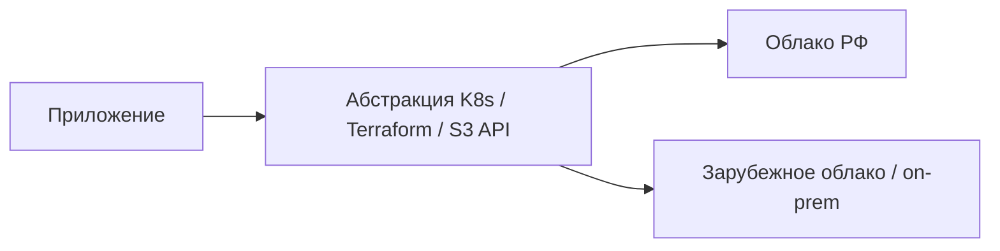
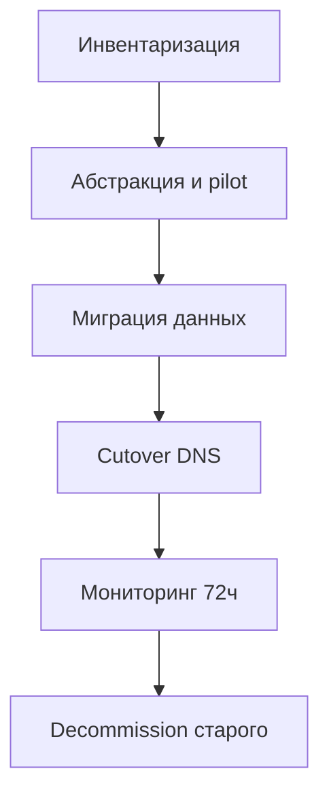
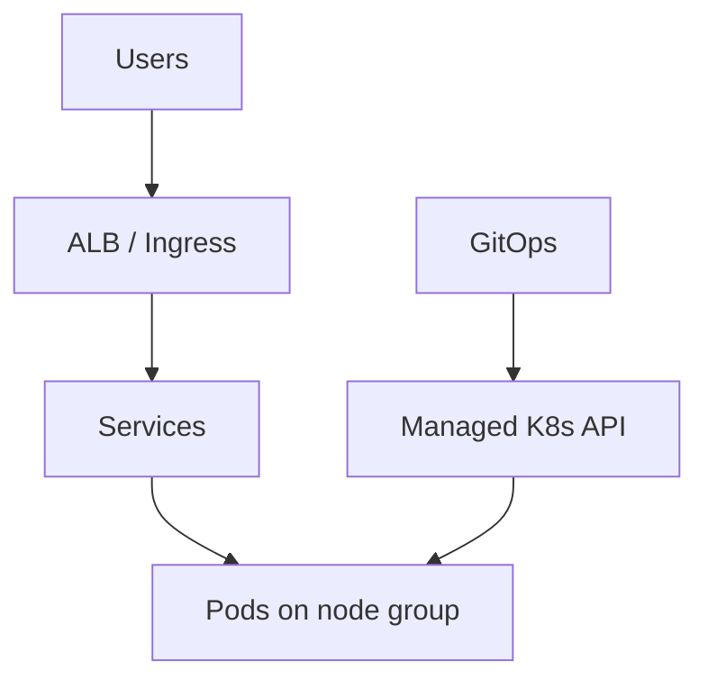
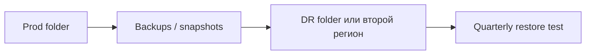

import ExternalPlayEmbed from '@site/src/components/ExternalPlayEmbed';

# Облачные сервисы в РФ

<div class="article-tags">
  <span class="tag tag-required">ОБЯЗАТЕЛЬНО</span>
  <span class="tag tag-beginner">ДЛЯ НОВИЧКОВ</span>
</div>
<span class="complexity-badge">Разработчику</span>
<span class="complexity-badge">Инженеру</span>
<span class="complexity-badge">Аналитику</span>

<ExternalPlayEmbed example="infra-security/ru-cloud-picker-play" title="Облака РФ — подбор" minHeight={380} />
После 2022 года многие команды в России **мигрировали или дублировали** инфраструктуру на отечественные и локальные провайдеры. Облачные **концепции** остаются теми же — меняются **консоли, квоты, compliance и экосистема**.

Термины, которые встретите в любом облаке:

- **IaaS** (Infrastructure as a Service) — виртуальные машины, сети, диски; вы управляете ОС и приложением;
- **PaaS** (Platform as a Service) — managed БД, Kubernetes, serverless; провайдер управляет платформой;
- **SaaS** (Software as a Service) — готовое приложение (почта, CRM);
- **VPC** (Virtual Private Cloud) — изолированная виртуальная сеть;
- **Object Storage** — хранилище файлов по S3-подобному API.

Базовые модели — [8.01/1](/encyclopedia/8-infra-security/8-01-oblachnye-tehnologii/1), shared responsibility — [8.01/12](/encyclopedia/8-infra-security/8-01-oblachnye-tehnologii/12).

<div class="callout callout--info">
  <div class="callout-title">Не юридическая консультация</div>

  <div class="callout-body">
  Требования 152-ФЗ, КИИ (критическая информационная инфраструктура), реестр ПО и локализация ПДн (персональных данных) — согласовывайте с юристами и ИБ. Здесь — техническая карта сервисов для разработчиков и инженеров.
  </div>
</div>

---

## Зачем отдельная карта для РФ

Hyperscale-провайдеры (AWS, Azure, GCP) задают "язык" облака — EC2, S3, RDS, EKS. Российские провайдеры используют **те же идеи**, но другие названия, лимиты и интеграции. Если вы знаете AWS, переход на Yandex Cloud обычно занимает дни — при условии, что стек не завязан на проприетарные сервисы вроде Lambda + DynamoDB streams.

Типичные причины выбора облака РФ:

- хранение и обработка данных **на территории РФ**;
- оплата в рублях и локальные договоры;
- интеграция с госсистемами и отраслевыми регуляторами;
- поддержка на русском языке и локальный NOC (Network Operations Center).

---

## Основные провайдеры (ориентир 2025–2026)

| Провайдер | Сильные стороны | Типичные сервисы |
|-----------|-----------------|------------------|
| **Yandex Cloud** | Зрелая документация, managed K8s, Object Storage, экосystem Яндекса | Compute Cloud, MDB (PostgreSQL, ClickHouse), ALB, IAM, Lockbox |
| **VK Cloud** (бывш. Mail.ru Cloud) | Корпоративный сектор, OpenStack-наследие | ВМ, Kubernetes, DBaaS, S3-совместимое хранилище |
| **Selectel** | IaaS, colocation, прозрачные тарифы, bare metal | VPS/выделенные серверы, object storage, managed DB |
| **Cloud.ru** (SberCloud) | Enterprise, гибрид | Evolution, Advanced, реестровые образы |
| **Ростелеком / RT Cloud** | Госсектор, крупный enterprise | Облако под отраслевые требования |

Документация провайдеров:

- [Yandex Cloud](https://yandex.cloud/ru/docs)
- [VK Cloud](https://cloud.vk.com/docs/ru/)
- [Selectel](https://docs.selectel.ru/)
- [Cloud.ru](https://cloud.ru/docs/)

Сравнение моделей IaaS/PaaS/SaaS — [8.01/1](/encyclopedia/8-infra-security/8-01-oblachnye-tehnologii/1).

---

## Yandex Cloud — обзор для разработчика

**Yandex Cloud (YC)** — один из наиболее документированных провайдеров. Консоль, CLI (`yc`) и Terraform provider зрелые.

### Ключевые сервисы

| Сервис YC | Аналог AWS | Назначение |
|-----------|------------|------------|
| Compute Cloud | EC2 | ВМ, GPU, группы instances |
| Managed Service for Kubernetes | EKS | K8s без control plane ops |
| Managed Service for PostgreSQL | RDS | Postgres с бэкапами, PgBouncer |
| Object Storage | S3 | Статика, бэкапы, data lake |
| Application Load Balancer | ALB | HTTP/HTTPS балансировка |
| Cloud Functions | Lambda | Serverless функции |
| Yandex Lockbox | Secrets Manager | Секреты, версии |
| Cloud Logging / Monitoring | CloudWatch | Логи, метрики, алерты |
| Virtual Private Cloud | VPC | Подсети, NAT, security groups |

### Иерархия ресурсов YC

```
Organization
 └── Cloud (облако)
      └── Folder (каталог) — dev / prod
           └── Resources (ВМ, K8s, БД...)
```

**Folder** — граница для IAM и billing. Разделяйте prod и dev **разными folder**, не полагаясь только на labels.

### Пример Terraform (фрагмент)

```hcl
terraform {
  required_providers {
    yandex = {
      source = "yandex-cloud/yandex"
    }
  }
}

resource "yandex_vpc_network" "main" {
  name = "app-network"
}

resource "yandex_vpc_subnet" "private" {
  name           = "private-a"
  zone           = "ru-central1-a"
  network_id     = yandex_vpc_network.main.id
  v4_cidr_blocks = ["10.0.1.0/24"]
}
```

Логика Terraform та же, что в [8.04/22](/encyclopedia/8-infra-security/8-04-devops-ci-cd/22) — меняется только provider block.

---

## VK Cloud — обзор

**VK Cloud** (ранее Mail.ru Cloud Solutions) ориентирован на enterprise и telecom. Наследие **OpenStack** — знакомо тем, кто работал с private cloud.

| Особенность | Детали |
|-------------|--------|
| OpenStack API | Часть сервисов через Nova, Neutron, Cinder |
| Kubernetes | Managed K8s, интеграция с registry |
| S3 storage | Совместимость с S3 API — проверяйте edge cases |
| Billing | Пакеты для крупных контрактов |

Подходит для компаний с уже существующими OpenStack-навыками и long-term enterprise-контрактами.

---

## Selectel — обзор

**Selectel** силён в **IaaS** и **bare metal** — выделенные серверы без гипервизора. Прозрачные тарифы, дата-центры в РФ.

| Сценарий | Почему Selectel |
|----------|-----------------|
| Predictable load | Dedicated дешевле облака на 3 года |
| Colocation | Свое железо в стойке провайдера |
| Hybrid | Облако + bare metal в одной сети |
| Простой VPS | Быстрый старт без сложной консоли |

Managed DB и object storage есть, но экосystem уже, чем у YC — закладывайте время на R&D.

---

## Cloud.ru (SberCloud) — обзор

**Cloud.ru** — enterprise-платформа с линейками **Evolution** (публичное облако) и **Advanced** (гибрид/on-prem интеграция). Акцент на реестровое ПО и отраслевые сертификаты.

Типичный клиент — крупный банк, госкорпорация, холдинг с требованиями к импортозамещению стека.

---

## Сопоставление с hyperscale-провайдерами

Таблица — **словарь**; точное соответствие API не гарантируется. Всегда читайте документацию перед миграцией.

| Концепция AWS | Yandex Cloud | VK Cloud | Заметка |
|---------------|--------------|----------|---------|
| EC2 | Compute Cloud | Instances | cloud-init, SSH, security groups |
| S3 | Object Storage | Object Storage | S3 API частично совместим — тестируйте SDK |
| RDS PostgreSQL | Managed PostgreSQL | DBaaS Postgres | [8.11 практикум PG](/encyclopedia/8-infra-security/8-11-praktikum-postgresql/intro) |
| EKS | Managed Kubernetes | Managed K8s | GitOps тот же — [8.13](/encyclopedia/8-infra-security/8-13-praktikum-gitops/intro) |
| IAM | IAM / SA | IAM | Prefer short-lived keys, federated auth |
| Secrets Manager | Lockbox | Secret Manager | [практикум Vault](/encyclopedia/8-infra-security/8-14-praktikum-vault/intro) |
| VPC | VPC | VPC / Neutron | Подсети, NAT, peering |
| Route 53 | Cloud DNS | DNS | TTL, health checks |
| CloudWatch | Monitoring | Monitoring | Prometheus export часто доступен |
| SQS / SNS | YMQ | Очереди | **Vendor lock-in** — абстрагируйте |

Полный справочник AWS — [8.04/3118](/encyclopedia/8-infra-security/8-04-devops-ci-cd/3118) — полезен как словарь, даже если prod в YC.

---

## Импортозамещение и мультиоблако

**Импортозамещение** — переход с зарубежного стека на отечественный или self-hosted. **Мультиоблако** — работа с двумя провайдерами одновременно (например, DR-копия в Selectel, prod в YC).



### Что переносится легко

- **Контейнеры и Helm** — образ тот же, registry другой;
- **Terraform** — другой provider block (`yandex`, `vkcs`, `selectel`);
- **12-factor app** — конфиг через env, stateless — [8.07/1153](/encyclopedia/8-infra-security/8-07-informatsionnaya-bezopasnost/1153);
- **PostgreSQL** — dump/restore или logical replication;
- **Prometheus + Grafana** — стек observability переносим;
- **GitOps** — Argo CD/Flux одинаковы в любом K8s.

### Что переносится тяжело

- **Vendor-specific serverless** (привязка к триггерам провайдера);
- **Managed очереди** с proprietary API;
- **Propietary AI/ML** сервисы без open API;
- **Глубокая интеграция IAM** (SSO mapping, custom roles);
- **CDN + WAF** bundle — переконфигурация DNS и сертификатов.

### Стратегия миграции

| Фаза | Действия |
|------|----------|
| 1. Инвентаризация | Список сервисов, зависимостей, data flows |
| 2. Абстракция | K8s, стандартные API, убрать hardcode endpoint'ов |
| 3. Pilot | Staging в облаке РФ, нагрузочные тесты |
| 4. Data migration | БД, object storage, проверка checksum |
| 5. Cutover | DNS switch, rollback plan |
| 6. Decommission | Закрытие старого облака после retention |



---

## Первый проект в Yandex Cloud

Пошаговый скелет для типичного web-приложения.

### Шаг 1. Организация и folder

Создайте **cloud** и два **folder** — `dev` и `prod`. Не смешивайте среды в одном folder — IAM и billing станут запутанными.

### Шаг 2. Service account и IAM

- создайте **service account** (SA) для Terraform и CI;
- выдайте **минимальные роли** (`editor` только на нужный folder);
- **root-ключи** и SA keys на ноутбуке — запретите; используйте OIDC или временные ключи;
- включите ** MFA** на человеческих аккаунтах.

Безопасность аккаунта — [8.01/11](/encyclopedia/8-infra-security/8-01-oblachnye-tehnologii/11).

### Шаг 3. Сеть VPC

```
VPC 10.0.0.0/16
├── public subnet 10.0.0.0/24   — ALB, NAT gateway
├── private app  10.0.1.0/24    — K8s nodes / ВМ приложения
└── private db   10.0.2.0/24    — PostgreSQL, без public IP
```

**Security groups** — default deny, открывайте только нужные порты. БД **никогда** в public subnet.

Сеть — [2.03](/encyclopedia/2-system-network/2-03-set-i-internet/intro), Zero Trust — [8.07/121](/encyclopedia/8-infra-security/8-07-informatsionnaya-bezopasnost/121).

### Шаг 4. Compute

Варианты:

| Вариант | Когда |
|---------|-------|
| Managed Kubernetes | Несколько сервисов, GitOps, autoscaling |
| Compute Cloud ВМ + Docker | Один-два сервиса, простой старт |
| Cloud Functions | Event-driven, мало трафика |

### Шаг 5. База данных

**Managed PostgreSQL** — бэкапы, failover, патчи ОС. Для pet-проекта — одна instance в dev, HA cluster в prod.

Практикум PostgreSQL — [8.11](/encyclopedia/8-infra-security/8-11-praktikum-postgresql/intro).

### Шаг 6. Object Storage

Отдельный **bucket** для:

- статики фронтенда (через CDN);
- бэкапов БД (offsite от compute);
- артефактов CI (с lifecycle policy).

Включите **versioning** и **encryption at rest**.

### Шаг 7. Мониторинг и алерты

- Yandex Monitoring или self-hosted Prometheus;
- алерты на disk > 80%, 5xx rate, DB connections;
- uptime check с внешней точки.

FinOps — [8.16](/encyclopedia/8-infra-security/8-16-finops-pet-project/1).

---

## Безопасность и compliance (технический угол)

| Тема | Практика |
|------|----------|
| 152-ФЗ | Локализация ПДн, шифрование, audit log — [8.07/124](/encyclopedia/8-infra-security/8-07-informatsionnaya-bezopasnost/124) |
| КИИ | Категорирование, сертифицированные СЗИ — с ИБ и юристами |
| Реестр ПО | Проверяйте, входит ли СУБД/ОС в реестр, если требуется |
| Encryption | TLS in transit, KMS для secrets |
| Logging | Centralized logs, retention по политике |
| Backup | 3-2-1 rule — 3 копии, 2 носителя, 1 offsite |

Облачный чек-лист — [8.01/3](/encyclopedia/8-infra-security/8-01-oblachnye-tehnologii/3).

---

## Стоимость и FinOps

Облако РФ не всегда дешевле VPS — плата за **управляемые** сервисы, egress (исходящий трафик), диски SSD.

| Статья расходов | Как контролировать |
|-----------------|-------------------|
| Compute | Rightsizing, spot/preemptible где доступно |
| Managed K8s | Autoscaling node groups, выключение dev ночью |
| Object Storage | Lifecycle — cold storage, удаление старых бэкапов |
| Egress | CDN для статики, сжатие |
| IP addresses | Освобождать неиспользуемые public IP |

Billing alerts в консоли + еженедельный review. Подробнее — [FinOps pet](/encyclopedia/8-infra-security/8-16-finops-pet-project/1).

---

## Когда оставаться on-prem или VPS

Облако — не единственный ответ.

- **Физическое размещение железа** — жёсткое требование аудита;
- **Predictable load** — dedicated на 3 года может быть дешевле;
- **Команда без облачной экспертизы** — [системное администрирование](/encyclopedia/2-system-network/2-06-sistemnoe-administrirovanie/intro);
- **Legacy monolith** — lift-and-shift на одну fat ВМ проще, чем K8s;
- **Air-gapped** среды — облако недоступно по определению.

Гибрид — prod on-prem, burst в облако — возможен, но сложен в сетевой связности.

---

## Managed Kubernetes в облаке РФ

**Managed Kubernetes** (MK8s) снимает с вас control plane — API server, etcd, scheduler. Вы платите за worker nodes и managed fee.

| Задача | Yandex Cloud MK8s | VK Cloud K8s |
|--------|-------------------|--------------|
| Создание cluster | Console / `yc managed-kubernetes` | Console / Terraform |
| Node group | Auto scaling groups | Аналогично |
| Ingress | ALB + Ingress controller | LB + nginx |
| Registry | Container Registry | Harbor / registry |
| CNI | Calico / Cilium | Зависит от версии |

Типичный поток:

1. Создать cluster в private subnet.
2. Node group с autoscaling (min 2, max 10).
3. Установить ingress-nginx или ALB Ingress.
4. cert-manager для Let's Encrypt или internal CA.
5. Argo CD — [GitOps](./4.md) и [практикум 8.13](/encyclopedia/8-infra-security/8-13-praktikum-gitops/intro).



---

## Object Storage — практические паттерны

**Object Storage** — S3-подобное хранилище для файлов любого размера.

| Паттерн | Bucket | Lifecycle |
|---------|--------|-----------|
| Статика фронта | `myapp-static-prod` | CDN перед bucket |
| Бэкапы БД | `myapp-backups` | Delete after 30 days |
| CI artifacts | `myapp-ci` | Delete after 7 days |
| Data lake | `analytics-raw` | Transition to cold tier |

Проверьте совместимость SDK — multipart upload, ACL, presigned URL могут отличаться от AWS. Integration test на staging bucket обязателен.

Шифрование — server-side (KMS провайдера). Bucket policy — deny public access по умолчанию.

---

## DNS и TLS

| Компонент | Практика |
|-----------|----------|
| Cloud DNS | A/AAAA на ALB, CNAME для subdomains |
| Internal DNS | Private zone для service discovery |
| TLS | cert-manager + Let's Encrypt или Yandex Certificate Manager |
| mTLS | Service mesh (Istio/Linkerd) для east-west |

Wildcard cert для `*.dev.example.ru` упрощает staging. Prod — отдельные cert per service или wildcard по политике ИБ.

Сеть — [2.03](/encyclopedia/2-system-network/2-03-set-i-internet/intro).

---

## Disaster recovery в облаке РФ

| Компонент | RPO / RTO ориентир | Механизм |
|-----------|-------------------|----------|
| Managed PostgreSQL | RPO minutes | Automated backups, PITR |
| Object Storage | RPO hours | Cross-region replication |
| K8s workloads | RTO hours | GitOps + second cluster |
| Secrets | RTO minutes | Vault replication |

DR-тест **раз в квартал** — поднять restore в отдельном folder, проверить приложение, задокументировать время.



---

## Матрица выбора провайдера

| Критерий | Yandex Cloud | VK Cloud | Selectel | Cloud.ru |
|----------|--------------|----------|----------|----------|
| Документация | ★★★★★ | ★★★★ | ★★★ | ★★★★ |
| Managed K8s | Да | Да | Ограничено | Да |
| Bare metal | Через partners | Да | ★★★★★ | Да |
| Enterprise / госсектор | Да | Да | Да | ★★★★★ |
| Terraform provider | Зрелый | Зрелый | Есть | Есть |
| FinOps прозрачность | Billing API | Договор | Публичные тарифы | Enterprise quote |

Выбор зависит от **контракта**, **compliance**, **команды** и **existing skills**. Pilot на одном non-critical сервисе перед миграцией prod.

---

## CLI yc — быстрый старт

```bash
# Установка CLI — см. yandex.cloud/ru/docs/cli/quickstart
yc init
yc config list

# Создать folder
yc resource-manager folder create --name myapp-dev

# Service account для CI
yc iam service-account create --name terraform-sa
yc iam access-binding add --role editor --subject serviceAccount:...
```

Используйте **authorized key** только в CI secrets, ротация каждые 90 дней. Prefer **federated credentials** где доступно.

---

## Типичные ошибки при переходе

| Ошибка | Последствие | Решение |
|--------|-------------|---------|
| Assume 100% S3 compatibility | Broken SDK, missing headers | Integration tests на bucket |
| Один folder prod+dev | Утечка prod credentials в dev | Разделение folder + IAM |
| Public IP на БД | Scanning, brute force | Private subnet only |
| Нет egress плана | Surprise bill | CDN, cache, compress |
| Hardcode endpoint'ов | Lock-in | Config через env |
| Skip load test | Prod падает в peak | k6/Locust на staging |

---

## Гибридное облако и on-prem

Многие enterprise в РФ держат **core on-prem**, а **burst** и **DR** — в облаке.

| Сценарий | Архитектура |
|----------|-------------|
| Active-passive DR | Prod on-prem, standby в YC |
| Dev/test в облаке | Prod on-prem, dev folder в YC |
| Data residency | БД on-prem, compute в облаке РФ |
| CDN + origin | Origin в Selectel, CDN провайдера |

Связность — VPN или dedicated link между DC и VPC. Latency между on-prem DB и cloud app — критичный параметр; измеряйте до миграции.

---

## Реестр ПО и отраслевые требования

Технический инженер проверяет:

- входит ли **ОС**, **СУБД**, **K8s distribution** в [реестр отечественного ПО](https://reestr.digital.gov.ru/) — если требует контракт;
- сертификаты ФСТЭК/ФСБ — зона ответственности ИБ;
- audit log retention — [152-ФЗ](/encyclopedia/8-infra-security/8-07-informatsionnaya-bezopasnost/124).

Cloud.ru и RT Cloud часто поставляют **реестровые образы** out of the box.

---

## Observability в облаке РФ

| Сигнал | Yandex Cloud | Self-hosted |
|--------|--------------|-------------|
| Metrics | Yandex Monitoring | Prometheus + remote write |
| Logs | Cloud Logging | Loki |
| Traces | OpenTelemetry export | Tempo/Jaeger |
| Alerts | Alert policies | Alertmanager |

Единый Grafana dashboard для multi-cloud — импорт метрик через Prometheus federation или Mimir.

Мониторинг — [8.04/19](/encyclopedia/8-infra-security/8-04-devops-ci-cd/19).

---

## Billing модели провайдеров

| Модель | Selectel | Yandex Cloud | Enterprise VK/Cloud.ru |
|--------|----------|--------------|------------------------|
| Pay-as-you-go | Часто | Да | Редко |
| Reserved / commit | Dedicated | Commit discounts | Основной формат |
| Invoice | Ежемесячно | Карта + invoice | Договор, КП |

Закладывайте **+15–25%** к калькулятору на egress и рост дисков.

---

## Runbook — миграция одного сервиса в Yandex Cloud

| Фаза | Шаги | Критерий готовности |
|------|------|---------------------|
| Discovery | Inventory зависимостей, DNS, secrets | Диаграмма в Confluence |
| Pilot | Clone staging в folder `dev-migration` | Smoke tests green |
| Cutover | Maintenance window, DNS TTL 300 | Rollback plan подписан |
| Validate | Load test, мониторинг 24 ч | Error rate < baseline |
| Decommission | Старый VPS через 7 дней | Backup archived |

Checklist перед cutover:

- Snapshot БД и проверка restore;
- Lockbox secrets скопированы, старые ключи rotated после;
- SPF/DKIM для новых IP отправки почты;
- FinOps alert на бюджет folder.

---

## Runbook — инцидент недоступности региона

| Шаг | Действие |
|-----|----------|
| 1 | Подтвердить scope — один AZ или весь region |
| 2 | Активировать DR runbook (passive standby или cold) |
| 3 | Переключить DNS на резервный endpoint (TTL заранее снижен) |
| 4 | Restore БД из cross-region backup |
| 5 | Коммуникация статус-страница и клиентам |
| 6 | Post-mortem — сравнение фактического RTO/RPO с планом |

DR drill раз в квартал на non-prod. Для КИИ часто требуют документированный тест восстановления.

---

## Compliance — 152-ФЗ и локализация ПДн

| Область | Техническая мера в облаке РФ | Примечание |
|---------|------------------------------|------------|
| Локализация ПДн | Folder и БД только в region `ru-central1` | Проверка geo в Terraform |
| Учёт доступа | IAM audit log → SIEM | Retention по политике ИБ |
| Шифрование | KMS managed keys, TLS 1.2+ | YC KMS, Cloud.ru KMS |
| Резервное копирование | Snapshot в том же legal region | Cross-border backup запрещён для ПДн |
| Удаление по запросу | Процедура erase в ticket | DPO согласует срок |

Облако РФ **не снимает** ответственность оператора. Shared responsibility — [8.01/12](/encyclopedia/8-infra-security/8-01-oblachnye-tehnologii/12). Юристы оформляют поручение на обработку ПДн с провайдером.

---

## Compliance — КИИ и гостех

| Сценарий | Типичное требование | Технический ответ |
|----------|---------------------|-------------------|
| Гостех | Реестр ПО, сертифицированные СЗИ | Cloud.ru, RT Cloud образы |
| КИИ cat. 1–2 | Изоляция сегментов, журналирование | Dedicated VPC, no public DB |
| Аттестация | Документация конфигурации | Terraform state + audit export |
| Запрет foreign SaaS | Self-hosted Git, мониторинг | GitLab on Selectel |

Инженер готовит **техническое описание** архитектуры для аттестации. Юристы и аккредитованная лаборатория ведут процесс сертификации.

---

## Расширенный пример — SaaS на мультиоблаке РФ

Стартап B2B держит primary в Yandex Cloud, DR в Selectel, CDN через российского провайдера.

| Слой | Primary | DR |
|------|---------|-----|
| Compute | MK8s 3 AZ | MK8s single region |
| DB | Managed PostgreSQL HA | Async replica + manual promote |
| Object Storage | YC bucket + versioning | Selectel bucket sync nightly |
| DNS | Geo DNS health check | Failover to DR IP |
| Secrets | Lockbox | Vault self-hosted replica |

Стоимость DR — ~35% от primary при cold standby. FinOps dashboard показывает cost per environment еженедельно.

---

## Сравнение managed PostgreSQL в облаках РФ

| Критерий | Yandex MDB | VK Cloud DBaaS | Selectel managed DB |
|----------|------------|----------------|---------------------|
| HA failover | Авто | Авто | Зависит от тарифа |
| PgBouncer | Встроен | Проверять tier | Опция |
| Point-in-time recovery | Да | Да | Уточнять SLA |
| Private endpoint | Да | Да | Да |
| Terraform provider | Зрелый | Есть | Есть |
| Минимальный порог | Средний | Средний | Низкий для MVP |

Pilot — поднять один staging instance, прогнать pgBench и backup restore до выбора для prod.

---

## Сравнение Ingress и балансировки

| Продукт | Провайдер | Когда выбирать |
|---------|-----------|----------------|
| Application Load Balancer | Yandex Cloud | K8s Ingress + TLS termination |
| Cloud Load Balancer | VK Cloud | OpenStack legacy + K8s |
| Self-hosted nginx | Любой VPS | Pet-project, полный контроль |
| CDN + origin | Selectel, EdgeCenter | Статика, снижение egress |

Для API с mTLS между сервисами ALB терминирует только edge TLS. Внутри mesh — [8.05/111](/encyclopedia/8-infra-security/8-05-mikroservisy-i-integratsiya/111).

---

## Региональная специфика — оплата и договоры

| Тип клиента | Типичная модель | Рекомендация |
|-------------|-----------------|--------------|
| Стартап | Pay-as-you-go, карта | Yandex Cloud, Selectel |
| SMB | Invoice + commit | Сравнить commit discount |
| Enterprise госсектор | КП, реестр, NDA | Cloud.ru, RT Cloud |
| Иностранный филиал в РФ | Рублёвый договор | Юридическое лицо в РФ обязательно |

Закладывайте время на согласование договора 2–8 недель для enterprise. Технический pilot можно начать на pay-as-you-go параллельно.

---

## Расширенный пример — lift-and-shift за 30 дней

| Неделя | Задача | Результат |
|--------|--------|-----------|
| 1 | Inventory, Terraform modules VPC | Staging folder |
| 2 | Migrate stateless apps | CI deploy to YC |
| 3 | Managed PostgreSQL, cutover DNS | Prod traffic 10% |
| 4 | Full cutover, decommission VPS | Prod 100% |

Rollback window — держите старый VPS 14 дней с read-only DB replica.

---

## Runbook — превышение квоты cloud

| Шаг | Действие |
|-----|----------|
| 1 | Alert FinOps — quota CPU/RAM/IP |
| 2 | Request increase через support ticket |
| 3 | Temporary scale down non-prod |
| 4 | Review orphan resources — unused disks, IPs |
| 5 | Post-mortem — quota planning в roadmap |

Закладывайте **quota headroom 30%** перед Black Friday и batch jobs.

---

## Сравнение backup managed DB

| Критерий | Yandex MDB | VK DBaaS | Self-managed on VPS |
|----------|------------|----------|---------------------|
| Automated backup | Daily + PITR | Daily | Вы настраиваете |
| Cross-region copy | Same region policy | Check SLA | Manual rsync |
| Restore test | Quarterly drill | Quarterly drill | Обязательно |
| RPO типичный | 5–15 min | 15–30 min | Зависит от cron |
| Ops burden | Низкий | Низкий | Высокий |

Restore test **обязателен** — backup без проверенного restore не считается backup.

---

## Compliance — трансграничная передача

| Данные | Разрешено | Запрет |
|--------|-----------|--------|
| ПДн граждан РФ | Хранение в РФ | Primary DB в EU/US |
| Обезличенные метрики | Aggregated export | Raw logs с IP |
| Backup | Same legal region | Cross-border snapshot |
| Support ticket | Vendor DPA РФ | Foreign без DPA |

При мультиоблаке — **metadata** в РФ, приложение stateless может burst abroad только без ПДн в payload.

---

## Runbook — Object Storage bucket accidentally public

| Шаг | Действие |
|-----|----------|
| 1 | Block public ACL immediately |
| 2 | Audit access logs — suspicious GET |
| 3 | Rotate keys для affected integrations |
| 4 | Scan bucket listing — PII exposure |
| 5 | Notify DPO if ПДн affected |
| 6 | Policy-as-code deny public buckets |

Terraform `aws_s3_bucket_public_access_block` equivalent — включите на уровне org policy YC/VK.

---

## Связанные материалы

- [Облачные технологии — чек-лист](/encyclopedia/8-infra-security/8-01-oblachnye-tehnologii/3).
- [Terraform EC2→ALB](/encyclopedia/8-infra-security/8-04-devops-ci-cd/22) — логика та же для другого provider.
- [152-ФЗ и аудит](/encyclopedia/8-infra-security/8-07-informatsionnaya-bezopasnost/124).
- [Сеть и интернет](/encyclopedia/2-system-network/2-03-set-i-internet/intro) — VPC, DNS, firewall.
- [GitOps](./4.md) — delivery в managed K8s.
- [Platform Engineering](./6.md) — IDP поверх облака РФ.

---
