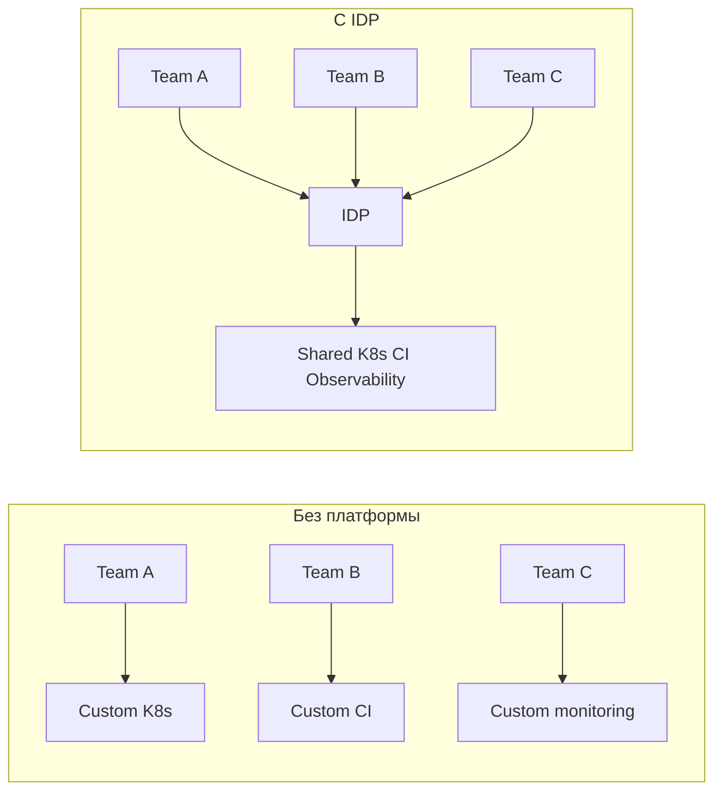
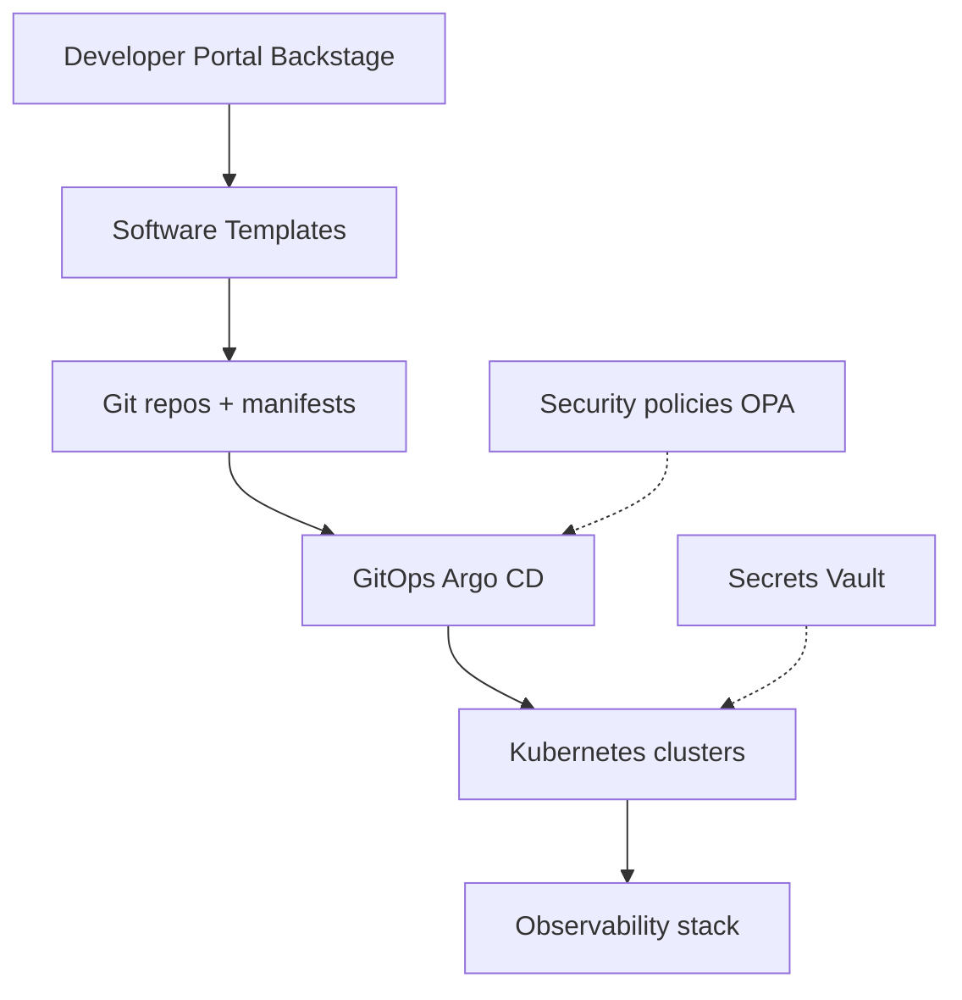
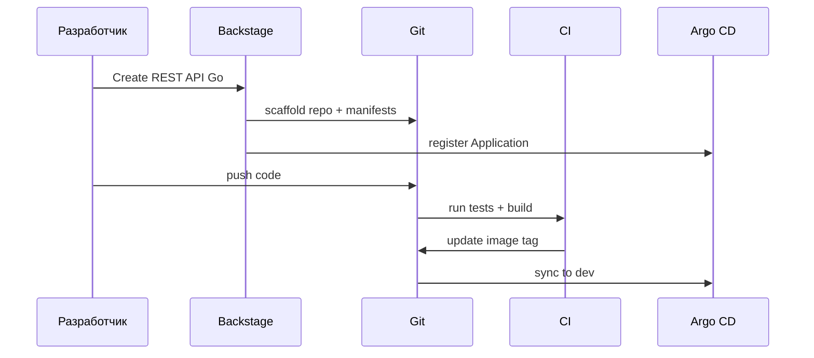
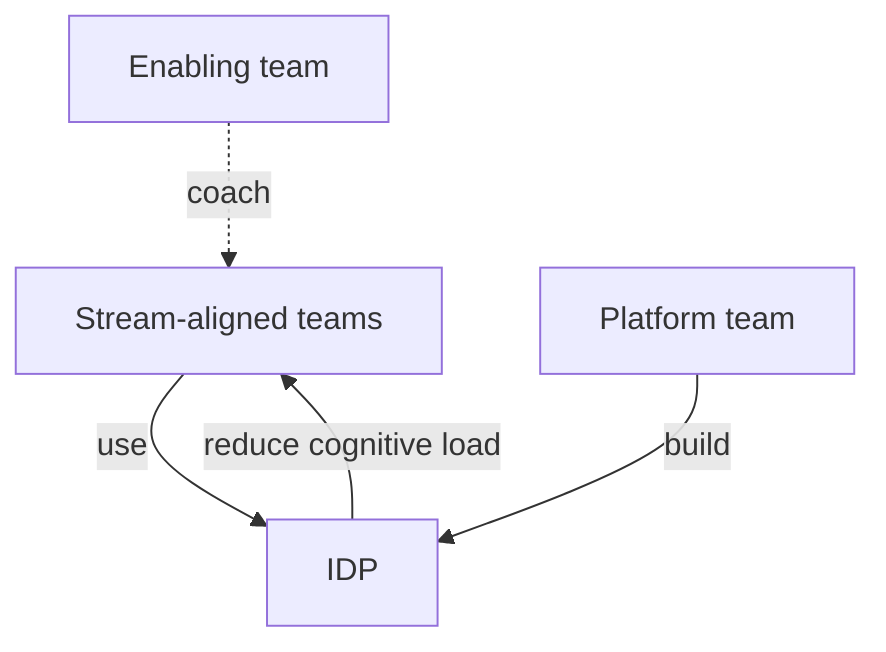

# Platform Engineering

<div class="article-tags">
  <span class="tag tag-required">ОБЯЗАТЕЛЬНО</span>
</div>

<span class="complexity-badge">Инженеру</span>
<span class="complexity-badge">Архитектору</span>

**Platform Engineering** (инженерия платформы) — дисциплина построения **Internal Developer Platform (IDP, внутренняя платформа разработчика)**. IDP даёт product-командам опыт, похожий на публичное облако, но внутри компании.

Разработчик выбирает **golden path** (рекомендованный маршрут) — например, "новый REST API на Go + PostgreSQL + CI" — и получает репозиторий, пайплайн, мониторинг и документацию **из коробки**, без недельной переписки "дайте kubeconfig и Helm chart".

Platform Engineering **дополняет** DevOps и SRE — переупаковывает их работу в переиспользуемые capability (возможности) для всей организации.

---

## Ключевые термины

| Термин | Расшифровка |
|--------|-------------|
| **IDP** | Internal Developer Platform — внутренний cloud-like слой |
| **Golden path** | Поддерживаемый платформой шаблон создания сервиса |
| **Platform team** | Команда, которая строит и поддерживает IDP |
| **Product team** | Команда, которая пишет фичи для пользователей |
| **Self-service** | Разработчик сам создаёт ресурсы без ticket |
| **Thinnest viable platform** | Минимум платформы, достаточный для ценности |

---

## Проблема, которую решают

По мере роста компании каждая product-команда изобретает свой способ деплоя, мониторинга и секретов. DevOps тонет в однотипных tickets. Безопасность не может enforce baseline — слишком много уникальных конфигураций ("снежинок").

| Без платформы | С IDP |
|---------------|-------|
| Каждая команда пишет свой Helm/CI | Шаблон + 3 параметра |
| "Кому написать kubeconfig?" | Self-service portal |
| 40 способов деплоя | 2–3 одобренных golden paths |
| DevOps тонет в tickets | Platform team строит capability |
| Onboarding недели | Onboarding часы |

DevOps **смещает фокус** с ручных задач на **платформенные capability** — [8.04/17](/encyclopedia/8-infra-security/8-04-devops-ci-cd/17).



---

## Слои IDP

Полноценная платформа — это несколько слоёв. Не обязательно внедрять все сразу.



| Слой | Назначение | Примеры |
|------|------------|---------|
| **Portal** | Единая точка входа, catalog, docs | Backstage, Port, Cortex, custom |
| **Templates** | Scaffolding новых сервисов | Cookiecutter, Backstage Scaffolder |
| **Infra** | Compute, network, data | K8s, Terraform, Crossplane |
| **Delivery** | Деплой и promotion | GitOps, Argo Rollouts — [GitOps](./4.md) |
| **Observability** | Metrics, logs, traces | Prometheus, Grafana, Loki — [8.04/19](/encyclopedia/8-infra-security/8-04-devops-ci-cd/19) |
| **Security** | Policy, secrets, identity | OPA, Kyverno, Vault — [DevSecOps](./3.md) |
| **FinOps** | Cost visibility | Kubecost, cloud billing API — [8.16](/encyclopedia/8-infra-security/8-16-finops-pet-project/1) |

CNCF whitepaper — [platform engineering TAG](https://tag-app-delivery.cncf.io/whitepapers/platform/).

---

## Developer Portal

**Developer Portal** — витрина платформы. Разработчик видит:

- **Software catalog** — список сервисов, владельцы, SLA;
- **Templates** — форма "создать микросервис";
- **Docs** — TechDocs рядом с кодом;
- **API** — OpenAPI, gRPC proto;
- **Status** — интеграция с Grafana/incident.

### Backstage (Spotify)

**Backstage** — open-source portal от Spotify, де-facto стандарт. Плагины для Kubernetes, Argo CD, Terraform, PagerDuty.

| Компонент | Роль |
|-----------|------|
| **Software Catalog** | Entities (Component, System, API) |
| **Scaffolder** | Templates → новый repo + CI + Argo App |
| **TechDocs** | MkDocs из repo |
| **Plugins** | Расширяемость |

Backstage необязателен с первого дня — см. раздел "Малый старт" ниже.

---

## Golden path

**Golden path** — рекомендованный, **поддерживаемый** платформой маршрут. Самый простой и безопасный путь, при этом существуют и альтернативы через escape hatch.

### Типичный golden path

1. Разработчик открывает portal → "REST API Go".
2. Заполняет имя, team, repo visibility.
3. Scaffolder создаёт Git repo, CI, Helm, Argo Application, dashboard, catalog entry.
4. Первый PR проходит CI → merge → auto-deploy в dev.
5. Promotion в staging/prod — PR в infra overlay.



### Escape hatch

**Escape hatch** — выход за шаблон с review platform team. Без escape hatch платформу обходят через shadow IT; без review — хаос возвращается. Баланс — 80% сервисов на golden path, 20% с обоснованным exception.

---

## Platform team и product team

| Platform team | Product team |
|---------------|--------------|
| SLO платформы (API K8s, CI uptime) | SLO продукта для пользователей |
| Шаблоны, кластеры, cost allocation | Бизнес-логика и UX |
| Enforce baseline security | Feature flags, A/B тесты |
| Roadmap capability | Roadmap продукта |

Platform team **даёт инструменты** для self-service, а не выполняет каждый деплой.

### Метрики платформы (DORA + свои)

| Метрика | Что измеряет |
|---------|--------------|
| **Lead time for changes** | Commit → prod |
| **Deployment frequency** | Как часто деплоят |
| **Change fail rate** | % деплоев с инцидентом |
| **MTTR** | Время восстановления |
| **Time to first PR** | Новый сервис → первый merge |
| **% на golden path** | Доля сервисов на шаблоне |
| **Ticket deflection** | Снижение infra-tickets |

SRE — [8.04/2111](/encyclopedia/8-infra-security/8-04-devops-ci-cd/2111).

---

## Crossplane и Infrastructure as Code

**Crossplane** — K8s-native provision облачных ресурсов (RDS, S3, VPC) через CRD. Platform team публикует **Compositions** — claim "PostgreSQL small" для product team.

| Подход | Плюсы |
|--------|-------|
| Terraform only | Зрелость, много providers |
| Crossplane | Единая модель с K8s, self-service claims |
| Hybrid | Terraform для foundation, Crossplane для app-level |

Terraform — [8.04/22](/encyclopedia/8-infra-security/8-04-devops-ci-cd/22).

---

## Безопасность в IDP

Platform team embeds security **по умолчанию**:

- Pod Security Standards / restricted profile;
- NetworkPolicy deny-all + allowlist;
- Secrets через Vault / External Secrets — [8.14](/encyclopedia/8-infra-security/8-14-praktikum-vault/intro);
- Image scan в CI — Trivy, [DevSecOps](./3.md);
- OPA/Kyverno — no privileged, no latest tag.

Product team отключает baseline только через exception ticket.

---

## GitOps как двигатель delivery

IDP использует **GitOps** — [GitOps](./4.md):

- Scaffolder кладёт Argo Application в infra-repo;
- product team меняет image через CI PR;
- platform team управляет cluster-addons тем же способом.

Единый Git history для audit — [152-ФЗ](/encyclopedia/8-infra-security/8-07-informatsionnaya-bezopasnost/124).

---

## С чего начать малой компании

Принцип **thinnest viable platform**.

### Минимальный набор (неделя 1–2)

1. Reference repo — Dockerfile, Helm, CI, README.
2. GitHub Actions template или org-level workflow.
3. Helm chart "стандартный микросервис".
4. Документ "как создать сервис за 30 минут".
5. K8s namespace per team + RBAC.

### Средний уровень (3–6 месяцев)

6. Argo CD — [практикум GitOps](/encyclopedia/8-infra-security/8-13-praktikum-gitops/intro).
7. Loki + Prometheus.
8. Vault или cloud secret manager.
9. Kyverno baseline.

### Зрелая платформа (6–12 месяцев)

10. Backstage catalog + Scaffolder.
11. Cost allocation по team.
12. Multi-cluster dev/staging/prod.
13. Platform SLO в Grafana.

---

## Platform Engineering и микросервисы

MSA без платформы умножает операционную нагрузку. IDP снижает стоимость эксплуатации — [экосистема MSA](/encyclopedia/7-project/7-06-proektirovanie-i-arhitektura/design/118#ekosistema-msa).

| Без IDP | С IDP |
|---------|-------|
| 20 repo × 20 CI configs | 1 template, 20 параметров |
| 20 способов log format | Стандартный JSON + trace id |
| 20 dashboard с нуля | Dashboard из шаблона |

---

## Platform Engineering и ИИ

**AgentOps** и AI в IDE усиливают IDP при обязательных gates — [Безопасность ИИ](./7.md), [AgentOps](/encyclopedia/8-infra-security/8-04-devops-ci-cd/2151), [8.04/2153](/encyclopedia/8-infra-security/8-04-devops-ci-cd/2153).

---

## Пример catalog-info.yaml

```yaml
apiVersion: backstage.io/v1alpha1
kind: Component
metadata:
  name: payments-api
  description: API платежей
  tags: [go, golden-path]
spec:
  type: service
  lifecycle: production
  owner: team-payments
  system: checkout
```

---

## Internal API платформы

| Capability | Интерфейс | SLA |
|------------|-----------|-----|
| Namespace | Portal / Terraform | 1 hour |
| DB small | Crossplane claim | 4 hours |
| Secrets | Vault path | Immediate |
| CI runner | Org Actions | 99% uptime |

---

## SLO platform team

| SLI | SLO |
|-----|-----|
| K8s API availability | 99.9% |
| CI success rate | 98% |
| Provision namespace p95 | < 1h |
| Golden path adoption | > 70% |

---

## Карта capability по зрелости

| Level | Capability |
|-------|------------|
| 0 | Reference repo, shared CI |
| 1 | Helm, GitOps, central logs |
| 2 | Portal, Scaffolder, Vault |
| 3 | Crossplane, FinOps per team |
| 4 | Multi-region DR, platform SLO |

---

## Scaffolder template (идея)

```yaml
apiVersion: scaffolder.backstage.io/v1beta3
kind: Template
metadata:
  name: rest-api-go
  title: REST API на Go
spec:
  parameters:
    - properties:
        name: { type: string }
        owner: { type: string }
  steps:
    - action: fetch:template
      input: { url: ./skeleton }
    - action: publish:github
```

---

## Стоимость platform team

| Роль | FTE (50–200 dev) |
|------|------------------|
| Platform engineer | 3–5 |
| SRE shared | 1–2 |
| Security champion | 0.5 |

ROI — lead time, ticket deflection.

---

## Типичные антиpatterns

| Антиpattern | Альтернатива |
|-------------|--------------|
| Platform без users | User research |
| Ticket-only | Self-service |
| Слишком много paths | 2–3 golden paths |
| Big bang Backstage | Reference repo first |

---

## Организационная модель

| Модель | Описание |
|--------|----------|
| Centralized | 5–15 инженеров на org |
| Embedded | 1 platform eng per tribe |
| Enabling team | Consult + capability |

Backlog — от реальных болей пользователей, без проектов ради модных технологий.

---

## Team Topologies и взаимодействие

**Team Topologies** (Матthew Skelton, Manuel Pais) описывает четыре типа команд:

| Тип | Роль |
|-----|------|
| Stream-aligned | Delivery фич (product teams) |
| Platform | IDP, self-service |
| Enabling | Временная помощь, обучение |
| Complicated-subsystem | Глубокая экспертиза (ML, billing) |

Platform team — **platform** или **enabling**. Stream-aligned команды — **клиенты** платформы. Enabling заходит на 2–3 спринта, помогает мигрировать на golden path, уходит.



---

## Cognitive load

Platform Engineering снижает **cognitive load** (когнитивную нагрузку) разработчика. Product engineer знает Go и бизнес-домен — ему не нужно знать Istio, cert-manager и 15 CRD на старте.

| Тип нагрузки | Пример | Кто снимает |
|--------------|--------|-------------|
| Intrinsic | Сложность домена | Product team |
| Extraneous | Helm, K8s YAML | Platform team |
| Germane | Архитектурные решения | Shared |

---

## Порталы кроме Backstage

| Portal | Особенность |
|--------|-------------|
| **Backstage** | Open source, plugins, Spotify origin |
| **Port** (getport.io) | SaaS, scorecards |
| **Cortex** | SLO, ownership, scorecards |
| **Custom** | Confluence + scripts — быстрый MVP |

MVP — Markdown catalog в Git + script create-repo. Backstage — когда > 20 сервисов и нужен Scaffolder.

---

## FinOps в IDP

Platform team даёт **visibility** затрат:

- label `team`, `cost-center` на namespace;
- Kubecost или cloud billing export в Grafana;
- monthly report per team;
- alerts на аномалии (dev cluster left at max nodes).

Подробнее — [FinOps 8.16](/encyclopedia/8-infra-security/8-16-finops-pet-project/1).

---

## Onboarding нового разработчика

| День | Актivity |
|------|----------|
| 1 | Portal tour, golden path doc |
| 2 | Create test service from template |
| 3 | First PR, CI green, deploy to dev |
| 5 | Observability — найти свой dashboard |

Цель — **first PR merge < 3 days** для типового сервиса.

---

## Case study — fintech startup

Компания 40 разработчиков, 12 микросервисов, боль — каждый серvice свой CI.

| Этап | Действие | Результат |
|------|----------|-----------|
| М1 | Reference repo + org workflow | 3 новых сервиса на шаблоне |
| М2 | Argo CD + infra-repo | Git audit, rollback через revert |
| М3 | Backstage catalog | Owner и dashboard видны всем |
| М4 | Kyverno + Vault | 0 plain secrets в Git |
| М6 | Crossplane postgres-small | DB за 15 min self-service |

Lead time commit→prod с 5 дней до 4 часов. Infra tickets −60%.

---

## Roadmap platform team (квартал)

| Квартал | Deliverable | Metric |
|---------|-------------|--------|
| Q1 | Reference + GitOps | 3 teams onboarded |
| Q2 | Portal MVP + 2 templates | 50% golden path |
| Q3 | Vault + policy | 0 critical scan findings |
| Q4 | FinOps dashboard | Cost per team visible |

Roadmap согласуется с product leadership — platform **служит** delivery, а не блокирует.

---

## Интеграция с облаком РФ

IDP поверх Yandex Cloud или VK Cloud — [облака РФ](./5.md):

- Terraform modules для VPC + MK8s;
- Lockbox вместо hardcoded secrets;
- Container Registry в том же cloud;
- GitOps — [8.13](/encyclopedia/8-infra-security/8-13-praktikum-gitops/intro).

Platform team публикует **approved modules** — product team не пишет VPC с нуля.

---

## Service catalog metadata

Расширяйте catalog для observability и on-call:

```yaml
metadata:
  annotations:
    backstage.io/techdocs-ref: dir:.
    grafana/dashboard-url: https://grafana/d/payments
    pagerduty.com/service-id: PXXXX
spec:
  dependsOn:
    - component:default/postgres-payments
  dependencyOf:
    - component:default/checkout-web
```

Граф зависимостей помогает при incident и blast radius analysis.

---

## Platform API versioning

Internal API платформы (Terraform modules, Crossplane claims) — **version semver**:

- `postgres-small/v1` — breaking change только в v2 с migration guide;
- changelog в Git;
- deprecation window 90 days.

Product team pin'ит версию module — предсказуемые upgrades.

---

## Миграция legacy на golden path

| Фаза | Действие |
|------|----------|
| Assess | Inventory сервисов |
| Prioritize | По риску и traffic |
| Wrap | Helm вокруг legacy |
| Move | GitOps Application |
| Retire | Удалить snowflake CI |

Pilot на 2 сервисах, затем масштабирование.

---

## User research platform team

Раз в квартал — interview с product dev: что блокирует деплой, где обходят платформу. Backlog platform начинается с этих инсайтов.

---

## Runbook — портал разработчика недоступен

| Шаг | Действие | SLA |
|-----|----------|-----|
| 1 | Проверить health Backstage / Port | 5 мин |
| 2 | Fallback — README golden path в Git | 10 мин |
| 3 | Scaffolder недоступен — manual template clone | 15 мин |
| 4 | GitOps и CI работают — деплой не блокируется | — |
| 5 | Root cause — DB catalog, OAuth IdP, ingress | 4 ч |
| 6 | Post-mortem, status page для platform | 24 ч |

Platform team публикует **offline golden path** PDF в intranet на случай длительного outage портала.

---

## Runbook — self-service застрял на provisioning

Симптом: разработчик создал сервис из template, Terraform/Crossplane завис в `Pending`.

| Шаг | Действие |
|-----|----------|
| 1 | Проверить Crossplane events и provider logs |
| 2 | Quota cloud folder — лимит ВМ или IP |
| 3 | IAM service account platform — expired key |
| 4 | Rollback claim, уведомить пользователя с ETA |
| 5 | Fix provider, replay claim |

SLO platform — **95% provisioning < 30 min**. Алерт на claims старше 45 min.

---

## Compliance — platform как контрольная точка

| Стандарт | Как IDP помогает | Артефакт |
|----------|------------------|----------|
| ISO 27001 A.8 | Единые secure defaults | Template checklist |
| PCI DSS | Segregation prod/non-prod | Separate clusters |
| 152-ФЗ | Logging access к prod | SSO + audit |
| SOC 2 | Change management через Git | PR history |
| Internal policy | Kyverno на все golden paths | Policy report |

Platform team ведёт **control matrix** — строка на каждый golden path и связанный gate в CI.

---

## Расширенный пример — госсектор, реестровый стек

Министерство внедряет IDP на базе GitLab self-hosted (Selectel) и MK8s Cloud.ru.

| Компонент | Решение |
|-----------|---------|
| Portal | Backstage on-prem |
| Git | GitLab HA, geo не требуется |
| Delivery | Flux, manual sync prod |
| Registry | Harbor с scan Trivy |
| Secrets | Vault HA on-prem |
| DB template | Crossplane → реестровый Postgres |

Product team создаёт сервис только из **двух одобренных templates** — web API и batch worker. Отклонение — architecture review board раз в месяц.

Onboarding нового подрядчика — guest account в GitLab, catalog read-only, deploy только через merge request с двумя внутренними reviewer.

---

## Сравнение developer portal

| Портал | Модель | Catalog | Scaffolder | Self-hosted |
|--------|--------|---------|------------|-------------|
| **Backstage** | Open source | Да | Да | Да |
| **Port** | SaaS / hybrid | Да | Да | Hybrid |
| **Cortex** | SaaS | Scorecards | Ограничен | Нет |
| **Custom wiki** | Internal | Вручную | Нет | Да |

Backstage — default для команд с 20+ разработчиками и appetite на поддержку plugins. Port ускоряет старт, если нет ресурса на ops Backstage.

---

## Сравнение provisioning — Crossplane, Terraform, Helm only

| Подход | Self-service UX | Drift control | Кривая обучения |
|--------|-----------------|---------------|-----------------|
| **Crossplane claims** | Высокий | Reconcile loop | Высокая |
| **Terraform Cloud workspaces** | Средний | Plan/apply audit | Средняя |
| **GitOps manifests only** | Низкий | Argo/Flux | Низкая |
| **Ticket to DevOps** | Нет | Ручной | Низкая |

Зрелый IDP — Crossplane для data plane (DB, bucket), GitOps для app plane (Deployment, Service).

---

## Platform Engineering в РФ — кадры и процессы

| Фактор | Рекомость | Практика |
|--------|-----------|----------|
| Дефицит SRE | Высокая | Platform team 4–6 человек на 50 dev |
| Импортозамещение | Обязательно в гостech | Approved module library |
| Подрядчики | Часто | Guest templates, time-bound access |
| Документация | На русском | TechDocs в Backstage |
| FinOps в рублях | Billing API YC/VK | Dashboard per team label |

Platform roadmap согласуют с **IT директором** и product leads раз в квартал. Метрика успеха — lead time и ticket volume, не количество microservices.

---

## Расширенный пример — e-commerce, Black Friday

Платформа готовит **capacity golden path** за 6 недель до пика.

| Неделя | Deliverable |
|--------|-------------|
| W-6 | HPA и VPA шаблоны в catalog |
| W-4 | Load test gate в staging CI |
| W-2 | Runbook scale-out, on-call roster |
| W-0 | FinOps cap снят, мониторинг saturation |

Product team масштабирует replicas через self-service slider в portal (обёртка над HPA max). Platform team не участвует в каждом изменении — только в инцидентах.

---

## Runbook — degraded golden path template

| Шаг | Действие |
|-----|----------|
| 1 | Pin template version в portal — block new scaffolds |
| 2 | Notify teams — use previous version |
| 3 | Fix template, CI test scaffold e2e |
| 4 | Publish changelog, unblock |

Каждый template — CI job создаёт ephemeral service и проверяет deploy до publish.

---

## Compliance — SLA platform team наружу

| Metric | Target | Измерение |
|--------|--------|-----------|
| Portal uptime | 99.5% | Synthetic check |
| Scaffold success | 95% | Portal analytics |
| Provisioning time | p95 < 30 min | Crossplane metrics |
| Incident response | 30 min ack | PagerDuty |

Публикуйте status page для internal platform — доверие product team растёт.

---

## Расширенный пример — platform metrics dashboard

| Panel | Query source | Цель |
|-------|--------------|------|
| Lead time | Git + Argo CD | < 4 h to prod |
| Scaffold rate | Portal API | Adoption golden path |
| Failed provisions | Crossplane | < 5% |
| Support tickets | Jira label `platform` | Down trend |
| Cost per team | Kubecost | FinOps visibility |

Review dashboard на platform sync каждые 2 недели с product representatives.

---

## Сравнение Backstage plugins must-have

| Plugin | Назначение | Приоритет |
|--------|------------|-----------|
| Kubernetes | Pod status in catalog | P0 |
| Argo CD | Sync status | P0 |
| TechDocs | Docs from repo | P0 |
| Grafana | Dashboard links | P1 |
| PagerDuty | On-call | P1 |
| Scorecards | Maturity | P2 |

Не устанавливайте 40 plugins в первый месяц — cognitive load на platform team.

---

## Runbook — Crossplane provider credentials expired

| Шаг | Действие |
|-----|----------|
| 1 | All claims Pending — check provider pod logs |
| 2 | Rotate cloud SA key in Lockbox |
| 3 | Update ProviderConfig secret |
| 4 | Replay failed claims |

Rotation SA каждые 90 days calendar reminder platform on-call.

---

## Compliance — platform access для подрядчиков

| Правило | Реализация |
|---------|------------|
| Time-bound access | GitLab guest 90 days max |
| Scope | Single project AppProject |
| MFA | Mandatory WebAuthn |
| Audit | Weekly access review |
| Offboard | Same-day revoke ticket |

Подрядчик не получает cluster-admin — только namespace scoped через RBAC template.

---

## Расширенный пример — IDP для data platform team

Data engineers получают golden path `spark-job` — отдельный от `rest-api`.

| Template | Includes |
|----------|----------|
| spark-job | Airflow DAG stub, S3 bucket claim, IAM |
| rest-api | K8s Deployment, Ingress, Postgres |

Разные AppProject — data team не деплоит в payment namespace.

---

## Связанные материалы

- [SRE](/encyclopedia/8-infra-security/8-04-devops-ci-cd/2111).
- [GitOps](./4.md).
- [DevSecOps](./3.md).
- [Облака РФ](./5.md).
- [Микросервисы — MSA](/encyclopedia/7-project/7-06-proektirovanie-i-arhitektura/design/118#ekosistema-msa).
- [Проект и фреймворки](/encyclopedia/4-code-dev/4-04-proekt-i-freymvorki/intro).
- CNCF [platform whitepaper](https://tag-app-delivery.cncf.io/whitepapers/platform/).

---
