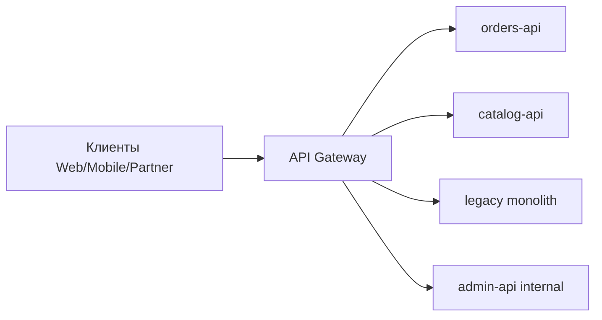
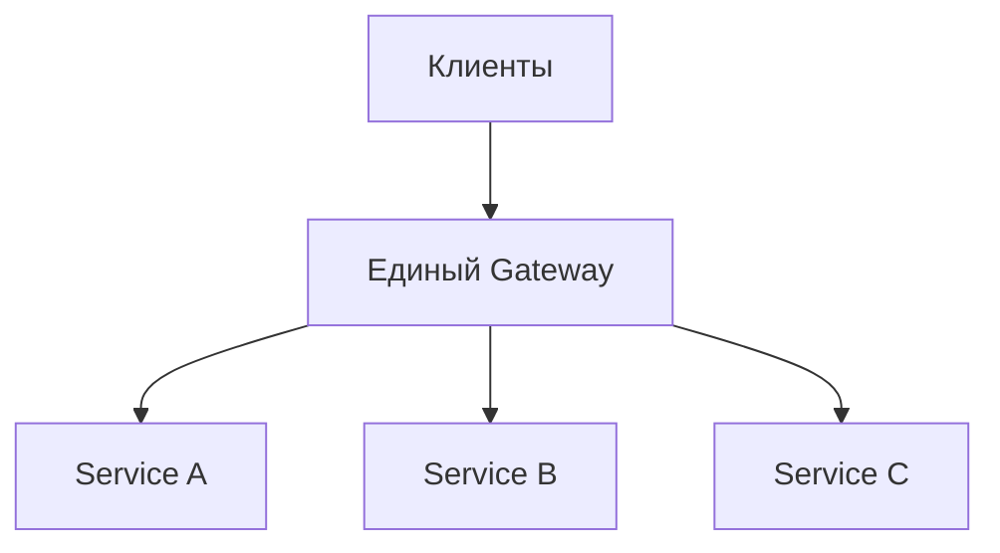
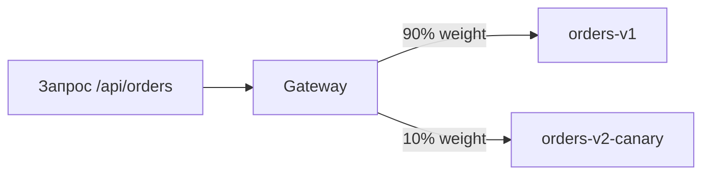
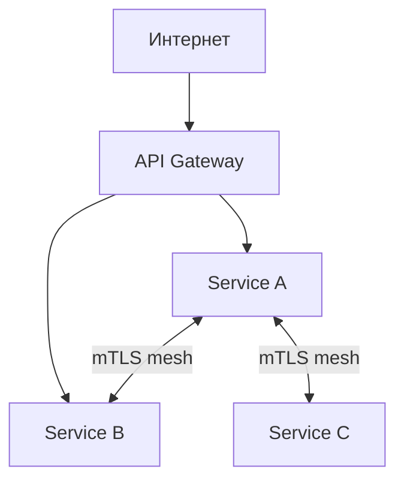
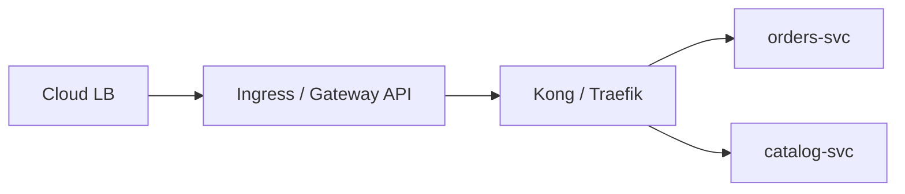

# API Gateway

<div class="article-tags">
  <span class="tag tag-required">ОБЯЗАТЕЛЬНО</span>
</div>

<span class="complexity-badge">Разработчику</span>
<span class="complexity-badge">Инженеру</span>
<span class="complexity-badge">Архитектору</span>

Когда у продукта один backend, клиенты обращаются к нему напрямую. Когда сервисов десять, клиенту неудобно знать адрес каждого. **API Gateway** — единая "дверь" для всех внешних запросов. Он принимает трафик, завершает TLS, проверяет токены, ограничивает частоту запросов и направляет вызовы к нужному микросервису.

Эта статья объясняет, зачем нужен gateway, чем он отличается от балансировщика нагрузки, какие решения выбрать и как настроить безопасность на периметре.

**API Gateway** — программный компонент на границе системы. Он понимает HTTP: path, headers, метод, тело запроса. На основе этих данных применяет политики и маршрутизирует трафик.



---

## Gateway и балансировщик нагрузки

**Load balancer** (балансировщик нагрузки) распределяет трафик между **копиями одного сервиса**. Он работает на уровне L4 (TCP) или простого L7 (один hostname → пул серверов). Не разбирает `/api/v1/orders` и `/api/v1/users` как разные политики.

**API Gateway** работает на уровне L7 HTTP и знает структуру API:

- Маршрутизация по path и host
- Версионирование (`/v1/`, `/v2/`)
- Аутентификация и авторизация
- Rate limiting per client
- Трансформация запросов и ответов

| Аспект | Балансировщик | API Gateway |
|--------|---------------|-------------|
| Уровень | L4 или простой L7 | Полный L7 HTTP |
| Маршрутизация | На один сервис | На много сервисов по path |
| Auth | Обычно нет | JWT, API key, OAuth |
| Rate limit | Базовый или нет | Per consumer, per route |
| Типичный пример | AWS NLB, HAProxy | Kong, nginx, AWS API Gateway |

На практике слои **складываются**: cloud ALB балансирует трафик на несколько инстансов Kong, а Kong маршрутизирует на микросервисы. Подробнее — [8.05/111](/encyclopedia/8-infra-security/8-05-mikroservisy-i-integratsiya/111).

---

## Когда нужен API Gateway

| Ситуация | Решение |
|----------|---------|
| Один monolith, один домен | Достаточно reverse proxy (nginx) |
| 3+ микросервиса с внешним API | Gateway оправдан |
| Разные команды, разные релизы | Gateway скрывает внутреннюю топологию |
| Партнёрские API с billing | Gateway для ключей и квот |
| Canary / blue-green на уровне API | Gateway переключает процент трафика |

Gateway **не обязателен** на старте. Добавляйте, когда появляется боль от множества endpoint, дублирования TLS и auth в каждом сервисе.

---

## Задачи gateway на периметре

| Функция | Что делает | Результат для команды |
|---------|------------|----------------------|
| **TLS termination** | Принимает HTTPS, внутри — HTTP или mTLS | Сертификаты в одном месте, автообновление |
| **Routing** | `/api/orders` → orders-service:8080 | Клиент видит один домен |
| **Authentication** | Проверка JWT, API key, OAuth introspection | Сервисы доверяют gateway или получают identity headers |
| **Rate limiting** | N запросов в секунду per IP / per key | Защита от abuse и контроль cost |
| **Observability** | Access logs, trace id, metrics | Единая картина трафика |
| **Protocol bridge** | REST наружу, gRPC внутри | Клиенты не знают про внутренние протоколы |
| **Request transformation** | Добавить header, изменить path | Совместимость версий API |
| **Caching** | Кеш GET-ответов | Снижение нагрузки на backend |

Проектирование контрактов API — [8.05/122](/encyclopedia/8-infra-security/8-05-mikroservisy-i-integratsiya/122).

---

## Архитектурные паттерны

### Single gateway

Один gateway на весь кластер. Просто в эксплуатации, но может стать bottleneck и single point of failure.



### Gateway per domain

Отдельный gateway для публичного API и отдельный для internal admin. Admin gateway за VPN или IP allowlist.

### Two-tier gateway

Cloud managed ALB → Kong/Ingress в K8s → сервисы. Первый уровень — DDoS и TLS, второй — API-политики.

---

## Варианты реализации

| Решение | Сильные стороны | Когда выбирать |
|---------|-----------------|----------------|
| **nginx / OpenResty** | Быстрый, знакомый, lua-скрипты | Pet-проекты, mid-size, команда знает nginx — [конфиги](/lab/Примеры/11112) |
| **Traefik / Caddy** | Auto TLS (Let's Encrypt), K8s Ingress | K8s, малые команды, нужен auto-cert |
| **Kong / APISIX** | Плагины, consumers, key-auth, rate limit из коробки | Много API, нужны enterprise-фичи |
| **Envoy + Gateway API** | Cloud-native, extensible, Istio edge | Service mesh, K8s Gateway API |
| **Cloud ALB / API Gateway** | Managed, масштаб, интеграция с облаком | AWS, Yandex Cloud, VK Cloud — минимум ops |
| **GraphQL federation router** | Единая GraphQL-схема из subgraphs | GraphQL-first архитектура — [8.05/1203](/encyclopedia/8-infra-security/8-05-mikroservisy-i-integratsiya/1203) |

### nginx / OpenResty

Классический reverse proxy. Rate limit, SSL, `proxy_pass`. OpenResty добавляет Lua для кастомной логики (JWT validation, dynamic routing).

Подходит, когда:

- Команда уже использует nginx
- Нужен минимальный ops overhead
- Политики простые (path routing + TLS + basic rate limit)

### Kong

API Gateway на базе OpenResty с богатой экосистемой плагинов:

- `jwt` — валидация JWT
- `rate-limiting` — квоты per consumer
- `key-auth` — API keys
- `request-transformer` — модификация headers
- `prometheus` — метрики

Kong хранит конфигурацию в PostgreSQL или DB-less mode (declarative YAML).

### Traefik

Нативная интеграция с Docker и Kubernetes. Автоматически обнаруживает сервисы по labels. Встроенный Let's Encrypt.

### Cloud managed

**AWS API Gateway**, **Yandex API Gateway**, **Azure API Management** — полностью управляемые. Платите за запросы, но не администрируете инстансы. Хороши для serverless (Lambda + API Gateway).

---

## Минимальный nginx

Базовый пример с rate limit и проксированием:

```nginx
limit_req_zone $binary_remote_addr zone=api:10m rate=10r/s;

upstream orders_upstream {
  server orders-1.internal:8080;
  server orders-2.internal:8080;
}

server {
  listen 443 ssl http2;
  server_name api.example.com;

  ssl_certificate     /etc/ssl/api.example.com.crt;
  ssl_certificate_key /etc/ssl/api.example.com.key;

  location /api/v1/orders/ {
    limit_req zone=api burst=20 nodelay;
    proxy_pass http://orders_upstream;
    proxy_set_header Host $host;
    proxy_set_header X-Request-Id $request_id;
    proxy_set_header X-Real-IP $remote_addr;
    proxy_set_header X-Forwarded-For $proxy_add_x_forwarded_for;
    proxy_set_header X-Forwarded-Proto $scheme;
  }

  location /api/v1/catalog/ {
    limit_req zone=api burst=20 nodelay;
    proxy_pass http://catalog_upstream;
    proxy_set_header X-Request-Id $request_id;
  }
}
```

**`limit_req_zone`** — 10 запросов в секунду с IP, burst до 20. **`$request_id`** — уникальный ID для трассировки в логах всех сервисов.

WebSocket требует отдельных заголовков `Upgrade` и `Connection` — [практикум REST](/encyclopedia/8-infra-security/8-08-praktikum-rest-i-websocket/intro).

---

## Kong — пример declarative config

```yaml
_format_version: "3.0"
services:
  - name: orders-service
    url: http://orders.internal:8080
    routes:
      - name: orders-route
        paths:
          - /api/v1/orders
        strip_path: false
    plugins:
      - name: rate-limiting
        config:
          minute: 100
          policy: local
      - name: jwt
        config:
          claims_to_verify:
            - exp

consumers:
  - username: partner-acme
    keyauth_credentials:
      - key: "partner-secret-key-xxx"
```

Файл загружается при старте Kong (`kong config db_import`). Версионируйте в Git — тот же подход, что в [GitOps](./4.md).

---

## Маршрутизация и версионирование

| Стратегия | Пример | Плюсы |
|-----------|--------|-------|
| Path prefix | `/v1/orders`, `/v2/orders` | Просто, видно в URL |
| Header | `Accept-Version: 2` | Чистый URL |
| Host | `v1.api.example.com` | Изоляция по домену |
| Canary | 5% трафика на v2 | Безопасный rollout |



При canary gateway сравнивает hash client IP или header и направляет фиксированный процент на новую версию.

---

## Аутентификация на gateway

Три распространённых подхода:

### Terminate auth на gateway

Gateway проверяет JWT и передаёт в backend заголовки `X-User-Id`, `X-Roles`. Backend доверяет gateway (только internal network).

- Плюс: единая точка проверки токенов
- Минус: backend должен доверять заголовкам; компрометация gateway = полный доступ

### Pass-through token

Gateway проверяет JWT (exp, signature) и передаёт оригинальный `Authorization` header в backend. Backend делает fine-grained AuthZ.

- Плюс: defense in depth
- Минус: дублирование валидации

### API keys для партнёров

Gateway проверяет `X-Api-Key`, маппит на consumer с квотами. Подходит для B2B интеграций.

**Важно:** никогда не доверяйте `X-Forwarded-User` или `X-User-Email` без проверки JWT на gateway. Атакующий может подставить заголовок, если gateway его не перезаписывает.

Подробнее — [OIDC и OAuth](./8.md), [12 советов по безопасности API](/encyclopedia/2-system-network/2-09-osnovy-integratsionnogo-vzaimodeystviya/132).

---

## Rate limiting

**Rate limit** ограничивает число запросов за период. Защищает от:

- Brute force на login
- Scraping данных
- DDoS на уровне приложения
- Неконтролируемого роста cloud bill

| Алгоритм | Описание |
|----------|----------|
| Fixed window | N запросов в минуту, сброс в начале минуты |
| Sliding window | Плавнее, без burst на границе окна |
| Token bucket | Burst разрешён, средняя скорость ограничена |

Настраивайте разные лимиты:

- Анонимные IP — строже
- Авторизованные пользователи — мягче
- Partner API keys — по контракту (1000 req/min)

При превышении возвращайте **429 Too Many Requests** с заголовком `Retry-After`.

---

## Безопасность на gateway

### TLS

- **TLS 1.2+** минимум, предпочтительно 1.3
- **HSTS** — принудительный HTTPS
- Корректные cipher suites — [SSL/TLS](/encyclopedia/8-infra-security/8-07-informatsionnaya-bezopasnost/118)
- Автообновление сертификатов (Let's Encrypt, cert-manager в K8s)

### WAF

**WAF** (Web Application Firewall) фильтрует вредоносные запросы: SQL injection, XSS, известные CVE. Варианты:

- ModSecurity с OWASP Core Rule Set
- Cloud WAF (AWS WAF, Yandex Smart Web Security)
- Встроенный WAF в Kong Enterprise

Подробнее — [8.07/113](/encyclopedia/8-infra-security/8-07-informatsionnaya-bezopasnost/113).

### Ограничение размера тела

```nginx
client_max_body_size 1m;
```

Защита от DoS большими JSON или file upload. Настраивайте per route (upload endpoint — больше, API — меньше).

### mTLS внутри периметра

Клиент → gateway (публичный TLS). Gateway → backend (**mTLS** — mutual TLS, оба предъявляют сертификат). Подробнее — [интеграции mTLS](/encyclopedia/8-infra-security/8-05-mikroservisy-i-integratsiya/134).

### IP allowlist

Admin API и internal endpoint — только с офисных IP или VPN. На gateway, не на каждом сервисе.

---

## API Gateway и Service Mesh

Два дополняющих слоя в зрелой микросервисной архитектуре:

| Слой | Направление трафика | Примеры |
|------|---------------------|---------|
| **API Gateway** (north-south) | Клиент → кластер | Kong, Ingress, cloud ALB |
| **Service Mesh** (east-west) | service A → service B | Istio, Linkerd — [8.04/218](/encyclopedia/8-infra-security/8-04-devops-ci-cd/218) |



Gateway защищает **внешний периметр**. Mesh защищает **внутренний трафик** между сервисами. В зрелых MSA используют оба слоя.

---

## Observability

Gateway — идеальное место для единых логов и трассировки.

| Сигнал | Что логировать | Зачем |
|--------|----------------|-------|
| Access log | method, path, status, latency, client IP | Аудит, SLA |
| Trace id | `X-Request-Id` или W3C `traceparent` | Сквозная трассировка |
| Auth events | consumer, JWT sub, denied | Security monitoring |
| Rate limit hits | IP, route, 429 count | Tuning лимитов |

Интеграция с Prometheus (Kong plugin, nginx exporter), Grafana dashboards, алерты на рост 5xx и 429.

---

## Развёртывание в Kubernetes

Типичная схема:



- **Ingress** (nginx-ingress, Traefik) — L7 маршрутизация в K8s
- **Gateway API** — новый стандарт, замена Ingress (более выразительный)
- **cert-manager** — автоматические TLS-сертификаты

Для production: минимум 2 реплики gateway, PodDisruptionBudget, health checks.

---

## Антипаттерны

| Антипаттерн | Почему плохо | Что делать |
|-------------|--------------|------------|
| **Smart gateway, dumb services** | Вся бизнес-логика в Kong plugins | Логика в сервисах, gateway — инфраструктура |
| **Double gateway** | Два gateway подряд без согласованных timeouts | Один слой политик или явные timeout budget |
| **Public admin API** | Admin на том же host без ограничений | Отдельный host + IP allowlist + mTLS |
| **God gateway config** | 5000 строк nginx без модулей | Разбить по файлам, GitOps |
| **No health checks** | Gateway шлёт трафик на мёртвый backend | Active health checks, circuit breaker |

---

## Миграция к gateway

Пошаговый план для существующего monolith:

| Фаза | Действие |
|------|----------|
| 1 | Поставить nginx перед monolith, TLS termination |
| 2 | Вынести один endpoint в отдельный сервис, path routing |
| 3 | Добавить JWT validation на gateway |
| 4 | Rate limit и access logs |
| 5 | Постепенно выносить domain в микросервисы |

Не пытайтесь внедрить Kong + Istio + WAF за один спринт. Начните с reverse proxy и добавляйте политики по мере роста.

---

## Стоимость и производительность

| Фактор | Влияние |
|--------|---------|
| Managed gateway | Плата за миллион запросов |
| Self-hosted Kong | Инстансы + PostgreSQL + ops |
| TLS termination | CPU на handshake (сессии, TLS 1.3 resumption) |
| JWT validation | CPU на криптографию (кешируйте JWKS) |
| WAF | Latency + false positives |

Gateway добавляет 1–5 ms latency. Для большинства API это приемлемо. Профилируйте при >10k RPS.

---

## GraphQL и gRPC на gateway

### GraphQL

**GraphQL federation router** (Apollo Router, Hive) — отдельный тип gateway. Принимает один GraphQL endpoint, маршрутизирует к subgraphs.

| Задача gateway | Реализация |
|----------------|------------|
| Auth | JWT в header, передача в subgraphs |
| Rate limit | По operation name, depth limit |
| Query cost | Ограничение сложности запроса |
| Caching | Persisted queries |

Подробнее — [8.05/1203](/encyclopedia/8-infra-security/8-05-mikroservisy-i-integratsiya/1203).

### gRPC transcoding

Внешние клиенты говорят REST/JSON, внутри — gRPC. Envoy и cloud gateways поддерживают **gRPC-JSON transcoding** по proto annotations.

```
Клиент: POST /v1/orders {"id": 1}
Gateway: transcoding → gRPC GetOrder(id=1)
orders-service: gRPC response → JSON
```

---

## API Management для партнёров

B2B API требует отдельного lifecycle:

| Функция | Описание |
|---------|----------|
| Developer portal | Документация, регистрация, получение key |
| API keys / OAuth client | Per-partner credentials |
| Quotas | 10 000 req/day per partner |
| Analytics | Usage billing, top consumers |
| Versioning | Deprecation policy, sunset headers |

Kong Consumer + key-auth или cloud API Management (AWS, Azure) закрывают этот сценарий.

---

## Disaster recovery gateway

Gateway — single point of failure, если один инстанс.

| Практика | Описание |
|----------|----------|
| Минимум 2 реплики | За LB, в разных AZ |
| Declarative config в Git | Быстрое восстановление |
| Health check upstream | Не слать на мёртвый backend |
| Circuit breaker | Отсечь failing service, fallback 503 |
| Config backup | DB Kong / etcd snapshot |

RTO gateway: при GitOps config — поднять новый инстанс за минуты.

---

## Пример Traefik в Docker Compose

```yaml
services:
  traefik:
    image: traefik:v3
    command:
      - "--providers.docker=true"
      - "--entrypoints.websecure.address=:443"
      - "--certificatesresolvers.letsencrypt.acme.tlschallenge=true"
    ports:
      - "443:443"
    volumes:
      - /var/run/docker.sock:/var/run/docker.sock

  orders-api:
    labels:
      - "traefik.http.routers.orders.rule=PathPrefix(`/api/v1/orders`)"
      - "traefik.http.routers.orders.tls.certresolver=letsencrypt"
```

Labels на контейнерах — маршрутизация без ручного конфига. Подходит для pet-проектов и staging.

---

## Чек-лист API Gateway

- [ ] TLS 1.2+, HSTS, автообновление сертификатов
- [ ] JWT / API key validation на gateway
- [ ] Rate limiting per IP и per consumer
- [ ] `X-Request-Id` / trace propagation
- [ ] Body size limits
- [ ] Health checks на upstream
- [ ] Access logs в централизованное хранилище
- [ ] Admin API за VPN / IP allowlist
- [ ] WAF или ModSecurity для публичного API
- [ ] Конфигурация в Git (GitOps)

---

## Runbook — gateway возвращает 502

| Шаг | Действие | Критерий |
|-----|----------|----------|
| 1 | Проверить health upstream | `curl` напрямую к service |
| 2 | Логи gateway — timeout или connection refused | Root cause в логах |
| 3 | K8s — Pod Ready, endpoints не пуст | `kubectl get ep` |
| 4 | Circuit breaker open — дождаться half-open | Grafana panel |
| 5 | Rollback последнего config deploy | Git revert |
| 6 | Scale upstream replicas | HPA или manual |

Если 502 только на одном route — проблема в конкретном service, не в gateway global.

---

## Runbook — DDoS на публичный API

| Шаг | Действие |
|-----|----------|
| 1 | Включить aggressive rate limit per IP |
| 2 | WAF challenge или geo block при необходимости |
| 3 | Уведомить провайдера CDN/DDoS scrubbing |
| 4 | Preserve access logs для forensics |
| 5 | Post-incident — tune baseline limits |

Заранее согласуйте с провайдером **DDoS protection tier** — у Yandex Cloud и Selectel есть опции.

---

## Compliance — API Gateway и 152-ФЗ

| Требование | Реализация на gateway | Артефакт |
|------------|----------------------|----------|
| TLS на периметре | TLS 1.2+, HSTS | Config export |
| Учёт доступа | Access log с user id | SIEM retention |
| Минимизация exposure | Internal routes не в public gateway | Route audit |
| ПДн в URL | Block query log PII, redact | Log pipeline config |
| Rate limit abuse | Per consumer quotas | Policy doc |

Gateway — первая точка для **data minimization** в логах. Не логируйте Authorization header целиком.

---

## Расширенный пример — marketplace с партнёрским API

B2B marketplace, 200 партнёров, Kong на MK8s Yandex Cloud.

| Компонент | Решение |
|-----------|---------|
| Edge | Yandex ALB → Kong 3 replicas |
| Auth | OAuth2 client credentials per partner |
| Rate limit | 10k req/day bronze, 100k gold |
| Analytics | Prometheus + Grafana per consumer |
| Docs | Developer portal OpenAPI 3 |
| WAF | ModSecurity OWASP CRS |

Onboarding партнёра — self-service portal создаёт Consumer + key, webhook на CRM. Revoke — disable Consumer одной кнопкой.

---

## Сравнение API Gateway для Kubernetes

| Gateway | Модель config | JWT | Rate limit | GitOps | Лицензия |
|---------|---------------|-----|------------|--------|----------|
| **Kong** | DB или declarative | Plugin | Plugin | Да | OSS + Enterprise |
| **Traefik** | CRD / file | Middleware | Middleware | Да | OSS |
| **NGINX Ingress** | Ingress YAML | External | Limit req | Да | OSS |
| **Envoy Gateway** | Gateway API | ext_authz | Local | Да | OSS |
| **Yandex ALB + Ingress** | Cloud + K8s | JWT optional | Cloud | Partial | Cloud |

Старт — NGINX Ingress или Traefik. Enterprise API Management — Kong Enterprise или cloud API Management.

---

## Сравнение cloud load balancer в РФ

| Продукт | Провайдер | L7 routing | WAF | Интеграция K8s |
|---------|-----------|------------|-----|----------------|
| Application LB | Yandex Cloud | Да | Partial | Ingress controller |
| Cloud LB | VK Cloud | Да | Опция | Да |
| Selectel LB | Selectel | L4/L7 | Нет | Manual |
| Self-hosted HAProxy | Любой | Да | External | Да |

Для гостech часто требуют **on-prem HAProxy** перед K8s — cloud LB только на DMZ.

---

## Региональная специфика — ГОСТ и TLS

| Сценарий | Практика |
|----------|----------|
| ГОСТ TLS к госсистемам | Termination на отдельном proxy |
| Let's Encrypt | Работает на публичных доменах РФ |
| Internal mTLS | Корпоративный CA, не публичный LE |
| Certificate storage | Cert-manager + Lockbox |

Смешивание ГОСТ edge и RSA internal — типичная схема для интеграции с ЕСИА и отраслевыми шлюзами.

---

## Расширенный пример — canary через gateway weights

```yaml
# Kong declarative fragment
services:
  - name: orders-v1
    url: http://orders-v1:8080
  - name: orders-v2
    url: http://orders-v2:8080
routes:
  - name: orders-canary
    paths: ["/api/v1/orders"]
    plugins:
      - name: canary
        config:
          percentage: 10
          upstream_host: orders-v2
```

Альтернатива в mesh — Istio VirtualService. Gateway canary проще, когда mesh ещё нет.

---

## Runbook — JWT validation fail на gateway

| Шаг | Действие |
|-----|----------|
| 1 | Проверить clock skew |
| 2 | JWKS URL доступен из gateway pod |
| 3 | aud claim совпадает с API identifier |
| 4 | iss в allowlist |
| 5 | Token expired — client refresh flow |

Кешируйте JWKS 15 min, но поддерживайте key rotation IdP.

---

## Расширенный пример — internal API без public route

```yaml
# Ingress — только corporate VPN CIDR
apiVersion: networking.k8s.io/v1
kind: Ingress
metadata:
  name: internal-api
  annotations:
    nginx.ingress.kubernetes.io/whitelist-source-range: "10.0.0.0/8,172.16.0.0/12"
spec:
  rules:
    - host: api.internal.example.ru
      http:
        paths:
          - path: /
            pathType: Prefix
            backend:
              service:
                name: backend
                port:
                  number: 8080
```

Public gateway и internal ingress — **разные** entry points, разные policy.

---

## Compliance — логирование API для 152-ФЗ

| Поле access log | Хранить | Маскировать |
|-----------------|---------|-------------|
| timestamp | Да | — |
| client_ip | Да | Partial /64 |
| user_id | Да | — |
| path | Да | — |
| Authorization | Нет | Drop header |
| request body | Нет | — |

Retention access log — согласовать с DPO, типично 6–12 месяцев.

---

## Сравнение rate limiting algorithms

| Algorithm | Burst | Fairness | Kong | NGINX |
|-----------|-------|----------|------|-------|
| Fixed window | Sharp edge | Low | Да | limit_req |
| Sliding window | Smooth | Medium | Да | Custom |
| Token bucket | Configurable | High | Да | limit_req |

API с mobile clients — token bucket с reasonable burst.

---

## Связанные материалы

- [Практикум OrderDesk](/encyclopedia/8-infra-security/8-08-praktikum-rest-i-websocket/intro) — JWT + API key на сервисах, gateway как следующий шаг.
- [Балансировка нагрузки](/encyclopedia/8-infra-security/8-05-mikroservisy-i-integratsiya/111).
- [Проектирование API](/encyclopedia/8-infra-security/8-05-mikroservisy-i-integratsiya/122).
- [Zero Trust](/encyclopedia/8-infra-security/8-07-informatsionnaya-bezopasnost/121).
- [Сеть и интернет](/encyclopedia/2-system-network/2-03-set-i-internet/intro) — DNS, TLS, firewall.
- [OIDC и OAuth](./8.md) — аутентификация на gateway.

---
