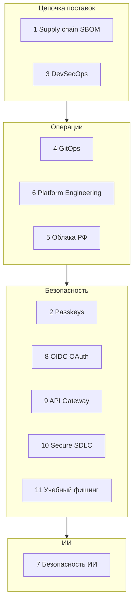
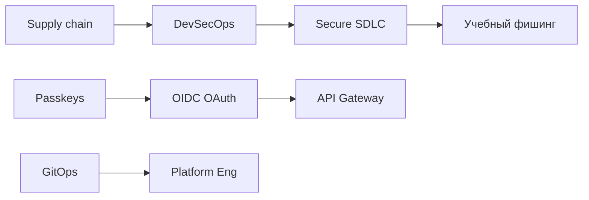

# Актуальные практики — итоги

Подраздел **8.12** объединяет практики, которые в 2025–2026 регулярно встречаются в вакансиях, аудитах и post-mortem отчётах после инцидентов. Здесь — **конкретные подходы**, которые команды внедряют в pipeline, инфраструктуру и процессы разработки.

Ниже — развёрнутое резюме статей [1–11](./intro.md). Детали, чек-листы и пошаговые инструкции — в каждой статье и в [999.md](./999.md).

---

## Карта подраздела

---

## 1. Supply chain и SBOM

**Статья:** [1.md](./1.md)

Атаки через цепочку поставок ПО стали одной из главных угроз. Злоумышленники компрометируют зависимости (npm, PyPI), CI/CD pipeline или build-инструменты, чтобы попасть в production незаметно.

**Ключевые практики:**

- **Lockfile** (`package-lock.json`, `poetry.lock`) — фиксированные версии зависимостей
- **SBOM** (Software Bill of Materials) — машиночитаемый список компонентов в артефакте
- **Dependency scan** — trivy, dependabot, socket.dev на каждый PR
- **Pin Actions** — фиксированные SHA вместо `@v3` в GitHub Actions
- **Signed artifacts** — cosign, Sigstore для container images

**Связь:** [4.09 Зависимости](/encyclopedia/4-code-dev/4-09-zavisimosti/intro), [DevSecOps](./3.md).

| Вопрос для самопроверки | Ответ в статье |
|-------------------------|----------------|
| Что такое SBOM? | Список всех компонентов в билде |
| Зачем pin Actions? | Защита от supply chain через CI |

---

## 2. Passkeys и WebAuthn

**Статья:** [2.md](./2.md)

**Passkeys** — современная замена паролю на основе WebAuthn и FIDO2. Криптографический ключ хранится на устройстве, phishing-resistant (привязан к домену).

**Ключевые практики:**

- Внедрение passkeys как опция рядом с паролем
- MFA с FIDO2 security key для admin и VPN
- Понимание разницы между platform authenticator (Touch ID) и roaming (YubiKey)

**Связь:** [OIDC и OAuth](./8.md), [8.07/116](/encyclopedia/8-infra-security/8-07-informatsionnaya-bezopasnost/116).

---

## 3. DevSecOps

**Статья:** [3.md](./3.md)

**DevSecOps** — встраивание проверок безопасности в CI/CD pipeline. Security gates на каждом PR, а не отдельный этап перед релизом.

**Ключевые практики:**

- Secret scan (gitleaks) — block merge при находке
- SAST (semgrep) — статический анализ кода
- Container scan (trivy) — CVE в образах
- Policy as code — OPA, Conftest для Kubernetes manifests
- Pentest параллельно с разработкой, не после

**Связь:** [8.04/16](/encyclopedia/8-infra-security/8-04-devops-ci-cd/16), [Secure SDLC](./10.md).

| Gate | Когда block |
|------|-------------|
| Secret in diff | Всегда |
| Critical CVE | По умолчанию, waiver с expiry |
| High SAST | Warn → block через спринт |

---

## 4. GitOps

**Статья:** [4.md](./4.md)

**GitOps** — подход, при котором желаемое состояние production описано в Git, а контроллер (Argo CD, Flux) приводит кластер к этому состоянию.

**Ключевые практики:**

- Prod = Git, откат = `git revert`
- Pull-деплой (контроллер читает Git) вместо push из CI
- Review infrastructure changes как code review
- Separation: app repo + infra repo или monorepo с чёткими путями

**Связь:** [практикум 8.13](/encyclopedia/8-infra-security/8-13-praktikum-gitops/intro).

---

## 5. Облака РФ

**Статья:** [5.md](./5.md)

Российские облачные провайдеры предлагают те же модели **IaaS** (виртуальные машины), **PaaS** (managed DB, K8s), **SaaS**, но с учётом локального законодательства (152-ФЗ, импортозамещение).

**Ключевые практики:**

- Yandex Cloud, VK Cloud, Selectel, Cloud.ru — выбор по сервисам и compliance
- Те же паттерны: VPC, S3-analog object storage, managed PostgreSQL
- Особое внимание к data residency и договорам обработки ПДн

**Связь:** [8.01 Облачные технологии](/encyclopedia/8-infra-security/8-01-oblachnye-tehnologii/intro).

---

## 6. Platform Engineering

**Статья:** [6.md](./6.md)

**Platform Engineering** — создание внутренней платформы с **golden paths** (готовыми шаблонами) для разработчиков. Снижает хаос при росте числа микросервисов.

**Ключевые практики:**

- Internal Developer Platform (IDP) — портал, templates, docs
- Golden path: "создать сервис" → CI + K8s + monitoring + logging из коробки
- Self-service в рамках guardrails
- Измерение developer experience (время до первого deploy)

**Связь:** [SRE](/encyclopedia/8-infra-security/8-04-devops-ci-cd/2111), [8.05 Микросервисы](/encyclopedia/8-infra-security/8-05-mikroservisy-i-integratsiya/intro).

---

## 7. Безопасность при работе с ИИ

**Статья:** [7.md](./7.md)

LLM-агенты и copilots получают доступ к коду, инфраструктуре и данным. Без ограничений — риск утечки секретов и несанкционированных действий.

**Ключевые практики:**

- Least privilege для AI agents — минимальные права
- No secrets in prompts — секреты не попадают в контекст LLM
- Human-in-the-loop для destructive actions
- Мониторинг prompt injection и data exfiltration

**Связь:** [OWASP LLM Top 10](/encyclopedia/6-ai/6-10-bezopasnost-pri-rabote-s-ii/intro).

---

## 8. OIDC и OAuth

**Статья:** [8.md](./8.md)

Кнопка "Войти через Google/GitHub" — стандарт де-факто для аутентификации. За ней стоят **OAuth 2.0** (делегирование доступа) и **OIDC** (аутентификация, ID Token).

**Ключевые практики:**

- Authorization Code + PKCE для SPA и mobile
- BFF (Backend-for-Frontend) для хранения refresh token server-side
- JWT validation на API (signature, exp, aud, iss)
- OIDC federation в CI (GitHub Actions → AWS без static keys)

**Связь:** [8.07/116](/encyclopedia/8-infra-security/8-07-informatsionnaya-bezopasnost/116), [Passkeys](./2.md).

---

## 9. API Gateway

**Статья:** [9.md](./9.md)

**API Gateway** — единая точка входа для клиентов к набору backend-сервисов. TLS termination, маршрутизация, rate limit, JWT validation, WAF.

**Ключевые практики:**

- nginx / Kong / Traefik / cloud managed — выбор по зрелости команды
- Rate limiting per IP и per API key
- Не доверять `X-Forwarded-User` без JWT check
- Gateway (north-south) + Service Mesh (east-west) в зрелых MSA

**Связь:** [8.05/111](/encyclopedia/8-infra-security/8-05-mikroservisy-i-integratsiya/111), [8.05/122](/encyclopedia/8-infra-security/8-05-mikroservisy-i-integratsiya/122).

---

## 10. Secure SDLC

**Статья:** [10.md](./10.md)

**Secure SDLC** — встраивание безопасности в каждый этап разработки. Практический маршрут для команды 5–15 человек за один спринт.

**Ключевые практики:**

- Threat modeling (STRIDE) на design
- OWASP ASVS как чек-лист (начать с L1)
- Security gates в PR (gitleaks, dep scan, checklist)
- Security champions (1 dev + 1 QA)
- DAST baseline на staging
- Incident runbook

**Связь:** [8.07/1132](/encyclopedia/8-infra-security/8-07-informatsionnaya-bezopasnost/1132), [DevSecOps](./3.md).

---

## 11. Учебный фишинг

**Статья:** [11.md](./11.md)

Контролируемая имитация фишинговой атаки для обучения сотрудников. Только с согласованием HR, legal, DPO.

**Ключевые практики:**

- Письменный scope и safe harbor
- Метрики: click rate (снижать), report rate (повышать)
- Обязательный debrief в 48 часов
- Технические улучшения после: DMARC, external sender banner, passkeys
- Повтор каждые 3–6 месяцев

**Связь:** [социальная инженерия](/encyclopedia/8-infra-security/8-07-informatsionnaya-bezopasnost/1291), [Secure SDLC](./10.md).

---

## Как темы связаны между собой

- **Supply chain + DevSecOps** — автоматическая защита зависимостей и CI
- **Secure SDLC + фишинг** — процесс + люди
- **OAuth + API Gateway** — аутентификация на периметре
- **GitOps + Platform Eng** — воспроизводимая инфраструктура для разработчиков
- **Passkeys + OAuth** — современная аутентификация end-to-end

---

## Практикумы для закрепления

| Практикум | Тема | Что сделаете руками |
|-----------|------|---------------------|
| [8.13 GitOps](/encyclopedia/8-infra-security/8-13-praktikum-gitops/intro) | Argo CD, kind/minikube | Деплой из Git, rollback |
| [8.14 Vault](/encyclopedia/8-infra-security/8-14-praktikum-vault/intro) | Секреты, OIDC | Хранение client_secret, dynamic secrets |
| [8.15 DR](/encyclopedia/8-infra-security/8-15-praktikum-dr/intro) | Disaster recovery | Backup, restore, RTO/RPO |
| [8.16 FinOps](/encyclopedia/8-infra-security/8-16-finops-pet-project/1) | Стоимость облака | Cost allocation, budgets |

Рекомендуемый порядок: GitOps → Vault → DR. FinOps — параллельно, когда появится cloud bill.

---

## Что внедрять первым

Для команды, которая только начинает:

| Приоритет | Практика | Срок | Усилия |
|-----------|----------|------|--------|
| 1 | Secret scan + dep scan в CI | 1 день | Низкие |
| 2 | OAuth/OIDC вместо самописного auth | 1–2 спринта | Средние |
| 3 | Secure SDLC checklist в PR | 1 спринт | Низкие |
| 4 | API Gateway (nginx) | 1 спринт | Средние |
| 5 | SBOM для prod | 2–3 дня | Низкие |
| 6 | GitOps | 2 спринта | Средние |
| 7 | Учебный фишинг | 1 месяц (с согласованиями) | Средние |

---

## Метрики зрелости подраздела

| Область | Начальный уровень | Зрелый уровень |
|---------|-------------------|----------------|
| Supply chain | Dep scan warn | SBOM + block critical CVE |
| CI/CD security | Manual review | Automated gates + waiver |
| Auth | Самописный login | OIDC + passkeys + BFF |
| Perimeter | Прямой доступ к сервисам | Gateway + rate limit + WAF |
| Process | Ad-hoc | Secure SDLC + threat models |
| People | Разовый тренинг | Фишинг-симуляции 2–4/год |

---

## Навигация

[Чек-лист самопроверки](./999.md) · [Оглавление 8.12](./intro.md) · [Основы инфраструктуры](/encyclopedia/8-infra-security/8-00-osnovy-infrastruktury/1) · [DevOps](/encyclopedia/8-infra-security/8-04-devops-ci-cd/intro) · [ИБ](/encyclopedia/8-infra-security/8-07-informatsionnaya-bezopasnost/intro)

---
