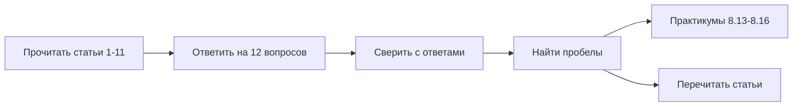

# Актуальные практики — чек-лист

Используйте вопросы ниже для самопроверки после прохождения статей [1–11](./intro.md). Сначала попробуйте ответить без подсказок, затем сверьтесь с краткими ответами в конце и с полными статьями.

Разделите вопросы на три блока: **базовые** (1–4), **инфраструктурные** (5–8), **процессные** (9–12).

---

## Блок 1 — Цепочка поставок и аутентификация

### 1. Что такое SBOM (Software Bill of Materials) и для чего он нужен команде?

**Подсказка:** статья [Supply chain и SBOM](./1.md).

Краткий ответ

**SBOM** — машиночитаемый список всех программных компонентов в артефакте (библиотеки, пакеты, версии, лицензии). Нужен для быстрого ответа на вопрос "есть ли уязвимый Log4j в нашем prod?", для compliance-аудитов и прозрачности supply chain. Форматы: SPDX, CycloneDX. Генерируется инструментами syft, trivy, cyclonedx-cli.

### 2. Назовите три звена software supply chain (цепочки поставок ПО).

**Подсказка:** статья [Supply chain и SBOM](./1.md).

Краткий ответ

Три звена:

- **Зависимости** — npm, PyPI, Maven пакеты, которые вы подключаете
- **CI/CD pipeline** — GitHub Actions, GitLab CI, runners, secrets
- **Build и deploy** — Dockerfile, base images, Helm charts, инфраструктура

Атака на любое звено даёт доступ к production.

### 3. Чем GitOps (pull-деплой) отличается от push-deploy из CI?

**Подсказка:** статья [GitOps](./4.md).

Краткий ответ

При **push-deploy** CI-сервер напрямую применяет изменения в кластер (`kubectl apply`, `helm upgrade`). При **GitOps** желаемое состояние описано в Git, а контроллер (Argo CD, Flux) **сам читает** Git и приводит кластер к этому состоянию. Откат = `git revert`. Преимущества: audit trail, единый source of truth, нет прямого доступа CI к prod.

### 4. Что такое PKCE (Proof Key for Code Exchange) в OAuth?

**Подсказка:** статья [OIDC и OAuth](./8.md).

Краткий ответ

**PKCE** — механизм защиты public client (SPA, mobile) от перехвата authorization code. Клиент генерирует случайный `code_verifier`, отправляет его хеш (`code_challenge`) в `/authorize`, а при обмене code на токены передаёт оригинальный `code_verifier`. IdP проверяет совпадение. Без verifier перехваченный code бесполезен.

---

## Блок 2 — Инфраструктура и облака

### 5. Какую роль выполняет API Gateway, если на сервере уже стоит nginx?

**Подсказка:** статья [API Gateway](./9.md).

Краткий ответ

Nginx может **быть** API Gateway, если настроен с L7-политиками: маршрутизация по path на разные сервисы, JWT validation, rate limit per consumer, request transformation. Простой reverse proxy с одним upstream — только проксирование. Gateway дополнительно понимает структуру API и применяет политики.

### 6. Что такое golden path в Platform Engineering?

**Подсказка:** статья [Platform Engineering](./6.md).

Краткий ответ

**Golden path** — готовый шаблонный маршрут для типовой задачи разработчика. Пример: "создать новый микросервис" → автоматически получает CI pipeline, K8s deployment, monitoring dashboard, logging, documentation template. Снижает cognitive load и обеспечивает единые стандарты безопасности.

### 7. Назовите два российских облачных провайдера и один типичный сервис (ВМ, S3-analog, managed DB).

**Подсказка:** статья [Облака РФ](./5.md).

Краткий ответ

Примеры:

- **Yandex Cloud** — Compute Cloud (ВМ), Object Storage (S3-analog), Managed PostgreSQL
- **VK Cloud** — Cloud Servers, Cloud Storage, Cloud Databases
- **Selectel** — облачные серверы, S3-хранилище
- **Cloud.ru** — виртуальные машины, object storage

Сервисы аналогичны AWS, но с учётом 152-ФЗ и data residency.

### 8. Почему LLM-агенту нельзя давать prod kubeconfig без ограничений?

**Подсказка:** статья [Безопасность ИИ](./7.md).

Краткий ответ

LLM может: случайно вывести секреты из kubeconfig в ответ, выполнить destructive команды (`kubectl delete namespace`), быть уязвим к prompt injection. Нужен **least privilege**: read-only доступ, sandbox cluster, human-in-the-loop для изменений, запрет секретов в промптах.

---

## Блок 3 — Процессы и люди

### 9. Что проверяет gitleaks в CI?

**Подсказка:** статья [DevSecOps](./3.md).

Краткий ответ

**gitleaks** сканирует git diff и историю на наличие секретов: API keys, passwords, tokens, private keys, connection strings. При находке в PR — block merge. Это первый и самый дешёвый security gate в CI.

### 10. Какие метрики учебного фишинга важнее click rate?

**Подсказка:** статья [Учебный фишинг](./11.md).

Краткий ответ

Важнее click rate:

- **Report rate** — сколько сотрудников отправили подозрительное письмо в security@ (желаемый рост)
- **Time to report** — как быстро репортят (зрелость SOC culture)

Высокий report rate и низкий time to report показывают, что команда **активно участвует** в защите — отправляет подозрительные письма в security@.

### 11. Чем ID Token отличается от Access Token в OIDC?

**Подсказка:** статья [OIDC и OAuth](./8.md).

Краткий ответ

- **ID Token** (JWT) — для **клиента** (браузер, приложение). Содержит identity: `sub`, `email`, `name`. Подтверждает "кто вошёл".
- **Access Token** — для **API** (resource server). Даёт право вызывать защищённые endpoint. Может быть JWT или opaque.

ID Token не подставляют на backend API. Access Token не используют для отображения профиля в UI.

### 12. Что такое STRIDE в Secure SDLC?

**Подсказка:** статья [Secure SDLC](./10.md), [8.07/1132](/encyclopedia/8-infra-security/8-07-informatsionnaya-bezopasnost/1132).

Краткий ответ

**STRIDE** — модель угроз от Microsoft для threat modeling:

- **S**poofing — подмена identity
- **T**ampering — изменение данных
- **R**epudiation — отказ от действия
- **I**nformation Disclosure — утечка
- **D**enial of Service — отказ в обслуживании
- **E**levation of Privilege — повышение привилегий

Применяется к каждому элементу DFD-диаграммы на этапе design.

---

## Таблица соответствия вопросов и статей

| № вопроса | Тема | Статья |
|-----------|------|--------|
| 1–2 | Supply chain, SBOM | [1.md](./1.md) |
| 3 | GitOps | [4.md](./4.md) |
| 4, 11 | OIDC, OAuth, токены | [8.md](./8.md) |
| 5 | API Gateway | [9.md](./9.md) |
| 6 | Platform Engineering | [6.md](./6.md) |
| 7 | Облака РФ | [5.md](./5.md) |
| 8 | Безопасность ИИ | [7.md](./7.md) |
| 9 | DevSecOps, CI gates | [3.md](./3.md) |
| 10 | Учебный фишинг | [11.md](./11.md) |
| 12 | Secure SDLC, threat model | [10.md](./10.md) |

---

## Дополнительные вопросы для углубления

Если базовые 12 вопросов даются легко, попробуйте ответить на эти:

| № | Вопрос | Статья |
|---|--------|--------|
| 13 | Что такое BFF и зачем он нужен для SPA? | [8.md](./8.md) |
| 14 | Какой OAuth flow устарел и почему? | [8.md](./8.md) |
| 15 | Чем API Gateway отличается от Load Balancer? | [9.md](./9.md) |
| 16 | Что такое OWASP ASVS L1? | [10.md](./10.md) |
| 17 | Что такое safe harbor в учебном фишинге? | [11.md](./11.md) |
| 18 | Зачем pin GitHub Actions по SHA? | [1.md](./1.md) |

---

## Как использовать чек-лист

| Шаг | Действие |
|-----|----------|
| 1 | Пройдите все статьи [1–11](./intro.md) |
| 2 | Ответьте на 12 вопросов письменно |
| 3 | Сверьтесь с краткими ответами выше |
| 4 | Вопросы с ошибками — перечитайте статью |
| 5 | Закрепите на практикуме [8.13](/encyclopedia/8-infra-security/8-13-praktikum-gitops/intro) или [8.14](/encyclopedia/8-infra-security/8-14-praktikum-vault/intro) |
| 6 | Вернитесь к [итогам](./998.md) для общей картины |

---

### 13. Что такое BFF и зачем он нужен для SPA?

Краткий ответ

**BFF** (Backend-for-Frontend) — тонкий backend между SPA и IdP/API. Обменивает OAuth code на токены server-side, хранит refresh token в server session, отдаёт SPA HttpOnly cookie. SPA не видит долгоживущих секретов. Снижает риск XSS-кражи токенов.

### 14. Какой OAuth flow устарел и почему?

Краткий ответ

**Implicit flow** (`response_type=token`) и **Resource Owner Password Credentials** устарели. Implicit выдавал access token в URL fragment (утечка через history, Referer). Password grant требовал передачи пароля приложению. Для нового кода — только Authorization Code + PKCE.

### 15. Чем API Gateway отличается от Load Balancer?

Краткий ответ

**Load Balancer** распределяет трафик между копиями **одного** сервиса (L4/L7). **API Gateway** маршрутизирует на **разные** сервисы по HTTP path, применяет JWT validation, rate limit, WAF, protocol bridge. Gateway — осмысленный L7 с политиками API.

### 16. Что такое OWASP ASVS L1?

Краткий ответ

**ASVS L1** — базовый уровень Application Security Verification Standard. Минимальные требования для большинства приложений: валидация input, auth, access control, secure config, logging. Начните с L1, затем L2 для B2B SaaS с PII.

### 17. Что такое safe harbor в учебном фишинге?

Краткий ответ

**Safe harbor** — письменное обещание, что клик по учебной фишинговой ссылке **не влечёт** дисциплинарных мер. Снимает страх и повышает честность метрик. Объявляется до кампании в security policy и повторяется на debrief.

### 18. Зачем pin GitHub Actions по SHA?

Краткий ответ

`uses: actions/checkout@v4` может измениться на сервере GitHub (supply chain attack). Pin по commit SHA (`uses: actions/checkout@b4ffde65...`) фиксирует точный код action. Обновление SHA — осознанный PR с review.

---

## Глоссарий ключевых терминов

| Термин | Краткое определение |
|--------|---------------------|
| **SBOM** | Список компонентов в артефакте |
| **PKCE** | Защита OAuth code для public client |
| **BFF** | Backend-for-Frontend для безопасных токенов |
| **GitOps** | Prod = Git, контроллер синхронизирует |
| **Golden path** | Шаблонный маршрут в Platform Eng |
| **ASVS** | Стандарт верификации безопасности OWASP |
| **STRIDE** | Модель угроз для threat modeling |
| **DAST** | Динамическое сканирование приложения |
| **WAF** | Web Application Firewall |
| **Safe harbor** | Защита от санкций при учебном фишинге |

---

## Оценка результата

| Результат | Уровень | Рекомендация |
|-----------|---------|--------------|
| 10–12 верных | Уверенное понимание | Практикумы, внедрение в проект |
| 7–9 верных | Базовое понимание | Перечитать пробелы |
| 4–6 верных | Начальный уровень | Пройти статьи заново с заметками |
| 0–3 верных | Требуется изучение | Начать с [1.md](./1.md) и [3.md](./3.md) |

---

Ответы в полном объёме: статьи [1–11](./intro.md) · [итоги](./998.md) · [оглавление 8.12](./intro.md)

---
