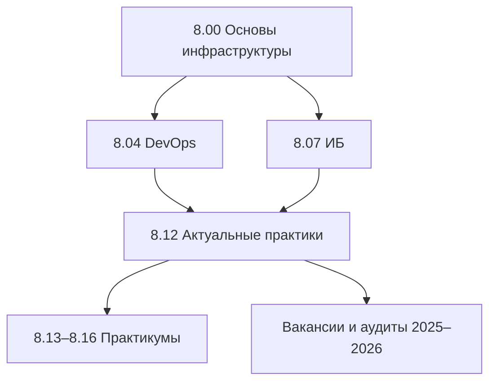
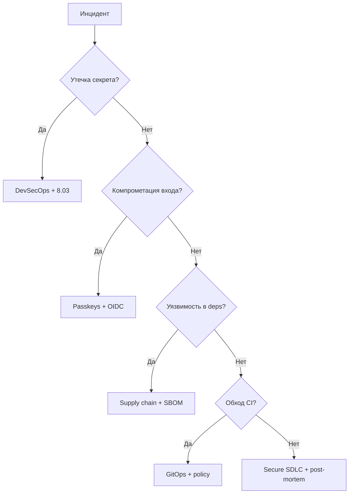
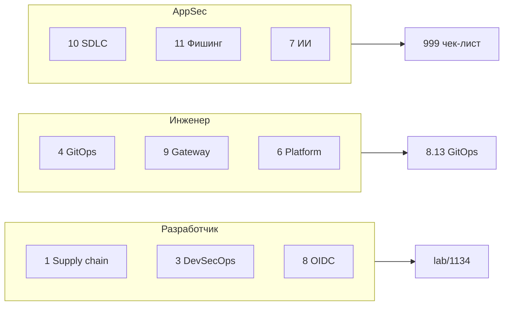

import DocCardList from '@theme/DocCardList';

# О разделе

Подраздел **8.12** собирает темы, которые в 2025–2026 регулярно встречаются в вакансиях, аудитах и реальных инцидентах, но раньше были размазаны по разным главам. Здесь — **концепции и практические ориентиры**; углублённые практикумы — в **[8.13–8.16](/encyclopedia/8-infra-security/8-13-praktikum-gitops/intro)**.

  
Предварительные знания

  

  Пройдите <a href="/encyclopedia/8-infra-security/8-00-osnovy-infrastruktury/1">"Основы инфраструктуры"</a>, базу <a href="/encyclopedia/8-infra-security/8-04-devops-ci-cd/1">DevOps</a> и <a href="/encyclopedia/8-infra-security/8-07-informatsionnaya-bezopasnost/1">информационной безопасности (ИБ)</a>. Без этого абстрактными покажутся термины CI (непрерывная интеграция), K8s (Kubernetes), OWASP (Open Web Application Security Project).
  

---

## Зачем отдельный подраздел 8.12

Инфраструктура и безопасность меняются быстрее, чем классические учебники. Темы вроде **supply chain** (цепочка поставок ПО), **Passkeys** (ключи доступа WebAuthn), **GitOps** и **Platform Engineering** (инженерия внутренних платформ) сегодня звучат на собеседованиях и в отчётах аудиторов. Подраздел 8.12 даёт единую точку входа без необходимости искать их по всему разделу 8.

---

## Маршрут по статьям

| № | Статья | Тема | Кому в первую очередь |
|---|--------|------|----------------------|
| 1 | [Supply chain и SBOM](./1.md) | Зависимости, образы, атаки на цепочку поставок | Разработчик, инженер |
| 2 | [Passkeys и WebAuthn](./2.md) | Вход без пароля для веба и API | Разработчик |
| 3 | [DevSecOps](./3.md) | SAST, secret scan, policy в CI | Разработчик, инженер, AppSec |
| 4 | [GitOps](./4.md) | Argo CD, Flux, декларативный деплой | Инженер |
| 5 | [Облачные сервисы в РФ](./5.md) | Yandex Cloud, VK Cloud, Selectel | Инженер, архитектор |
| 6 | [Platform Engineering](./6.md) | IDP, golden paths, self-service | Инженер, тимлид |
| 7 | [Безопасность ИИ в инфраструктуре](./7.md) | Агенты, MCP, секреты в промптах | Разработчик, ИБ |
| 8 | [OIDC и OAuth для разработчика](./8.md) | "Войти через Google", scopes, PKCE | Разработчик |
| 9 | [API Gateway](./9.md) | Kong, nginx, rate limit, mTLS | Инженер, архитектор |
| 10 | [Secure SDLC — маршрут для команды](./10.md) | Threat modeling, ASVS, релизные gates | AppSec, тимлид |
| 11 | [Фишинг — учебная симуляция](./11.md) | Безопасный учебный фишинг в команде | ИБ, HR |

---

## Рекомендуемые траектории чтения

### Траектория "Безопасная доставка" (2–3 недели)

1. [Supply chain и SBOM](./1.md)
2. [DevSecOps](./3.md)
3. [Secure SDLC](./10.md)
4. Практикум [GitHub Actions](/lab/Примеры/1134) с secret scan

Подходит инженерам и разработчикам, которые отвечают за CI/CD.

### Траектория "Современный вход пользователя" (1 неделя)

1. [OIDC и OAuth](./8.md)
2. [Passkeys и WebAuthn](./2.md)
3. [Аутентификация 8.07/116](/encyclopedia/8-infra-security/8-07-informatsionnaya-bezopasnost/116)

Подходит backend- и fullstack-разработчикам.

### Траектория "Платформа и эксплуатация" (1 месяц)

1. [GitOps](./4.md) → [практикум 8.13](/encyclopedia/8-infra-security/8-13-praktikum-gitops/intro)
2. [Platform Engineering](./6.md)
3. [API Gateway](./9.md)
4. [Облака РФ](./5.md) — при работе с локальными провайдерами

---

## Практикумы после теории

| Практикум | Что закрепляет из 8.12 |
|-----------|------------------------|
| [GitOps 8.13](/encyclopedia/8-infra-security/8-13-praktikum-gitops/intro) | GitOps, декларативный деплой, K8s |
| [Vault 8.14](/encyclopedia/8-infra-security/8-14-praktikum-vault/intro) | Секреты, DevSecOps, policy |
| [DR 8.15](/encyclopedia/8-infra-security/8-15-praktikum-dr/intro) | RTO/RPO, устойчивость |
| [FinOps 8.16](/encyclopedia/8-infra-security/8-16-finops-pet-project/1) | Стоимость облака, Platform Engineering |

Закрепление теории: [итоги](./998.md), [чек-лист](./999.md).

---

## Связь с инцидентами и стандартами

| Тема 8.12 | Реальный контекст |
|-----------|-------------------|
| Supply chain | Компрометация npm-пакетов, подмена GitHub Actions, [SolarWinds](https://www.cisa.gov/solarwinds) |
| DevSecOps | Требования PCI DSS, SOC 2, внутренние аудиты |
| Passkeys | Снижение фишинга паролей, рекомендации [FIDO Alliance](https://fidoalliance.org/) |
| GitOps | Единый источник правды при росте числа микросервисов |
| Secure SDLC | [OWASP ASVS](https://owasp.org/www-project-application-security-verification-standard/), threat modeling |

Подробности по каждой теме — в соответствующих статьях.

---

## Смежные разделы

| Раздел | Связь с 8.12 |
|--------|--------------|
| [Контейнеризация 8.06](/encyclopedia/8-infra-security/8-06-konteynerizatsiya-i-orkestratsiya/intro) | Образы, registry, K8s — основа supply chain и GitOps |
| [Микросервисы 8.05](/encyclopedia/8-infra-security/8-05-mikroservisy-i-integratsiya/intro) | API Gateway, интеграции |
| [Зависимости 4.09](/encyclopedia/4-code-dev/4-09-zavisimosti/intro) | npm, pip, Maven — вход supply chain |
| [Основы инфраструктуры 8.00](/encyclopedia/8-infra-security/8-00-osnovy-infrastruktury/1) | Карта раздела 8 перед углублением |

---

## Краткий словарь подраздела

| Термин | Расшифровка |
|--------|-------------|
| **SBOM** | Software Bill of Materials — список компонентов сборки |
| **SAST** | Static Application Security Testing — анализ кода без запуска |
| **DAST** | Dynamic Application Security Testing — тесты на работающем приложении |
| **WebAuthn** | Веб-стандарт аутентификации с криптографическими ключами |
| **OIDC** | OpenID Connect — слой идентификации поверх OAuth 2.0 |
| **IDP** | Internal Developer Platform — внутренняя платформа для разработчиков |
| **mTLS** | Mutual TLS — взаимная проверка сертификатов клиента и сервера |
| **ASVS** | Application Security Verification Standard от OWASP |

---

## Чек-лист перед стартом 8.12

- [ ] Прочитана [глава "Основы инфраструктуры"](/encyclopedia/8-infra-security/8-00-osnovy-infrastruktury/1)
- [ ] Понятны CI/CD и разница dev/staging/prod ([8.04](/encyclopedia/8-infra-security/8-04-devops-ci-cd/1))
- [ ] Знакомы CIA и OWASP Top 10 ([8.07/1](/encyclopedia/8-infra-security/8-07-informatsionnaya-bezopasnost/1))
- [ ] Выбрана траектория — "доставка", "вход" или "платформа"
- [ ] Есть pet-проект или учебный репозиторий для экспериментов

---

## Типичные вопросы

### "С чего начать, если времени мало?"

Три статьи с максимальной отдачей для большинства команд:

1. [Supply chain](./1.md)
2. [DevSecOps](./3.md)
3. [OIDC и OAuth](./8.md) или [Passkeys](./2.md) — по профилю задачи

### "Нужен ли Kubernetes для 8.12?"

Для Passkeys и OAuth — нет. Для GitOps, API Gateway и части DevSecOps — желательно базовое знакомство с [8.06](/encyclopedia/8-infra-security/8-06-konteynerizatsiya-i-orkestratsiya/intro).

### "Где искать готовые рецепты CI?"

[lab/Примеры/1134](/lab/Примеры/1134) — GitHub Actions; [8.04/16](/encyclopedia/8-infra-security/8-04-devops-ci-cd/16) — обзор инструментов.

---

## OWASP и внешние стандарты в 8.12

| Ресурс | Тема в подразделе |
|--------|-------------------|
| [OWASP Top 10](https://owasp.org/www-project-top-ten/) | База перед DevSecOps |
| [OWASP ASVS](https://owasp.org/www-project-application-security-verification-standard/) | [Secure SDLC](./10.md) |
| [OWASP SCVS](https://owasp.org/www-project-software-component-verification-standard/) | [Supply chain](./1.md) |
| [NIST SSDF](https://csrc.nist.gov/Projects/ssdf) | Процессы безопасной разработки |

---

## Связь статей 8.12 с практикумами — матрица

| Статья 8.12 | Практикум | Навык |
|-------------|-----------|-------|
| GitOps | [8.13](/encyclopedia/8-infra-security/8-13-praktikum-gitops/intro) | Argo CD, K8s |
| DevSecOps + Supply chain | [lab/1134](/lab/Примеры/1134) | GitHub Actions |
| DevSecOps | [8.14 Vault](/encyclopedia/8-infra-security/8-14-praktikum-vault/intro) | Секреты |
| OIDC | [8.08 REST](/encyclopedia/8-infra-security/8-08-praktikum-rest-i-websocket/intro) | JWT, API auth |
| Облака РФ | [8.16 FinOps](/encyclopedia/8-infra-security/8-16-finops-pet-project/1) | Стоимость |

---

## Индекс статей 8.12 — одной таблицей

| № | Файл | Ключевые слова для поиска |
|---|------|---------------------------|
| 1 | Supply chain | SBOM, npm, Docker, cosign, Trivy |
| 2 | Passkeys | WebAuthn, FIDO2, биометрия |
| 3 | DevSecOps | SAST, gitleaks, policy |
| 4 | GitOps | Argo CD, Flux, declarative |
| 5 | Облака РФ | Yandex, VK Cloud, Selectel |
| 6 | Platform Engineering | IDP, golden path |
| 7 | ИИ в инфраструктуре | MCP, агенты, промпты |
| 8 | OIDC OAuth | Google login, PKCE, scopes |
| 9 | API Gateway | Kong, rate limit, mTLS |
| 10 | Secure SDLC | ASVS, threat model |
| 11 | Фишинг учебный | симуляция, awareness |

---

## Рекомендуемый порядок чтения за 4 недели

| Неделя | Статьи | Практика |
|--------|--------|----------|
| 1 | intro, [1 Supply chain](./1.md), [3 DevSecOps](./3.md) | gitleaks + npm audit в pet-репо |
| 2 | [8 OIDC](./8.md), [2 Passkeys](./2.md) | OAuth login или WebAuthn demo |
| 3 | [4 GitOps](./4.md), [9 API Gateway](./9.md) | [8.13 практикум](/encyclopedia/8-infra-security/8-13-praktikum-gitops/intro) |
| 4 | [10 Secure SDLC](./10.md), [5 Облака РФ](./5.md), [6 Platform](./6.md) | [итоги](./998.md), [чек-лист](./999.md) |

---

## Кейсы из практики — как темы 8.12 помогают в инцидентах

### Кейс 1. Утечка npm-токена в публичном репозитории

**Ситуация.** Разработчик случайно закоммитил `.npmrc` с токеном публикации. Репозиторий открытый, боты нашли ключ за минуты.

**Какие статьи 8.12 закрывают пробел:**

- [DevSecOps](./3.md) — pre-commit и gitleaks на PR
- [Supply chain](./1.md) — ротация токена, audit npm-пакетов на подмену
- [Secure SDLC](./10.md) — onboarding "где хранить секреты"

**Урок.** Один красный gate в CI дешевле, чем отзыв пакетов и расследование.

### Кейс 2. Фишинг пароля администратора SaaS

**Ситуация.** Админ ввёл пароль на поддельной странице. Аккаунт скомпрометирован, злоумышленник сменил billing и API keys.

**Связанные материалы:**

- [Passkeys](./2.md) — phishing-resistant вход для админов
- [OIDC и OAuth](./8.md) — корректные redirect URI, PKCE
- [Фишинг — учебная симуляция](./11.md) — тренировка команды

**Урок.** Passkeys для привилегированных ролей снижают классический фишинг пароля.

### Кейс 3. Critical CVE в Log4j в пятницу вечером

**Ситуация.** Вышел CVE для Log4j. Без SBOM команда три дня вручную искала вхождения в сотнях сервисов.

**Связанные материалы:**

- [Supply chain](./1.md) — SBOM, `trivy`, playbook реагирования
- [DevSecOps](./3.md) — SLA на critical, waivers с expiry

**Урок.** SBOM сокращает поиск уязвимых компонентов с недель до часов. Документ полезен при инциденте и для аудита.

### Кейс 4. Ручной деплой обошёл security gate

**Ситуация.** Инженер задеплоил образ с `:latest` в prod, минуя CI. На staging gate был зелёный, в prod попала уязвимая версия базового слоя.

**Связанные материалы:**

- [GitOps](./4.md) — единый источник правды, sync только из Git
- [DevSecOps](./3.md) — policy-as-code, запрет `:latest`
- [API Gateway](./9.md) — mTLS между сервисами как компенсирующая мера

**Урок.** GitOps и policy в кластере закрывают обход пайплайна руками.

---

## Расширенный словарь подраздела

| Термин | Расшифровка | Где углубиться |
|--------|-------------|----------------|
| **Supply chain** | Цепочка от кода до prod — deps, CI, образы, registry | [1.md](./1.md) |
| **SBOM** | Software Bill of Materials — список компонентов сборки | [1.md](./1.md) |
| **SAST** | Static Application Security Testing — анализ кода без запуска | [3.md](./3.md) |
| **DAST** | Dynamic Application Security Testing — тесты на работающем приложении | [3.md](./3.md) |
| **SCA** | Software Composition Analysis — уязвимости в зависимостях | [1.md](./1.md), [3.md](./3.md) |
| **WebAuthn** | Веб-стандарт аутентификации с криптографическими ключами | [2.md](./2.md) |
| **Passkey** | Ключ доступа FIDO2/WebAuthn — вход без пароля по сети | [2.md](./2.md) |
| **OIDC** | OpenID Connect — слой идентификации поверх OAuth 2.0 | [8.md](./8.md) |
| **PKCE** | Proof Key for Code Exchange — защита OAuth для SPA и мобильных | [8.md](./8.md) |
| **GitOps** | Деплой из Git как единственный источник правды | [4.md](./4.md) |
| **IDP** | Internal Developer Platform — внутренняя платформа для разработчиков | [6.md](./6.md) |
| **Golden path** | Рекомендуемый шаблон "как правильно" для типовой задачи | [6.md](./6.md) |
| **mTLS** | Mutual TLS — взаимная проверка сертификатов клиента и сервера | [9.md](./9.md) |
| **ASVS** | Application Security Verification Standard от OWASP | [10.md](./10.md) |
| **Waiver** | Формальное исключение из security gate с owner и сроком | [3.md](./3.md) |
| **Shift-left** | Перенос проверок безопасности ближе к написанию кода | [3.md](./3.md) |
| **MCP** | Model Context Protocol — протокол подключения инструментов к LLM | [7.md](./7.md) |
| **FinOps** | Управление стоимостью облака | [8.16 FinOps](/encyclopedia/8-infra-security/8-16-finops-pet-project/1) |

---

## Что делать если — типичные ситуации

### Security gate в CI красный, релиз завтра

1. Откройте лог job — secret scan, SAST или dependency scan.
2. Если **true positive** — исправьте или обновите зависимость; emergency merge только с AppSec approval.
3. Если **false positive** — waiver с ticket, owner, expiry 30 дней — см. [DevSecOps](./3.md).
4. Задокументируйте в post-mortem, если gate обошли — [Secure SDLC](./10.md).

### Нужно быстро внедрить "Войти через Google"

1. Прочитайте [OIDC и OAuth](./8.md) — scopes, PKCE, хранение refresh token.
2. Не смешивайте OAuth и собственные пароли без плана recovery.
3. Для B2C рассмотрите [Passkeys](./2.md) после первого OAuth-входа.

### Команда просит Kubernetes, но опыта мало

1. Сначала [GitOps](./4.md) и [8.06 контейнеризация](/encyclopedia/8-infra-security/8-06-konteynerizatsiya-i-orkestratsiya/intro).
2. Практикум [8.13 GitOps](/encyclopedia/8-infra-security/8-13-praktikum-gitops/intro) на minikube или kind.
3. [Platform Engineering](./6.md) — golden path вместо "каждый сам пишет Helm".

### Аудитор спрашивает SBOM и подпись образов

1. [Supply chain](./1.md) — CycloneDX, Trivy, cosign.
2. [DevSecOps](./3.md) — gates в CI, audit log деплоев.
3. Матрица compliance — таблица в [3.md](./3.md) "Compliance mapping".

### Разработчики игнорируют алерты Semgrep

1. Triage — [DevSecOps](./3.md), weekly review.
2. Lunch & learn с разбором одного finding.
3. Сократите правила до p/ci на старте, добавляйте кастом постепенно.

---

## Расширенный FAQ

### "Можно ли пройти 8.12 без облака?"

Да. Passkeys, OAuth, DevSecOps и supply chain работают на локальном pet-проекте и GitHub Actions. Облака РФ ([5.md](./5.md)) — опционально для локального рынка.

### "8.12 для frontend или только backend?"

Обе стороны. Passkeys и OAuth — frontend + backend. SAST и secret scan — весь репозиторий. API Gateway — backend и инфра.

### "Сколько времени на одну статью?"

Ориентир 45–90 минут чтения + 1–2 часа практики на pet-проект. [Supply chain](./1.md) и [DevSecOps](./3.md) — с практикой до полного дня.

### "Есть ли пересечение с 8.07 ИБ?"

Да. 8.07 даёт теорию CIA, OWASP Top 10, криптографию. 8.12 — прикладные практики 2025–2026. Читайте 8.07/1 перед 8.12.

### "Нужен ли AppSec-специалист в команде?"

На старте достаточно инженера с [DevSecOps](./3.md) и чек-листом. AppSec консультант полезен для threat modeling ([10.md](./10.md)) и triage на масштабе.

### "Как связаны 8.12 и практикумы 8.13–8.16?"

8.12 — концепции и ориентиры. 8.13–8.16 — hands-on с Vault, GitOps, DR, FinOps. Матрица выше в разделе "Связь статей 8.12 с практикумами".

### "Что читать после завершения всех 11 статей?"

[Итоги 998](./998.md), [чек-лист 999](./999.md), затем углубление по роли — [Platform Engineering](./6.md) для платформенных инженеров, [Secure SDLC](./10.md) для тимлидов.

---

## Карта компетенций по ролям

| Роль | Обязательно из 8.12 | Желательно | Практикум |
|------|---------------------|------------|-----------|
| Junior backend | [1](./1.md), [3](./3.md), [8](./8.md) | [2 Passkeys](./2.md) | [lab/1134](/lab/Примеры/1134) |
| Frontend | [2](./2.md), [8](./8.md) | [3 DevSecOps](./3.md) | WebAuthn demo |
| DevOps / SRE | [1](./1.md), [3](./3.md), [4 GitOps](./4.md) | [9 Gateway](./9.md), [6 Platform](./6.md) | [8.13](/encyclopedia/8-infra-security/8-13-praktikum-gitops/intro) |
| Архитектор | [9](./9.md), [6](./6.md), [5 облака](./5.md) | [10 SDLC](./10.md) | [8.16 FinOps](/encyclopedia/8-infra-security/8-16-finops-pet-project/1) |
| AppSec | [3](./3.md), [10](./10.md), [1](./1.md) | [7 ИИ](./7.md), [11 фишинг](./11.md) | Threat model workshop |
| Тимлид | [10](./10.md), [6 Platform](./6.md) | [3](./3.md), [11](./11.md) | Secure SDLC roadmap |

---

## Внешние ссылки — быстрый указатель

| Тема | Ресурс |
|------|--------|
| OWASP Top 10 | https://owasp.org/www-project-top-ten/ |
| OWASP ASVS | https://owasp.org/www-project-application-security-verification-standard/ |
| OWASP SCVS | https://owasp.org/www-project-software-component-verification-standard/ |
| NIST SSDF | https://csrc.nist.gov/Projects/ssdf |
| FIDO / passkeys | https://fidoalliance.org/ |
| passkeys.dev | https://passkeys.dev/ |
| SLSA | https://slsa.dev/ |
| CycloneDX | https://cyclonedx.org/ |
| OWASP DevSecOps | https://owasp.org/www-project-devsecops-guideline/ |
| CISA SolarWinds | https://www.cisa.gov/solarwinds |

---

## Дальше

- Начните с [Supply chain и SBOM](./1.md) или выберите траекторию выше
- После серии статей — [итоги](./998.md) и [чек-лист](./999.md)
- Углубление руками — [8.13 GitOps](/encyclopedia/8-infra-security/8-13-praktikum-gitops/intro)

<DocCardList />

---
