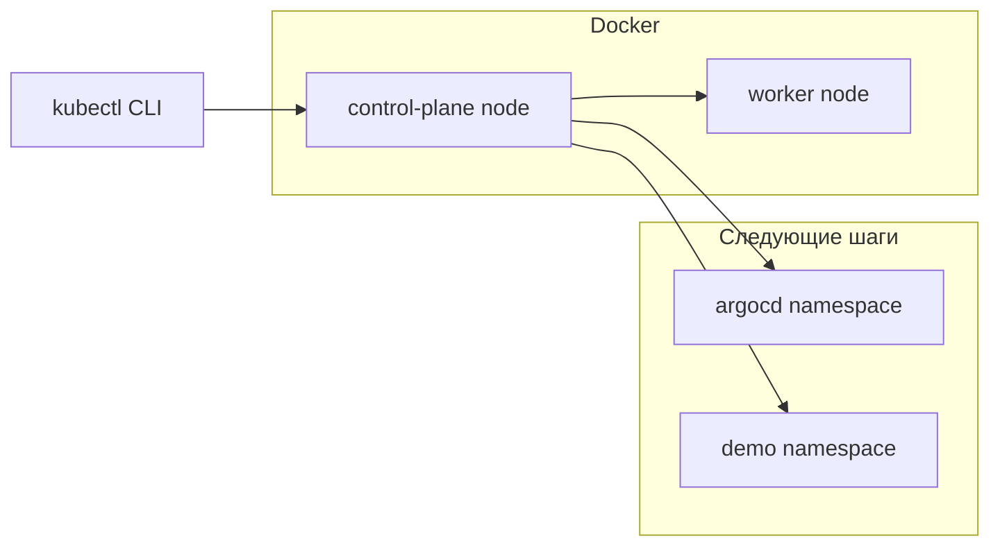

import ExternalPlayEmbed from '@site/src/components/ExternalPlayEmbed';

# Практикум GitOps — подготовка кластера

<div class="article-tags">
  <span class="tag tag-required">ОБЯЗАТЕЛЬНО</span>
</div>


<span class="complexity-badge">Инженеру</span>

<ExternalPlayEmbed example="infra-security/argocd-app-status-play" title="Argo CD Application status" minHeight={400} />

Первый шаг — поднять локальный [Kubernetes](/encyclopedia/8-infra-security/8-06-konteynerizatsiya-i-orkestratsiya/211) и установить **Argo CD** — инструмент, который следит за Git-репозиторием и приводит кластер к описанному в нём состоянию. Без работающего кластера и Argo CD следующие шаги практикума невозможны.

---

## Предварительные требования

| Требование | Проверка |
|------------|----------|
| Docker запущен | `docker ps` без ошибки |
| kubectl установлен | `kubectl version --client` |
| 4+ GB свободной RAM | Диспетчер задач / `free -h` |
| Свободны порты 8080, 6443 | Нет другого kind/minikube на тех же портах |

Если Kubernetes новый для вас — начните с [первых шагов](/encyclopedia/8-infra-security/8-06-konteynerizatsiya-i-orkestratsiya/1172). Теория GitOps — [8.12/4](/encyclopedia/8-infra-security/8-12-aktualnye-praktiki/4).

---

## Архитектура шага 1



На этом шаге появляются только кластер и namespace `argocd` с компонентами Argo CD. Namespace `demo` создадим в конце статьи.

---

## 1. Локальный кластер (kind)

**kind** (Kubernetes in Docker) создаёт кластер из Docker-контейнеров — удобно для учебных стендов без облака.

Установка kind (если ещё нет):

```bash
# Linux / macOS — см. https://kind.sigs.k8s.io/docs/user/quick-start/
# Windows (scoop): scoop install kind
kind version
```

Создание кластера:

```bash
kind create cluster --name gitops-lab
```

Ожидаемый вывод (фрагмент):

```
Creating cluster "gitops-lab" ...
 ✓ Ensuring node image (kindest/node:v1.xx.x) 🖼
 ✓ Preparing nodes 📦
 ✓ Writing configuration 📜
 ✓ Starting control-plane 🕹️
 ✓ Installing CNI 🔌
 ✓ Installing StorageClass 💾
Set kubectl context to "kind-gitops-lab"
```

Проверка:

```bash
kubectl cluster-info --context kind-gitops-lab
kubectl get nodes
```

Ожидаемый результат:

```
Kubernetes control plane is running at https://127.0.0.1:xxxxx
NAME                       STATUS   ROLES           AGE   VERSION
gitops-lab-control-plane   Ready    control-plane   1m    v1.xx.x
```

### Альтернатива — minikube

```bash
minikube start --cpus=4 --memory=8192 --driver=docker
kubectl get nodes
```

Ещё один вариант — встроенный Kubernetes в [Docker Desktop](/encyclopedia/8-infra-security/8-06-konteynerizatsiya-i-orkestratsiya/1121). Включите Kubernetes в настройках и убедитесь, что context указывает на docker-desktop.

### Устранение неполадок — кластер

| Ошибка | Решение |
|--------|---------|
| `ERROR failed to create cluster` | Перезапустите Docker, увеличьте RAM в Docker Desktop до 6 GB+ |
| `node(s) already exist` | `kind delete cluster --name gitops-lab` и повторите create |
| `Unable to connect to the server` | `kubectl config use-context kind-gitops-lab` |

---

## 2. Установка Argo CD

**Argo CD** — контроллер GitOps. Он устанавливается в отдельный namespace `argocd` и не смешивается с вашими приложениями.

Создание namespace и установка stable-манифеста:

```bash
kubectl create namespace argocd
kubectl apply -n argocd -f https://raw.githubusercontent.com/argoproj/argo-cd/stable/manifests/install.yaml
```

Ожидаемый вывод:

```
namespace/argocd created
customresourcedefinition.apiextensions.k8s.io/applications.argoproj.io created
...
deployment.apps/argocd-server created
```

Дождитесь готовности server (до 5 минут на слабом ноутбуке):

```bash
kubectl wait --for=condition=Available deployment/argocd-server -n argocd --timeout=300s
```

Проверка подов:

```bash
kubectl get pods -n argocd
```

Ожидаемый результат — все поды в `Running` или `Completed` (redis):

```
NAME                                  READY   STATUS    RESTARTS   AGE
argocd-application-controller-...     1/1     Running   0          2m
argocd-server-...                     1/1     Running   0          2m
argocd-repo-server-...                1/1     Running   0          2m
...
```

### Начальный пароль admin

Argo CD создаёт Secret с одноразовым паролем:

```bash
kubectl -n argocd get secret argocd-initial-admin-secret -o jsonpath="{.data.password}" | base64 -d && echo
```

На Windows PowerShell без `base64`:

```powershell
$p = kubectl -n argocd get secret argocd-initial-admin-secret -o jsonpath="{.data.password}"
[System.Text.Encoding]::UTF8.GetString([System.Convert]::FromBase64String($p))
```

Сохраните пароль — понадобится для UI и CLI. После смены пароля Secret можно удалить по документации Argo CD.

### Доступ к веб-интерфейсу

Port-forward пробрасывает HTTPS Argo CD на localhost:

```bash
kubectl port-forward svc/argocd-server -n argocd 8080:443
```

Оставьте терминал открытым. В браузере откройте `https://localhost:8080`. Логин `admin`, пароль — из команды выше. Браузер покажет предупреждение о сертификате — в lab это нормально.

Ожидаемый экран — пустой список Applications (приложений ещё нет).

### Устранение неполадок — Argo CD

| Симптом | Действие |
|---------|----------|
| `argocd-server` Pending | `kubectl describe pod -n argocd -l app.kubernetes.io/name=argocd-server` — часто нехватка CPU |
| port-forward `connection refused` | Под server ещё не Ready — дождитесь `kubectl wait` |
| Неверный пароль | Убедитесь, что декодировали Secret без лишних пробелов |

---

## 3. CLI Argo CD (опционально)

CLI удобен для автоматизации, просмотра diff и отладки без UI.

```bash
# Windows: choco install argocd-cli
# macOS: brew install argocd
argocd version --client
```

Логин (port-forward должен работать):

```bash
argocd login localhost:8080 --username admin --password YOUR_PASSWORD --insecure
```

Ожидаемый вывод:

```
'admin:logged in successfully'
Context 'localhost:8080' updated
```

Список приложений (пока пуст):

```bash
argocd app list
```

---

## 4. Namespace для приложения

**Namespace** — изолированная область имён в Kubernetes. Учебное приложение `demo-nginx` живёт в `demo`, отдельно от `argocd`.

```bash
kubectl create namespace demo
kubectl get namespace demo
```

Ожидаемый результат:

```
NAME   STATUS   AGE
demo   Active   5s
```

В шаге 2 Argo CD может создать namespace сам через `CreateNamespace=true`, но явное создание помогает проверить права до подключения Git.

---

## Проверка шага 1

Выполните контрольный список:

```bash
kubectl config current-context
# kind-gitops-lab или minikube

kubectl get ns argocd demo
kubectl get deployment argocd-server -n argocd
curl -k -s -o /dev/null -w "%{http_code}" https://localhost:8080
# при работающем port-forward ожидается 200 или 302
```

Если все проверки прошли — переходите к [репозиторию манифестов и Application](./2.md).

---

## Конфигурация kind для GitOps lab

Файл `kind-gitops-lab.yaml` (опционально) — проброс port 8080 для Ingress-less lab:

```yaml
kind: Cluster
apiVersion: kind.x-k8s.io/v1alpha4
name: gitops-lab
nodes:
  - role: control-plane
    extraPortMappings:
      - containerPort: 30080
        hostPort: 30080
        protocol: TCP
```

Создание:

```bash
kind create cluster --name gitops-lab --config kind-gitops-lab.yaml
```

---

## Компоненты Argo CD в namespace argocd

| Deployment | Роль |
|------------|------|
| argocd-server | API и UI |
| argocd-application-controller | Reconcile Application |
| argocd-repo-server | Git clone и manifest render |
| argocd-dex-server | SSO (опционально) |
| argocd-redis | Кэш |

Проверка всех deployment:

```bash
kubectl get deploy -n argocd
```

---

## Смена пароля admin (рекомендуется после lab)

```bash
argocd account update-password --account admin --current-password OLD --new-password NEW_STRONG
```

Или через UI: User Info → Update Password.

---

## Установка kind и kubectl (Windows)

```powershell
# scoop
scoop install kind kubectl

# проверка
kind version
kubectl version --client
```

На Linux используйте пакетный менеджер дистрибутива или бинарники с официальных сайтов.

---

## minikube — дополнительные флаги

```bash
minikube start --cpus=4 --memory=8192 --driver=docker --kubernetes-version=v1.29.0
minikube addons enable metrics-server
kubectl get nodes -o wide
```

`metrics-server` пригодится для `kubectl top pods` в следующих шагах.

---

## Docker Desktop Kubernetes

1. Settings → Kubernetes → Enable Kubernetes.
2. `kubectl config use-context docker-desktop`
3. Дальше те же команды установки Argo CD.

Отличие от kind — одна нода, встроенная в Docker Desktop без отдельного `kind create`.

---

## Расширенная диагностика Argo CD

Логи application-controller при проблемах sync (на шаге 2):

```bash
kubectl logs -n argocd -l app.kubernetes.io/name=argocd-application-controller --tail=30
```

События namespace:

```bash
kubectl get events -n argocd --sort-by='.lastTimestamp' | tail -15
```

---

## Глоссарий шага 1

| Термин | Кратко |
|--------|--------|
| **Context** | Запись в kubeconfig — к какому кластеру подключается kubectl |
| **Namespace** | Изоляция ресурсов внутри одного кластера |
| **Port-forward** | Туннель kubectl с pod/service на localhost |
| **CRD** | Custom Resource Definition — расширение API K8s (Application) |

Подробнее — [справочник Kubernetes](/encyclopedia/8-infra-security/8-06-konteynerizatsiya-i-orkestratsiya/211).

---

## Заметки по безопасности

1. Пароль `admin` смените после lab или удалите доступ из интернета — port-forward только на localhost.
2. Stable manifest Argo CD тянет образы из публичного registry — в production используйте pinned версии и private mirror ([Supply chain](/encyclopedia/8-infra-security/8-12-aktualnye-praktiki/1)).
3. RBAC кластера в kind по умолчанию широкий — это учебный стенд, в prod ограничивают права Argo CD через AppProject.

---

## Связанные материалы

- [Kubernetes YAML — минимальные манифесты](/lab/Примеры/11115)
- [Справочник Kubernetes](/encyclopedia/8-infra-security/8-06-konteynerizatsiya-i-orkestratsiya/211)
- [GitOps — теория](/encyclopedia/8-infra-security/8-12-aktualnye-praktiki/4)
- [О разделе практикума](./intro.md)

---

## Полный walkthrough шага 1 (copy-paste)

Выполните блок целиком после проверки Docker. Каждый подблок заканчивается ожидаемым выводом.

### Блок 1 — kind cluster

```bash
kind delete cluster --name gitops-lab 2>/dev/null || true
kind create cluster --name gitops-lab
kubectl cluster-info --context kind-gitops-lab
```

Ожидаемый фрагмент:

```
Kubernetes control plane is running at https://127.0.0.1:xxxxx
```

### Блок 2 — Argo CD install

```bash
kubectl create namespace argocd
kubectl apply -n argocd -f https://raw.githubusercontent.com/argoproj/argo-cd/stable/manifests/install.yaml
kubectl wait --for=condition=Available deployment/argocd-server -n argocd --timeout=300s
kubectl get pods -n argocd -o wide
```

Ожидаемый результат — минимум 5 подов Running (server, repo-server, application-controller, redis, dex).

### Блок 3 — пароль и UI

```bash
kubectl -n argocd get secret argocd-initial-admin-secret -o jsonpath="{.data.password}" | base64 -d && echo
kubectl port-forward svc/argocd-server -n argocd 8080:443 &
sleep 3
curl -k -s -o /dev/null -w "HTTP %{http_code}\n" https://localhost:8080
```

Ожидаемый HTTP код **200** или **302**. В браузере — пустой список Applications.

### Блок 4 — namespace demo

```bash
kubectl create namespace demo
kubectl get ns argocd demo
```

---

## Расширенное устранение неполадок

| Симптом | Команда диагностики | Ожидаемый вывод при OK | Решение |
|---------|---------------------|------------------------|---------|
| Pod Pending | `kubectl describe pod -n argocd -l app.kubernetes.io/name=argocd-server` | Events без FailedScheduling | Увеличьте CPU/RAM Docker |
| ImagePullBackOff | `kubectl describe pod -n argocd <pod>` | Pull succeeded | Проверьте сеть, `docker pull quay.io/argoproj/argocd` |
| CRD missing | `kubectl get crd applications.argoproj.io` | NAME applications... | Переустановите install.yaml |
| Wrong context | `kubectl config current-context` | kind-gitops-lab | `kubectl config use-context kind-gitops-lab` |
| Secret not found | `kubectl get secret -n argocd` | argocd-initial-admin-secret | Дождитесь готовности server |

Логи application-controller (на будущее, шаг 2):

```bash
kubectl logs -n argocd -l app.kubernetes.io/name=argocd-application-controller --tail=20
```

---

## Предупреждения безопасности

1. **Не** публикуйте port-forward Argo CD в интернет без TLS и auth proxy.
2. Пароль `admin` смените после lab — `argocd account update-password`.
3. Root token Vault и kubeconfig **не** коммитьте в infra-repo.
4. В production используйте AppProject с whitelist repo и namespace.
5. Образы Argo CD pin по digest — см. [Supply chain](/encyclopedia/8-infra-security/8-12-aktualnye-praktiki/1).

---

## Чек-лист завершения шага 1

| # | Критерий | Команда | Ожидание |
|---|----------|---------|----------|
| 1 | Кластер Ready | `kubectl get nodes` | STATUS Ready |
| 2 | argocd-server | `kubectl get deploy -n argocd` | 1/1 READY |
| 3 | Все поды argocd | `kubectl get pods -n argocd` | Running |
| 4 | UI отвечает | curl -k localhost:8080 | 200/302 |
| 5 | namespace demo | `kubectl get ns demo` | Active |
| 6 | CLI login (опц.) | `argocd app list` | пустой список |

Шесть пунктов OK — [шаг 2](./2.md).

---

## Windows PowerShell — эквиваленты команд

```powershell
# пароль admin
$p = kubectl -n argocd get secret argocd-initial-admin-secret -o jsonpath="{.data.password}"
[System.Text.Encoding]::UTF8.GetString([System.Convert]::FromBase64String($p))

# port-forward (отдельное окно)
kubectl port-forward svc/argocd-server -n argocd 8080:443

# проверка Docker
docker ps
```

Ожидаемый `docker ps` — контейнер `gitops-lab-control-plane` в STATUS Up.

---

## Установка argocd CLI — полный цикл

```bash
# Linux
curl -sSL -o argocd https://github.com/argoproj/argo-cd/releases/latest/download/argocd-linux-amd64
chmod +x argocd && sudo mv argocd /usr/local/bin/
argocd version --client

argocd login localhost:8080 --username admin --password YOUR_PASSWORD --insecure
argocd app list
```

Ожидаемый вывод login:

```
'admin:logged in successfully'
```

---

## Мониторинг ресурсов кластера

```bash
kubectl top nodes 2>/dev/null || echo "metrics-server не установлен — опционально"
kubectl get events -n argocd --sort-by='.lastTimestamp' | tail -10
```

При нехватке памяти Events покажут `OOMKilled` — освободите RAM на хосте.

---

## Очистка lab (если нужно начать заново)

```bash
kubectl delete namespace argocd --wait=false
kubectl delete namespace demo --wait=false
kind delete cluster --name gitops-lab
```

Повторите walkthrough с блока 1.

---

## Диагностика сети между host и kind

```bash
docker network ls | grep kind
kubectl run nettest --rm -it --restart=Never --image=busybox -- wget -qO- --timeout=3 https://kubernetes.default.svc 2>&1 | head -3
```

Ожидаемо — ответ от API или timeout в lab без DNS test — главное, что pod создался.

---

## Проверка CRD Application

```bash
kubectl get crd applications.argoproj.io -o jsonpath='{.spec.versions[0].name}{"\n"}'
kubectl api-resources | grep application
```

Ожидаемый api-resources:

```
applications    app     argoproj.io/v1alpha1    true    Application
```

---
