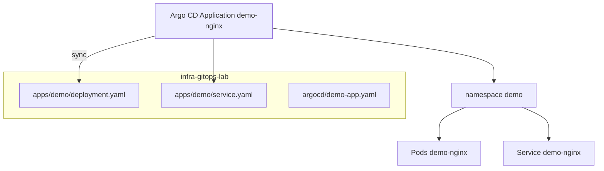

# Практикум GitOps — репозиторий и Application

Git становится **единственным источником правды** (source of truth) для конфигурации кластера. Argo CD читает репозиторий и создаёт ресурсы через объект **Application** — Custom Resource, который описывает "откуда брать манифесты" и "куда их применять".

Предварительно завершите [шаг 1](./1.md): кластер, Argo CD UI, namespace `demo`.

---

## Предварительные требования

| Компонент | Статус |
|-----------|--------|
| Argo CD UI на `https://localhost:8080` | port-forward активен |
| namespace `demo` | создан |
| Аккаунт GitHub/GitLab | для push репозитория |
| git локально | `git init`, remote add |

---

## Архитектура шага 2



---

## 1. Структура Git-репозитория

Создайте каталог и инициализируйте repo:

```bash
mkdir -p infra-gitops-lab/apps/demo infra-gitops-lab/argocd
cd infra-gitops-lab
git init
git branch -M main
```

Целевая структура:

```
infra-gitops-lab/
  apps/
    demo/
      deployment.yaml
      service.yaml
  argocd/
    demo-app.yaml
```

### deployment.yaml

**Deployment** — контроллер, который держит заданное число одинаковых **Pod** (контейнеров). Pod — минимальная единица запуска в [Kubernetes](/encyclopedia/8-infra-security/8-06-konteynerizatsiya-i-orkestratsiya/211).

```yaml
apiVersion: apps/v1
kind: Deployment
metadata:
  name: demo-nginx
  namespace: demo
spec:
  replicas: 2
  selector:
    matchLabels:
      app: demo-nginx
  template:
    metadata:
      labels:
        app: demo-nginx
    spec:
      containers:
        - name: nginx
          image: nginx:1.27-alpine
          ports:
            - containerPort: 80
          resources:
            requests:
              cpu: 50m
              memory: 64Mi
            limits:
              cpu: 200m
              memory: 128Mi
```

Поле `replicas: 2` — два Pod для демонстрации rolling update в шаге 3. Tag образа `1.27-alpine` — фиксированная версия; `:latest` в GitOps избегают.

### service.yaml

**Service** — стабильный DNS и IP для доступа к Pod по label `app: demo-nginx`.

```yaml
apiVersion: v1
kind: Service
metadata:
  name: demo-nginx
  namespace: demo
spec:
  selector:
    app: demo-nginx
  ports:
    - port: 80
      targetPort: 80
  type: ClusterIP
```

`ClusterIP` — доступ только внутри кластера; для проверки используем `kubectl port-forward`.

### Первый commit и push

```bash
git add apps/demo/
git commit -m "feat: add demo nginx deployment and service"
git remote add origin https://github.com/YOUR_USER/infra-gitops-lab.git
git push -u origin main
```

Замените `YOUR_USER` на свой логин. Для private repo настройте credentials в Argo CD (см. раздел "Безопасность" ниже).

Пример минимальных манифестов — [/lab/Примеры/11115](/lab/Примеры/11115).

---

## 2. Argo CD Application

**Application** связывает Git-путь с namespace в кластере. Файл `argocd/demo-app.yaml`:

```yaml
apiVersion: argoproj.io/v1alpha1
kind: Application
metadata:
  name: demo-nginx
  namespace: argocd
  finalizers:
    - resources-finalizer.argocd.argoproj.io
spec:
  project: default
  source:
    repoURL: https://github.com/YOUR_USER/infra-gitops-lab.git
    targetRevision: main
    path: apps/demo
  destination:
    server: https://kubernetes.default.svc
    namespace: demo
  syncPolicy:
    automated:
      prune: true
      selfHeal: true
    syncOptions:
      - CreateNamespace=true
```

| Параметр | Смысл |
|----------|-------|
| `repoURL` | HTTPS или SSH URL Git-репозитория |
| `path` | Каталог с манифестами относительно корня repo |
| `targetRevision` | Ветка, tag или commit SHA |
| `destination.namespace` | Куда применять ресурсы |
| `automated.prune` | Удаляет ресурсы, которых больше нет в Git |
| `automated.selfHeal` | Возвращает кластер к Git при ручных правках |
| `CreateNamespace=true` | Создаёт namespace, если его ещё нет |

Теория pull-based deploy — [GitOps](/encyclopedia/8-infra-security/8-12-aktualnye-praktiki/4).

### Применение Application

Application можно применить из того же repo или локально:

```bash
kubectl apply -f argocd/demo-app.yaml
```

Ожидаемый вывод:

```
application.argoproj.io/demo-nginx created
```

Либо через CLI после push `argocd/` в Git:

```bash
argocd app create demo-nginx \
  --repo https://github.com/YOUR_USER/infra-gitops-lab.git \
  --path apps/demo \
  --dest-server https://kubernetes.default.svc \
  --dest-namespace demo \
  --sync-policy automated \
  --auto-prune \
  --self-heal
```

### Проверка в UI

Откройте Argo CD UI → Application `demo-nginx`. Ожидаемые статусы:

| Поле | Значение |
|------|----------|
| Sync Status | Synced |
| Health | Healthy |
| Revision | SHA последнего commit на `main` |

Если **Progressing** — подождите 1–2 минуты. Если **Unknown** или **Failed** — см. troubleshooting ниже.

---

## 3. Проверка в кластере

```bash
kubectl get deployment,svc,pods -n demo
```

Ожидаемый результат:

```
NAME                         READY   UP-TO-DATE   AVAILABLE   AGE
deployment.apps/demo-nginx   2/2     2            2           1m

NAME                 TYPE        CLUSTER-IP     EXTERNAL-IP   PORT(S)   AGE
service/demo-nginx   ClusterIP   10.96.xxx.x    <none>        80/TCP    1m

NAME                              READY   STATUS    RESTARTS   AGE
pod/demo-nginx-xxxxxxxxxx-xxxxx   1/1     Running   0          1m
pod/demo-nginx-xxxxxxxxxx-yyyyy   1/1     Running   0          1m
```

Доступ к nginx через port-forward:

```bash
kubectl port-forward svc/demo-nginx -n demo 8888:80
```

В другом терминале:

```bash
curl -s -o /dev/null -w "%{http_code}\n" http://localhost:8888
```

Ожидаемый код **200**. Тело ответа — HTML страница "Welcome to nginx!".

CLI Argo CD:

```bash
argocd app get demo-nginx
argocd app diff demo-nginx
```

Пустой diff означает совпадение Git и кластера.

---

## Устранение неполадок

| Статус в UI | Причина | Решение |
|-------------|---------|---------|
| **OutOfSync** | Ручные правки или задержка sync | Нажмите Sync или дождитесь automated |
| **ComparisonError** | Неверный repoURL, нет доступа | Проверьте URL, для private — Repository credentials |
| **InvalidSpecError** | Опечатка в YAML Application | `kubectl describe application demo-nginx -n argocd` |
| Pods **ImagePullBackOff** | Нет сети к Docker Hub | Проверьте `docker pull nginx:1.27-alpine` на хосте |
| **Degraded** | Readiness probe fail | `kubectl logs -n demo -l app=demo-nginx` |

Для private repository в UI: Settings → Repositories → Connect repo (HTTPS token или SSH key).

---

## Подключение private repository

Если репозиторий private, Argo CD не прочитает манифесты без credentials.

### HTTPS с Personal Access Token

1. GitHub → Settings → Developer settings → Personal access tokens → fine-grained token.
2. Права: Repository → Contents → Read-only на `infra-gitops-lab`.
3. В Argo CD UI: Settings → Repositories → Connect repo using HTTPS.
4. URL: `https://github.com/YOUR_USER/infra-gitops-lab.git`, username — логин, password — token.

CLI:

```bash
argocd repo add https://github.com/YOUR_USER/infra-gitops-lab.git \
  --username YOUR_USER \
  --password ghp_xxxxxxxx \
  --name infra-gitops-lab
argocd repo list
```

Ожидаемый статус: **Successful**.

### SSH (альтернатива)

```bash
argocd repo add git@github.com:YOUR_USER/infra-gitops-lab.git \
  --ssh-private-key-path ~/.ssh/id_ed25519
```

Публичный ключ добавьте в GitHub → Repository → Deploy keys (read-only достаточно для Argo CD).

---

## Разбор полей Application построчно

| Поле | Пример | Объяснение |
|------|--------|------------|
| `apiVersion` | argoproj.io/v1alpha1 | Версия CRD Argo CD |
| `kind` | Application | Тип ресурса |
| `metadata.namespace` | argocd | Application живёт рядом с Argo CD |
| `spec.project` | default | AppProject — RBAC и whitelist repo |
| `spec.source.repoURL` | https://github.com/... | Откуда clone |
| `spec.source.path` | apps/demo | Подкаталог с YAML |
| `spec.source.targetRevision` | main | Ветка или tag |
| `spec.destination.server` | https://kubernetes.default.svc | In-cluster API |
| `spec.destination.namespace` | demo | Target namespace |
| `syncPolicy.automated` | prune, selfHeal | Авто-sync |

Теория pull model — [GitOps 8.12/4](/encyclopedia/8-infra-security/8-12-aktualnye-praktiki/4).

---

## AppProject (расширение lab)

**AppProject** ограничивает, какие repo и namespace может использовать Application. Пример для команды:

```yaml
apiVersion: argoproj.io/v1alpha1
kind: AppProject
metadata:
  name: demo-team
  namespace: argocd
spec:
  sourceRepos:
    - https://github.com/YOUR_USER/infra-gitops-lab.git
  destinations:
    - namespace: demo
      server: https://kubernetes.default.svc
  clusterResourceWhitelist:
    - group: apps
      kind: Deployment
    - group: ""
      kind: Service
```

В Application замените `project: default` на `project: demo-team`. В production whitelist не даёт применить ClusterRole из случайного path.

---

## Health и Sync — что видит UI

Argo CD вычисляет **health** по типу ресурса:

| Ресурс | Healthy когда |
|--------|---------------|
| Deployment | desired replicas = ready replicas |
| Service | ClusterIP назначен |
| Pod | Running и probes OK |

**Sync status**:

| Статус | Значение |
|--------|----------|
| Synced | Live = Git |
| OutOfSync | Есть diff |
| Unknown | Ошибка сравнения |

Команда для JSON status:

```bash
kubectl get application demo-nginx -n argocd -o jsonpath='{.status.sync.status}{" "}{.status.health.status}{"\n"}'
```

Ожидаемо: `Synced Healthy`.

---

## Расширенная проверка сети внутри кластера

```bash
kubectl run curl-test --rm -it --restart=Never -n demo --image=curlimages/curl -- \
  curl -s -o /dev/null -w "%{http_code}" http://demo-nginx.demo.svc.cluster.local
```

Ожидаемый код **200** — Service резолвится через DNS `имя.namespace.svc.cluster.local` — см. [8.06 Service](/encyclopedia/8-infra-security/8-06-konteynerizatsiya-i-orkestratsiya/211).

---

## Частые вопросы

**Почему Argo CD не создал Deployment сразу?**  
Repo server clone + manifest generate занимает 30–120 секунд. Проверьте Events: `kubectl describe application demo-nginx -n argocd`.

**Можно ли один repo на много Application?**  
Да. Разные `path` — `apps/team-a`, `apps/team-b` — и разные `destination.namespace`.

**Нужен ли Helm?**  
Нет для lab. Argo CD поддерживает plain YAML, Helm, Kustomize — см. [8.06/211](/encyclopedia/8-infra-security/8-06-konteynerizatsiya-i-orkestratsiya/211#cicd-и-gitops).

---

## Дополнительное lab-задание

1. Добавьте label `app.kubernetes.io/version: "1.27"` в Deployment template metadata.
2. Commit и push — убедитесь в UI, что diff только по labels.
3. Добавьте `livenessProbe` httpGet на `/` port 80 — перезапустите sync при Degraded Pod.

Пример probe:

```yaml
          livenessProbe:
            httpGet:
              path: /
              port: 80
            initialDelaySeconds: 5
            periodSeconds: 10
```

---

## Устранение неполадок (продолжение)

| Симптом | Диагностика | Решение |
|---------|-------------|---------|
| `rpc error: code = Unknown` в repo | `argocd repo get` | Проверьте token / SSH |
| Application **Missing** | CRD не установлен | Переустановите Argo CD manifest |
| Duplicate resource | Два Application на один path | Удалите дубликат |
| Sync **Failed** invalid YAML | `kubectl apply --dry-run=client -f` локально | Исправьте syntax в Git |

Логи repo-server:

```bash
kubectl logs -n argocd -l app.kubernetes.io/name=argocd-repo-server --tail=50
```

---

## Полный пошаговый сценарий (copy-paste lab)

Ниже — последовательность без пропусков для проверки end-to-end после [шага 1](./1.md).

### Создание repo локально

```bash
mkdir -p ~/infra-gitops-lab/apps/demo ~/infra-gitops-lab/argocd
cd ~/infra-gitops-lab
```

Скопируйте `deployment.yaml` и `service.yaml` из раздела 1 выше. Затем:

```bash
git init && git branch -M main
git add apps/demo/
git commit -m "feat: demo nginx manifests"
git remote add origin https://github.com/YOUR_USER/infra-gitops-lab.git
git push -u origin main
```

### Application manifest

Сохраните `argocd/demo-app.yaml`, замените YOUR_USER, commit optional (можно apply локально):

```bash
kubectl apply -f argocd/demo-app.yaml
```

### Ожидание sync

```bash
for i in 1 2 3 4 5 6 7 8 9 10; do
  STATUS=$(kubectl get application demo-nginx -n argocd -o jsonpath='{.status.sync.status}' 2>/dev/null)
  HEALTH=$(kubectl get application demo-nginx -n argocd -o jsonpath='{.status.health.status}' 2>/dev/null)
  echo "sync=$STATUS health=$HEALTH"
  [ "$STATUS" = "Synced" ] && [ "$HEALTH" = "Healthy" ] && break
  sleep 15
done
```

### Финальная проверка

```bash
kubectl get pods -n demo -l app=demo-nginx
kubectl port-forward svc/demo-nginx -n demo 8888:80 &
sleep 2
curl -s -o /dev/null -w "HTTP %{http_code}\n" http://localhost:8888
kill %1 2>/dev/null
```

Ожидается HTTP 200 и два Pod Running.

---

## Интеграция с Vault ExternalSecret (preview)

После [Vault practicum шаг 3](/encyclopedia/8-infra-security/8-14-praktikum-vault/3) добавьте в `apps/demo/` файл `external-secret.yaml` **без** password в Git. Argo CD sync создаст ExternalSecret; ESO создаст Kubernetes Secret. Deployment ссылается на `secretRef` — password только в Vault.

---

## Метрики успеха шага 2

| Критерий | Как проверить |
|----------|---------------|
| Git содержит манифесты | `git ls-files apps/demo/` |
| Application существует | `kubectl get app demo-nginx -n argocd` |
| Synced + Healthy | UI или jsonpath |
| 2 Pod Running | `kubectl get pods -n demo` |
| Service отвечает | curl через port-forward |
| Diff пустой | `argocd app diff demo-nginx` |

---

## Справочник полей deployment.yaml

| Строка YAML | Назначение |
|-------------|------------|
| `apiVersion: apps/v1` | API группа Deployment |
| `kind: Deployment` | Тип ресурса — контроллер реплик Pod |
| `metadata.name` | Имя Deployment в namespace |
| `metadata.namespace` | demo — изоляция от argocd |
| `spec.replicas` | Желаемое число Pod |
| `spec.selector.matchLabels` | Как Deployment находит свои Pod |
| `spec.template.metadata.labels` | Labels на Pod — должны match selector |
| `spec.template.spec.containers` | Список контейнеров в Pod |
| `containers[].image` | Docker-образ из registry |
| `containers[].ports` | Порты контейнера — для Service targetPort |
| `resources.requests` | Минимум CPU/RAM для scheduler |
| `resources.limits` | Максимум CPU/RAM для контейнера |

Подробнее о каждом kind — [8.06/211](/encyclopedia/8-infra-security/8-06-konteynerizatsiya-i-orkestratsiya/211).

---

## Справочник полей service.yaml

| Поле | Значение в lab |
|------|----------------|
| `spec.selector.app` | Связь с Pod label `demo-nginx` |
| `spec.ports.port` | Порт Service внутри кластера (80) |
| `spec.ports.targetPort` | Порт контейнера nginx (80) |
| `type: ClusterIP` | Доступ только inside cluster |

DNS имя Service: `demo-nginx.demo.svc.cluster.local`.

---

## Ожидаемый вывод kubectl describe application

```bash
kubectl describe application demo-nginx -n argocd
```

Фрагмент Events при успехе:

```
Status:
  Health:
    Status:       Healthy
  Sync:
    Status:       Synced
    Revision:     abc1234...
  Conditions:
    Type:         Synced
    Message:      successfully synced
Events:
  Normal  ResourceUpdated  application-controller  Updated sync status
```

При ошибке repo clone Events содержат `ComparisonError` и текст `authentication required`.

---

## Kustomize и Helm в том же repo

Argo CD autodetect tool по файлам в path:

| Файл в path | Tool |
|-------------|------|
| `kustomization.yaml` | Kustomize |
| `Chart.yaml` | Helm |
| Только `.yaml` | Plain directory |

Пример `kustomization.yaml` в `apps/demo/`:

```yaml
apiVersion: kustomize.config.k8s.io/v1beta1
kind: Kustomization
resources:
  - deployment.yaml
  - service.yaml
commonLabels:
  app.kubernetes.io/part-of: gitops-lab
```

Commit и push — Argo CD пересоберёт manifest через kustomize build.

---

## Multi-source Application (preview)

Argo CD 2.x поддерживает несколько source в одной Application — например chart + values из второго repo. Для enterprise fleet; в lab достаточно single source. Документация связана с [GitOps 8.12/4](/encyclopedia/8-infra-security/8-12-aktualnye-praktiki/4).

---

## Безопасность

1. Секреты (пароли, ключи API) **не храните** в открытом виде в Git — см. [практикум Vault](/encyclopedia/8-infra-security/8-14-praktikum-vault/intro) и Sealed Secrets.
2. Для private-репозитория добавьте credentials в Argo CD (SSH-ключ или token с минимальными правами read).
3. Политики на манифесты — [DevSecOps](/encyclopedia/8-infra-security/8-12-aktualnye-praktiki/3).
4. Не коммитьте `argocd-initial-admin-secret` и kubeconfig в infra-repo.

---

## Связанные материалы

- [Справочник Kubernetes — Deployment, Service](/encyclopedia/8-infra-security/8-06-konteynerizatsiya-i-orkestratsiya/211)
- [GitOps — теория](/encyclopedia/8-infra-security/8-12-aktualnye-praktiki/4)
- [Шаг 1 — кластер и Argo CD](./1.md)
- Дальше — [обновление через Git](./3.md)

---
