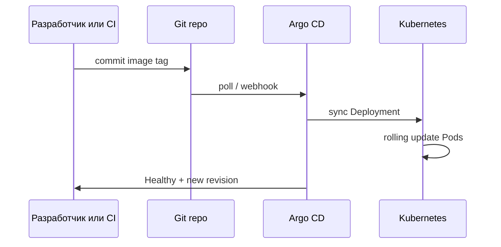
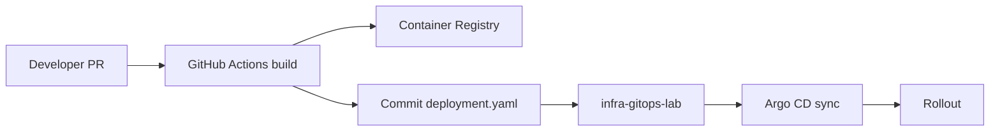

# Практикум GitOps — обновление через Git

В GitOps релиз — **изменение в Git**. Оператор не запускает `kubectl apply` вручную на проде. Argo CD обнаруживает diff между repo и кластером и запускает [rolling update](/encyclopedia/8-infra-security/8-04-devops-ci-cd/111) — поочерёдную замену Pod без простоя.

Предварительно Application `demo-nginx` должна быть **Synced / Healthy** ([шаг 2](./2.md)).

---

## Предварительные требования

| Проверка | Команда | Ожидание |
|----------|---------|----------|
| Application синхронизирована | `argocd app get demo-nginx` | Sync: Synced |
| Два Pod работают | `kubectl get pods -n demo` | 2/2 Running |
| Git remote настроен | `git remote -v` | origin → ваш repo |

---

## Архитектура релиза



---

## Сценарий релиза

1. CI собрал образ с новым tag (в lab меняем tag в `deployment.yaml` вручную).
2. В репозитории **infra-git** меняете поле `image:` в `apps/demo/deployment.yaml`.
3. Commit и push → Argo CD обнаруживает изменение → sync → rolling update.

### Ручное изменение tag (lab)

Откройте `apps/demo/deployment.yaml` и измените образ:

```yaml
          image: nginx:1.26-alpine
```

Commit:

```bash
git add apps/demo/deployment.yaml
git commit -m "chore: bump nginx to 1.26-alpine"
git push origin main
```

Ожидаемое поведение Argo CD (через 1–3 минуты при poll):

```
Sync Status: Synced
Health: Progressing → Healthy
Revision: <новый SHA commit>
```

### Pin по digest (рекомендуется для supply chain)

Tag образа можно подменить злоумышленником. Надёжнее фиксировать **digest** (SHA256 слоя образа):

```bash
docker pull nginx:1.27-alpine
docker inspect nginx:1.27-alpine --format='{{index .RepoDigests 0}}'
```

Пример строки в манифесте:

```yaml
image: nginx:1.27-alpine@sha256:5041775884a...   # полный digest из inspect
```

Подробнее — [Supply chain](/encyclopedia/8-infra-security/8-12-aktualnye-praktiki/1).

---

## Наблюдение за rollout

```bash
kubectl rollout status deployment/demo-nginx -n demo --timeout=120s
```

Ожидаемый вывод:

```
Waiting for deployment "demo-nginx" rollout to finish: 1 out of 2 new replicas have been updated...
Waiting for deployment "demo-nginx" rollout to finish: 2 old replicas are pending termination...
deployment "demo-nginx" successfully rolled out
```

История ReplicaSet:

```bash
kubectl rollout history deployment/demo-nginx -n demo
```

Argo CD CLI:

```bash
argocd app get demo-nginx
argocd app history demo-nginx
```

В UI раздел **History and Rollback** показывает **Git commits** — видно, какой commit вызвал изменение. Это аудит через Git без ручных правок в кластере.

Проверка версии nginx внутри Pod:

```bash
kubectl exec -n demo deploy/demo-nginx -- nginx -v
```

Ожидаемая строка содержит `nginx/1.26` после bump.

---

## Имитация CI (GitHub Actions)

В production CI обновляет манифест после сборки и push образа в registry. Для lab — workflow с ручным запуском:

```yaml
# .github/workflows/update-manifest.yml
name: Bump nginx tag
on:
  workflow_dispatch:
    inputs:
      image_tag:
        description: "Minor nginx version, e.g. 1.26"
        required: true
        type: string
jobs:
  bump:
    runs-on: ubuntu-latest
    permissions:
      contents: write
    steps:
      - uses: actions/checkout@v4
      - name: Patch deployment
        run: |
          sed -i "s|image: nginx:.*|image: nginx:${{ inputs.image_tag }}-alpine|" apps/demo/deployment.yaml
      - name: Commit and push
        run: |
          git config user.name "ci-bot"
          git config user.email "ci-bot@users.noreply.github.com"
          git commit -am "chore: bump nginx to ${{ inputs.image_tag }}"
          git push
```

После push Argo CD подхватит commit так же, как при ручном изменении.

Полные рецепты CI/CD — [/lab/Примеры/1134](/lab/Примеры/1134), [раздел DevOps](/encyclopedia/8-infra-security/8-04-devops-ci-cd/intro).

---

## Проверка шага 3

| Шаг | Команда | Ожидание |
|-----|---------|----------|
| 1 | `argocd app get demo-nginx` | Revision = последний commit |
| 2 | `kubectl get rs -n demo` | Новый ReplicaSet с desired 2 |
| 3 | `curl localhost:8888` (port-forward) | HTTP 200 |
| 4 | UI History | Запись с message bump |

---

## Устранение неполадок

| Симптом | Причина | Решение |
|---------|---------|---------|
| Argo не видит commit | Задержка poll (3 min default) | Sync в UI вручную или уменьшите timeout repo |
| Rollout stuck | Нехватка ресурсов | `kubectl describe rs -n demo` |
| **ImagePullBackOff** | Неверный tag | Проверьте tag на Docker Hub |
| Sync OK, образ старый | Кэш на ноде | `kubectl delete pod -n demo -l app=demo-nginx` |

---

## Canary (опционально)

Для production используйте **Argo Rollouts** или два Application (stable и canary). Базовые стратегии развёртывания — [8.04/111](/encyclopedia/8-infra-security/8-04-devops-ci-cd/111). В этом lab достаточно стандартного Deployment rolling update.

---

## Заметки по безопасности

1. CI-bot должен иметь право только на infra-repo, не на kubeconfig prod.
2. Pin digest снижает риск подмены образа в registry.
3. Review PR перед merge — [DevSecOps](/encyclopedia/8-infra-security/8-12-aktualnye-praktiki/3).

Следующий шаг — [drift и откат](./4.md).

---

## Webhook вместо poll (production)

По умолчанию Argo CD опрашивает Git каждые 3 минуты. Для быстрого deploy настройте **webhook** в GitHub:

1. Argo CD Settings → Repositories → ваш repo → Webhook URL.
2. GitHub → repo → Settings → Webhooks → Payload URL из Argo CD, content type `application/json`.
3. Events: push.

После push sync начнётся за секунды. Теория — [GitOps](/encyclopedia/8-infra-security/8-12-aktualnye-praktiki/4).

---

## Kustomize overlay (опционально)

Структура с Kustomize — разные overlay для dev/prod без дублирования YAML:

```
apps/demo/
  base/
    deployment.yaml
    service.yaml
    kustomization.yaml
  overlays/
    dev/
      kustomization.yaml
    prod/
      kustomization.yaml
```

В Application укажите `path: apps/demo/overlays/dev`. Argo CD вызовет `kustomize build` автоматически.

---

## Проверка ReplicaSet во время rollout

```bash
kubectl get rs -n demo -l app=demo-nginx -o wide
watch kubectl get pods -n demo -l app=demo-nginx
```

Во время rolling update видны Pod с разными hash в имени — старый ReplicaSet scale down, новый scale up.

---

## Semver и image tag policy

Рекомендации для команды:

| Практика | Пример |
|----------|--------|
| Фиксированный tag | `nginx:1.27-alpine` |
| Digest pin | `nginx@sha256:abc...` |
| Избегать | `nginx:latest` |

Supply chain — [8.12/1](/encyclopedia/8-infra-security/8-12-aktualnye-praktiki/1).

---

## CI/CD pipeline end-to-end (схема)



Примеры workflow — [/lab/Примеры/1134](/lab/Примеры/1134).

---

## Дополнительное задание

1. Измените `replicas` с 2 на 3 через Git — наблюдайте rolling без downtime.
2. Добавьте annotation `argocd.argoproj.io/sync-wave: "1"` — порядок sync при нескольких ресурсах.
3. Запустите GitHub Actions bump из раздела выше с tag `1.25`.

---

## Устранение неполадок (расширение)

| Симптом | Команда | Решение |
|---------|---------|---------|
| Old pods не terminate | `kubectl describe pod -n demo` | Проверьте PDB, grace period |
| Argo **Progressing** долго | `argocd app get demo-nginx --hard-refresh` | Принудительный refresh |
| Wrong image после sync | `kubectl get deploy -o yaml \| grep image` | Проверьте branch в Application |

---

## Связанные материалы

- [GitOps — теория](/encyclopedia/8-infra-security/8-12-aktualnye-praktiki/4)
- [Kubernetes — rolling update](/encyclopedia/8-infra-security/8-06-konteynerizatsiya-i-orkestratsiya/211)
- [Шаг 2 — Application](./2.md)

---

## Полный walkthrough релиза через Git

Сценарий от текущего состояния (Synced/Healthy) до нового образа в кластере.

### Подготовка — зафиксируйте baseline

```bash
argocd app get demo-nginx
kubectl get deployment demo-nginx -n demo -o jsonpath='{.spec.template.spec.containers[0].image}{"\n"}'
kubectl get pods -n demo -l app=demo-nginx
```

Ожидаемый образ до bump — `nginx:1.27-alpine` (или ваш из шага 2). Два Pod в Running.

### Изменение в Git

```bash
cd infra-gitops-lab
sed -i 's|nginx:1.27-alpine|nginx:1.26-alpine|' apps/demo/deployment.yaml
git diff apps/demo/deployment.yaml
git add apps/demo/deployment.yaml
git commit -m "chore: bump nginx to 1.26-alpine"
git push origin main
```

Ожидаемый `git diff` — одна строка `image:`.

### Ожидание sync Argo CD

```bash
for i in 1 2 3 4 5 6 7 8 9 10; do
  REV=$(kubectl get application demo-nginx -n argocd -o jsonpath='{.status.sync.status}' 2>/dev/null)
  IMG=$(kubectl get deployment demo-nginx -n demo -o jsonpath='{.spec.template.spec.containers[0].image}' 2>/dev/null)
  echo "sync=$REV image=$IMG"
  echo "$IMG" | grep -q 1.26 && break
  sleep 15
done
```

Ожидаемо — `image=nginx:1.26-alpine` и Sync Status Synced.

### Проверка rollout

```bash
kubectl rollout status deployment/demo-nginx -n demo --timeout=120s
kubectl exec -n demo deploy/demo-nginx -- nginx -v 2>&1 | head -1
```

Ожидаемая строка nginx содержит `nginx/1.26`.

---

## Ожидаемый вывод argocd app history

```bash
argocd app history demo-nginx
```

Фрагмент при успехе:

```
ID  DATE                           REVISION
0   2026-06-15 10:00:00 +0000 UTC  abc1234 (feat: add demo nginx)
1   2026-06-15 11:30:00 +0000 UTC  def5678 (chore: bump nginx to 1.26-alpine)
```

---

## Типичные ошибки шага 3

| Симптом | Ожидаемое при OK | Диагностика | Решение |
|---------|------------------|-------------|---------|
| Argo не видит commit 5+ мин | Revision = новый SHA | `argocd app get demo-nginx --refresh` | Hard refresh или webhook |
| ImagePullBackOff | Pod Running | `kubectl describe pod -n demo` | Проверьте tag на hub.docker.com |
| Synced, образ старый | image в deploy = Git | `argocd app diff demo-nginx` | Проверьте branch targetRevision |
| Rollout stuck | rollout finished | `kubectl get rs -n demo` | Нехватка CPU — describe pod |
| Progressing > 10 min | Healthy | `kubectl logs -n demo -l app=demo-nginx` | Readiness probe |

---

## Предупреждения безопасности

1. CI-bot с правом push в infra-repo **без** kubeconfig prod — только Git.
2. Pin digest вместо tag снижает риск подмены образа в registry.
3. Review PR перед merge — [DevSecOps](/encyclopedia/8-infra-security/8-12-aktualnye-praktiki/3).
4. Не используйте `:latest` в Git — непредсказуемый rollout.
5. Webhook URL Argo CD не публикуйте без auth.

---

## Чек-лист завершения шага 3

| # | Проверка | Команда | Ожидание |
|---|----------|---------|----------|
| 1 | Новый revision | `argocd app get demo-nginx` | SHA последнего commit |
| 2 | Образ обновлён | jsonpath image | nginx:1.26-alpine |
| 3 | Rollout OK | `kubectl rollout status` | successfully rolled out |
| 4 | nginx -v | exec в pod | версия 1.26 |
| 5 | HTTP 200 | port-forward + curl | код 200 |
| 6 | History в UI | Argo CD UI | запись bump |

Дальше — [drift и откат](./4.md).

---

## GitHub Actions — полный workflow с проверкой

Добавьте в repo `.github/workflows/update-manifest.yml` из раздела выше. После push workflow:

```bash
gh run list --workflow=update-manifest.yml --limit 3
gh run view <run-id> --log
```

Ожидаемый лог — commit `chore: bump nginx` и push в main. Argo CD подхватит тот же commit.

---

## Имитация сбоя rollout (lab)

Намеренно укажите несуществующий tag:

```yaml
image: nginx:9.99-nonexistent
```

После push — Pod в ImagePullBackOff, Application **Degraded**. Откат через `git revert` — тема [шага 4](./4.md).

```bash
kubectl get pods -n demo -l app=demo-nginx
# STATUS ImagePullBackOff — ожидаемо для учебного сбоя
git revert HEAD --no-edit && git push
```

---

## Метрики успеха релиза

| Метрика | Как измерить | Цель lab |
|---------|--------------|----------|
| Time to sync | от push до Synced | < 5 min (poll) |
| Rollout duration | rollout status | < 2 min |
| Downtime | curl в цикле | 0 (rolling) |
| Replicas ready | get pods | 2/2 |

---

## Наблюдение rollout в реальном времени

```bash
kubectl get pods -n demo -l app=demo-nginx -w
# в другом терминале — push commit с bump
```

Ожидаемая последовательность — Terminating старых pod, Running новых с другим hash в имени.

---
