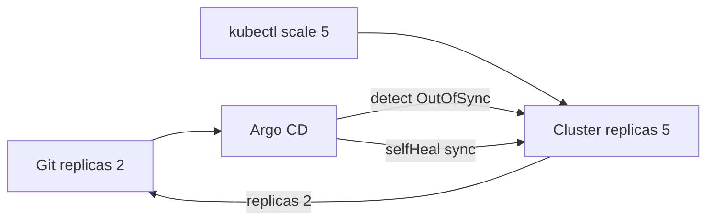

# Практикум GitOps — drift и откат

**Drift** (расхождение) — когда состояние кластера отличается от Git. GitOps делает Git единственным источником правды: откат и исправления тоже идут через commit. Экстренные правки `kubectl` без записи в Git создают временный drift, который Argo CD может автоматически отменить.

Предварительно завершите [шаг 3](./3.md) с работающим rolling update.

---

## Предварительные требования

| Настройка | Где проверить |
|-----------|---------------|
| `selfHeal: true` | `argocd/demo-app.yaml` или UI Application spec |
| `automated.prune: true` | там же |
| Application Synced | `argocd app get demo-nginx` |

---

## Архитектура drift и self-heal



---

## 1. Обнаружение drift

Измените кластер **в обход Git** — увеличьте число реплик:

```bash
kubectl scale deployment/demo-nginx -n demo --replicas=5
kubectl get deployment demo-nginx -n demo
```

Ожидаемый вывод сразу после scale:

```
NAME         READY   UP-TO-DATE   AVAILABLE   AGE
demo-nginx   5/5     5            5           20m
```

Через несколько секунд при `selfHeal: true` Argo CD вернёт **replicas: 2** из Git. В UI статус пройдёт **OutOfSync** → **Syncing** → **Synced**.

Проверка:

```bash
kubectl get deployment demo-nginx -n demo -o jsonpath='{.spec.replicas}{"\n"}'
```

Ожидаемое значение после self-heal: **2**.

**Вывод для практики:** экстренный `kubectl scale` без commit — временная мера на минуты. Зафиксируйте желаемое число реплик в Git или отключите selfHeal осознанно (только для особых случаев на dev).

Другой пример drift — ручное изменение env:

```bash
kubectl set env deployment/demo-nginx -n demo DEMO=manual
argocd app diff demo-nginx
```

Diff покажет лишнюю переменную; после sync Argo CD удалит её.

---

## 2. Откат через Git

Предпочтительный rollback в GitOps — новый commit, который отменяет проблемный.

```bash
cd infra-gitops-lab
git log --oneline -3
git revert HEAD --no-edit
git push origin main
```

Ожидаемое поведение:

1. Argo CD видит новый SHA на `main`.
2. Sync применяет предыдущий образ и конфигурацию из Git.
3. UI History показывает revert commit.

Проверка образа:

```bash
kubectl get deployment demo-nginx -n demo -o jsonpath='{.spec.template.spec.containers[0].image}{"\n"}'
```

Должен вернуться tag из commit до bump.

### Способы отката

| Способ | Git обновляется | Drift после отката |
|--------|-----------------|-------------------|
| `git revert` + push | Да | Нет — Git и кластер совпадают |
| `kubectl rollout undo` | Нет | Да — кластер и Git расходятся |
| Rollback в Argo CD UI к старому Git SHA | Нет (если только UI) | Зависит от sync policy |

`kubectl rollout undo` допустим как **break-glass** на минуты, но затем нужен commit в Git с тем же образом, иначе следующий sync или selfHeal вернёт проблемную версию.

---

## 3. Sync policy для prod

На dev удобна полная автоматика. На production часто включают ручной sync или окна деплоя.

| Policy | Когда применять |
|--------|-----------------|
| `automated` + selfHeal | dev и staging |
| Manual sync + approval | production |
| Sync windows | запрет deploy в нерабочие часы |

Пример manual sync (без блока automated):

```yaml
syncPolicy:
  syncOptions:
    - CreateNamespace=true
```

Пример sync window (фрагмент Application):

```yaml
syncPolicy:
  syncOptions:
    - CreateNamespace=true
  automated:
    prune: true
    selfHeal: true
  # syncWindows задают в AppProject — см. документацию Argo CD
```

При manual sync оператор нажимает **Sync** в UI после review PR. Теория — [GitOps](/encyclopedia/8-infra-security/8-12-aktualnye-praktiki/4).

---

## 4. Статусы OutOfSync и Degraded

| Статус | Значение |
|--------|----------|
| **OutOfSync** | Git и live manifest различаются |
| **Synced** | Состояние применено из Git |
| **Healthy** | Ресурсы работают (Pod Running) |
| **Degraded** | Ресурс сломан (CrashLoop, failed probe) |
| **Progressing** | Идёт rollout или sync |

Application может быть **Synced** и **Degraded** одновременно — Git применён, но Pod падает. Лечится правкой манифеста в Git, не только sync.

---

## 5. Очистка lab

```bash
kind delete cluster --name gitops-lab
# или: minikube delete
```

Удалите port-forward процессы и локальный clone при необходимости.

---

## Проверка шага 4

1. Выполните scale до 5 и убедитесь, что replicas вернулись к 2.
2. Сделайте `git revert` после bump образа и проверьте tag в Deployment.
3. Объясните разницу между OutOfSync и Degraded своими словами.

---

## Устранение неполадок

| Симптом | Действие |
|---------|----------|
| selfHeal не срабатывает | Проверьте `automated.selfHeal` в Application |
| revert не меняет образ | Конфликт revert — решите в Git и push |
| Prune удалил лишний ресурс | Ресурс убрали из Git — ожидаемое поведение prune |

---

## Заметки по безопасности

1. Break-glass kubectl должен логироваться; после инцидента — commit в Git.
2. Sync windows снижают риск деплоя в пик нагрузки.
3. Секреты по-прежнему в [Vault](/encyclopedia/8-infra-security/8-14-praktikum-vault/intro), не в infra-repo.

---

## Итоги практикума

Вы прошли цикл **Git as source of truth → Argo CD → Kubernetes**. Следующие шаги:

- [Практикум Vault](/encyclopedia/8-infra-security/8-14-praktikum-vault/intro) — секреты вне Git
- [DevSecOps policy on manifests](/encyclopedia/8-infra-security/8-12-aktualnye-praktiki/3) — политики безопасности
- [Справочник Kubernetes](/encyclopedia/8-infra-security/8-06-konteynerizatsiya-i-orkestratsiya/211)

[Итоги](./998.md) · [Чек-лист](./999.md)

---

## Sync windows — пример для prod

**Sync windows** задают, когда automated sync разрешён. Конфигурация на уровне AppProject:

```yaml
apiVersion: argoproj.io/v1alpha1
kind: AppProject
metadata:
  name: prod-project
  namespace: argocd
spec:
  syncWindows:
    - kind: allow
      schedule: "0 9-17 * * 1-5"
      duration: 8h
      applications:
        - demo-nginx
      manualSync: true
    - kind: deny
      schedule: "0 0-9 * * *"
      duration: 9h
      applications:
        - "*"
```

Расписание в cron — deploy только в рабочие часы. Manual sync в deny window заблокирован.

---

## AppProject и RBAC

Ограничьте, кто может sync production Application:

```yaml
spec:
  roles:
    - name: deployer
      policies:
        - p, proj:prod-project:deployer, applications, sync, prod-project/demo-nginx, allow
      groups:
        - platform-team
```

Интеграция с SSO через Dex — за рамками lab, см. [GitOps 8.12/4](/encyclopedia/8-infra-security/8-12-aktualnye-praktiki/4).

---

## kubectl rollout undo — break-glass сценарий

Если prod горит и revert в Git займёт минуты:

```bash
kubectl rollout undo deployment/demo-nginx -n demo
kubectl rollout status deployment/demo-nginx -n demo
```

**Сразу после стабилизации** — commit в Git с тем же образом, иначе drift:

```bash
# в infra-gitops-lab — верните image в deployment.yaml к working tag
git commit -am "fix: align Git with emergency rollback image"
git push
```

---

## Finalizers и удаление Application

Application с finalizer `resources-finalizer.argocd.argoproj.io` удаляет cascade ресурсы в demo при удалении Application. Lab cleanup:

```bash
kubectl delete application demo-nginx -n argocd
kubectl get all -n demo
# ресурсы demo-nginx удалены Argo CD
```

---

## Мониторинг drift в production

1. Prometheus metrics Argo CD — `argocd_app_info`, `argocd_app_sync_total`.
2. Alert на `sync_status != Synced` дольше N минут.
3. Policy — запрет `kubectl edit` для dev без break-glass role.

DevSecOps — [8.12/3](/encyclopedia/8-infra-security/8-12-aktualnye-praktiki/3).

---

## Расширенная проверка selfHeal

Тест с ConfigMap (если добавите в Git):

```bash
kubectl edit configmap -n demo
# добавьте ключ в обход Git
sleep 30
kubectl get application demo-nginx -n argocd -o jsonpath='{.status.sync.status}{"\n"}'
# OutOfSync → Synced после selfHeal
```

---

## Глоссарий шага 4

| Термин | Определение |
|--------|-------------|
| **Drift** | Расхождение live state и Git |
| **Self-heal** | Авто-sync к Git при drift |
| **Prune** | Удаление ресурсов, отсутствующих в Git |
| **Revert** | Новый commit, отменяющий предыдущий |
| **Break-glass** | Экстренное ручное вмешательство с последующим fix в Git |

---

## Полный walkthrough drift и отката

### Раунд 1 — демонстрация selfHeal

```bash
kubectl get deployment demo-nginx -n demo -o jsonpath='replicas={.spec.replicas}{"\n"}'
kubectl scale deployment/demo-nginx -n demo --replicas=5
kubectl get deployment demo-nginx -n demo
sleep 30
kubectl get deployment demo-nginx -n demo -o jsonpath='replicas={.spec.replicas}{"\n"}'
argocd app get demo-nginx
```

Ожидаемое поведение:

1. Сразу после scale — `replicas=5`.
2. Через 30–120 сек при selfHeal — `replicas=2`.
3. Argo CD — Sync Status **Synced**, кратковременно был **OutOfSync**.

### Раунд 2 — drift через env

```bash
kubectl set env deployment/demo-nginx -n demo DRIFT_TEST=manual
argocd app diff demo-nginx
```

Ожидаемый diff — лишняя переменная `DRIFT_TEST`. После automated sync переменная исчезнет.

### Раунд 3 — откат образа через git revert

```bash
cd infra-gitops-lab
git log --oneline -3
git revert HEAD --no-edit
git push origin main
kubectl rollout status deployment/demo-nginx -n demo --timeout=120s
kubectl get deployment demo-nginx -n demo -o jsonpath='{.spec.template.spec.containers[0].image}{"\n"}'
```

Ожидаемо — образ вернулся к версии до bump (например `nginx:1.27-alpine`).

---

## Ожидаемый вывод argocd app diff при drift

```bash
argocd app diff demo-nginx
```

Фрагмент при scale без Git:

```
===== apps/Deployment demo/demo-nginx ======
spec.replicas
- 2
+ 5
```

Пустой вывод после selfHeal — кластер совпал с Git.

---

## Типичные ошибки шага 4

| Симптом | Ожидаемое при OK | Решение |
|---------|------------------|---------|
| selfHeal не срабатывает 5+ мин | replicas=2 | Проверьте `automated.selfHeal: true` в Application |
| revert конфликт | push успешен | Разрешите конфликт в Git вручную |
| Prune удалил Service | ресурс был убран из Git | Верните YAML в repo или отключите prune |
| OutOfSync постоянно | Synced | Проверьте ignoreDifferences в Application |
| kubectl undo + drift | Git ≠ cluster | Commit с тем же образом в infra-repo |

---

## Предупреждения безопасности

1. Break-glass `kubectl` логируйте — после инцидента обязателен commit в Git.
2. Sync windows снижают риск деплоя в пик нагрузки.
3. Секреты — [Vault](/encyclopedia/8-infra-security/8-14-praktikum-vault/intro), не в infra-repo.
4. Manual sync на prod — без automated selfHeal до завершения review.
5. Rollback в UI без Git commit создаёт временный drift — документируйте.

---

## Чек-лист завершения практикума GitOps

| # | Навык | Как проверить |
|---|-------|---------------|
| 1 | Git — source of truth | Объясните без kubectl apply на prod |
| 2 | Application + auto-sync | `kubectl get app demo-nginx -n argocd` |
| 3 | Релиз через commit | History с bump commit |
| 4 | Drift detection | scale → selfHeal → replicas=2 |
| 5 | Откат git revert | образ вернулся |
| 6 | OutOfSync / Degraded | различаете статусы |
| 7 | Sync policy prod | manual + windows — на словах |

[Итоги](./998.md) · [Чек-лист](./999.md)

---

## Скрипт проверки drift (bash)

```bash
#!/bin/bash
# drift-check.sh — запускать после scale в обход Git
kubectl scale deployment/demo-nginx -n demo --replicas=5
for i in 1 2 3 4 5 6 7 8 9 10 11 12; do
  R=$(kubectl get deployment demo-nginx -n demo -o jsonpath='{.spec.replicas}')
  S=$(kubectl get application demo-nginx -n argocd -o jsonpath='{.status.sync.status}' 2>/dev/null)
  echo "t=${i}0s replicas=$R sync=$S"
  [ "$R" = "2" ] && echo "selfHeal OK" && exit 0
  sleep 10
done
echo "FAIL: selfHeal не вернул replicas=2" && exit 1
```

Ожидаемый финал — `selfHeal OK` за 1–2 минуты.

---

## Сравнение способов отката

| Способ | Git обновляется | Drift после | Когда использовать |
|--------|-----------------|-------------|-------------------|
| git revert + push | да | нет | Предпочтительный |
| git reset + force push | да | нет | Только dev, осторожно |
| kubectl rollout undo | нет | да | Break-glass минуты |
| Argo UI rollback SHA | зависит | возможен | После fix в Git |
| Новый commit с old image | да | нет | Альтернатива revert |

---

## Очистка lab — полная последовательность

```bash
kubectl delete application demo-nginx -n argocd
kubectl delete namespace demo --wait=false
kubectl delete namespace argocd --wait=false
kind delete cluster --name gitops-lab
# остановите port-forward
```

Ожидаемо — `kind delete` завершается без ошибки, контекст kind-gitops-lab исчезает из kubeconfig.

---

## Вопросы для самопроверки

1. Почему `kubectl scale` без Git — временная мера при включённом selfHeal?
2. Чем `git revert` лучше `kubectl rollout undo` в GitOps модели?
3. Когда Application Synced, но Degraded — что чинить первым?
4. Зачем sync windows на production Application?
5. Что делает `prune: true` при удалении YAML из Git?

Ответы должны ссылаться на Git как source of truth и на разделы 1–3 practicum.

---

## Экспорт Application YAML для аудита

```bash
kubectl get application demo-nginx -n argocd -o yaml > demo-nginx-export.yaml
grep -E 'selfHeal|prune|repoURL' demo-nginx-export.yaml
```

Ожидаемо — selfHeal true, prune true, ваш repoURL. Файл храните локально, не с секретами в public fork.

---
