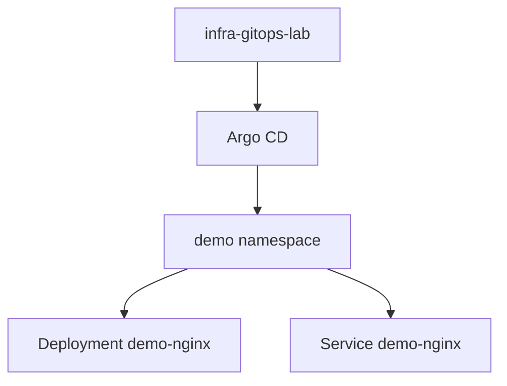

# Практикум GitOps — итоги

Практикум построен вокруг цикла: Git описывает желаемое состояние, Argo CD сравнивает его с кластером и выполняет sync. Ниже — ключевые выводы по каждому блоку.

---

## 1. GitOps и источник правды

**GitOps** — подход, при котором изменения инфраструктуры и приложений проходят через merge в репозиторий манифестов. Кластер **подстраивается** под Git, а не наоборот. Теория и сравнение с push-based deploy — [GitOps](/encyclopedia/8-infra-security/8-12-aktualnye-praktiki/4).

Вы на практике:

1. Хранили манифесты в `infra-gitops-lab/apps/demo/`.
2. Подключили repo через Application `demo-nginx`.
3. Выпустили релиз commit без `kubectl apply` на prod.

---

## 2. Kubernetes и Argo CD на стенде

| Компонент | Что сделали | Ссылка |
|-----------|-------------|--------|
| kind / minikube | Локальный кластер | [8.06 K8s](/encyclopedia/8-infra-security/8-06-konteynerizatsiya-i-orkestratsiya/211) |
| namespace `argocd` | Установка Argo CD | [Шаг 1](./1.md) |
| namespace `demo` | Учебное приложение | [Шаг 1](./1.md) |
| Deployment + Service | nginx, 2 replicas | [Шаг 2](./2.md) |
| Application | auto-sync, prune, selfHeal | [Шаг 2](./2.md) |

---

## 3. Релиз и rolling update

Релиз — изменение поля `image:` (или digest) в Git. Argo CD запускает **rolling update**: новые Pod поднимаются, старые гасятся по одному. Наблюдение — `kubectl rollout status`, History в UI Argo CD.

Рекомендации для production:

1. Pin образа по digest — [Supply chain](/encyclopedia/8-infra-security/8-12-aktualnye-praktiki/1).
2. CI обновляет манифест после сборки — [/lab/Примеры/1134](/lab/Примеры/1134).
3. Review PR перед merge — [DevSecOps](/encyclopedia/8-infra-security/8-12-aktualnye-praktiki/3).

---

## 4. Drift, selfHeal и откат

**Drift** — расхождение live state и Git. При `selfHeal: true` Argo CD возвращает кластер к Git (пример — `kubectl scale` без commit).

**Откат** — `git revert` и push. Git и кластер снова совпадают. `kubectl rollout undo` без commit создаёт drift.

| Политика | Среда |
|----------|-------|
| automated + selfHeal | dev, staging |
| manual sync, sync windows | production |

Подробно — [шаг 4](./4.md).

---

## 5. Секреты и следующий практикум

Секреты в plaintext в public Git **не хранят**. Варианты:

1. [HashiCorp Vault](/encyclopedia/8-infra-security/8-14-praktikum-vault/intro) + External Secrets.
2. Sealed Secrets, SOPS с ключом в CI.
3. Private repo + credentials только в Argo CD.

GitOps-репозиторий описывает **что** монтировать, Vault — **значения** credentials.

---

## 6. Что проверить перед собеседованием или exam

1. Объяснить ресурс **Application** (source, destination, syncPolicy).
2. Различить **OutOfSync** (diff с Git) и **Degraded** (Pod сломан).
3. Описать rolling update при смене образа через Git.
4. Назвать preferred rollback (`git revert`) и риск `rollout undo` без commit.
5. Перечислить отличия kind от managed Kubernetes (control plane на ноутбуке, нет SLA облака).

---

## Расширенный FAQ

**Можно ли пройти practicum без GitHub?**  
Да. Любой Git remote (GitLab, Gitea, local bare repo с SSH) работает, если Argo CD достучится до URL.

**Нужен ли Ingress для Argo CD?**  
В lab достаточно port-forward. В production — Ingress с TLS и SSO.

**Сколько Application на один кластер?**  
Сотни и тысячи — Argo CD рассчитан на fleet; lab использует одну Application.

**Что если забыл пароль admin?**  
Пересоздайте Secret `argocd-initial-admin-secret` по документации или переустановите Argo CD в lab.

**Связь с Helm charts?**  
Application `source` может указывать Helm chart из repo — см. [8.12 GitOps](/encyclopedia/8-infra-security/8-12-aktualnye-praktiki/4).

---

## Маршрут дальше

| Тема | Куда идти |
|------|-----------|
| Секреты | [Практикум Vault](/encyclopedia/8-infra-security/8-14-praktikum-vault/intro) |
| GitOps углублённо | [8.12/4](/encyclopedia/8-infra-security/8-12-aktualnye-praktiki/4) |
| YAML справочник | [8.06/211](/encyclopedia/8-infra-security/8-06-konteynerizatsiya-i-orkestratsiya/211) |
| Самопроверка | [Чек-лист](./999.md) |

[Чек-лист](./999.md) · [GitOps — теория](/encyclopedia/8-infra-security/8-12-aktualnye-praktiki/4)

---
