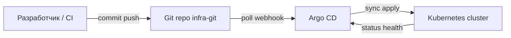
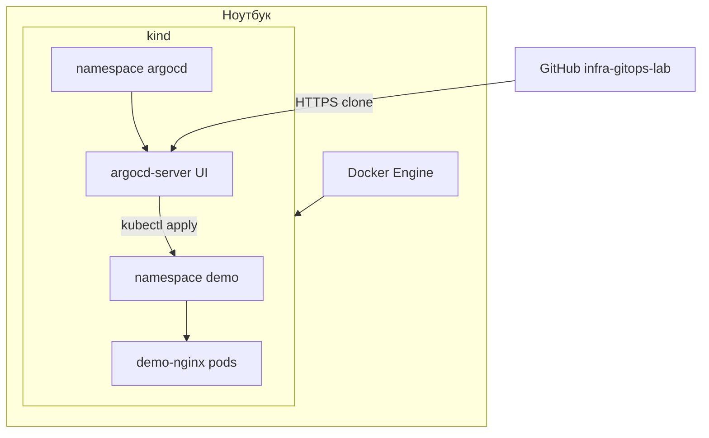

import DocCardList from '@theme/DocCardList';

# О разделе

Сквозной практикум по **GitOps** (Git Operations — управление инфраструктурой и приложениями через Git-репозиторий). Вы поднимаете локальный [Kubernetes](/encyclopedia/8-infra-security/8-06-konteynerizatsiya-i-orkestratsiya/211), устанавливаете **Argo CD** (контроллер, который следит за Git и приводит кластер к описанному состоянию), храните манифесты в отдельном репозитории и меняете окружение **только через commit**. Теория и принципы — в статье [GitOps](/encyclopedia/8-infra-security/8-12-aktualnye-praktiki/4).

<div class="callout callout--info">
  <div class="callout-title">Для кого раздел</div>
  <div class="callout-body">
  Нужны базовый [Docker](/encyclopedia/8-infra-security/8-06-konteynerizatsiya-i-orkestratsiya/111), <code>kubectl</code>, Git и 4–8 GB RAM. Полезно пройти [первые шаги Kubernetes](/encyclopedia/8-infra-security/8-06-konteynerizatsiya-i-orkestratsiya/1172) до этого практикума.
  </div>
</div>

---

## Что такое GitOps на этом стенде

**Git** становится единственным источником правды (source of truth) для конфигурации кластера. Оператор не правит прод вручную через `kubectl edit`. Любое изменение — pull request, review, merge, после чего Argo CD подтягивает diff и применяет его в Kubernetes.

На стенде вы пройдёте полный цикл: кластер → Argo CD → Application → релиз через Git → drift и откат. Это тот же паттерн, который команды используют в staging и production, только без облачного биллинга.



---

## Предварительные требования

| Навык или инструмент | Зачем нужен | Где подтянуть |
|----------------------|-------------|---------------|
| Docker | kind и minikube создают кластер в контейнерах | [Docker — основы](/encyclopedia/8-infra-security/8-06-konteynerizatsiya-i-orkestratsiya/111) |
| kubectl | Проверка подов, port-forward, отладка | [Первые шаги Kubernetes](/encyclopedia/8-infra-security/8-06-konteynerizatsiya-i-orkestratsiya/1172) |
| Git | Коммиты, revert, работа с remote | [Git в DevOps](/encyclopedia/8-infra-security/8-04-devops-ci-cd/12) |
| YAML манифесты K8s | Deployment, Service, namespace | [Справочник Kubernetes](/encyclopedia/8-infra-security/8-06-konteynerizatsiya-i-orkestratsiya/211) |
| Аккаунт GitHub или GitLab | Хранение infra-репозитория | Любой публичный или private repo |
| 4–8 GB RAM | Локальный кластер + Argo CD | Закройте лишние приложения на время lab |

Проверьте версии перед стартом:

```bash
docker version --format '{{.Server.Version}}'
kubectl version --client --short 2>/dev/null || kubectl version --client
git --version
```

Ожидаемый результат — три команды завершаются без ошибки и показывают номера версий.

---

## Сценарий стенда

| Компонент | Роль |
|-----------|------|
| **kind** или **minikube** | Локальный кластер Kubernetes на ноутбуке |
| **demo-app** | Учебный Deployment с nginx |
| **infra-git** | Репозиторий с манифестами в `apps/demo/` |
| **Argo CD** | Синхронизация Git → кластер |
| **argocd/** | Манифест Application, связывающий repo и namespace |

**kind** (Kubernetes in Docker) поднимает control plane и worker-ноды как Docker-контейнеры. **minikube** — одна виртуальная нода в Docker или hypervisor. Для lab подойдёт любой из вариантов; в шаге 1 показаны оба.

**Argo CD** — open-source GitOps-контроллер от CNCF. Он сравнивает желаемое состояние (Git) с фактическим (кластер) и выполняет sync. Подробнее о принципах — [GitOps — теория](/encyclopedia/8-infra-security/8-12-aktualnye-praktiki/4).

---

## Архитектура учебного стенда



Репозиторий **infra-gitops-lab** живёт на GitHub (или GitLab). Argo CD читает путь `apps/demo/` и создаёт Deployment и Service в namespace `demo`. Секреты в этот public repo **не кладём** — для них есть [практикум Vault](/encyclopedia/8-infra-security/8-14-praktikum-vault/intro).

---

## Маршрут по шагам

| Шаг | Статья | Содержание |
|-----|--------|------------|
| 1 | [Подготовка кластера и Argo CD](./1.md) | kind, установка Argo CD, доступ к UI, namespace demo |
| 2 | [Репозиторий манифестов и Application](./2.md) | Deployment, Service, ресурс Application, auto-sync |
| 3 | [Обновление образа через Git](./3.md) | Релиз через commit, rolling update, имитация CI |
| 4 | [Drift, sync policy и откат](./4.md) | Self-heal, git revert, sync windows |

Закрепление — [итоги](./998.md), [чек-лист](./999.md).

Рекомендуемый порядок — строго 1 → 2 → 3 → 4. Шаг 2 требует работающий Argo CD из шага 1. Шаг 3 требует Application в статусе Synced из шага 2.

---

## Что понадобится на диске и в сети

1. **kubectl** — CLI для Kubernetes. Установка описана в [первых шагах K8s](/encyclopedia/8-infra-security/8-06-konteynerizatsiya-i-orkestratsiya/1172).
2. **Docker** — для kind или minikube. Альтернатива — встроенный Kubernetes в [Docker Desktop](/encyclopedia/8-infra-security/8-06-konteynerizatsiya-i-orkestratsiya/1121).
3. **kind** или **minikube** — один инструмент на выбор.
4. **Git** и SSH-ключ или HTTPS-token для push в remote.
5. **Браузер** — UI Argo CD по `https://localhost:8080` (самоподписанный сертификат, предупреждение можно принять в lab).
6. **4–8 GB RAM** — при нехватке памяти kind может зависнуть на `Creating cluster`.

Примеры манифестов из lab-сборника — [/lab/Примеры/11115](/lab/Примеры/11115) (минимальные YAML для Kubernetes).

---

## Связь с теорией и другими разделами

| Тема | Раздел энциклопедии |
|------|---------------------|
| Pod, Deployment, Service | [8.06 Kubernetes](/encyclopedia/8-infra-security/8-06-konteynerizatsiya-i-orkestratsiya/211) |
| GitOps, pull-based deploy | [8.12 GitOps](/encyclopedia/8-infra-security/8-12-aktualnye-praktiki/4) |
| Rolling update, стратегии | [8.04 DevOps CI/CD](/encyclopedia/8-infra-security/8-04-devops-ci-cd/111) |
| Секреты вне Git | [8.14 Vault practicum](/encyclopedia/8-infra-security/8-14-praktikum-vault/intro) |
| Политики на манифесты | [8.12 DevSecOps](/encyclopedia/8-infra-security/8-12-aktualnye-praktiki/3) |
| Supply chain, pin digest | [8.12 Supply chain](/encyclopedia/8-infra-security/8-12-aktualnye-praktiki/1) |

---

## Типичные проблемы до старта

| Симптом | Вероятная причина | Что сделать |
|---------|-------------------|-------------|
| `kind create cluster` зависает | Мало RAM или Docker не запущен | Освободите память, перезапустите Docker Desktop |
| `kubectl` пишет connection refused | Неверный context | `kubectl config get-contexts` и выберите `kind-gitops-lab` |
| Argo CD UI не открывается | port-forward не запущен | Повторите `kubectl port-forward svc/argocd-server -n argocd 8080:443` |
| Application OutOfSync сразу | Неверный repoURL или path | Проверьте URL и ветку `main` в demo-app.yaml |

Подробные команды и expected output — в статьях шагов 1–4.

---

## Временные затраты

| Шаг | Примерное время |
|-----|-----------------|
| 1 — кластер + Argo CD | 20–40 мин |
| 2 — repo + Application | 30–45 мин |
| 3 — релиз через Git | 15–25 мин |
| 4 — drift и откат | 20–30 мин |

Итого около 2–3 часов с первым проходом и отладкой сети.

---

## Именование и соглашения lab

| Объект | Имя в practicum |
|--------|-----------------|
| kind cluster | `gitops-lab` |
| Application | `demo-nginx` |
| namespace app | `demo` |
| Git repo | `infra-gitops-lab` |
| Git path | `apps/demo/` |

Единые имена упрощают копирование команд из статей.

---

## Связь с lab-примерами

| Пример | Что взять |
|--------|-----------|
| [/lab/Примеры/11115](/lab/Примеры/11115) | Минимальные Deployment/Service YAML |
| [/lab/Примеры/1134](/lab/Примеры/1134) | CI pipeline, bump manifest |

Энциклопедические статьи дают контекст, lab — готовые фрагменты кода.

---

## Чек перед шагом 1

```bash
docker info >/dev/null 2>&1 && echo "Docker OK" || echo "Start Docker"
command -v kubectl >/dev/null && echo "kubectl OK"
command -v kind >/dev/null || command -v minikube >/dev/null && echo "cluster tool OK"
git --version
```

Все четыре проверки должны вывести OK или версию.

---

## Ожидаемый результат после всего практикума

После шага 4 вы сможете:

1. Объяснить, почему Git — источник правды для конфигурации кластера.
2. Создать Argo CD Application с automated sync и selfHeal.
3. Выпустить новую версию образа одним commit без ручного `kubectl apply`.
4. Обнаружить drift и откатить релиз через `git revert`.
5. Назвать отличия dev-политики sync (automated) от prod (manual sync, sync windows).

---

## Полный walkthrough перед шагом 1

Ниже — сквозной сценарий подготовки окружения без пропусков. Выполняйте команды в одном терминале, фиксируйте вывод при отклонениях.

### Шаг A — проверка Docker и инструментов

```bash
docker info >/dev/null 2>&1 && echo "Docker OK" || echo "FAIL: запустите Docker Desktop"
command -v kind >/dev/null && kind version || echo "FAIL: установите kind"
command -v kubectl >/dev/null && kubectl version --client --short 2>/dev/null || kubectl version --client
git --version
```

Ожидаемый результат — четыре блока без FAIL. Пример `kind version`:

```
kind v0.24.0 go1.22.5 linux/amd64
```

### Шаг B — создание кластера gitops-lab

```bash
kind create cluster --name gitops-lab
kubectl config use-context kind-gitops-lab
kubectl get nodes
```

Ожидаемый вывод `kubectl get nodes`:

```
NAME                       STATUS   ROLES           AGE   VERSION
gitops-lab-control-plane   Ready    control-plane   45s   v1.31.0
```

### Шаг C — установка Argo CD

```bash
kubectl create namespace argocd
kubectl apply -n argocd -f https://raw.githubusercontent.com/argoproj/argo-cd/stable/manifests/install.yaml
kubectl wait --for=condition=Available deployment/argocd-server -n argocd --timeout=300s
kubectl get pods -n argocd
```

Все поды argocd-* должны перейти в Running в течение 2–5 минут. Если `argocd-server` в Pending — проверьте RAM Docker Desktop (минимум 6 GB).

### Шаг D — доступ к UI

```bash
kubectl -n argocd get secret argocd-initial-admin-secret -o jsonpath="{.data.password}" | base64 -d && echo
kubectl port-forward svc/argocd-server -n argocd 8080:443
```

В браузере откройте `https://localhost:8080`, логин `admin`. Предупреждение о сертификате в lab принимают — **не** открывайте port-forward на `0.0.0.0` в production.

### Шаг E — namespace demo

```bash
kubectl create namespace demo
kubectl get ns argocd demo
```

Ожидаемый вывод:

```
NAME     STATUS   AGE
argocd   Active   8m
demo     Active   3s
```

---

## Типичные ошибки на этапе подготовки

| Симптом | Ожидаемый вывод при успехе | Что делать |
|---------|---------------------------|------------|
| `kind create cluster` зависает на Preparing nodes | Прогресс за 1–3 мин | Увеличьте RAM Docker, перезапустите engine |
| `Unable to connect to the server` | `cluster-info` без ошибки | `kubectl config use-context kind-gitops-lab` |
| `argocd-server` CrashLoopBackOff | Pod Running 1/1 | `kubectl logs -n argocd -l app.kubernetes.io/name=argocd-server --tail=50` |
| port-forward `address already in use` | Туннель на 8080 | `netstat -ano \| findstr 8080` (Windows) или смените локальный порт на 8081 |
| Пароль admin не подходит | Декодированная строка без пробелов | Повторите base64 decode, проверьте namespace argocd |

---

## Предупреждения безопасности раздела

1. Root-пароль Argo CD (`admin`) смените после lab или удалите port-forward из интернета.
2. Манифесты в public Git **без** секретов — пароли и tokens только в [Vault practicum](/encyclopedia/8-infra-security/8-14-praktikum-vault/intro).
3. Stable manifest Argo CD тянет образы из публичного registry — в production pin digest ([Supply chain](/encyclopedia/8-infra-security/8-12-aktualnye-praktiki/1)).
4. RBAC kind по умолчанию широкий — учебный стенд; в prod ограничьте Argo CD через AppProject.
5. Self-signed TLS на UI — норма для lab; в prod используйте Ingress с Let's Encrypt или corporate CA.

---

## Чек-лист готовности к шагу 2

| # | Проверка | Команда | Ожидание |
|---|----------|---------|----------|
| 1 | Context кластера | `kubectl config current-context` | `kind-gitops-lab` |
| 2 | Argo CD server | `kubectl get deploy argocd-server -n argocd` | READY 1/1 |
| 3 | UI доступен | curl при port-forward | HTTP 200 или 302 |
| 4 | Namespace demo | `kubectl get ns demo` | Active |
| 5 | Git установлен | `git --version` | версия без ошибки |
| 6 | Remote repo готов | аккаунт GitHub/GitLab | пустой или новый repo |

Все шесть пунктов зелёные — переходите к [шагу 2](./2.md).

---

## Сравнение kind и minikube для lab

| Критерий | kind | minikube |
|----------|------|----------|
| Скорость старта | быстрее, один контейнер | чуть дольше |
| RAM | 4 GB минимум | 6–8 GB комфортнее |
| Multi-node | да, через config | ограниченно |
| Удаление | `kind delete cluster` | `minikube delete` |

Для practicum достаточно **kind**; minikube — если kind недоступен на вашей ОС.

---

## Ожидаемые артефакты после всего практикума

| Артефакт | Где живёт |
|----------|-----------|
| Репозиторий `infra-gitops-lab` | GitHub/GitLab |
| Application `demo-nginx` | namespace argocd |
| Deployment + Service | namespace demo |
| История Git commits | bump образа, revert |
| Runbook в голове | drift → git revert |

Закрепление — [итоги](./998.md), [чек-лист](./999.md).

<DocCardList />

---
