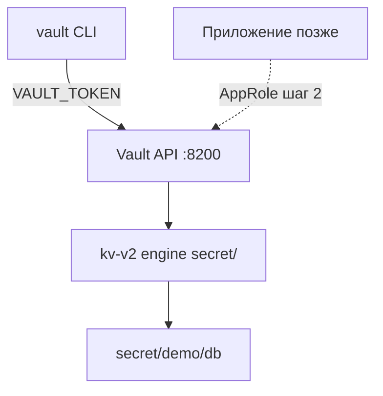

# Практикум Vault — запуск и KV

<div class="article-tags">
  <span class="tag tag-required">ОБЯЗАТЕЛЬНО</span>
</div>

<span class="complexity-badge">Инженеру</span>

<div class="callout callout--warning">
  <div class="callout-title">Только lab</div>
  <div class="callout-body">Режим <code>-dev</code> хранит root token в памяти и подходит только для учебного стенда. В production — HA-кластер, auto-unseal и audit log.</div>
</div>

**HashiCorp Vault** — сервис для безопасного хранения и выдачи секретов. Вместо файлов `.env` в Git приложение запрашивает credentials в **runtime** (во время работы). Vault также умеет динамические секреты (временные пароли БД), но в этом шаге — статический **KV** (Key-Value) store.

---

## Предварительные требования

| Требование | Проверка |
|------------|----------|
| Docker запущен | `docker ps` |
| Порт 8200 свободен | `netstat` / нет старого vault-dev |
| Vault CLI | `vault version` |

Теория — [методы защиты данных](/encyclopedia/8-infra-security/8-03-zabota-o-kode-i-dannyh/117). Связка с GitOps — [практикум GitOps](/encyclopedia/8-infra-security/8-13-praktikum-gitops/intro).

---

## Архитектура шага 1



---

## Docker (dev)

Контейнер с предустановленным root token и auto-unseal:

```bash
docker run --cap-add=IPC_LOCK -d --name vault-dev -p 8200:8200 \
  -e VAULT_DEV_ROOT_TOKEN_ID=dev-root-token \
  -e VAULT_DEV_LISTEN_ADDRESS=0.0.0.0:8200 \
  hashicorp/vault:1.17
```

Флаг `--cap-add=IPC_LOCK` нужен Vault для блокировки памяти (mlock) и защиты секретов от swap.

Переменные окружения для CLI:

```bash
export VAULT_ADDR=http://127.0.0.1:8200
export VAULT_TOKEN=dev-root-token
```

Windows PowerShell:

```powershell
$env:VAULT_ADDR = "http://127.0.0.1:8200"
$env:VAULT_TOKEN = "dev-root-token"
```

Проверка:

```bash
vault status
```

Ожидаемый вывод:

```
Key             Value
---             -----
Seal Type       shamir
Initialized     true
Sealed          false
Total Shares    1
Cluster Name    vault-cluster-...
Cluster ID      ...
HA Enabled      false
```

`Sealed: false` — Vault готов принимать запросы. В production после перезапуска Vault **sealed** до процедуры unseal.

Health через HTTP:

```bash
curl -s http://127.0.0.1:8200/v1/sys/health | head -c 200
```

Ожидается JSON с `"initialized":true,"sealed":false`.

### Устранение неполадок — Docker

| Ошибка | Решение |
|--------|---------|
| `Conflict. The container name vault-dev is already in use` | `docker rm -f vault-dev` и повторите run |
| `connection refused` на 8200 | `docker logs vault-dev` — контейнер упал |
| `permission denied` | Запустите Docker Desktop |

---

## KV secrets engine v2

**Secrets engine** — плагин Vault для типа данных. **KV v2** хранит пары ключ-значение с **версионированием** и soft delete (можно восстановить старую версию).

Включение движка на path `secret/` (дефолтный mount):

```bash
vault secrets enable -path=secret kv-v2
```

Если движок уже включён в dev-образе, команда вернёт ошибку — это нормально, переходите к put.

Запись секрета БД для учебного приложения:

```bash
vault kv put secret/demo/db \
  url=postgres://localhost:5432/app \
  password='CHANGE_ME_STRONG' \
  username=app_user
```

Ожидаемый вывод:

```
===== Secret Path =====
secret/data/demo/db

======= Metadata =======
Key                Value
---                -----
created_time       2026-...
custom_metadata    <nil>
deletion_time      n/a
destroyed          false
version            1
```

Чтение:

```bash
vault kv get secret/demo/db
```

Ожидаемый вывод (фрагмент):

```
====== Data ======
Key         Value
---         -----
password    CHANGE_ME_STRONG
url         postgres://localhost:5432/app
username    app_user
```

Чтение одного поля:

```bash
vault kv get -field=password secret/demo/db
```

### Версии KV v2

Обновление создаёт version 2:

```bash
vault kv put secret/demo/db password='NEW_VALUE_v2'
vault kv get -version=1 secret/demo/db
```

Путь API для v2 всегда содержит `/data/` — `secret/data/demo/db`. CLI принимает короткий path `secret/demo/db`.

---

## Антипаттерны и рекомендуемый паттерн

| Антипаттерн | Рекомендуемый паттерн |
|-------------|----------------------|
| `DB_PASSWORD=…` в `.env` в Git | Vault path + runtime fetch |
| Один общий `.env` на все среды | `secret/dev/`, `secret/staging/`, `secret/prod/` |
| Root token в CI | AppRole или OIDC — [шаг 2](./2.md) |
| Plaintext Secret в GitOps repo | ExternalSecret — [шаг 3](./3.md), [GitOps](/encyclopedia/8-infra-security/8-13-praktikum-gitops/2) |

Подробнее о секретах — [8.03/117](/encyclopedia/8-infra-security/8-03-zabota-o-kode-i-dannyh/117).

---

## Проверка шага 1

```bash
vault kv list secret/demo
# ожидается: db

vault kv metadata get secret/demo/db
# version: 1 или выше

docker ps --filter name=vault-dev
# STATUS Up
```

---

## Заметки по безопасности

1. Root token `dev-root-token` **никогда** не кладите в Git, CI secrets или Kubernetes manifest.
2. В lab пароль `CHANGE_ME_STRONG` — замените на длинную случайную строку для привычки.
3. После lab остановите контейнер: `docker stop vault-dev && docker rm vault-dev` — данные в dev не persist.
4. Production Vault — TLS на API, network policies, audit log — [8.12 DevSecOps](/encyclopedia/8-infra-security/8-12-aktualnye-praktiki/3).

---

## Связанные материалы

- [О разделе Vault](./intro.md)
- [Policies и AppRole — шаг 2](./2.md)
- [Kubernetes — секреты без Git](/encyclopedia/8-infra-security/8-06-konteynerizatsiya-i-orkestratsiya/211)

Дальше — [Policies и AppRole](./2.md).

---

## HTTP API без CLI

Запись секрета через curl (эквивалент `kv put`):

```bash
curl -s -H "X-Vault-Token: $VAULT_TOKEN" \
  -H "Content-Type: application/json" \
  -X POST \
  -d '{"data":{"url":"postgres://localhost:5432/app","password":"API_TEST"}}' \
  $VAULT_ADDR/v1/secret/data/demo/api-test
```

Чтение:

```bash
curl -s -H "X-Vault-Token: $VAULT_TOKEN" \
  $VAULT_ADDR/v1/secret/data/demo/api-test | jq .data.data
```

Полезно для отладки из CI без установки CLI.

---

## Mount path и list

```bash
vault secrets list
vault kv list secret/
vault kv list secret/demo
```

Ожидаемый list `secret/demo`: ключ `db` (и другие, если создавали).

---

## Удаление и восстановление версии KV v2

Soft delete metadata:

```bash
vault kv delete secret/demo/db
vault kv get secret/demo/db
# not found или deleted

vault kv undelete -versions=2 secret/demo/db
vault kv get secret/demo/db
```

**Destroy** версии необратим — в lab не используйте без нужды.

---

## Переменные окружения в shell profile

Для удобства lab добавьте в `~/.bashrc` (не commit в Git):

```bash
export VAULT_ADDR=http://127.0.0.1:8200
export VAULT_TOKEN=dev-root-token   # только dev!
```

---

## Связь с GitOps practicum

После этого шага в [GitOps шаг 2](/encyclopedia/8-infra-security/8-13-praktikum-gitops/2) вы добавите ExternalSecret вместо ConfigMap с password. Vault path `secret/demo/db` остаётся тем же.

---

## Полный walkthrough шага 1

```bash
# 1. Старт Vault
docker rm -f vault-dev 2>/dev/null || true
docker run --cap-add=IPC_LOCK -d --name vault-dev -p 8200:8200 \
  -e VAULT_DEV_ROOT_TOKEN_ID=dev-root-token \
  -e VAULT_DEV_LISTEN_ADDRESS=0.0.0.0:8200 \
  hashicorp/vault:1.17

# 2. Env
export VAULT_ADDR=http://127.0.0.1:8200
export VAULT_TOKEN=dev-root-token

# 3. Status
vault status

# 4. KV engine (если не включён)
vault secrets enable -path=secret kv-v2 2>/dev/null || echo "already enabled"

# 5. Put secret
vault kv put secret/demo/db \
  url=postgres://localhost:5432/app \
  password='CHANGE_ME_STRONG' \
  username=app_user

# 6. Get secret
vault kv get secret/demo/db
vault kv get -field=password secret/demo/db

# 7. List
vault kv list secret/demo
```

Ожидаемый вывод шага 7:

```
Keys
----
db
```

---

## Расширенное устранение неполадок

| Ошибка | Команда проверки | Решение |
|--------|------------------|---------|
| `Error making API request` connection refused | `docker logs vault-dev` | Перезапустите контейнер |
| `no handler for route` | `vault secrets list` | `vault secrets enable kv-v2` |
| `permission denied` | `echo $VAULT_TOKEN` | Экспортируйте dev-root-token |
| `must be provided but was not` | env vars | `export VAULT_ADDR` |
| KV v2 path wrong | API path | CLI `secret/demo/db`, API `secret/data/demo/db` |
| Container exits | `docker ps -a` | Проверьте IPC_LOCK, образ vault:1.17 |

---

## HTTP API walkthrough

```bash
# Health
curl -s http://127.0.0.1:8200/v1/sys/health | jq .

# Write via API
curl -s -H "X-Vault-Token: $VAULT_TOKEN" -H "Content-Type: application/json" \
  -X POST -d '{"data":{"key":"api-test-value"}}' \
  $VAULT_ADDR/v1/secret/data/demo/api-walkthrough

# Read via API
curl -s -H "X-Vault-Token: $VAULT_TOKEN" \
  $VAULT_ADDR/v1/secret/data/demo/api-walkthrough | jq .data.data
```

Ожидаемый read — `"key": "api-test-value"`.

---

## Версионирование KV — полный цикл

```bash
vault kv put secret/demo/db password='VERSION_1'
vault kv put secret/demo/db password='VERSION_2'
vault kv metadata get secret/demo/db
vault kv get -version=1 secret/demo/db
vault kv get secret/demo/db
```

Ожидаемый metadata — `current_version 2`, version 1 содержит `VERSION_1`.

---

## Чек-лист завершения шага 1

| # | Критерий | Команда | Ожидание |
|---|----------|---------|----------|
| 1 | Контейнер Up | `docker ps --filter name=vault-dev` | Up |
| 2 | Unsealed | `vault status` | false |
| 3 | Secret exists | `vault kv get secret/demo/db` | 3 поля |
| 4 | List works | `vault kv list secret/demo` | db |
| 5 | Field read | `-field=password` | строка без ошибки |
| 6 | API health | curl sys/health | initialized true |

Дальше — [Policies и AppRole](./2.md).

---

## Windows PowerShell

```powershell
$env:VAULT_ADDR = "http://127.0.0.1:8200"
$env:VAULT_TOKEN = "dev-root-token"
vault status
vault kv put secret/demo/db url=postgres://localhost:5432/app password=CHANGE_ME_STRONG username=app_user
vault kv get secret/demo/db
```

---

## Предупреждения безопасности (повтор)

1. Не commit `.env` с VAULT_TOKEN.
2. `CHANGE_ME_STRONG` — замените на случайную строку 32+ символов.
3. После lab — `docker stop vault-dev && docker rm vault-dev`.
4. Audit log в dev опционален; в prod обязателен.
5. Root token rotation — break-glass процедура в production.

---
