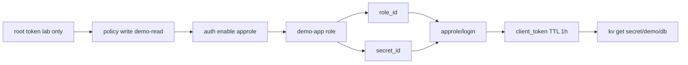

# Практикум Vault — policies и AppRole

**Policy** (политика) задаёт, какие пути Vault может читать или писать конкретный клиент. **AppRole** — метод **аутентификации** для машин (приложений, CI, cron), без долгоживущего root token.

Предварительно завершите [шаг 1](./1.md): контейнер `vault-dev`, секрет `secret/demo/db`, переменные `VAULT_ADDR` и `VAULT_TOKEN`.

---

## Предварительные требования

```bash
vault status
# Sealed: false

vault kv get secret/demo/db
# password присутствует
```

---

## Архитектура шага 2



---

## Policy (read-only demo)

Политики пишут на языке HCL. Файл **demo-read.hcl**:

```hcl
# Read-only доступ к учебным секретам demo
path "secret/data/demo/*" {
  capabilities = ["read"]
}

path "secret/metadata/demo/*" {
  capabilities = ["read", "list"]
}
```

`secret/data/` — путь KV v2 для чтения значений. `secret/metadata/` — список версий без раскрытия значений (list).

Применение:

```bash
vault policy write demo-read demo-read.hcl
vault policy read demo-read
```

Ожидаемый вывод второй команды — содержимое HCL.

Принцип **least privilege** — давать только те права, которые нужны для задачи. Приложению demo достаточно read на `demo/*`, без write и без доступа к `secret/prod/*`.

### Проверка policy без AppRole (опционально)

Создайте token с policy:

```bash
vault token create -policy=demo-read -ttl=10m -format=json | jq -r .auth.client_token
```

С новым token (в отдельной shell):

```bash
export VAULT_TOKEN=<client_token>
vault kv get secret/demo/db          # OK
vault kv put secret/demo/db x=y      # permission denied — ожидаемо
```

---

## AppRole

**AppRole** выдаёт пару идентификаторов:

| Идентификатор | Свойство |
|---------------|----------|
| **role_id** | Стабильный, как "логин" роли |
| **secret_id** | Одноразовый или короткоживущий, как "пароль" |

Включение метода:

```bash
vault auth enable approle
```

Создание роли с policy `demo-read` и TTL token 1 час:

```bash
vault write auth/approle/role/demo-app \
  token_policies=demo-read \
  token_ttl=1h \
  token_max_ttl=4h \
  secret_id_ttl=10m
```

Получение role_id:

```bash
vault read auth/approle/role/demo-app/role-id
```

Ожидаемый вывод:

```
Key        Value
---        -----
role_id    xxxxxxxx-xxxx-xxxx-xxxx-xxxxxxxxxxxx
```

Генерация secret_id:

```bash
vault write -f auth/approle/role/demo-app/secret-id
```

Ожидаемый вывод:

```
Key                   Value
---                   -----
secret_id             yyyyyyyy-yyyy-yyyy-yyyy-yyyyyyyyyyyy
secret_id_accessor    ...
```

### Login через AppRole

```bash
vault write auth/approle/login \
  role_id=xxxxxxxx-xxxx-xxxx-xxxx-xxxxxxxxxxxx \
  secret_id=yyyyyyyy-yyyy-yyyy-yyyy-yyyyyyyyyyyy
```

Ожидаемый вывод (фрагмент):

```
Key                     Value
---                     -----
token                   hvs.CAES...
token_accessor          ...
token_duration          1h
token_policies          ["demo-read" "default"]
```

Используйте `token` для чтения:

```bash
export VAULT_TOKEN=hvs.CAES...
vault kv get secret/demo/db
```

**CI** получает `role_id` (можно в vars) и short-lived `secret_id` из protected store — root token в pipeline не нужен. OIDC-вариант — [8.12/8](/encyclopedia/8-infra-security/8-12-aktualnye-praktiki/8).

---

## Audit (dev)

**Audit device** пишет каждый запрос к Vault — кто, когда, какой path. В compliance audit обязателен — [8.07/114](/encyclopedia/8-infra-security/8-07-informatsionnaya-bezopasnost/114).

В dev-контейнере file audit на хост может быть недоступен. Пример для production-подобного стенда:

```bash
vault audit enable file file_path=/vault/logs/audit.log
```

После включения каждый `kv get` оставляет JSON-строку в log. В lab достаточно понимать, что без audit нельзя расследовать утечки.

Проверка списка audit devices:

```bash
vault audit list
```

---

## Проверка шага 2

1. Policy `demo-read` существует — `vault policy list`.
2. Login через AppRole возвращает token с policy `demo-read`.
3. Token **не** может `kv put` на prod path — permission denied.
4. Root token по-прежнему только для администрирования, не для приложения.

---

## Устранение неполадок

| Симптом | Решение |
|---------|---------|
| `permission denied` на login | Неверный secret_id или истёк TTL |
| `no handler for route` | AppRole не enabled — `vault auth enable approle` |
| policy не применяется | Опечатка в path — KV v2 использует `secret/data/` |

---

## Заметки по безопасности

1. **secret_id** передавайте по защищённому каналу (K8s Secret, CI masked var), не в лог pipeline.
2. Ограничьте `secret_id_num_uses=1` для одноразовых CI job.
3. Root token храните offline (break-glass), rotation policies — [DevSecOps](/encyclopedia/8-infra-security/8-12-aktualnye-praktiki/3).
4. В Kubernetes предпочтительнее **Kubernetes auth** вместо AppRole — ESO настраивает SA; AppRole проще для lab и bare CI.

Дальше — [Приложение и CI](./3.md).

---

## Bound secret_id и CIDR

Ограничение, откуда можно login:

```bash
vault write auth/approle/role/demo-app \
  secret_id_bound_cidrs="127.0.0.1/32,10.0.0.0/8" \
  token_policies=demo-read
```

Login с IP вне списка вернёт permission denied.

---

## secret_id_num_uses для CI

```bash
vault write auth/approle/role/demo-app secret_id_num_uses=1
```

Каждый secret_id работает один раз — подходит для одноjob CI pipeline.

---

## Token lookup и revoke

```bash
vault token lookup
vault token revoke -self
vault token lookup
# permission denied после revoke
```

Приложение должно обрабатывать expiry token и re-login через AppRole.

---

## Несколько policies на одной роли

```bash
vault write auth/approle/role/demo-app \
  token_policies="demo-read,default"
```

Policy `default` — базовые права token self-lookup; custom policies добавляют доступ к secret paths.

---

## Тест deny на чужой path

```bash
vault kv put secret/prod/db password=secret
# с root OK

export VAULT_TOKEN=<approle_client_token>
vault kv get secret/prod/db
# permission denied — policy demo-read не cover prod
```

---

## Связанные материалы

- [Шаг 1 — KV](./1.md)
- [GitOps — секреты вне Git](/encyclopedia/8-infra-security/8-13-praktikum-gitops/2)
- [OIDC для CI](/encyclopedia/8-infra-security/8-12-aktualnye-praktiki/8)

---

## Полный walkthrough шага 2

```bash
# Предусловие
vault status
vault kv get secret/demo/db

# 1. Policy
cat > demo-read.hcl <<'EOF'
path "secret/data/demo/*" {
  capabilities = ["read"]
}
path "secret/metadata/demo/*" {
  capabilities = ["read", "list"]
}
EOF
vault policy write demo-read demo-read.hcl
vault policy read demo-read

# 2. AppRole
vault auth enable approle 2>/dev/null || echo "approle already enabled"
vault write auth/approle/role/demo-app \
  token_policies=demo-read \
  token_ttl=1h \
  token_max_ttl=4h \
  secret_id_ttl=10m

# 3. Credentials
ROLE_ID=$(vault read -field=role_id auth/approle/role/demo-app/role-id)
SECRET_ID=$(vault write -f -field=secret_id auth/approle/role/demo-app/secret-id)
echo "role_id=$ROLE_ID"

# 4. Login
CLIENT_TOKEN=$(vault write -field=token auth/approle/login role_id=$ROLE_ID secret_id=$SECRET_ID)
export VAULT_TOKEN=$CLIENT_TOKEN

# 5. Read OK
vault kv get secret/demo/db

# 6. Write denied
vault kv put secret/demo/db test=fail 2>&1 | head -1
# ожидается permission denied
```

---

## Ожидаемый вывод login

```
Key                     Value
---                     -----
token                   hvs.CAES...
token_duration          1h
token_policies          ["demo-read" "default"]
```

---

## Расширенное устранение неполадок

| Симптом | Диагностика | Решение |
|---------|-------------|---------|
| permission denied login | `vault read auth/approle/role/demo-app/role-id` | Новый secret_id, проверьте TTL |
| no handler for route | `vault auth list` | `vault auth enable approle` |
| policy not applied | `vault token lookup` | Проверьте token_policies в login output |
| read prod denied | `vault kv get secret/prod/db` | Ожидаемо — least privilege OK |
| secret_id expired | TTL 10m | `vault write -f auth/approle/role/demo-app/secret-id` |

---

## Audit log walkthrough (если доступен путь)

```bash
vault audit list
# file audit в dev контейнере часто недоступен на хост
vault audit enable file file_path=stdout 2>/dev/null || echo "skip in dev"
vault kv get secret/demo/db
# в production — JSON строка в SIEM
```

---

## Token lifecycle — команды

```bash
vault token lookup
vault token renew -self
vault token capabilities secret/data/demo/db
vault token revoke -self
vault token lookup 2>&1
# permission denied — ожидаемо
```

---

## Чек-лист завершения шага 2

| # | Критерий | Команда | Ожидание |
|---|----------|---------|----------|
| 1 | Policy demo-read | `vault policy list` | в списке |
| 2 | AppRole enabled | `vault auth list` | approle/ |
| 3 | Login OK | approle/login | token hvs. |
| 4 | Read demo | kv get | password виден |
| 5 | Write denied | kv put | permission denied |
| 6 | Prod denied | kv get secret/prod | permission denied |

Дальше — [Приложение и CI](./3.md).

---

## CI integration — AppRole без root

```bash
# Симуляция CI job
export VAULT_ROLE_ID="<role_id from vault read>"
export VAULT_SECRET_ID="<one-time secret_id>"
export VAULT_ADDR=http://127.0.0.1:8200
TOKEN=$(vault write -field=token auth/approle/login role_id=$VAULT_ROLE_ID secret_id=$VAULT_SECRET_ID)
VAULT_TOKEN=$TOKEN vault kv get -field=password secret/demo/db
```

Ожидаемый вывод — password без использования dev-root-token.

---

## Предупреждения безопасности

1. secret_id в CI — masked output, не в логах.
2. secret_id_num_uses=1 для одноjob pipeline.
3. bound_cidrs ограничивает login по IP.
4. Root token только для admin, не для app.
5. Kubernetes auth предпочтительнее static AppRole в prod.

---
