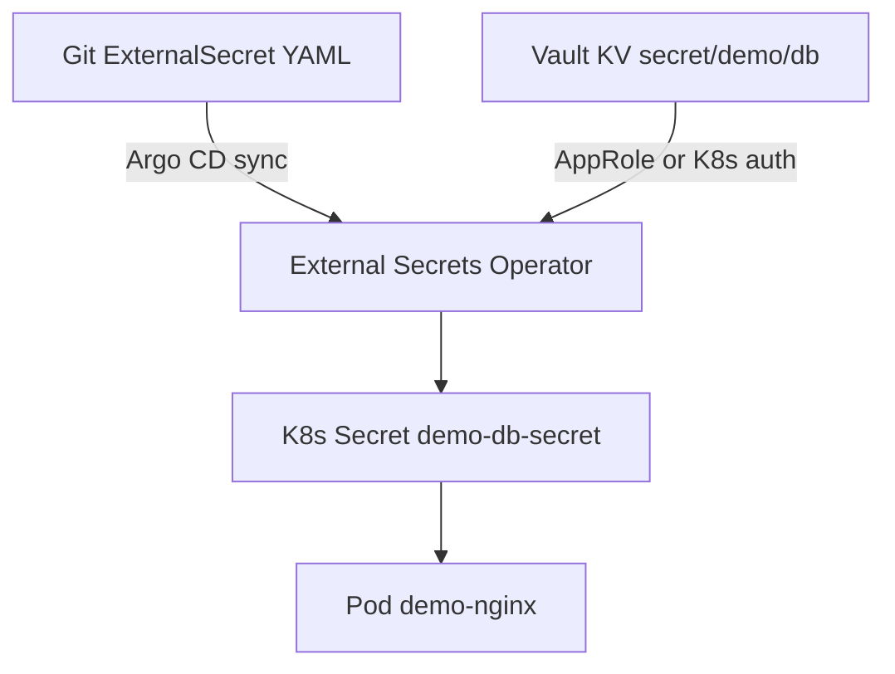

# Практикум Vault — приложение и CI

Приложение и CI получают секреты из Vault в **runtime** — Git-репозиторий остаётся без plaintext credentials. Этот шаг связывает Vault с [практикумом GitOps](/encyclopedia/8-infra-security/8-13-praktikum-gitops/intro) через External Secrets Operator (ESO).

Предварительно — [AppRole и policy demo-read](./2.md), работающий Vault на `:8200`.

---

## Предварительные требования

| Компонент | Нужен для |
|-----------|-----------|
| Vault + secret/demo/db | Все блоки |
| AppRole demo-app | Fetch at startup, CI |
| kind cluster (опционально) | External Secrets |
| namespace demo | ESO target |

---

## Архитектура интеграции



Git хранит только **ExternalSecret** без password. Argo CD из [8.13/2](/encyclopedia/8-infra-security/8-13-praktikum-gitops/2) синхронизирует манифест; ESO подтягивает значение из Vault.

---

## Паттерн fetch at startup

Приложение при старте:

1. Authenticate (AppRole, Kubernetes auth или OIDC в CI).
2. Читает `secret/data/demo/db`.
3. Держит credentials **в памяти**, без `.env` на диске.

Псевдокод (Python + библиотека **hvac**):

```python
import os
import hvac

def token_from_approle():
    client = hvac.Client(url=os.environ["VAULT_ADDR"])
    resp = client.auth.approle.login(
        role_id=os.environ["VAULT_ROLE_ID"],
        secret_id=os.environ["VAULT_SECRET_ID"],
    )
    return resp["auth"]["client_token"]

client = hvac.Client(
    url=os.environ["VAULT_ADDR"],
    token=token_from_approle(),
)
secret = client.secrets.kv.v2.read_secret_version(path="demo/db")
db_password = secret["data"]["data"]["password"]
# далее подключение к PostgreSQL
```

Переменные `VAULT_ROLE_ID` и `VAULT_SECRET_ID` задаёт orchestrator (K8s Secret, CI vars), не Git.

Проверка локально (bash + curl после AppRole login):

```bash
TOKEN=$(vault write -field=token auth/approle/login role_id=$ROLE_ID secret_id=$SECRET_ID)
curl -s -H "X-Vault-Token: $TOKEN" \
  $VAULT_ADDR/v1/secret/data/demo/db | jq .data.data.password
```

Ожидается `"CHANGE_ME_STRONG"` или ваше значение из шага 1.

---

## Kubernetes — External Secrets Operator

**ESO** — контроллер, который синхронизирует секреты из Vault (и других backend) в native Kubernetes Secret.

### Установка ESO (lab, kind)

```bash
helm repo add external-secrets https://charts.external-secrets.io
helm install external-secrets external-secrets/external-secrets \
  -n external-secrets --create-namespace
kubectl wait --for=condition=Available deployment/external-secrets -n external-secrets --timeout=120s
```

### ClusterSecretStore (Vault backend)

Пример для Vault с AppRole (упрощённо для lab — root token **только в lab**):

```yaml
apiVersion: external-secrets.io/v1beta1
kind: ClusterSecretStore
metadata:
  name: vault-backend
spec:
  provider:
    vault:
      server: http://host.docker.internal:8200
      path: secret
      version: v2
      auth:
        tokenSecretRef:
          name: vault-token
          namespace: external-secrets
          key: token
```

На kind Vault на хосте доступен как `host.docker.internal:8200` (Windows/macOS Docker Desktop).

### ExternalSecret

```yaml
apiVersion: external-secrets.io/v1beta1
kind: ExternalSecret
metadata:
  name: demo-db
  namespace: demo
spec:
  refreshInterval: 1h
  secretStoreRef:
    name: vault-backend
    kind: ClusterSecretStore
  target:
    name: demo-db-secret
    creationPolicy: Owner
  data:
    - secretKey: password
      remoteRef:
        key: secret/data/demo/db
        property: password
    - secretKey: url
      remoteRef:
        key: secret/data/demo/db
        property: url
```

Применение:

```bash
kubectl apply -f cluster-secret-store.yaml
kubectl apply -f external-secret-demo-db.yaml
kubectl get externalsecret -n demo
kubectl get secret demo-db-secret -n demo
```

Ожидаемый результат ExternalSecret — `Ready: True`. Kubernetes Secret `demo-db-secret` содержит ключи `password` и `url` (значения base64 в describe, не печатайте в shared log).

Pod использует secret:

```yaml
envFrom:
  - secretRef:
      name: demo-db-secret
```

GitOps-репозиторий содержит ExternalSecret и Deployment **без** plaintext password — см. [GitOps шаг 2](/encyclopedia/8-infra-security/8-13-praktikum-gitops/2).

---

## GitHub Actions + Vault (идея)

Long-lived `VAULT_TOKEN` в repository secrets — антипаттерн. Современный подход:

1. GitHub Actions получает **OIDC JWT** от GitHub.
2. Vault auth method **jwt** проверяет issuer и audience.
3. Vault выдаёт **short-lived token** только на duration job.

Схема (концептуально):

```yaml
# фрагмент workflow — см. полные примеры в 8.12/8
permissions:
  id-token: write
steps:
  - uses: hashicorp/vault-action@v3
    with:
      url: https://vault.example.com
      method: jwt
      role: github-actions-demo
      secrets: |
        secret/data/demo/db password | DB_PASSWORD
```

Подробнее — [OIDC для CI](/encyclopedia/8-infra-security/8-12-aktualnye-praktiki/8), [DevSecOps](/encyclopedia/8-infra-security/8-12-aktualnye-praktiki/3).

---

## Rotation

При компрометации или по политике меняют секрет в Vault:

```bash
vault kv put secret/demo/db password='NEW_ROTATED' url=postgres://localhost:5432/app username=app_user
```

ESO подхватывает при `refreshInterval` (1h в примере) или после restart Pod. Приложение с fetch at startup может перечитывать по SIGHUP или периодически.

Проверка версии:

```bash
vault kv metadata get secret/demo/db
# current_version увеличился
```

Регулярная **rotation** снижает риск при утечке credentials — [8.03/117](/encyclopedia/8-infra-security/8-03-zabota-o-kode-i-dannyh/117).

---

## Проверка шага 3

| # | Действие | Ожидание |
|---|----------|----------|
| 1 | AppRole login + kv get | password совпадает с Vault |
| 2 | ExternalSecret Ready | `kubectl describe externalsecret demo-db -n demo` |
| 3 | K8s Secret создан | `demo-db-secret` exists |
| 4 | Git repo без password | только ExternalSecret YAML |

---

## Устранение неполадок

| Симптом | Решение |
|---------|---------|
| ESO `SecretSyncedError` | Vault unreachable с pod — проверьте URL host.docker.internal |
| 403 от Vault | Token или AppRole policy не cover path |
| Secret пустой | Неверный `remoteRef.key` — нужен `secret/data/demo/db` |
| Argo OutOfSync на Secret | ESO владеет Secret — используйте `creationPolicy: Owner` |

---

## Заметки по безопасности

1. Не монтируйте root token в ClusterSecretStore в production — Kubernetes auth или AppRole с минимальной policy.
2. RBAC K8s на Secret `demo-db-secret` — только нужный ServiceAccount.
3. Audit Vault + audit K8s API — кто читал Secret.
4. NetworkPolicy между Pod и Vault API в prod.

[Итоги](./998.md) · [Чек-лист](./999.md)

---

## Kubernetes auth (production вместо AppRole)

Pod с ServiceAccount `demo-sa` в namespace `demo`:

```bash
vault auth enable kubernetes
vault write auth/kubernetes/config \
  kubernetes_host="https://kubernetes.default.svc" \
  kubernetes_ca_cert=@/var/run/secrets/kubernetes.io/serviceaccount/ca.crt \
  token_reviewer_jwt=@/var/run/secrets/kubernetes.io/serviceaccount/token
```

Policy binding:

```bash
vault write auth/kubernetes/role/demo-app \
  bound_service_account_names=demo-sa \
  bound_service_account_namespaces=demo \
  policies=demo-read \
  ttl=1h
```

Login из Pod — POST `/v1/auth/kubernetes/login` с JWT SA. ESO поддерживает kubernetes auth natively.

---

## Sidecar injector (альтернатива ESO)

HashiCorp **Vault Agent Injector** монтирует секреты как файл в Pod без Kubernetes Secret. GitOps описывает аннотации Pod — см. документацию Vault. ESO проще для начала.

---

## Полный пример GitHub Actions OIDC (фрагмент)

```yaml
jobs:
  deploy:
    runs-on: ubuntu-latest
    permissions:
      id-token: write
      contents: read
    steps:
      - id: vault
        uses: hashicorp/vault-action@v3
        with:
          url: http://127.0.0.1:8200
          method: jwt
          path: jwt-github
          role: demo-ci
          secrets: secret/data/demo/db password | DB_PASSWORD
      - run: echo "Password length ${#DB_PASSWORD}"
        env:
          DB_PASSWORD: ${{ steps.vault.outputs.password }}
```

Настройка jwt auth backend — [8.12/8](/encyclopedia/8-infra-security/8-12-aktualnye-praktiki/8).

---

## Проверка mount Secret в Pod

```bash
kubectl run debug --rm -it --restart=Never -n demo \
  --overrides='{"spec":{"containers":[{"name":"debug","image":"busybox","command":["sh"],"envFrom":[{"secretRef":{"name":"demo-db-secret"}}]}]}}' \
  -- sh -c 'echo $password | wc -c'
```

Длина строки password должна быть больше 0, значение не печатайте в shared terminal.

---

## Dynamic secrets (направление для изучения)

Vault может выдавать **временный** login/password PostgreSQL на каждый запрос — database secrets engine. Статический KV в lab — первый шаг; dynamic — следующий уровень — [8.03/117](/encyclopedia/8-infra-security/8-03-zabota-o-kode-i-dannyh/117).

---

## Связанные материалы

- [Policies и AppRole](./2.md)
- [Практикум GitOps](/encyclopedia/8-infra-security/8-13-praktikum-gitops/intro)
- [Kubernetes справочник](/encyclopedia/8-infra-security/8-06-konteynerizatsiya-i-orkestratsiya/211)
- [OIDC 8.12/8](/encyclopedia/8-infra-security/8-12-aktualnye-praktiki/8)

---

## Полный walkthrough External Secrets

### Предусловия

```bash
vault status
kubectl config current-context
kubectl get ns demo external-secrets 2>/dev/null || echo "install ESO first"
```

### Установка ESO

```bash
helm repo add external-secrets https://charts.external-secrets.io
helm repo update
helm install external-secrets external-secrets/external-secrets \
  -n external-secrets --create-namespace
kubectl wait --for=condition=Available deployment/external-secrets -n external-secrets --timeout=180s
kubectl get pods -n external-secrets
```

Ожидаемо — pod external-secrets в Running.

### Secret с root token (только lab)

```bash
kubectl create namespace external-secrets 2>/dev/null || true
kubectl create secret generic vault-token -n external-secrets \
  --from-literal=token=dev-root-token
```

### ClusterSecretStore + ExternalSecret

Примените YAML из разделов выше, затем:

```bash
kubectl apply -f cluster-secret-store.yaml
kubectl apply -f external-secret-demo-db.yaml
kubectl get clustersecretstore vault-backend
kubectl get externalsecret demo-db -n demo
kubectl describe externalsecret demo-db -n demo
```

Ожидаемый Events:

```
Normal  Created  external-secrets  Created Secret
```

### Проверка Kubernetes Secret

```bash
kubectl get secret demo-db-secret -n demo
kubectl get secret demo-db-secret -n demo -o jsonpath='{.data.password}' | base64 -d | wc -c
# длина > 0, значение не печатайте в shared log
```

---

## Fetch at startup — bash walkthrough

```bash
export VAULT_ADDR=http://127.0.0.1:8200
export ROLE_ID="<your role_id>"
export SECRET_ID="<your secret_id>"
TOKEN=$(vault write -field=token auth/approle/login role_id=$ROLE_ID secret_id=$SECRET_ID)
curl -s -H "X-Vault-Token: $TOKEN" $VAULT_ADDR/v1/secret/data/demo/db | jq -r .data.data.password
```

Ожидаемо — строка password без ошибки jq.

---

## Расширенное устранение неполадок ESO

| Симптом | Команда | Решение |
|---------|---------|---------|
| SecretSyncedError | `kubectl describe externalsecret -n demo` | URL Vault host.docker.internal |
| 403 Forbidden | `kubectl logs -n external-secrets -l app.kubernetes.io/name=external-secrets` | Token/policy |
| Secret empty | describe externalsecret | remoteRef.key = secret/data/demo/db |
| Connection refused | curl из debug pod | Vault на хосте, не в cluster network |
| Argo OutOfSync | argocd app diff | creationPolicy Owner |

Debug pod к Vault с хоста:

```bash
kubectl run vault-test --rm -it --restart=Never -n demo --image=curlimages/curl -- \
  curl -s -o /dev/null -w "%{http_code}" http://host.docker.internal:8200/v1/sys/health
```

Ожидаемый код **200**, **429** или **503** (не 000).

---

## Rotation walkthrough

```bash
vault kv put secret/demo/db password='ROTATED_$(date +%s)' url=postgres://localhost:5432/app username=app_user
vault kv metadata get secret/demo/db
# подождите refreshInterval или:
kubectl annotate externalsecret demo-db -n demo force-sync=$(date +%s) --overwrite
kubectl get secret demo-db-secret -n demo -o yaml | grep -c password
```

---

## Чек-лист завершения шага 3

| # | Критерий | Проверка | Ожидание |
|---|----------|----------|----------|
| 1 | AppRole login | bash/curl | password OK |
| 2 | ESO Running | get pods | Running |
| 3 | ExternalSecret Ready | describe | Ready True |
| 4 | K8s Secret | get secret | exists |
| 5 | Git без password | git grep password | нет plaintext |
| 6 | Rotation | metadata version | увеличилась |

[Итоги](./998.md) · [Чек-лист](./999.md)

---

## GitHub Actions OIDC — проверка (концепт)

После настройки jwt auth в Vault:

```bash
# локально симулируют только AppRole; OIDC — в CI
gh workflow run deploy.yml
gh run watch
```

В логах job — `DB_PASSWORD` из vault-action, длина > 0, значение masked.

---

## Предупреждения безопасности

1. Root token в ClusterSecretStore — **только lab**.
2. Production — Kubernetes auth для ESO.
3. RBAC на Secret demo-db-secret — только нужный SA.
4. NetworkPolicy Pod → Vault API.
5. Audit Vault + K8s API для расследований.

---
