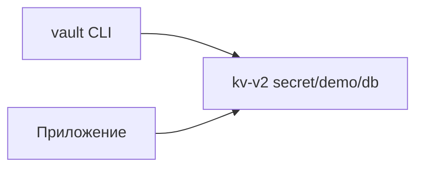
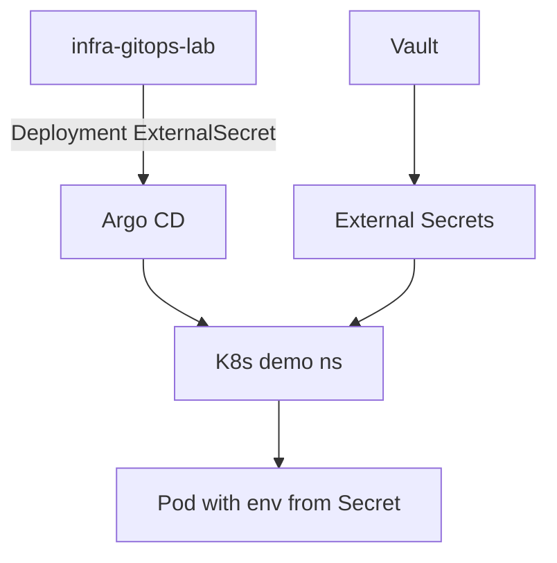

# Практикум Vault — итоги

Практикум показал, как убрать plaintext credentials из Git и `.env`, централизовав секреты в HashiCorp Vault. Ниже — выводы по каждому блоку и связь с GitOps.

---

## 1. Зачем Vault в инфраструктуре

Секреты хранятся в **Vault**, Git остаётся без passwords и API keys — [8.03/117](/encyclopedia/8-infra-security/8-03-zabota-o-kode-i-dannyh/117).

| Было | Стало |
|------|-------|
| `.env` в репозитории | path `secret/demo/db` в Vault |
| Один файл на все среды | `secret/dev/`, `secret/prod/` |
| Root token в CI | AppRole, K8s auth, OIDC |

---

## 2. Шаг 1 — KV v2

1. Vault в Docker `-dev` на `http://127.0.0.1:8200`.
2. Движок **kv-v2** с версионированием и metadata.
3. Команды `vault kv put` / `vault kv get` — базовый CRUD секретов.
4. Dev-режим **только lab** — нет persistence, предсказуемый root token.

---

## 3. Шаг 2 — Policies и AppRole

1. **Policy** `demo-read` — least privilege, read на `secret/data/demo/*`.
2. **AppRole** — `role_id` + `secret_id` → short-lived `client_token`.
3. Root token — break-glass для админов, не для приложений и CI.
4. **Audit log** — обязателен в production для compliance — [8.07/114](/encyclopedia/8-infra-security/8-07-informatsionnaya-bezopasnost/114).

---

## 4. Шаг 3 — приложение, K8s, CI

1. **Fetch at startup** — секрет в памяти процесса, hvac или HTTP API.
2. **External Secrets Operator** — Vault → Kubernetes Secret без YAML password в Git.
3. Связка с [GitOps practicum](/encyclopedia/8-infra-security/8-13-praktikum-gitops/2) — Argo CD sync ExternalSecret, ESO sync значений.
4. **GitHub Actions + OIDC** — JWT вместо long-lived `VAULT_TOKEN` — [8.12/8](/encyclopedia/8-infra-security/8-12-aktualnye-praktiki/8).
5. **Rotation** — `vault kv put` новой версии, ESO refresh или restart Pod.

---

## 5. Production checklist

| Требование | Lab | Production |
|------------|-----|------------|
| HA Vault | Нет | Raft / Consul cluster |
| Auto-unseal | Dev auto | KMS, HSM |
| TLS | HTTP localhost | HTTPS, cert rotation |
| Auth для apps | AppRole | K8s auth, SPIFFE, OIDC |
| Audit | Опционально | Immutable + SIEM |
| Policies | demo-read | По сервисам и средам |

DevSecOps-практики — [8.12/3](/encyclopedia/8-infra-security/8-12-aktualnye-praktiki/3).

---

## 6. Связка GitOps + Vault (итоговая схема)

Git описывает **структуру** (какой Secret нужен). Vault хранит **значения**. Argo CD не видит password в diff PR.

---

## 7. Куда идти дальше

| Тема | Ссылка |
|------|--------|
| GitOps цикл | [8.13 intro](/encyclopedia/8-infra-security/8-13-praktikum-gitops/intro) |
| Kubernetes | [8.06/211](/encyclopedia/8-infra-security/8-06-konteynerizatsiya-i-orkestratsiya/211) |
| OIDC CI | [8.12/8](/encyclopedia/8-infra-security/8-12-aktualnye-praktiki/8) |
| Самопроверка | [Чек-лист](./999.md) |

[Чек-лист](./999.md) · [Методы защиты данных](/encyclopedia/8-infra-security/8-03-zabota-o-kode-i-dannyh/117)

---
