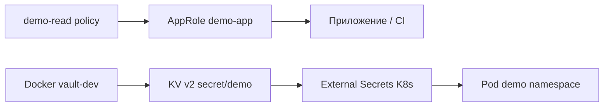

import DocCardList from '@theme/DocCardList';

# О разделе

**HashiCorp Vault** — централизованное хранилище секретов (пароли, ключи API, TLS-сертификаты) с аудитом, rotation и fine-grained **policies** (политиками доступа). Практикум проходит путь: dev-режим на Docker → движок **KV v2** → **AppRole** → чтение из приложения и интеграция с CI и Kubernetes.

Секреты в GitOps-репозитории хранить нельзя — см. [практикум GitOps](/encyclopedia/8-infra-security/8-13-praktikum-gitops/intro). Vault закрывает этот пробел: Git описывает **ExternalSecret**, значения живут в Vault.

<div class="callout callout--info">
  <div class="callout-title">Для кого раздел</div>
  <div class="callout-body">
  Нужны Docker, базовый Linux и знакомство с [методами защиты данных](/encyclopedia/8-infra-security/8-03-zabota-o-kode-i-dannyh/117). Полезно пройти [практикум GitOps](/encyclopedia/8-infra-security/8-13-praktikum-gitops/intro) — секреты в K8s часто подтягивают из Vault через External Secrets Operator.
  </div>
</div>

---

## Что вы построите на стенде



1. Vault в `-dev` на порту 8200.
2. Секрет БД в path `secret/demo/db`.
3. Policy с read-only на `secret/data/demo/*`.
4. AppRole вместо root token для машин.
5. ExternalSecret в кластере из [GitOps practicum](/encyclopedia/8-infra-security/8-13-praktikum-gitops/2).

---

## Предварительные требования

| Инструмент | Проверка | Назначение |
|------------|----------|------------|
| Docker | `docker ps` | Контейнер vault-dev |
| curl или браузер | — | Health check API |
| Vault CLI | `vault version` | put/get, policies |
| Опционально kind | из GitOps lab | External Secrets в K8s |

Установка Vault CLI: https://developer.hashicorp.com/vault/docs/install

Базовая теория секретов — [8.03/117](/encyclopedia/8-infra-security/8-03-zabota-o-kode-i-dannyh/117). OIDC для CI — [8.12/8](/encyclopedia/8-infra-security/8-12-aktualnye-praktiki/8).

---

## Маршрут по шагам

| Шаг | Статья | Содержание |
|-----|--------|------------|
| 1 | [Запуск Vault и KV secrets](./1.md) | Docker dev, kv-v2 put/get, антипаттерны .env в Git |
| 2 | [Policies и AppRole](./2.md) | Least privilege, role_id/secret_id, audit log |
| 3 | [Приложение и CI](./3.md) | External Secrets, fetch at startup, OIDC в GitHub Actions |

[Итоги](./998.md) · [Чек-лист](./999.md)

Рекомендуемый порядок 1 → 2 → 3. Шаг 3 опирается на AppRole из шага 2; для блока K8s нужен кластер из [GitOps practicum](/encyclopedia/8-infra-security/8-13-praktikum-gitops/1).

---

## Dev-режим и production

<div class="callout callout--warning">
  <div class="callout-title">Только lab</div>
  <div class="callout-body">Режим <code>-dev</code> хранит root token в памяти, без HA и без persistent storage. В production — кластер Vault, auto-unseal (KMS/HSM), audit log в immutable storage.</div>
</div>

На стенде `-dev` допустим для обучения. В production те же API (KV, policies, AppRole), но другая топология:

| Аспект | Lab (-dev) | Production |
|--------|------------|------------|
| Хранение данных | В памяти контейнера | Persistent backend (Consul, Raft, cloud) |
| Unseal | Автоматически | Shamir keys или auto-unseal |
| Root token | `dev-root-token` в env | Break-glass, редко используется |
| Audit | Опционально file | SIEM, [8.07/114](/encyclopedia/8-infra-security/8-07-informatsionnaya-bezopasnost/114) |

---

## Связь с GitOps и Kubernetes

GitOps-манифесты в Git **без plaintext password**. Типичная схема:

1. Vault хранит `secret/demo/db`.
2. **External Secrets Operator** (ESO) создаёт Kubernetes Secret из Vault.
3. Pod монтирует Secret по volume или envFrom.
4. Argo CD синхронизирует только ExternalSecret YAML — см. [8.13 шаг 2](/encyclopedia/8-infra-security/8-13-praktikum-gitops/2).

Теория DevSecOps — [8.12/3](/encyclopedia/8-infra-security/8-12-aktualnye-praktiki/3).

---

## Типичные проблемы до старта

| Симптом | Решение |
|---------|---------|
| `vault: command not found` | Установите CLI, добавьте в PATH |
| Port 8200 занят | `docker stop vault-dev` или смените `-p 8201:8200` |
| `permission denied` на Docker | Запустите Docker Desktop / добавьте пользователя в группу docker |

Подробные команды — в [шаге 1](./1.md).

---

## Словарь терминов раздела

| Термин | Объяснение |
|--------|------------|
| **Secret** | Чувствительные данные — password, API key |
| **KV engine** | Key-Value хранилище в Vault |
| **Policy** | HCL-правила доступа к paths |
| **AppRole** | Machine auth — role_id + secret_id |
| **ESO** | External Secrets Operator в Kubernetes |
| **Rotation** | Смена секрета без смены path |
| **Unseal** | Распечатывание Vault после restart |
| **Seal** | Vault не отвечает на запросы до unseal |

---

## Способы хранения секретов в K8s

| Способ | Безопасно для Git | Production |
|--------|-------------------|------------|
| Plaintext в YAML | Нет | Нет |
| Sealed Secrets | Да | Да |
| SOPS + age | Да | Да |
| Vault + ESO | Да | Да |

Practicum показывает Vault + ESO в связке с [GitOps 8.13](/encyclopedia/8-infra-security/8-13-praktikum-gitops/intro).

---

## Время прохождения

| Шаг | Минут |
|-----|-------|
| 1 — Docker + KV | 25–35 |
| 2 — Policy + AppRole | 30–40 |
| 3 — ESO + приложение | 45–60 |

---

## Чек перед шагом 1

```bash
docker ps --filter name=vault-dev
vault version 2>/dev/null || echo "Install Vault CLI"
curl -s -o /dev/null -w "%{http_code}" http://127.0.0.1:8200/v1/sys/health 2>/dev/null || echo "Vault not running yet"
```

---

## Production roadmap после lab

1. Развернуть Vault HA (Raft storage, 3+ nodes).
2. Настроить auto-unseal через cloud KMS.
3. Включить audit на immutable storage + SIEM — [8.07/114](/encyclopedia/8-infra-security/8-07-informatsionnaya-bezopasnost/114).
4. Заменить root token на break-glass процедуру.
5. Kubernetes auth для ESO вместо static token.
6. Rotation policy и alerting на failed login.

DevSecOps checklist — [8.12/3](/encyclopedia/8-infra-security/8-12-aktualnye-praktiki/3).

---

## Полный walkthrough подготовки Vault lab

### Проверка окружения

```bash
docker ps --filter name=vault-dev
vault version 2>/dev/null || echo "Install Vault CLI"
curl -s -o /dev/null -w "%{http_code}" http://127.0.0.1:8200/v1/sys/health 2>/dev/null || echo "Vault not running"
```

Ожидаемо до старта — Vault not running, HTTP 000.

### Запуск контейнера

```bash
docker rm -f vault-dev 2>/dev/null || true
docker run --cap-add=IPC_LOCK -d --name vault-dev -p 8200:8200 \
  -e VAULT_DEV_ROOT_TOKEN_ID=dev-root-token \
  -e VAULT_DEV_LISTEN_ADDRESS=0.0.0.0:8200 \
  hashicorp/vault:1.17
export VAULT_ADDR=http://127.0.0.1:8200
export VAULT_TOKEN=dev-root-token
vault status
```

Ожидаемый вывод `vault status`:

```
Sealed          false
```

### Первая запись секрета

```bash
vault kv put secret/demo/db url=postgres://localhost:5432/app password='CHANGE_ME_STRONG' username=app_user
vault kv get secret/demo/db
```

---

## Типичные ошибки до старта Vault

| Симптом | Ожидание при OK | Решение |
|---------|-----------------|---------|
| `vault: command not found` | версия CLI | Установите с developer.hashicorp.com |
| Port 8200 занят | curl 200/429/503 | `docker stop vault-dev` или порт 8201 |
| `permission denied` Docker | docker ps OK | Запустите Docker Desktop |
| `connection refused` | vault status | `docker logs vault-dev` |
| `permission denied` на kv put | version 1 | Проверьте VAULT_TOKEN |

---

## Предупреждения безопасности раздела

1. Режим `-dev` **только** для lab — данные в RAM, без HA.
2. Root token `dev-root-token` не в Git, CI, Kubernetes manifest.
3. Production — TLS, audit log, auto-unseal, break-glass root.
4. Dump Postgres в offsite шифруйте — Vault хранит runtime credentials, не заменяет backup encryption.
5. AppRole secret_id — masked в CI logs, одноразовый где возможно.

---

## Чек-лист готовности к шагу 1

| # | Проверка | Команда | Ожидание |
|---|----------|---------|----------|
| 1 | Docker | `docker ps` | без ошибки |
| 2 | Vault CLI | `vault version` | v1.x |
| 3 | Контейнер | `docker ps --filter name=vault-dev` | Up |
| 4 | Unsealed | `vault status` | Sealed false |
| 5 | KV доступен | `vault secrets list` | secret/ |

<DocCardList />

---
