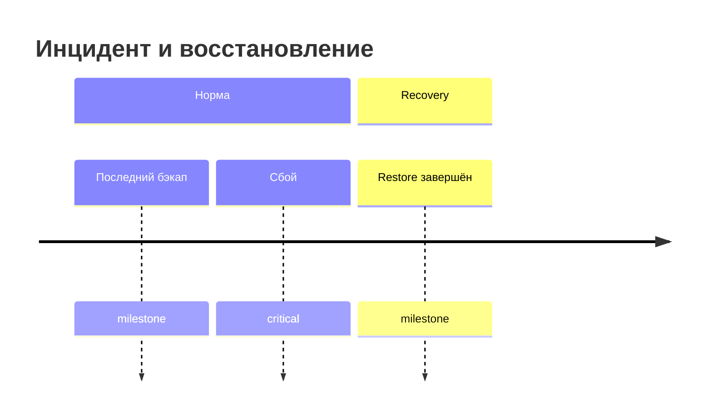
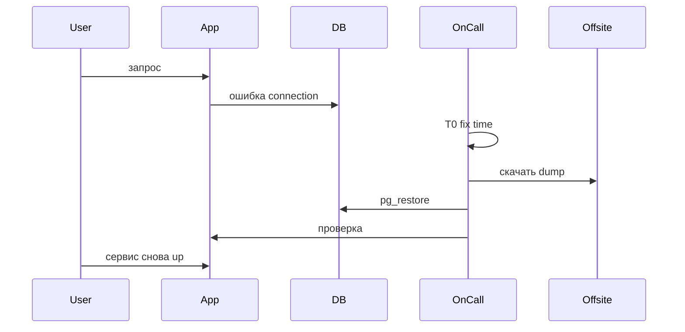

import ExternalPlayEmbed from '@site/src/components/ExternalPlayEmbed';

# Практикум DR — RTO, RPO и 3-2-1

<div class="article-tags">
  <span class="tag tag-required">ОБЯЗАТЕЛЬНО</span>
</div>
<ExternalPlayEmbed example="infra-security/rto-rpo-slider-play" title="RTO / RPO слайдеры" minHeight={420} />


**Disaster Recovery** (DR, аварийное восстановление) — процесс возвращения сервисов в работу после катастрофы. До инцидента команда (или один владелец pet-проекта) договаривается о двух числовых целях: **RPO** и **RTO**. Без них невозможно выбрать частоту бэкапов, бюджет на offsite-хранилище и состав runbook. Эта статья — теоретическая база перед [стендом и бэкапом](./2.md).

---

## RTO и RPO — две разные оси

**RPO** (Recovery Point Objective) отвечает на вопрос "сколько **данных** мы готовы потерять". Метрика выражается во **времени** между последней успешной точкой восстановления и моментом сбоя, без привязки к размеру dump в мегабайтах. Если бэкап делается раз в сутки в 03:00, а сервер упал в 14:00, RPO gap — до 11 часов транзакций. Формулировка для pet-магазина может звучать так: "мы терпим потерю заказов не более чем за 15 минут до сбоя".

**RTO** (Recovery Time Objective) отвечает на вопрос "сколько **простоя** допустимо". От момента сбоя до момента, когда пользователь снова может оформить заказ, проходит время восстановления. RTO включает обнаружение инцидента, решение "идём в restore", выполнение runbook и проверку данных. Для учебного pet-проекта разумная цель — "сервис снова доступен за 1 час"; для критичного production — минуты, и тогда runbook автоматизируют.

| Метрика | Вопрос | Пример цели |
|---------|--------|-------------|
| **RPO** | Сколько данных можно потерять? | "Не больше 15 минут транзакций" |
| **RTO** | Сколько простоя допустимо? | "Сервис up за 1 час" |



На диаграмме **RPO** — расстояние по оси времени от последнего бэкапа (или WAL checkpoint) до сбоя: всё, что записалось после бэкапа, при restore из dump пропадёт. **RTO** — интервал от сбоя до завершения restore и проверки. Узкий RPO требует частых бэкапов или WAL archiving; узкий RTO требует отрепетированного runbook, готовых образов Docker и понятного on-call.

---

## Правило 3-2-1

**Правило 3-2-1** — мнемоника для минимально приемлемой схемы копий.

| Цифра | Смысл |
|-------|-------|
| **3** | Три экземпляра данных (production + две копии) |
| **2** | Два разных носителя или типа хранения (локальный SSD и object storage) |
| **1** | Одна копия **offsite** — физически или логически отделена от основной площадки |

Offsite означает, что одна катастрофа не уничтожит все копии сразу. Бэкап в папке `/var/backups` на том же VPS, где крутится production, **не** считается offsite: отказ диска или удаление VM уничтожит и сервис, и dump. Offsite — другой диск на другой машине, S3 bucket в другом регионе, внешний NAS у друга или cold tier в облаке.

Типовая ошибка из реальных инцидентов (в том числе кейс на [странице раздела 8](/section/infra-security)) — бэкап **в том же здании**, что и production, без второго региона. Пожар, затопление или ошибка администратора на shared storage уничтожают и primary, и "резервную" копию.

---

## Стратегии бэкапа и связь с RPO

| Стратегия | Как работает | Типичный RPO | Когда выбирают |
|-----------|--------------|--------------|----------------|
| Логический `pg_dump` по cron | SQL/custom dump базы | Часы (интервал cron) | Pet-проект, миграции, учебные стенды |
| Физический base backup + WAL | Копия data directory + журнал | Минуты при continuous archive | Production PostgreSQL |
| Snapshot тома (EBS, cloud disk) | Снимок блока диска | Зависит от частоты и consistency | Быстрый DR в том же облаке |
| Реплика read-only | Streaming replication на standby | Секунды (lag реплики) | Высокая доступность, failover |

В этом практикуме вы используете первую строку — `pg_dump` каждые несколько часов или сутки. Это честно показывает RPO gap: заказы после dump исчезнут при restore. Решение — чаще dump, nightly + hourly для критичных таблиц, или переход к WAL (см. [8.11/10](/encyclopedia/8-infra-security/8-11-praktikum-postgresql/10)).

---

## Backup и DR — две ступени зрелости

| Аспект | Только backup | DR с учениями |
|--------|---------------|---------------|
| Артефакт | Файл dump на диске | **Проверенный** runbook restore |
| Расписание | Cron раз в сутки | **Test restore** раз в квартал |
| Метрики | Надежда без измерений | Записанные RTO и RPO |
| Ответственность | "Бэкап есть" | "Мы восстанавливали 12 марта за 23 минуты" |

Файл dump без единого успешного restore — это страховой полис, который никто не открывал. **Restore drill** доказывает, что dump не битый, пароли в runbook актуальны, а команда помнит порядок команд. После каждого учения обновляют дату "last successful test restore" в runbook и в wiki.

---

## Runbook — что записать до инцидента

**Runbook** — пошаговая инструкция восстановления, которую можно выполнить под стрессом. Минимальный черновик для PostgreSQL в Docker включает имя контейнера, путь к offsite dump, команды `docker run`, `pg_restore`, проверочный `SELECT`, контакт on-call и ссылку на мониторинг. Отдельной строкой — **целевые RTO/RPO** и **фактические** с прошлого учения.

Пример структуры runbook (текст в Confluence, Notion или `RUNBOOK.md` в репозитории):

```
1. Зафиксировать T0 (date -Iseconds)
2. Остановить и удалить контейнер pg-dr-lab, volume pgdata
3. Поднять новый контейнер с чистым volume
4. pg_restore из последнего файла в backup-offsite/
5. SELECT * FROM orders — сверка строк
6. Зафиксировать T1, вычислить RTO = T1 - T0
7. Уведомить владельца pet-проекта
```

Runbook дополняют после каждого учения: что сработало, где команда ошиблась, какие секреты устарели.

---

## Стоимость offsite для pet-проекта

Offsite dump в object storage — одна из самых дешёвых статей DR. Пример для базы **800 МБ** после сжатия `-Fc`:

| Провайдер / tier | Ориентир цены | Пример в месяц (30 dump по 800 МБ) |
|------------------|---------------|-------------------------------------|
| AWS S3 Glacier Instant Retrieval | ~$0.004/ГБ | ~$0.10 хранение + ~$0.05 запросы |
| Yandex Object Storage cold | ~₽1.5/ГБ | ~₽36 хранение |
| Backblaze B2 | ~$0.005/ГБ | ~$0.12 |

Подробнее про бюджет и алерты — [FinOps для pet-проекта](/encyclopedia/8-infra-security/8-16-finops-pet-project/1). Дешёвый tier подходит для редко читаемых dump; для срочного restore в инциденте иногда держат одну "горячую" копию на стандартном S3 tier.

---

## Как выбрать RTO и RPO для pet-проекта

Начните с вопроса "что случится, если сервис лежит сутки". Для личного блога RTO **24 часа** и RPO **24 часа** часто приемлемы: один nightly `pg_dump` и restore в выходной. Для pet-магазина с десятком заказов в день разумнее RTO **1 час** и RPO **6 часов** — cron каждые 6 часов плюс runbook, который вы отработали в lab.

| Профиль сервиса | RTO (ориентир) | RPO (ориентир) | Минимальная стратегия |
|-----------------|----------------|----------------|------------------------|
| Личный блог, SQLite | 24 h | 24 h | Копия файла БД на другой диск |
| Demo API + Postgres | 1 h | 6 h | `pg_dump` каждые 6 h + offsite |
| Side-project с оплатой | 30 min | 15 min | Hourly dump или WAL + standby |
| Production SaaS | минуты | секунды–минуты | HA, PITR, multi-region |

Цифры согласуют с владельцем продукта (в pet-проекте — с вами же) **до** первого инцидента. После restore drill сравните **целевой** RTO с **фактическим** — gap показывает, где runbook слишком длинный или offsite слишком медленный.

---

## Restore drill — расписание и сценарии

**Restore drill** проводят по календарю, а не откладывают "на потом". Минимум для pet-проекта с реальными пользователями — **раз в квартал**. Для учебного стенда достаточно drill после каждого изменения runbook или версии Postgres.

| Тип учения | Что проверяют | Длительность |
|------------|---------------|--------------|
| Tabletop | Обсуждение runbook без команд | 30 min |
| Partial restore | `pg_restore --list`, restore одной таблицы | 15 min |
| Full restore | Полная катастрофа volume, как в [шаге 3](./3.md) | 30–90 min |
| Failover | Переключение на реплику (production) | 1–4 h |

В lab вы выполняете **full restore**. Запишите в runbook дату, участников, T0/T1 и отклонения ("образ postgres:16-alpine не был закэширован — +2 min download").

---

## DRP и место DR в политике

**DRP** (Disaster Recovery Plan) — документ уровня организации: роли, эскалация, связь с регуляторами. **Runbook** — техническая часть DRP для одной системы (PostgreSQL shop). В pet-проекте DRP умещается на двух страницах: кто принимает решение о restore, где лежит offsite, как связаться с хостингом.

On-call в lab — вы сами. В маленькой команде on-call ротируют; в runbook указывают primary и secondary контакт. Важно, чтобы человек без глубокого знания Postgres мог выполнить команды из runbook буквально — отсюда требование коротких шагов без импровизации.

---

## Типовые ошибки (урок NaRS Korea и аналоги)

На [странице раздела 8](/section/infra-security) разобран кейс, где бэкапы оказались бесполезны из-за географии и процесса. Обобщённые ошибки, которые ловит practicum:

| Ошибка | Последствие | Как practicum лечит |
|--------|-------------|---------------------|
| Бэкап на том же диске | Потеря primary = потеря dump | Папка `backup-offsite` / S3 |
| Dump без test restore | Битый файл обнаруживается в инциденте | Restore drill в [шаге 3](./3.md) |
| Нет runbook | Импровизация, растёт RTO | Черновик в [шаге 2](./2.md) |
| Секреты только в голове | Restore стопорится на пароле | Пароль в runbook / vault |
| Один retention file | Нет отката на вчерашний dump | 7 daily + lifecycle |

---

## Проверка dump до катастрофы

Перед учением выполните **dry check** без удаления volume:

```bash
pg_restore --list ./backup-offsite/shop-20250615-0300.dump | head -20
```

Команда выводит оглавление объектов в dump. Ошибка "could not open input file" или "archive is corrupted" — сигнал сделать новый `pg_dump` до drill. Это сокращает RTO в реальном инциденте: вы уже знаете, что файл читается.

---

## Шифрование offsite-копий

Dump в bucket без шифрования читают все, у кого есть доступ к bucket policy. Для pet-проекта включите **server-side encryption** (SSE-S3, SSE-KMS) в bucket и ограничьте IAM ключ только на `PutObject` для cron и `GetObject` для restore. Пароль Postgres в dump **не** шифруется отдельно — защита на уровне bucket и сети. Для чувствительных данных рассмотрите `gpg --encrypt` перед upload.

---

## Репликация как дополнение к бэкапу

**Streaming replication** на read-only standby сокращает RPO до секунд (lag реплики), но **не** заменяет offsite dump: админ может удалить данные на primary и реплика повторит ошибку. Комбинация для production — реплика для быстрого failover **плюс** offsite dump **плюс** restore drill. В lab достаточно dump; реплика — тема [8.11/6](/encyclopedia/8-infra-security/8-11-praktikum-postgresql/6).

| Подход | RPO | RTO | Сложность pet |
|--------|-----|-----|---------------|
| Только pg_dump offsite | часы | минуты–часы | низкая |
| Standby + dump | секунды–минуты | минуты | средняя |
| Multi-region active | минуты | минуты | высокая |

---

## Хронология типового инцидента



On-call фиксирует T0 при подтверждении потери данных, не при первом flaky ping. Restore из offsite — отдельная фаза с собственным таймером внутри RTO.

---

## Согласование RTO/RPO с заказчиком (и с собой)

Документируйте цели одной таблицей в README pet-проекта:

| Сервис | RPO | RTO | Ответственный |
|--------|-----|-----|---------------|
| shop API | 6 h | 1 h | you@email |

При изменении cron меняйте строку RPO. При ускорении runbook automation — строку RTO. Без таблицы метрики плавают, post-incident сравнение бессмысленно.

---

## Glossary расширенный

**Offsite** — логически отделённое хранилище: другой account, region, провайдер или физический носитель в другом здании.

**Restore drill** — контролируемое учение с записью T0/T1 и diff данных.

**Runbook** — минимум команд для restore; версионируется в git рядом с infra.

**Last successful test restore** — дата последнего drill без блокирующих ошибок; KPI зрелости DR.

**RPO gap** — данные, записанные после последней точки восстановления и потерянные при restore.

**Cold tier** — дешёвый класс object storage с большей latency чтения; см. FinOps.

---

## Практическое задание перед шагом 2

Запишите на бумаге или в файле `dr-goals.md` свои RTO/RPO для учебного shop. Нарисуйте схему 3-2-1 для своего ноутбука (Docker volume + папка offsite + optional S3). Это займёт 10 минут и ускорит [шаг 2](./2.md), потому что offsite-путь уже выбран.

---

## Частые вопросы новичков

**Нужен ли DR, если база в managed Postgres?** Да. Провайдер бэкапит, но restore через их консоль — отдельный RTO; runbook и drill всё равно ваши. Плюс vendor lock-in — offsite dump в ваш bucket даёт выход.

**Достаточно ли snapshot VM?** Snapshot на том же hypervisor слабее offsite. Комбо: snapshot для быстрого rollback **плюс** dump в другой region.

**Можно ли DR без облака?** Да. Второй диск, NAS у друга, rsync на домашний сервер — правило 3-2-1 работает и on-prem.

**Как часто менять runbook?** После каждого deploy инфра, каждого drill, смены версии Postgres.

---

## Безопасность runbook

Runbook содержит пароли lab — в production храните ссылки на vault (HashiCorp Vault, AWS Secrets Manager, YC Lockbox). Read-only доступ on-call, audit log изменений. Dump offsite шифруется SSE; ключ IAM только для backup job и restore role.

---

## Матрица зрелости DR

| Уровень | Бэкап | Offsite | Test restore | RTO измерен |
|---------|-------|---------|--------------|-------------|
| 0 | нет | — | — | — |
| 1 | cron dump | same disk | нет | — |
| 2 | cron dump | offsite | год назад | ~ |
| 3 | cron + retention | offsite encrypted | quarterly | да |
| 4 | WAL/PITR | multi-region | monthly | да + auto |

Practicum переводит с уровня 1–2 на **3** для pet-проекта.

---

## Связанные материалы

[8.11 Бэкапы PostgreSQL](/encyclopedia/8-infra-security/8-11-praktikum-postgresql/10) — PITR, Wal-G, физические бэкапы. [DRP в методах защиты](/encyclopedia/8-infra-security/8-07-informatsionnaya-bezopasnost/111) — место DR в политике безопасности. [FinOps — дешёвый tier для offsite](/encyclopedia/8-infra-security/8-16-finops-pet-project/1) — контроль расходов на хранение копий.

Дальше — [стенд и бэкап](./2.md).

---

## Приложение A — примеры RTO/RPO по индустрии (ориентиры)

| Отрасль | RTO | RPO | Комментарий |
|---------|-----|-----|-------------|
| Корпоративный блог | 24 h | 24 h | nightly backup |
| E-commerce small | 1 h | 15 min | hourly + drill |
| Фintech | 15 min | 1 min | HA + PITR |
| Учебный shop lab | 1 h | 6 h | practicum default |

Pet-проект берёт строку "E-commerce small" только при реальных платежах; иначе lab default достаточен.

---

## Приложение B — checklist runbook v1

| # | Элемент | Заполнено |
|---|---------|-----------|
| 1 | Имя базы и контейнера | |
| 2 | Путь offsite / s3:// | |
| 3 | Команды pg_restore | |
| 4 | Проверка SELECT | |
| 5 | On-call контакт | |
| 6 | Target RTO / RPO | |
| 7 | Last test restore date | |

---

## Приложение C — ссылки на стандарты

ISO 22301 (business continuity) и NIST SP 800-34 выходят за рамки pet-проекта, но термины RTO/RPO совпадают с practicum. Для собеседований достаточно объяснить метрики и показать runbook из lab.

---

## Полный runbook v0.1 (шаблон)

Сохраните как `RUNBOOK-dr-shop.md`:

```markdown
# DR Runbook — shop PostgreSQL

## Цели
- RTO: 1 час
- RPO: 6 часов (cron pg_dump каждые 6h)
- Last successful test restore: (пусто до drill)

## Контекст
- Container: pg-dr-lab
- DB: shop
- Port host: 5433
- Volume: pgdata
- Offsite: ./backup-offsite/ или s3://my-dr-bucket/shop/

## Restore (full)
1. T0=$(date -Iseconds)
2. docker stop pg-dr-lab && docker rm pg-dr-lab
3. docker volume rm pgdata
4. docker run -d --name pg-dr-lab-new -e POSTGRES_PASSWORD=lab -e POSTGRES_DB=shop \
     -v pgdata-new:/var/lib/postgresql/data -p 5433:5432 postgres:16-alpine
5. sleep 10
6. DUMP=$(ls -t ./backup-offsite/*.dump | head -1)
7. docker exec -i pg-dr-lab-new pg_restore -U postgres -d shop --clean --if-exists < "$DUMP"
8. docker exec pg-dr-lab-new psql -U postgres -d shop -c "SELECT count(*) FROM orders;"
9. T1=$(date -Iseconds)
10. RTO = T1 - T0

## On-call
- you@email / Telegram @handle

## Post-incident
- Заполнить таблицу RTO/RPO gap
```

---

## Walkthrough dry check dump

```bash
pg_restore --list ./backup-offsite/shop-20250615-0300.dump | head -20
sha256sum -c ./backup-offsite/shop-20250615-0300.dump.sha256 2>/dev/null || echo "добавьте checksum в шаге 2"
```

Ожидаемый list — строки `TABLE DATA public orders` без FATAL.

---

## Типичные ошибки теории DR

| Ошибка | Последствие | Как practicum лечит |
|--------|-------------|---------------------|
| Путают RTO и RPO | неверный cron | таблица метрик в шаге 1 |
| Offsite = same disk | total loss | папка backup-offsite / S3 |
| Нет test restore | битый dump в инциденте | шаг 3 drill |
| Один dump file | нет отката | retention 7 daily |
| Runbook устарел | высокий RTO | дата last test restore |

---

## Чек-лист завершения шага 1

| # | Критерий | Готово |
|---|----------|--------|
| 1 | RTO записан | ☐ |
| 2 | RPO записан | ☐ |
| 3 | Правило 3-2-1 объяснено | ☐ |
| 4 | Runbook v0.1 создан | ☐ |
| 5 | Cost offsite оценён | ☐ |
| 6 | Матрица зрелости понятна | ☐ |

Дальше — [стенд и бэкап](./2.md).

---

## Калькулятор RPO по расписанию cron

| Cron | Максимальный RPO gap |
|------|----------------------|
| `0 3 * * *` (daily 03:00) | 24 часа |
| `0 */6 * * *` | 6 часов |
| `0 * * * *` (hourly) | 1 час |
| `*/15 * * * *` | 15 минут |

Выберите cron под вашу записанную цель RPO из таблицы в начале статьи.

---
