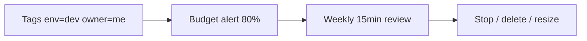

import ExternalPlayEmbed from '@site/src/components/ExternalPlayEmbed';

# FinOps для pet-проекта

<div class="article-tags">
  <span class="tag tag-required">ОБЯЗАТЕЛЬНО</span>
  <span class="tag tag-beginner">ДЛЯ НОВИЧКОВ</span>
</div>


<span class="complexity-badge">Разработчику</span>

<ExternalPlayEmbed example="infra-security/cloud-leak-calculator-play" title="FinOps — калькулятор утечек" minHeight={440} />

Представим, что вы делаете свой маленький проект. Ставите виртуалку в облаке, забываете про неё, а через месяц приходит счёт на 50 баксов, потому что она круглосуточно жрала ресурсы, хотя вы ей пользовались всего пару часов. FinOps — это про то, чтобы этого не случилось. Как снять квартиру и забыть выключить свет - всё равно придётся платить за электроэнергию.

**FinOps** (Financial Operations) — дисциплина управления **облачными расходами**. Цель — понимать, за что платите каждый месяц, получать предупреждение до исчерпания бюджета и не держать включёнными ресурсы, которые не используете. Для pet-проекта и учебных стендов хватает **простых привычек** без SAP, chargeback между отделами и команды FinOps из десяти человек.

Pet-проект легко превращается в "забытый Kubernetes" со счётом **$500** за Load Balancer, три ноды и NAT Gateway. FinOps для одного разработчика — это budget alert на **$10–20**, тег `env=dev` на каждой VM и пятничный cron stop. Ниже — типовые утечки с цифрами, минимальный контур контроля и примеры стоимости offsite-бэкапов из [DR practicum](/encyclopedia/8-infra-security/8-15-praktikum-dr/1).

---

## Типовые утечки денег

| Утечка | Пример ущерба | Что сделать |
|--------|---------------|-------------|
| Dev-ВМ 24/7 | $30–80/мес за t3.medium | Stop nights/weekends |
| Unattached disk | $10–40/мес | Delete orphan EBS/volume |
| Public IP idle | $3–5/мес | Release EIP |
| Oversized DB | managed DB "на вырост" | Tier down / SQLite locally |
| Egress traffic | CDN cross-region | Same region bucket+compute |
| Forgotten K8s LB | Load Balancer без сервисов | `kubectl delete` / terraform destroy |

1. Выключайте на ночь и выходные, просто cron-скриптом или кнопкой в консоли. Это называется **Dev-ВМ 24/7.** Инстанс `t3.medium` в AWS (~$0.0416/час) при круглосуточной работе ≈ **$30/мес** только compute; диск и IP добавят ещё **$5–10**. Учебный стенд, которым пользуются 2 часа вечером, можно останавливать на 16 часов в сутки и сэкономить **~65%** compute.
2. **Unattached disk.** После удаления VM диск EBS или cloud volume часто остаётся "висеть". **100 ГБ gp3** ≈ **$8/мес** без пользы. Раз в неделю просматривайте список volumes без attachment.
3. **Public IP idle.** Elastic IP в AWS без привязанного инстанса — **~$3.6/мес**. Мелочь, но сигнал о забытых ресурсах.
4. **Oversized DB.** Managed PostgreSQL минимального tier **$15–40/мес** против **$5 VPS** с Docker Compose для demo с десятью пользователями. SQLite или один контейнер Postgres на том же VPS закрывают задачу до роста нагрузки.
5. **Egress.** Трафик из bucket в другой регион или из облака к пользователям без CDN бьёт по billing. Держите bucket и compute в **одном регионе**, static — на Cloudflare Pages или GitHub Pages (egress часто $0).
6. **Forgotten K8s LB.** Один Load Balancer в managed Kubernetes **$15–25/мес** без backend service. После эксперимента — `terraform destroy` или удаление cluster.

FinOps — это просто привычка заглядывать в консоль раз в неделю и подчищать хвосты. 

CapEx и OpEx в облаке — [8.01/12](/encyclopedia/8-infra-security/8-01-oblachnye-tehnologii/12).

---

## Минимальный набор контролей



**Billing alert.** В AWS Budgets, Yandex Billing, VK Cloud или аналоге задайте месячный лимит pet-проекта (**$15–25** для начала) и email при **50%, 80% и 100%**. Алерт не останавливает ресурсы автоматически — он будит вас до нуля на карте.

**Tags.** На каждый ресурс: `env=dev|prod`, `project=petshop`, `owner=you`. Без тегов в Cost Explorer непонятно, кто сожрал $40 — lab или production blog.

**Calendar stop.** Cron в пятницу 20:00 останавливает dev VM; понедельник 09:00 — start. Реализация — Lambda + EventBridge, `yc compute instance stop`, GitHub Action по schedule или скрипт на домашнем NAS.

**Inventory.** Раз в неделю 15 минут — список running instances, unattached disks, load balancers. В AWS: `aws ec2 describe-instances`, Cost Explorer filter by tag.

---

## Пример monthly cost pet-стека

Сценарий: demo API + Postgres, учёба вечерами, offsite dump из DR practicum.

| Ресурс | Конфигурация | Ориентир $/мес |
|--------|--------------|----------------|
| VPS или t3.small | 2 vCPU, stop 12h/день | $8–15 |
| Object storage offsite | 10 ГБ dump, cold tier | $0.10–0.50 |
| Domain + DNS | Cloudflare free | $0–12/год домен |
| Managed DB (если включили) | db.t3.micro | $15–25 |
| **Итого lean** | VPS + storage + alert | **~$10–20** |
| **Итого "на вырост"** | Managed DB 24/7 + LB | **~$50–80** |

Разница между lean и "на вырост" — FinOps-решение до появления реальных пользователей.

---

## Пример stop dev VM (Yandex Cloud CLI)

Список инстансов с меткой `env=dev`:

```bash
yc compute instance list --format json | jq '.[] | select(.labels.env=="dev") | .id'
# yc compute instance stop --id <id>
```

Для автоматизации — Cloud Function по cron или [Terraform](/encyclopedia/8-infra-security/8-04-devops-ci-cd/2) с `count` и schedule. AWS analog — **Instance Scheduler** или Systems Manager Maintenance Windows.

Пример AWS CLI (идея inventory):

```bash
aws ec2 describe-volumes --filters Name=status,Values=available \
  --query 'Volumes[*].[VolumeId,Size,CreateTime]' --output table
```

Volumes в статусе `available` — кандидаты на удаление после проверки.

---

## DR offsite и FinOps

[Практикум DR](/encyclopedia/8-infra-security/8-15-praktikum-dr/1) рекомендует хранить `pg_dump` в offsite object storage. FinOps-выбор:

| Tier | Когда | Пример 20 ГБ backup |
|------|-------|---------------------|
| Standard / hot | Частый restore test | ~$0.46/мес AWS S3 |
| Infrequent Access | Раз в месяц drill | ~$0.25/мес |
| Glacier / cold | Долгий retention | ~$0.08–0.12/мес |

Lifecycle rule "перевести в cold через 7 дней, удалить через 90" держит DR-долг без раздувания счёта. Restore из cold добавляет минуты к RTO — зафиксируйте это в runbook.

---

## Pet-project stack — дёшево

| Задача | Дешёвый вариант | Ориентир cost |
|--------|-----------------|---------------|
| Static site | GitHub Pages / Cloudflare Pages | $0 |
| API + DB small | Single VPS + Docker Compose | $5–10/мес |
| Experiments K8s | kind локально — [GitOps practicum](/encyclopedia/8-infra-security/8-13-praktikum-gitops/intro) | $0 cloud |
| Object storage | Lifecycle → cold tier через 30 дней | cents per GB |

Миграция в [облако РФ](/encyclopedia/8-infra-security/8-12-aktualnye-praktiki/5) оправдана, когда нужен SLA, 152-ФЗ для персональных данных пользователей или production-сервис с uptime. До этого момента FinOps часто говорит "локально или один VPS".

---

## Чек-лист перед концом месяца

| Проверка | Готово |
|----------|--------|
| Budget alert включён на осмысленную сумму | ☐ |
| Все ресурсы с tag `env` и `project` | ☐ |
| Нет unattached disks и orphan Load Balancer | ☐ |
| Dev выключается, когда не учусь | ☐ |
| Раз в квартал `terraform destroy` для lab cluster | ☐ |
| Offsite dump на cold tier с lifecycle | ☐ |

Отметьте пункты после настройки; повторяйте обзор в тот же день, когда приходит billing email.

---

## CapEx и OpEx в pet-проекте

**CapEx** (Capital Expenditure) — разовые покупки железа или годовой VPS prepaid. **OpEx** (Operational Expenditure) — помесячный счёт облака по факту использования. Pet-проект почти всегда **OpEx**: плата за час VM, за ГБ storage, за egress. FinOps для OpEx — **выключать** и **удалять**, потому что каждый час running t3.medium списывает деньги автоматически.

| Модель | Платёж | FinOps-фокус |
|--------|--------|--------------|
| On-demand cloud | поминутно | stop, tags, alerts |
| Reserved 1y | upfront + скидка | только stable prod |
| Dedicated VPS год | upfront | не забыть renew |

Подробнее — [8.01/12](/encyclopedia/8-infra-security/8-01-oblachnye-tehnologii/12).

---

## Free tier и ловушки

AWS Free Tier 12 месяцев, YC грант для новых аккаунтов — хороший старт, но **не** бессрочный. Типичные сюрпризы после окончания free tier:

| Ресурс | Free | После free |
|--------|------|------------|
| t2.micro 750 h/mo | $0 | ~$8–10/mo 24/7 |
| S3 5 GB | $0 | $0.023/GB |
| RDS db.t2.micro | ограничено | $15+/mo |

Поставьте budget alert **до** окончания гранта. Calendar reminder за 30 дней до expiry.

---

## GitHub Actions и CI cost

Публичные репозитории — бесплатные minutes. Private repo — лимит, затем **$0.008/min** Linux runner. Тяжёлый pipeline docker build 20 min × 30 runs = **$4.8/mo**. FinOps-приёмы: cache layers, `paths-ignore` в workflow, self-hosted runner на домашнем NAS для lab.

---

## Сценарии cost — три pet-профиля

**Профиль A — static only.** GitHub Pages + domain **~$1/mo** amortized. FinOps минимален: renew domain, не поднимать VM "на будущее".

**Профиль B — API + Postgres Docker на VPS.** Hetzner/YC compute **€4–8/mo** + backup bucket **$0.2**. Stop не нужен если один small VPS — уже дёшево. FinOps: не апгрейдить до managed DB без метрик нагрузки.

**Профиль C — lab K8s в облаке.** EKS/GKE **$70+** control plane + nodes **$30+** each. FinOps: kind local, destroy cluster после practicum. Забытый cluster **$100+/mo** — главный anti-pattern.

---

## Еженедельный обзор 15 минут (ritual)

| Минута | Действие |
|--------|----------|
| 0–3 | Открыть billing dashboard, сравнить с прошлой неделей |
| 3–8 | Cost by tag `env=dev` — кто растёт |
| 8–12 | Список unattached disks / LB / floating IP |
| 12–15 | Stop или delete одного ресурса-кандидата |

Запишите итог одной строкой в `finops-log.md`: "2025-06-15 deleted vol-abc saved $8/mo".

---

## Cost Explorer и Infracost

**AWS Cost Explorer** — фильтр по service, tag, daily granularity. **Infracost** (`infracost breakdown --path .`) оценивает Terraform **до** apply — полезно перед поднятием RDS в lab. Для YC — отчёты в консоли биллинга по label.

---

## Managed DB или Postgres на VPS

| Фактор | Managed PostgreSQL | Docker Postgres на VPS |
|--------|-------------------|------------------------|
| Цена entry | $15–40/mo | $5–10/mo VPS shared |
| Patches | автомат | ваш docker pull |
| Backups | часто встроены | [DR practicum](/encyclopedia/8-infra-security/8-15-praktikum-dr/intro) |
| FinOps | tier down сложнее | stop whole VPS |

Pet с менее 1000 пользователей — VPS + dump offsite. Рост — managed + PITR.

---

## NAT Gateway и скрытые $32

Private subnet в AWS без NAT — app не выходит в интернет. **NAT Gateway** **~$32/mo** + egress. FinOps lab: public subnet для dev или **VPC endpoints** для S3. Production — NAT осознанно в бюджете.

---

## Floating IP и elastic IP

YC/VK Cloud floating IP на stopped VM может тарифицироваться. AWS EIP без attachment **~$3.6/mo**. Inventory раз в неделю — release неиспользуемые.

---

## Lifecycle policy — пример S3

```json
{
  "Rules": [{
    "ID": "dr-dump-cold",
    "Status": "Enabled",
    "Transitions": [{ "Days": 7, "StorageClass": "GLACIER_IR" }],
    "Expiration": { "Days": 90 }
  }]
}
```

Связка с [DR offsite](/encyclopedia/8-infra-security/8-15-praktikum-dr/2) — dump старше 7 дней дешевле, старше 90 удаляется.

---

## Telegram bot alert (идея)

Cron на VPS:

```bash
COST=$(yc billing account-balance --format json | jq .balance)
# если balance < порог — curl telegram API
```

Простой bot дополняет email budget alert для тех, кто не читает почту.

---

## Quarterly finops audit

Раз в квартал вместе с [restore drill](/encyclopedia/8-infra-security/8-15-praktikum-dr/3): `terraform state list`, сверка с консолью, удаление stale DNS records, destroy lab cluster, пересмотр Reserved если prod стабилен.

---

## AWS Budgets — пошагово

В консоли AWS откройте **Billing → Budgets → Create budget**. Выберите **Cost budget**, период **Monthly**, сумму **$20** (подставьте свой лимит pet-проекта). Добавьте alert при **80%** и **100%** на email. Фильтр по tag `project=petshop` отделяет lab от других проектов в том же аккаунте.

Для Yandex Cloud — **Биллинг → Бюджеты** с порогом в рублях. VK Cloud — аналогичный раздел в личном кабинете. Budget alert **не останавливает** ресурсы — только письмо. Авто-stop требует Lambda или скрипт по EventBridge.

---

## Теги через Terraform (идея)

IaC фиксирует теги при каждом `apply` — меньше "безымянных" ресурсов.

```hcl
resource "yandex_compute_instance" "dev" {
  name = "pet-dev"
  labels = {
    env     = "dev"
    project = "petshop"
    owner   = "me"
  }
  # ...
}
```

Cost Explorer в AWS и отчёты YC фильтруют по `env=dev`. Перед `terraform destroy` lab убедитесь, что state не пересоздаст VM без вашего ведома — см. [DevOps practicum](/encyclopedia/8-infra-security/8-04-devops-ci-cd/intro).

---

## Reserved capacity и spot — когда имеет смысл

| Модель | Pet-проект | Комментарий |
|--------|------------|-------------|
| On-demand | dev VM, эксперiments | Платите за час, stop экономит |
| Reserved 1y | production VPS 24/7 | −30–40% при стабильной нагрузке |
| Spot / preemptible | batch, CI runner | Дешево, могут прервать |

Pet-проект на одной dev VM редко покупает Reserved — выгоднее **stop по расписанию**. Production blog на t3.micro 24/7 год — кандидат на Reserved или годовой VPS у провайдера.

---

## Egress и CDN — скрытый расход

| Сценарий | Риск | FinOps-приём |
|----------|------|--------------|
| Static из S3 без CloudFront | $0.09/ГБ egress | GitHub Pages, Cloudflare |
| API в us-east, users в EU | cross-region | Регион ближе к users |
| Backup restore в другой region | разовый spike | Restore drill в том же region |

[DR practicum](/encyclopedia/8-infra-security/8-15-praktikum-dr/1) рекомендует offsite в **другом** регионе для катастрофы — это сознательный trade-off: платите хранение + редкий egress ради выживания при regional outage.

---

## Kubernetes и FinOps для lab

Managed Kubernetes control plane **$70+/мес** в AWS EKS до первой app. Для учёбы [kind локально](/encyclopedia/8-infra-security/8-13-praktikum-gitops/intro) — **$0** cloud. Если cluster уже поднят:

| Ресурс | Cost leak | Действие |
|--------|-----------|----------|
| LoadBalancer Service | $15–25/мес каждый | `type: ClusterIP` в lab |
| Idle nodes | 3× worker 24/7 | один node или stop cluster |
| PersistentVolume orphan | как unattached disk | `kubectl get pv` |

Раз в квартал **`terraform destroy`** или удаление cluster через консоль — ritual из чек-листа.

---

## Облако РФ и compliance

[Облако РФ](/encyclopedia/8-infra-security/8-12-aktualnye-praktiki/5) оправдано при персональных данных пользователей по 152-ФЗ и требованиях заказчика к локализации. FinOps там же: бюджеты YC/VK Cloud, теги, stop dev. DR offsite может быть второй зона того же провайдера — дешевле cross-cloud, но слабее против total provider failure.

---

## Пример месячного отчёта pet-проекта

| Статья | $ |
|--------|---|
| VPS t3.small (stop 50% time) | 7 |
| S3 offsite 12 GB cold | 0.15 |
| Route53 / domain amortized | 1 |
| **Итого** | **~8** |

Сравните с unmanaged stack "всё 24/7 + managed DB" **$55+** — разница идёт на domain, мониторинг или резерв.

---

## Домашнее задание FinOps

За 30 минут включите budget alert, проставьте tag `env=dev` на одной VM, найдите один orphan resource и удалите или stop. Запишите сэкономленную сумму в `finops-log.md`. Параллельно откройте [DR practicum intro](/encyclopedia/8-infra-security/8-15-praktikum-dr/intro) и оцените cost offsite bucket — две статьи одного раздела 8.

---

## Приложение — калькулятор idle VM

Формула: **hours_on × price_hour × 30**. Пример t3.medium **$0.0416/h × 24 × 30 = ~$30/mo**. Stop 12h/день: **$0.0416 × 12 × 30 = ~$15/mo**. Экономия **$15** — одна строка в `finops-log.md`.

---

## Приложение — чек FinOps + DR

| Действие | FinOps | DR |
|----------|--------|-----|
| Budget на bucket | да | offsite cost |
| Lifecycle 90d | да | retention |
| Encrypt SSE | опционально | dump security |
| Quarterly drill | — | restore test |
| Cold tier | да | RTO +latency |

Обе колонки закрываются за один вечер настройки.

---

## Связанные материалы

[8.01 чек-лист FinOps вопросы](/encyclopedia/8-infra-security/8-01-oblachnye-tehnologii/3) — закрепление терминов. [DR offsite storage](/encyclopedia/8-infra-security/8-15-praktikum-dr/1) — стратегии бэкапа и RPO. [DevOps и IaC](/encyclopedia/8-infra-security/8-04-devops-ci-cd/intro) — теги и destroy через код.

---

## Полный walkthrough еженедельного обзора

Выполняйте каждую пятницу, 15 минут.

```bash
# 1. Дата в лог
echo "## $(date +%Y-%m-%d)" >> finops-log.md

# 2. AWS unattached volumes (если AWS)
aws ec2 describe-volumes --filters Name=status,Values=available \
  --query 'Volumes[*].[VolumeId,Size,CreateTime]' --output table 2>/dev/null || echo "skip AWS"

# 3. YC disks (если YC)
yc compute disk list 2>/dev/null | grep -v ATTACHED || echo "skip YC"

# 4. Running instances dev
yc compute instance list --format json 2>/dev/null | jq '.[] | select(.labels.env=="dev") | {name:.name, status:.status}' || echo "skip"

# 5. Запись действия
echo "- reviewed inventory, no action" >> finops-log.md
```

После обзора отметьте один ресурс-кандидат на stop/delete.

---

## AWS Budgets — полный CLI walkthrough

```bash
# Создание budget (идея — в консоли проще для первого раза)
aws budgets create-budget \
  --account-id $(aws sts get-caller-identity --query Account --output text) \
  --budget file://budget-pet.json \
  --notifications-with-subscribers file://budget-notifications.json
```

Пример `budget-pet.json`:

```json
{
  "BudgetName": "pet-monthly",
  "BudgetLimit": { "Amount": "20", "Unit": "USD" },
  "TimeUnit": "MONTHLY",
  "BudgetType": "COST"
}
```

Ожидаемый результат — budget visible в Billing → Budgets.

---

## Stop/start dev VM — YC полный цикл

```bash
# Список dev
yc compute instance list --format json | jq '.[] | select(.labels.env=="dev") | {id:.id, name:.name, status:.status}'

# Stop
yc compute instance stop --id <INSTANCE_ID>
yc compute instance get --id <INSTANCE_ID>
# status: STOPPED

# Start (понедельник)
yc compute instance start --id <INSTANCE_ID>
```

Ожидаемая экономия t3.medium 12h/день — ~50% compute (~$15/mo).

---

## Orphan cleanup walkthrough

```bash
# AWS volume delete (после проверки!)
aws ec2 describe-volumes --filters Name=status,Values=available
# aws ec2 delete-volume --volume-id vol-xxxxxxxx

# Floating IP YC
yc vpc address list
# yc vpc address delete --id <id>
```

**Предупреждение** — удаляйте только после проверки, что volume не нужен.

---

## DR bucket lifecycle — полная настройка

```bash
aws s3api put-bucket-lifecycle-configuration --bucket my-dr-bucket --lifecycle-configuration file://lifecycle-dr.json
aws s3api get-bucket-lifecycle-configuration --bucket my-dr-bucket
```

Ожидаемый output — Rule `dr-dump-cold` Enabled.

Связка с [DR practicum](/encyclopedia/8-infra-security/8-15-praktikum-dr/2) — dump дешевле после 7 дней.

---

## Infracost перед Terraform apply

```bash
infracost breakdown --path ./terraform
```

Ожидаемый вывод — monthly cost estimate по ресурсам. Запустите **до** поднятия RDS в lab.

---

## Типичные ошибки и решения

| Симптом | Ожидание | Решение |
|---------|----------|---------|
| Счёт вырос 2× | flat или −5% | Cost Explorer by service |
| dev VM 24/7 | stopped nights | calendar cron stop |
| NAT $32/mo | нет NAT в lab | public subnet или VPC endpoint |
| K8s LB orphan | 0 LB | kubectl get svc --all-namespaces |
| Backup Standard tier | lifecycle cold | GLACIER_IR через 7d |

---

## Чек-лист FinOps — расширенный

| # | Проверка | Команда/действие | Готово |
|---|----------|------------------|--------|
| 1 | Budget alert | консоль billing | ☐ |
| 2 | Tags env, project | на всех VM | ☐ |
| 3 | Unattached disks | describe-volumes | ☐ |
| 4 | Orphan EIP/LB | inventory | ☐ |
| 5 | Dev stop schedule | cron/EventBridge | ☐ |
| 6 | DR bucket lifecycle | s3 lifecycle | ☐ |
| 7 | finops-log.md | запись за неделю | ☐ |
| 8 | Quarterly destroy lab | terraform destroy | ☐ |

---

## Сравнение профилей cost

| Профиль | $/мес | Риск |
|---------|-------|------|
| A static only | ~$1 | минимальный |
| B VPS + docker | $8–15 | низкий |
| C managed K8s 24/7 | $100+ | высокий без destroy |

Pet-проект без пользователей — профиль A или B.

---

## Предупреждения безопасности FinOps

1. IAM keys для backup script — отдельный user, PutObject/GetObject only.
2. Billing alerts на отдельный email — не теряется в спаме.
3. Auto-stop scripts — idempotent, логируют действия.
4. Не публикуйте cost screenshots с account ID.
5. Destroy lab — подтверждение в terraform или `--dry-run` first.

---

## Telegram alert — минимальный скрипт

```bash
#!/bin/bash
# finops-alert.sh — запуск раз в день из cron
THRESHOLD=15  # USD остаток
BALANCE=$(yc billing account-balance --format json 2>/dev/null | jq -r '.balance // empty')
if [ -n "$BALANCE" ] && [ "$(echo "$BALANCE < $THRESHOLD" | bc)" -eq 1 ]; then
  curl -s -X POST "https://api.telegram.org/bot${BOT_TOKEN}/sendMessage" \
    -d chat_id="${CHAT_ID}" -d text="FinOps: balance low ${BALANCE}"
fi
```

Ожидаемо — сообщение в Telegram только при низком остатке; в lab подставьте тестовые BOT_TOKEN и CHAT_ID.

---

## Сводная таблица экономии за год

| Действие | $/мес | $/год |
|----------|-------|-------|
| Stop dev 12h/день | $15 | $180 |
| Delete orphan 100GB | $8 | $96 |
| kind вместо EKS | $70+ | $840+ |
| Cold tier backup | $0.30 | $3.6 |

Одно действие "destroy forgotten K8s" может окупить год домена и мониторинга.

---

## Домашнее задание с проверкой

1. Включите budget alert — скриншот или id budget в finops-log.
2. Найдите один orphan disk — запишите VolumeId и Size.
3. Поставьте tag `env=dev` — покажите в list/filter.
4. Оцените cost DR bucket за месяц — строка в finops-log.
5. Повторите обзор через 7 дней — сравните $ с первой неделей.

---
