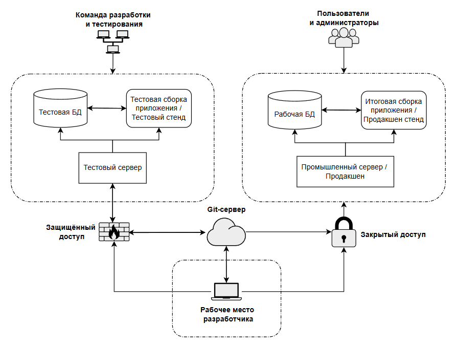

import CicdDemo from '@site/src/components/CicdDemo.jsx';

# Основы DevOps

<div class="article-tags">
  <span class="tag tag-required">ОБЯЗАТЕЛЬНО</span>
  <span class="tag tag-beginner">ДЛЯ НОВИЧКОВ</span>
</div>

<span class="complexity-badge">Разработчику</span>
<span class="complexity-badge">Архитектору</span>
<span class="complexity-badge">Инженеру</span>

## Основы DevOps

<div class="callout callout--tip">
  <div class="callout-title">Правила неизбежности</div>
  <p>- каждая система имеет свою архитектуру построения;</p>
  <p>- систему нужно разворачивать так, чтобы она выдержала требуемую нагрузку;</p>
  <p>- нужно понять, как обновлять систему, и исправлять ошибки;</p>
  <p>- рано или поздно придётся интегрировать систему с внешними ресурсами;</p>
  <p>- придётся обеспечить безопасность данных и доступа к системе;</p>
  <p>- система неизбежно будет расширяться;</p>
  <p>- будут ошибки, и нужна будет поддержка.</p>
</div>

### Тест и прод

Часто можно запутаться в этих понятиях вроде «прод», «тест» и тому подобное. Смысл прост - нельзя размещать тестовые или непроверенные вариации приложения на рабочей среде, поэтому нужна «копия» рабочей среды для проверок и экспериментов. Поэтому разворачивается целая инфраструктура вроде такой:



Здесь мы видим следующий порядок:

1. Создаётся **тестовая** среда, на которой развёртывается тестовая база данных и тестовая сборка приложения (часто её называют «стенд»). Сотрудникам компании заказчиков или разработчиков предоставляется доступ к этой среде, часто даже полный доступ, чтобы разрабатывать, тестировать и экспериментировать.
2. Создаётся **продакшен** (промышленная) среда, которая включает уже реальную базу данных (готовую «к бою») и итоговая проверенная версия приложения. Часто у команды разработки уже нет доступа к продакшену, чтобы не испортить.

Смысл продакшен среды в том, чтобы установить туда рабочую программу и «не трогать, пока работает». Доступ туда даётся лишь ограниченный, как для обычных пользователей. К примеру, открыв любой сайт, маркетплейс, или даже игру, вы как пользователь получаете доступ именно к проду, поэтому да, всё вокруг нас - продакшен. И представьте, вы подаёте заявку на кредит на сайте, и прямо в середине процесса у вас резко меняется цвет интерфейса, а введённые вами данные очистились. Неприятно? Не то слово.

Поэтому разработчики сначала разработают и протестируют все изменения на тестовой среде без вреда для юзеров, и лишь потом полноценно развернут новую систему на продакшене.

В классическом понимании развёртывание на продакшене представляет собой остановку работы приложения, замену файлов кода и всех ресурсов, конфигурация и запуск новой версии. Но представьте, если работа онлайн-банка или маркетплейса по всему миру…остановится, для установки обновления? Это же смертельно для бизнеса!

Поэтому существует автоматический процесс поставки с теста на прод.


Здесь всё искусство администраторов и DevOps-инженеров как раз в том, чтобы аккуратно обновить продакшен без вреда бизнесу. Современные технологии и инструменты позволяют производить такую «поставку» автоматически, что и привело к появлению термина CI/CD.

---

### Что такое DevOps?

DevOps, CI/CD – что это?

И так, мы спроектировали решение, определились с архитектурой и даже разработали его. Что дальше? Нужно установить и реализовать. Тут вступает в силу развёртывание, или деплой.

**Развёртывание** – процесс установки и запуска программного обеспечения на целевой среде (например, сервер). Оно бывает ручным и автоматическим. И если ручное – это классическая установка всех компонентов, зависимостей и программ, то автоматическое – более интересный и сложный процесс, который требует особой квалификации – DevOps.

**DevOps (от Разработка + Operations)** – культура, методология и набор практик, которые направлены на автоматизацию и ускорение процессов разработки и развертывания программного обеспечения путем улучшения взаимодействия между разработчиками (Dev) и ИТ-операциями (Ops).


Важно: это не сисадмины, не релиз-мастера, и не конкретный инструмент. Это подход, который затрагивает и меняет весь цикл разработки ПО – от написания кода до его работы в продакшене.

Цель – ускорить выпуск продукта без потери качества. Если привести аналогию – то это использование на производстве автоматического конвейера вместо использования ручного труда. Цели те же, эффект аналогичный, главное не просто запустить проект, «чтобы работало», а сделать этот запуск быстрым, безопасным, надёжным.

Принципы:
	- автоматизация (уменьшение количества ручных процессов, использование автосборки и автотестирования, авторазвертывания (деплоя) на продакшен и управление структурой через код);
	- коллаборация (команды работают вместе, разработчики, сисадмины, техподдержка – все должны работать на единую цель обеспечения удобства развертывания и масштабируемости);
	- непрерывность (CI/CD, постоянная интеграция, тестирование и доставка в продакшен, с постоянным мониторингом ошибок и нагрузки).

Возможно, многие сталкивались с традиционной для любой ячейки общества системы «перекладывания ответственности», появившейся из «разделения ответственности». Допустим, разработчик сделал четко, что требуется, закинул код, передал админам, а на любые замечания говорит: «Мне без разницы, вот, смотрите, у меня всё работает». Админы пытаются, настраивают всё вручную, но не получается – то ошибка в тоннах конфигураций серверов, то нет нужных зависимостей, то нагрузка намного выше, чем на тестовом стенде. Итог – бесконечное перекладывание вины, медленные релизы, падение продакшена и конечно же «выдёргивание» разработчика для решения проблемы.

На практике знаю – это колоссальный стресс, я сталкивался с этим и как пользователь, и как техподдержка, и как администратор, и как разработчик. Когда не обеспечена автоматизация или должным образом все принципы не соблюдены – цикл «релизного ада» будет постоянным.

DevOps меняет ситуацию – разработчики теперь должны не просто написать код, достаточный для выполнения задачи, но и продумать важные вопросы:
	- Как код будет работать в продакшене?
	- Как код будет масштабироваться?
	- Как быстро откатить, если что-то сломается?

Администраторы (их ещё называют «операторами», это как раз часть «Ops») участвуют в планировании, взаимодействуют с командой и знают, как устроено приложение.

Также DevOps практикует ещё и встраивание тестировщиков в процесс с самого начала, когда тесты пишутся параллельно с кодом, что обеспечивает тестирование не в конце, а на каждом этапе, а также используется автоматическое тестирование.

Всё это, в совокупности обеспечивает то, что команда перестаёт бояться изменений, а развертывание продукта становится гибким и плавным.

---

### Основные понятия в DevOps

В DevOps есть такие понятия, как CI/CD, петля обратной связи и пайплайн.

**Пайплайн** (pipeline) – автоматизированный конвейер, который берёт код, проводит через необходимые этапы и доставляет в продакшен:

```
Синхронизация кода с Git → Сборка → Автотесты → Деплой на тестовый или продакшен стенд → Ручное тестирование → Деплой на продакшен
```

CI/CD (Continuous Integration / Continuous Delivery) состоит из двух принципов.

	- **Непрерывная интеграция** (Continuous Integration) – постоянный учёт изменений и грамотное использование систем контроля версий, частое слияние кода в соответствующих ветках Git, и при каждом коммите – запуск автоматической сборки и тестов. Это сразу выявляет ошибки, которые проще починить до того, как наступят последствия.
	- **Непрерывная доставка** (Continuous Delivery) – автоматическое развёртывание сборки на соответствующем стенде. Часто используется ручное подтверждение релиза – и оно в любом случае представляет собой «клик», а не кропотливую настройку зависимостей и конфигураций.

**Петля обратной связи** – цикл фидбека, когда обеспечивается организация формы оперативной пересылки жалоб от пользователей, а также когда данные из продакшена (логи, метрики, ошибки) постоянно анализируются – улучшения попадают обратно в разработку. Это включает в себя, соответственно, логирование, мониторинг и отработку багов, выявленных пользователями.

Буквально, DevOps-инженеры обеспечивают автоматическую интеграцию кода на сервер по кнопке:

<CicdDemo />

---