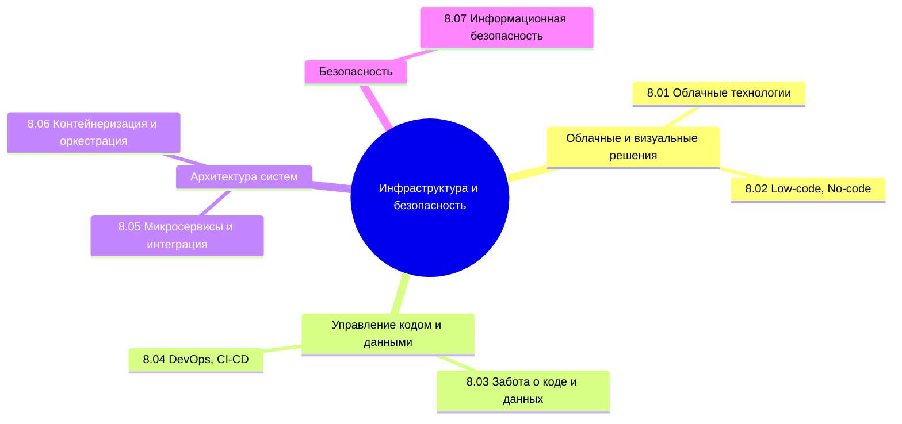

import DocCardList from '@theme/DocCardList';

## О разделе

<DocCardList />

Текущая часть не для каждого. Не каждому аналитику нужно знать контейнеризацию, не каждому разработчику надо углубляться в облачные технологии.

---