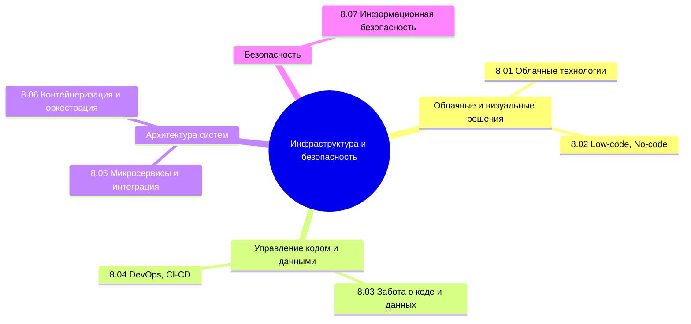

  ОБЯЗАТЕЛЬНО
  ДЛЯ НОВИЧКОВ
  В РАЗРАБОТКЕ

import DocCardList from '@theme/DocCardList';

---

## О разделе

<DocCardList />

Сквозная схема **bare metal → ВМ → контейнеры → контейнеры в облачных ВМ** — [четыре модели развёртывания](/encyclopedia/2-system-network/2-02-platformy/21#chetiryre-modeli-razvertyvaniya) (базовая информатика и софт power user).

Текущая часть не для каждого. Не каждому аналитику нужно знать контейнеризацию, не каждому разработчику надо углубляться в облачные технологии.

