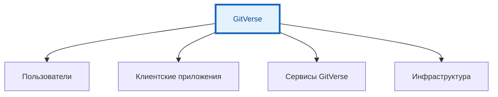
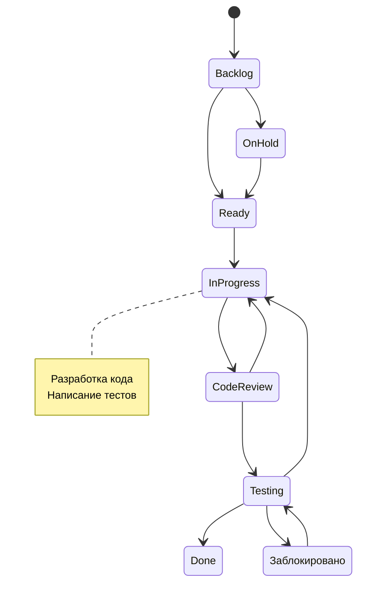

---
title: Gitverse - отечественная альтернатива Git
tags: [advanced, notrequired, engineer, developer, architector]
---

# Gitverse - отечественная альтернатива Git

<div class="article-tags">
  <span class="tag tag-inprogress">В РАЗРАБОТКЕ</span>
  <span class="tag tag-advanced">НЕ ДЛЯ НОВИЧКОВ</span>
  <span class="tag tag-notrequired">НЕ ОБЯЗАТЕЛЬНО</span>
</div>
<span class="complexity-badge">Разработчику</span>
<span class="complexity-badge">Архитектору</span>
<span class="complexity-badge">Инженеру</span>

## Gitverse - отечественная альтернатива Git

## Введение в платформу

**GitVerse** — это российская «AI-first» платформа для совместной разработки программного обеспечения и управления кодом. Платформа запущена компанией СберТех в марте 2024 года как ответ на возможные ограничения со стороны зарубежных сервисов хостинга репозиториев.

Позиционирование проекта ориентировано на обеспечение непрерывности работы российских разработчиков с использованием отечественных технологических решений. Размещение инфраструктуры внутри России исключает риски блокировок для отечественных команд и проектов любой масштабу.

Основные характеристики платформы включают функциональный аналог GitHub с расширенными возможностями искусственного интеллекта. Система предоставляет полный набор инструментов для полного цикла разработки: хранение кода, системы контроля версий, интеграция CI/CD, управление проектами и встроенные AI-ассистенты.

Ключевые особенности архитектуры GitVerse:
- Полная поддержка стандартных Git-операций;
- Встроенный AI-ассистент GigaCode для написания и анализа кода;
- Облачная и десктопная IDE GigaIDE с поддержкой плагинов;
- Системы непрерывной интеграции и доставки (CI/CD);
- Инструменты управления задачами и документацией;
- Безопасность и защита от утечек данных;
- Импорт и зеркалирование из внешних репозиториев.

---

## Архитектура платформы



Платформа работает по принципу клиент-серверной архитектуры с облачной реализацией базовых функций. 

Пользователи получают доступ к системе через веб-интерфейс или специальные клиентские приложения. 

GigaIDE Desktop базируется на платформе IntelliJ IDEA, что обеспечивает высокую производительность и совместимость с популярными инструментами разработки.

GigaIDE Cloud выполнена на основе VS Code, предоставляя облачную среду с теми же возможностями синтаксиса и поддержки языков программирования. Это позволяет командам работать без необходимости установки дополнительного ПО на локальные машины.

| Компонент | Функциональность | Поддержка |
|-----------|------------------|-----------|
| Репозитории | Хранение и версионирование кода | Git, Git LFS |
| Code Review | Проверка изменений | Pull Request, Merge Request |
| Трекер задач | Управление проектами | Issue Tracking |
| Wiki | Документирование | Markdown, RST |
| CI/CD | Автоматизация сборки | YAML конфиги |
| AI Assistant | Помощь в коде | Анализ, генерация |

---

## AI-ассистент GigaCode

**GigaCode** — это интегрированный AI-помощник разработчика, встроенный в среду разработки. Инструмент позиционируется как персональная система поддержки программирования, способная ускорить процессы написания и анализа исходного кода.

Основные возможности ассистента включают:
- Генерацию вариантов завершения кода в реальном времени;
- Анализ контекста текущей разработки;
- Предоставление релевантных подсказок на основе промптов;
- Автоматическое создание документации;
- Реализацию умного рефакторинга кода;
- Поиск и выявление уязвимостей безопасности;
- Создание тестовых кейсов для модулей.

Функционал GigaCode охватывает более пятнадцати языков программирования, включая Java, Python, JavaScript и другие распространённые технологии. Система анализирует структуру кода, выявляет закономерности и предлагает соответствующие варианты продолжения или исправления.

### Режимы работы GigaCode

Агентный режим рассматривает GigaCode как активного цифрового разработчика с возможностью выполнения команд и выхода в интернет для сбора информации. В отличие от простого автодополнения, агентный режим способен самостоятельно выполнять последовательности операций для достижения поставленных целей.

| Режим | Описание | Возможности |
|-------|----------|-------------|
| Автодополнение | Подсказки при вводе кода | Быстрая вставка фрагментов |
| Анализ | Проверка качества кода | Выявление проблем |
| Рефакторинг | Улучшение структуры | Оптимизация методов |
| Агент | Самостоятельное выполнение | Сложные задачи |

### Установка и настройка

Для работы с GigaCode необходимо установить расширение в поддерживаемую IDE или использовать облачную среду разработки. Процесс настройки включает несколько этапов регистрации и авторизации.

```python
# Пример использования GigaCode в файле .gitverse/config.yaml
gigacode:
  enabled: true
  model: giga-code-v1
  auto_complete: true
  security_scan: true
  documentation: true
  refactoring: true
```

Настройки позволяют включать или отключать отдельные функции ассистента в зависимости от потребностей команды или организации.

---

## Системы управления репозиториями

**Репозиторий** — это централизованное хранилище для всех файлов проекта с полной историей изменений. Создание репозитория в GitVerse происходит аналогично процессу на GitHub, что обеспечивает привычный интерфейс для разработчиков.

Основные операции с репозиториями включают:
- Клонирование существующих проектов (`git clone`);
- Загрузку локальных изменений (`git push`);
- Синхронизацию с удалённым сервером (`git pull`, `git fetch`);
- Управление ветками и слиянием;
- Поддержку больших файлов через Git LFS.

### Импортирование и зеркалирование

Платформа поддерживает импорт и зеркальное копирование репозиториев из сторонних сервисов GitHub, Bitbucket и других источников. Это позволяет организациям постепенно мигрировать свои проекты на отечественную инфраструктуру без потери истории и метаданных.

Процесс импорта выполняется через веб-интерфейс или API и включает следующие этапы:
- Указание URL исходного репозитория;
- Выбор параметров доступа;
- Конфигурация прав и приватности;
- Завершение синхронизации.

Зеркалирование обеспечивает дублирование данных на российской инфраструктуре с сохранением полноты информации о коммитах, тикетах и pull request'ах.

---

## Интеграция CI/CD

**CI/CD** (Continuous Integration / Continuous Delivery) — это практика автоматизации процессов разработки программного обеспечения. Система GitVerse CI/CD представляет собой аналог GitHub Actions с совместимым синтаксисом конфигурации пайплайнов.

Непрерывная интеграция требует частой фиксации кода в общем репозитории. Более частая фиксация кода позволяет быстрее обнаруживать ошибки и обеспечивать качество продукта.

### Структура конфигурации

Конфигурационные файлы CI/CD пишутся в формате YAML и хранятся в директории `.gitverse/cicd.yml` внутри репозитория. Каждый файл определяет этапы сборки, тестирования и развертывания приложения.

Пример конфигурации пайплайна:

```yaml
stages:
  - lint
  - build
  - test
  - deploy

lint:
  stage: lint
  script:
    - npm run lint
    - python -m flake8 .
  artifacts:
    reports:
      coverage_report: coverage.xml

build:
  stage: build
  image: node:18-alpine
  script:
    - npm install
    - npm run build
  artifacts:
    paths:
      - dist/

test:
  stage: test
  image: node:18-alpine
  script:
    - npm test
  coverage: '/Test Result.*([0-9]{1,3})%/'

deploy:
  stage: deploy
  image: alpine:latest
  script:
    - cp dist/* /var/www/html/
  only:
    - main
  environment:
    name: production
    url: https://example.com
```

### Runners и агенты

Runners представляют собой исполняющие агенты, которые обрабатывают задачи пайплайнов. GitVerse поддерживает организацию собственных runners для повышения производительности и безопасности выполнения кода.

Команда установки runner выглядит следующим образом:

```bash
# Получение токена для регистрации
curl -X POST https://gitverse.ru/api/v1/runners/token \
  -H "Authorization: Bearer YOUR_TOKEN" \
  -o runner-token.txt

# Регистрация runner
./run.sh register --url https://gitverse.ru \
  --token $(cat runner-token.txt) \
  --name my-runner-01 \
  --executor docker \
  --environment "docker:v20"
```

Конфигурация runner может включать ограничения по CPU, памяти, дисковому пространству и количеству одновременных задач.

---

## Инструменты код-ревью

**code review** — процесс проверки изменений кода перед их слиянием в основную ветку. Система GitVerse предоставляет удобные инструменты для проведения ревью с комментариями и обсуждением каждой строки изменений.

### Pull Request workflow

Процесс создания Pull Request начинается с формирования ветки из основного кода:

```bash
# Создание новой ветки
git checkout -b feature/new-feature

# Добавление изменений
git add src/feature.js

# Коммит с описанием
git commit -m "Добавление нового функционала для обработки данных"

# Отправка в удалённый репозиторий
git push origin feature/new-feature
```

После этого пользователь создаёт Pull Request через веб-интерфейс, где указывает целевую ветку и участников ревью. Система автоматически проверяет соответствие требованиям линтеров, тестов и политик слияния.

### Правила ревью

| Правило | Описание | Требование |
|---------|----------|------------|
| Размер PR | Максимальное количество строк | ≤ 400 строк |
| Тесты | Наличие покрытия | ≥ 80% покрытие |
| Комментарий | Описание изменений | Обязательно |
| Линты | Прохождение проверок | Без ошибок |
| Кодстайл | Следование стандартам | Единый стиль |

### Комментарии и обсуждения

Каждое изменение в Pull Request можно прокомментировать с указанием конкретной строки кода. Участники могут отвечать на комментарии, отмечать исправления и отслеживать статус каждого запроса.

---

## Управление задачами и проектами

Система управления задачами внутри GitVerse позволяет организовывать работу над функциональными требованиями, багами и другими элементами проекта. Инструменты обеспечивают полную видимость процесса разработки для всех участников команды.

### Типы задач

| Тип | Описание | Пример |
|-----|----------|--------|
| Feature | Новая функциональность | Добавить поддержку JWT |
| Bug | Исправление ошибок | Баг в оплате картами |
| Task | Общая задача | Обновить библиотеки |
| Epic | Большая тема | Переход на микросервисы |
| Subtask | Часть задачи | Написать тесты для модуля |

### Workflow задач

Каждая задача проходит через определённые стадии состояния:



Статусы включают Backlog, Ready, InProgress, CodeReview, Testing, Done и дополнительные промежуточные состояния для гибкого управления процессом.

### SmartClass — инструмент обучения

SmartClass представляет бесплатный инструмент для управления заданиями по программированию. Решение позволяет создавать и распространять исходный код заданий, отслеживать ход их выполнения, проводить автопроверку с помощью CI/CD.

Функционал SmartClass подходит для учебных программ и корпоративного обучения:
- Создание наборов заданий с различными уровнями сложности;
- Автоматическая проверка решений кандидатов;
- Сбор статистики результатов;
- Интеграция с внешними системами оценки.

---

## Безопасность и защита данных

Безопасность информации является приоритетным направлением развития GitVerse. Платформа обеспечивает сканирование кода на уязвимости и защиту от утечек данных. Все данные размещаются на российских мощностях, что гарантирует стабильную работу системы.

### Политика защиты

Основные механизмы защиты включают:
- Шифрование данных при передаче по протоколам HTTPS/TLS;
- Защита от несанкционированного доступа к репозиториям;
- Аутентификация через OAuth и SSH ключи;
- Логирование всех действий пользователей;
- Регулярное обновление компонентов безопасности;
- Мониторинг подозрительной активности.

### Сканирование на уязвимости

Встроенные системы безопасности автоматически проверяют репозитории на наличие известных уязвимостей. Результаты сканирования доступны через панель мониторинга или интегрируются в уведомления команд.

Поддерживаемые типы проверок:
- Обнаружение секретов и паролей в коде;
- Поиск известных уязвимостей зависимостей;
- Анализ потенциальных инъекций SQL и XSS;
- Проверка настроек прав доступа.

### Экспорт и резервное копирование

Платформа предоставляет возможность экспорта данных и создания резервных копий проектов. Администраторы могут выгрузить информацию в форматах JSON, CSV, XML или создать бэкапы в архивах.

---

## Облачные среды разработки

**GigaIDE Cloud** представляет собой облачную среду разработки на базе VS Code. Инструмент позволяет работать с кодом напрямую из браузера без необходимости установки дополнительного ПО.

Преимущества облачной среды:
- Доступ с любого устройства через браузер;
- Единая среда для всей команды;
- Отсутствие необходимости настройки локального окружения;
- Мгновенное развертывание новых рабочих пространств;
- Интеграция с репозиториями GitVerse.

### Настройка рабочей области

Рабочая область настраивается через веб-интерфейс или API. Пользователь выбирает шаблон проекта, язык программирования и необходимые расширения. Система автоматически устанавливает зависимости и создает готовую к работе среду.

---

## Публикация статических сайтов

В марте 2026 года был официально запущен сервис GitVerse Pages для бесплатного хостинга статических сайтов (документации, лендингов, блогов) прямо из репозитория.

**GitVerse Pages** — инструмент для публикации статических сайтов из репозиториев. Это позволяет командам быстро создавать документацию, лендинги и другие ресурсы для своих проектов.

Процесс публикации включает:
- Размещение файлов сайта в специальной директории;
- Конфигурацию через файл `_config.yml`;
- Деплой по команде `git push` в основную ветку.

Пример структуры проекта для GitVerse Pages:

```markdown
project-site/
├── _site/          # Готовый сайт после сборки
├── docs/           # Документы проекта
├── assets/         # Изображения, стили, скрипты
├── index.html      # Главная страница
├── config.md       # Конфигурация страницы
└── .gitignore      # Игнорируемые файлы
```

Параметры конфигурации включают настройку домена, темы оформления, метаданные и другие опции публикации.

---

## Интеграция с другими сервисами

API GitVerse позволяет интегрировать платформу с внешними системами и автоматизировать рабочие процессы. REST API предоставляет полный доступ к созданию репозиториев, управлению пользователями, настройке CI/CD и другим операциям.

### Основные эндпоинты API

| Метод | Endpoint | Описание |
|-------|----------|----------|
| GET | `/api/v1/repos` | Получить список репозиториев |
| POST | `/api/v1/repos` | Создать новый репозиторий |
| PUT | `/api/v1/repos/{id}` | Обновить параметры репозитория |
| DELETE | `/api/v1/repos/{id}` | Удалить репозиторий |
| POST | `/api/v1/issues` | Создать задачу |
| GET | `/api/v1/projects/{id}/stats` | Получить статистику проекта |

### Пример взаимодействия

```bash
# Создание репозитория через API
curl -X POST https://gitverse.ru/api/v1/repos \
  -H "Authorization: Bearer YOUR_TOKEN" \
  -H "Content-Type: application/json" \
  -d '{
    "name": "my-project",
    "visibility": "private",
    "description": "Мой проект разработки"
  }'

# Получение списка репозиториев
curl -X GET https://gitverse.ru/api/v1/repos \
  -H "Authorization: Bearer YOUR_TOKEN" \
  -o repos.json
```

Интеграция через webhook позволяет автоматически запускать действия при событиях в репозитории: создание коммита, merge request, комментарий.

---

## Сравнение с конкурентами

| Характеристика | GitVerse | GitHub | GitLab |
|-----------------|----------|--------|--------|
| Локализация | Российская | Международная | Немецкая |
| AI-ассистент | GigaCode | Copilot | GitLab Duo |
| IDE | GigaIDE Desktop/Cloud | VS Code Online | GitLab Shell |
| CI/CD | Нативный | GitHub Actions | GitLab CI |
| Стоимость | Бесплатный/платный | Freemium | Open Source |
| Размещение | Россия | Мир | Европа |

Платформа отличается полной русскоязычной поддержкой и отсутствием рисков блокировок для отечественных разработчиков. Весь интерфейс GitVerse выполнен на русском языке, поддержка отвечает оперативно.

---